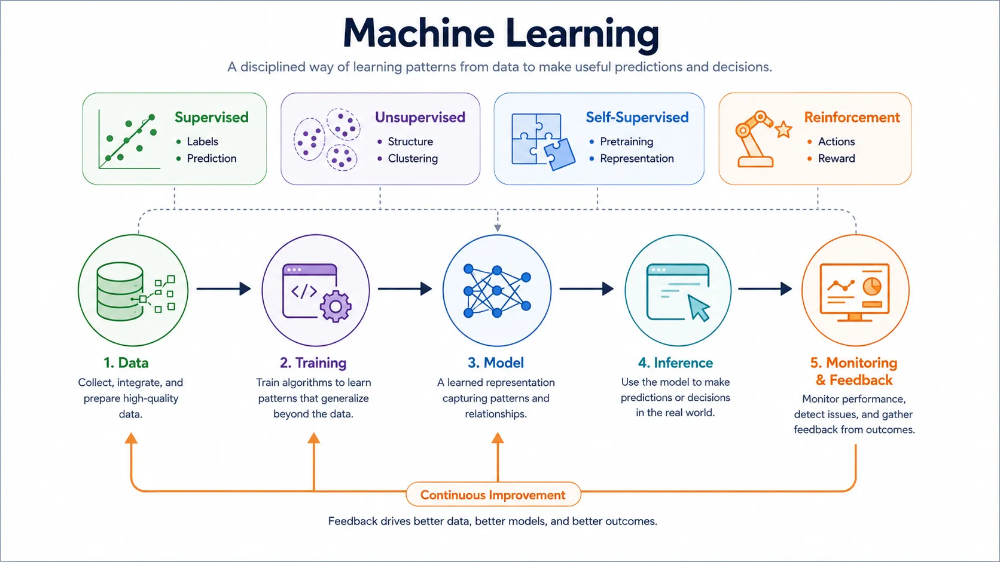

Machine learning became central to AI because many useful tasks are too variable to solve with fixed rules alone. Fraud patterns shift, customer behavior changes, image categories multiply, and language use never stays still. Rather than encoding every condition manually, machine learning lets systems infer useful patterns from examples and feedback.

That change did not remove the need for engineering judgment. It shifted the problem. Teams now need to reason about data quality, objective design, evaluation, generalization, and operational drift. Machine learning is therefore not only a modeling technique. It is a different way of building and maintaining behavior.

## Definition

Machine learning is the discipline of building systems that improve task performance by learning patterns from data. Instead of specifying every decision rule explicitly, engineers define objectives, prepare examples, choose representations, and evaluate how well the resulting model generalizes beyond the training set.

This makes machine learning a subset of AI focused on learned behavior. It is distinct from purely rule-based approaches, though real systems often combine both.

## Why Machine Learning Matters

Machine learning matters when the world contains too much variation for manual logic to scale well. Ranking search results, detecting spam, forecasting demand, classifying documents, recommending products, and recognizing speech all involve patterns that are easier to learn from data than to enumerate in rules.

The tradeoff is that learned systems are probabilistic. They do not guarantee perfect behavior. They must be judged through evidence, error analysis, and operational monitoring rather than only through code inspection.

## Main Learning Paradigms

### Supervised Learning

Supervised learning uses labeled examples. The system sees inputs together with desired outputs and learns a function that maps one to the other. Classification, regression, ranking, and many prediction tasks follow this pattern.

It works well when labels are meaningful and representative, but quality depends heavily on the data definition and the target being learned.

### Unsupervised Learning

Unsupervised learning looks for structure without explicit target labels. Clustering, segmentation, dimensionality reduction, and anomaly discovery are common examples. The system is not told the answer directly. It is asked to uncover useful organization in the data.

This is powerful for exploration, but usefulness depends on how the discovered structure connects to actual business or product decisions.

### Self-Supervised Learning

Self-supervised learning creates training signals from the data itself. Predicting masked words, next tokens, missing patches, or other internal structure allows models to learn broad representations without fully human-labeled datasets. This pattern became especially important in large language and multimodal models.

Its significance is architectural as much as statistical. It makes large-scale pretraining economically and operationally viable.

### Reinforcement Learning

Reinforcement learning focuses on action and feedback over time. The system interacts with an environment, receives rewards or penalties, and learns policies that improve cumulative outcomes. It is useful when decisions affect future states, such as control systems, game play, scheduling, or sequential optimization.

The core challenge is that feedback is delayed and exploration can be costly or risky.

## Comparing Learning Paradigms

The following comparison highlights the different signals, uses, and limits of the main learning paradigms.

| Paradigm        | Main signal                          | Typical use                                 | Strength                                  | Common limit                                |
| --------------- | ------------------------------------ | ------------------------------------------- | ----------------------------------------- | ------------------------------------------- |
| Supervised      | Human-provided labels                | Classification, regression, ranking         | Clear objective alignment                 | Label cost and label bias                   |
| Unsupervised    | Structure within the data            | Clustering, anomaly discovery, segmentation | Useful for exploration and representation | Harder to tie directly to business outcomes |
| Self-supervised | Signals derived from the data itself | Pretraining and representation learning     | Scales to large unlabelled corpora        | Needs downstream adaptation and evaluation  |
| Reinforcement   | Reward from sequential interaction   | Control, planning, optimization             | Learns behavior over time                 | Sample efficiency and stability challenges  |

## The Lifecycle of a Machine Learning System

A machine-learning system begins with data collection and problem framing. Teams need to decide what signal matters, what success looks like, and how examples will be gathered or labeled. That framing step is often more decisive than algorithm choice.

Training transforms data into a model that captures useful patterns. Validation and testing check whether the model generalizes, whether it fails systematically on important subgroups, and whether performance meets the intended use case.

Inference is the point where the model is used in a live workflow. That stage introduces new concerns such as latency, freshness, feedback loops, and the gap between offline evaluation and production behavior. Monitoring is therefore part of the lifecycle, not an afterthought.

## Common Evaluation Concepts

**Generalization** is the ability to perform well on new data rather than only memorizing the training set.

**Bias and variance** describe different failure modes. A model may be too simple to capture useful structure, or too sensitive to the training data to remain stable in production.

**Overfitting and underfitting** are practical symptoms of those problems. Overfitting means the model learns the training data too specifically. Underfitting means it never learns enough useful structure.

**Offline and online evaluation** serve different needs. Offline testing offers controlled comparison. Online behavior reveals how the model performs under real user interaction, changing inputs, and feedback loops.

## Relationship to Neighboring Topics

Deep learning is a specialized family within machine learning that uses multilayer neural architectures to learn richer representations at larger scale. Foundation models build further on those deep-learning patterns through large-scale pretraining and reuse.

MLOps operationalizes machine learning by handling versioning, deployment, monitoring, retraining, and drift management. Without that operational layer, even strong models degrade as the world changes.

## Summary

Machine learning is the part of AI concerned with building useful behavior from data rather than from exhaustive hand-authored rules. Its value comes from adaptability, but that adaptability introduces dependence on data quality, evaluation discipline, and operations. Understanding the main learning paradigms and lifecycle makes the rest of modern AI easier to reason about.
