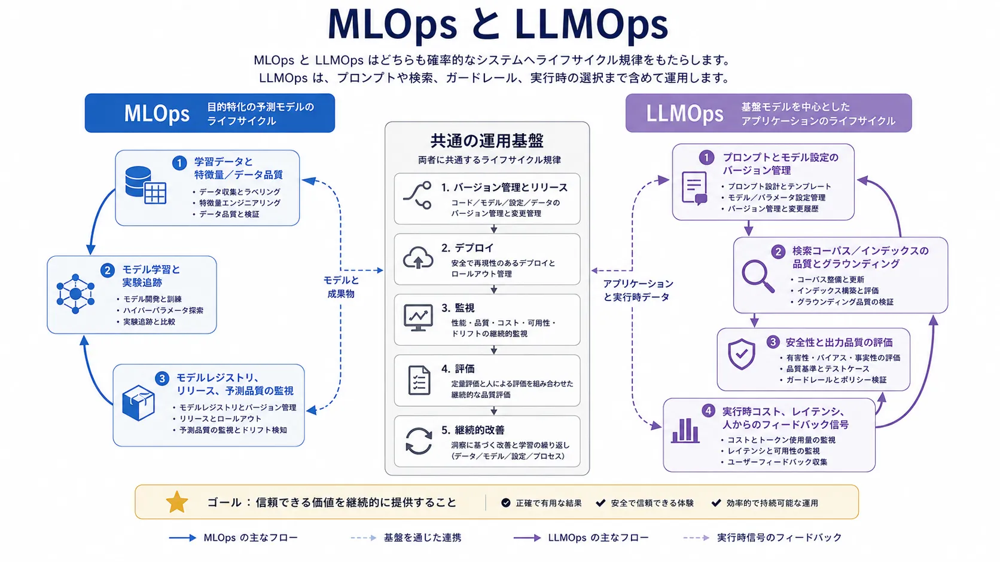

モデルのデプロイは AI の提供の終わりではなく、運用責任の始まりです。モデルが実際のワークフローに影響するようになると、チームには、バージョン管理、観測、ドリフト評価、変更管理、本番リスクを制御した改善を繰り返す方法が必要になります。

これが MLOps と LLMOps に共通する考え方です。AI システムは確率的で、データに依存し、従来のソフトウェアデリバリーだけでは十分に扱えない変化に敏感であるため、両方の規律が必要です。

## 定義

MLOps は、機械学習システムをデプロイ、監視、バージョン管理し、継続的に改善する運用上の規律です。LLMOps は同様の原則を大規模な再利用可能モデルに基づくシステムへ拡張し、プロンプト、検索コンテキスト、ツールアクセス、安全制約が振る舞いに大きく関わる点を扱います。

システム種別は異なっても運用パターンは強く重なるため、この対としての捉え方が役立ちます。

## なぜ運用が重要か

アプリケーションコードを変えなくても AI システムは劣化し得ます。データ分布の変化、ラベルの陳腐化、検索コーパスの更新、プロンプトの改訂、モデル提供者の振る舞いの変化、実際の需要下でのコスト・レイテンシの変化が起こるためです。システムの振る舞いの範囲は、コードデプロイより広くなります。

したがって、リリース規律、オブザーバビリティ、評価はバイナリやコンテナだけを対象にできません。

## MLOps の中核となる関心事

実験追跡は、データ、設定、観測した性能の結び付きを保ちます。バージョン管理は、どのモデル、データセット、特徴量ロジックがどの振る舞いを生んだかを追跡します。デプロイ制御はモデルのリリースとロールバックを統制します。監視は予測品質、レイテンシ、リソース使用、ドリフトを追います。再学習は、環境変化で既存モデルが適合しなくなったときにループを閉じます。

モデル品質は学習品質だけでなく、ライフサイクルの規律に依存するため、これらは本番の機械学習システムで標準的な関心事です。

## LLMOps が拡張する範囲

基盤モデルのシステムは新しい運用対象を加えます。プロンプトとシステム指示はバージョン管理すべき資産になります。検索品質は本番の依存関係になります。安全性評価は数値の予測精度だけでなく、自由度の高い応答とツール利用を対象にします。人からのフィードバックループは実行時の改善経路の一部になります。トークン消費や連鎖したツール呼び出しは急速に変わるため、コストとレイテンシのガバナンスも重要になります。

これは完全に新しい規律ではなく、より広い規律です。

## 共通する失敗と異なる失敗

以下の比較は、共通する運用規律と、LLM 中心のシステムに追加される関心事を分けて示します。

| 関心領域       | MLOps の重心                       | LLMOps の重心                                                |
| -------------- | ---------------------------------- | ------------------------------------------------------------ |
| バージョン管理 | モデル、特徴量、データセットの系譜 | モデル、プロンプト、検索、ツール、ポリシーの系譜             |
| 評価           | 精度、順位品質、校正、ドリフト     | 応答品質、グラウンディング、安全性、タスク成功、コスト       |
| 監視           | 予測品質とリソース健全性           | 出力品質、ハルシネーションのシグナル、ツールの振る舞い、支出 |
| 変更管理       | 再学習とリリース制御               | プロンプト変更、モデル切替、検索更新、ポリシー調整           |
| フィードバック | ラベルと性能指標                   | 人によるレビュー、選好シグナル、失敗例                       |

静かな品質劣化、弱い系譜、ロールバック規律の不足、オブザーバビリティの欠如は共通の失敗です。LLM 中心のシステムでは、プロンプト、コンテキスト、ツールアクセスが一体となって振る舞いを形作るため、応答の変動が広く、デバッグも複雑になります。

## エンジニアリングとガバナンスとの関係

AI エンジニアリングは、運用すべきプロダクトの振る舞いを定義します。MLOps と LLMOps は、その振る舞いを時間とともに測定可能かつ管理可能にします。システムを適切に観測・バージョン管理できなければ、ポリシー制御、レビュー要件、インシデント対応は有効に働かないため、責任ある AI にもこれらの規律が必要です。

## まとめ

MLOps と LLMOps は、データ、モデル、コンテキスト、実行時の相互作用に振る舞いが依存するシステムへ、提供の規律をもたらします。初回リリース後も AI システムを観測可能、制御可能、改善可能に保つことが役割です。
