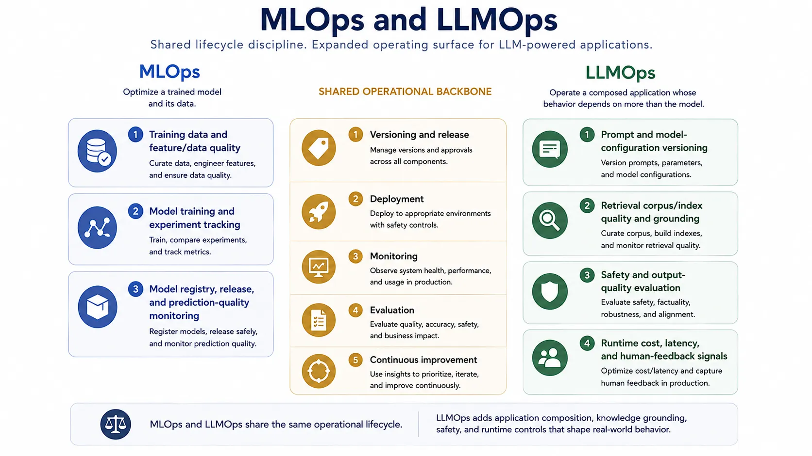

Model deployment is not the end of AI delivery. It is the beginning of operational responsibility. Once a model influences real workflows, teams need repeatable ways to version it, observe it, evaluate drift, manage change, and improve behavior without losing control of production risk.

That is the shared logic behind MLOps and LLMOps. Both disciplines exist because AI systems are probabilistic, data-dependent, and sensitive to change in ways that traditional software delivery alone does not fully capture.

## Definition

MLOps is the operational discipline for deploying, monitoring, versioning, and continuously improving machine-learning systems. LLMOps extends similar principles to systems built on large reusable models, where prompts, retrieved context, tool access, and safety constraints play a larger role in behavior.

The paired framing is useful because the operational patterns overlap strongly even when the system types differ.

## Why Operations Matter

An AI system can degrade without any application code changing. Data distributions drift, labels become stale, retrieval corpora evolve, prompts are revised, model providers change behavior, and cost or latency profiles shift under real demand. Operations matter because the system’s behavior surface is larger than a code deployment.

This means release discipline, observability, and evaluation must cover more than binaries or containers.

## Core MLOps Concerns

Experiment tracking preserves the link between data, configuration, and observed performance. Versioning tracks which model, dataset, and feature logic produced which behavior. Deployment controls govern how models are released and rolled back. Monitoring watches prediction quality, latency, resource use, and drift. Retraining closes the loop when the environment changes enough that the existing model no longer fits well.

These concerns are now standard for production machine-learning systems because model quality depends on lifecycle discipline, not only on training quality.

## How LLMOps Extends the Picture

Foundation-model systems add new operational surfaces. Prompts and system instructions become versioned assets. Retrieval quality becomes a production dependency. Safety evaluation must cover open-ended responses and tool use rather than only numeric prediction accuracy. Human feedback loops become part of the runtime improvement path. Cost and latency governance matter more because token consumption and chained tool calls can change rapidly.

The result is not a completely new discipline, but a broader one.

## Shared and Distinct Failure Modes

The following comparison separates the shared operational discipline from the additional concerns of LLM-centered systems.

| Concern area      | MLOps emphasis                                | LLMOps emphasis                                               |
| ----------------- | --------------------------------------------- | ------------------------------------------------------------- |
| Version control   | Model, feature, and dataset lineage           | Model, prompt, retrieval, tool, and policy lineage            |
| Evaluation        | Accuracy, ranking quality, calibration, drift | Response quality, grounding, safety, task success, cost       |
| Monitoring        | Prediction quality and resource health        | Output quality, hallucination signals, tool behavior, spend   |
| Change management | Retraining and release control                | Prompt changes, model swaps, retrieval updates, policy tuning |
| Feedback loops    | Labels and performance metrics                | Human review, preference signals, failure exemplars           |

Shared failure modes include silent quality degradation, weak lineage, poor rollback discipline, and missing observability. LLM-centered systems add broader response variability and more complicated debugging because behavior is shaped by prompt, context, and tool access together.

## Relationship to Engineering and Governance

AI engineering defines the product behavior that needs to be operated. MLOps and LLMOps keep that behavior measurable and manageable over time. Responsible AI depends on these operational disciplines because policy controls, review requirements, and incident response are ineffective if the system cannot be observed and versioned properly.

## Summary

MLOps and LLMOps bring delivery discipline to systems whose behavior depends on data, models, context, and runtime interaction. Their role is to keep AI systems observable, controllable, and improvable after initial release. That operational layer is what makes model-centric systems sustainable in production.
