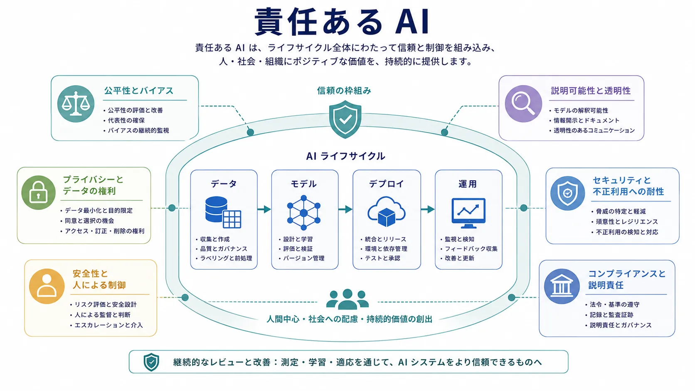

責任ある AI は、現実の条件下で AI システムを信頼できる状態に保つための規律です。モデルの能力だけでは十分ではありません。人、意思決定、知識、運用に影響するシステムには、公平性、セキュリティ、プライバシー、透明性、説明責任、境界のある制御も必要です。

実務上の誤りは、これらをシステム設計後の最終承認として扱うことです。責任ある AI は、データ選定から始まり、デプロイ、監視、インシデント対応まで続く、横断的な設計・運用の規律です。

## 定義

責任ある AI は、AI システムをライフサイクル全体で適法、安全、公平、セキュア、レビュー可能、説明責任を持つ状態に保つよう、設計、デプロイ、統制する分野です。組織のポリシーと技術的な制御を組み合わせます。

責任は抽象的な理念ではありません。具体的なシステム境界、レビュー手続き、証拠によって表現する必要があります。

## なぜ重要か

AI システムは、バイアスを増幅し、機微情報を露出し、安全でない自動化を生み、確信に満ちた誤解を招く出力を返すことがあります。データ、モデル、ツール、ワークフローロジックが相互作用すると、説明責任も難しくなります。これらのリスクは周辺的ではなく、システムの振る舞いの範囲そのものです。

顧客対応、アクセス判断、規制対象のワークフロー、内部知識の公開、運用上のアクションに AI が影響する領域では、特に重要になります。

## 中核となる関心領域

以下の領域は、AI に共通するリスクと、それに対応する代表的な制御を結び付けます。

| リスク領域                     | 意味                                           | 代表的な制御                                                 |
| ------------------------------ | ---------------------------------------------- | ------------------------------------------------------------ |
| 公平性とバイアス               | 集団・文脈間で不均衡または有害な結果が出ること | データセットレビュー、部分集団評価、エスカレーションポリシー |
| 説明可能性と透明性             | 振る舞いを理解・説明できること                 | 文書化、追跡可能性、出力の根拠、監査ログ                     |
| プライバシーとデータの権利     | 機微・制限付き情報を保護すること               | データ最小化、アクセス制御、保持、マスキング                 |
| セキュリティと不正利用への耐性 | 悪用、漏えい、敵対的利用から守ること           | 権限境界、監視、不正利用対策                                 |
| 安全性と人による制御           | 有害または無制御の行動を防ぐこと               | ガードレール、承認ゲート、フォールバック                     |
| コンプライアンスと説明責任     | 統制と意思決定の所有を示すこと                 | レビュー、証拠収集、ポリシー対応、所有者の明確化             |

公平性は人・集団・文脈による結果の差を扱い、透明性はシステムの意図、使われ方、失敗の調査方法を関係者が理解できることを扱います。プライバシーはアクセス・保持・開示してよい情報を問い、セキュリティは悪用・侵害される経路を問い、安全性は自律性の範囲と有害な行動を防ぐ境界を問います。

## ライフサイクルへの適用

責任ある AI は、データ選定と権利管理から始まります。目的とフィードバックシグナルが望ましくない振る舞いを埋め込み得るため、モデル適応にも続きます。デプロイではアクセス制御、レート制限、ガードレール、承認境界に影響します。本番では監視、インシデント対応、ポリシーレビューを通じて継続します。

リスクは1つのモデル判断ではなく、レイヤー間の相互作用から現れることが多いため、このライフサイクルの見方が重要です。

## 組織の運用モデル

責任ある AI には明確な所有者が必要です。プロダクト、プラットフォーム、セキュリティ、法務・コンプライアンス、領域の専門家が責任を共有することはありますが、判断の境界は明示しなければなりません。レビューゲート、エスカレーション経路、証拠保持、インシデントの説明責任は、ガバナンス文書だけでなく技術的な運用モデルの一部です。

## まとめ

責任ある AI は、AI の能力を信頼、制御、説明責任によって境界付ける、システム全体の規律です。提供を遅らせること自体が目的ではありません。強力なシステムを、時間を通じて責任を持って利用できるだけ安全で、説明可能で、統制可能な状態にすることが目的です。
