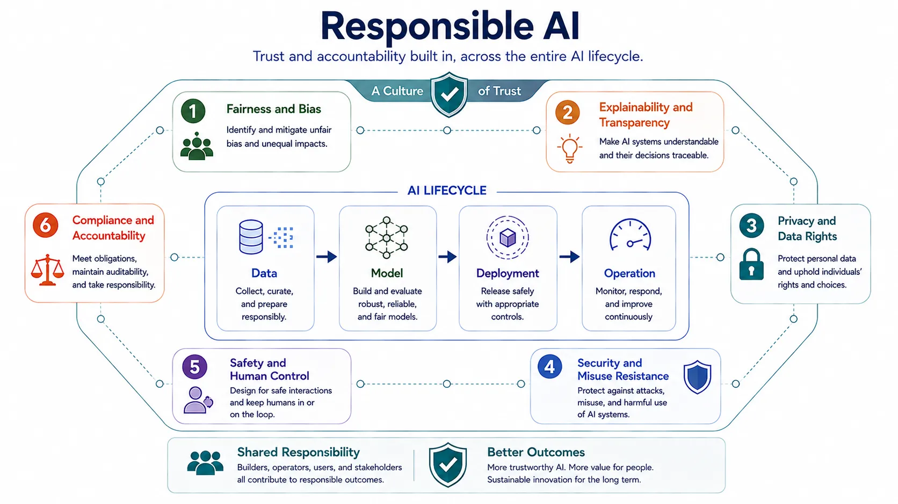

Responsible AI is the discipline of keeping AI systems trustworthy under real-world conditions. It exists because model capability alone is not enough. Systems that affect people, decisions, knowledge, or operations also need fairness, security, privacy, transparency, accountability, and bounded control.

The practical mistake is to treat these concerns as a final approval step after the system is already designed. In reality, responsible AI is a cross-cutting design and operating discipline that begins with data selection and continues through deployment, monitoring, and incident response.

## Definition

Responsible AI is the discipline of designing, deploying, and governing AI systems so they remain lawful, safe, fair, secure, reviewable, and accountable across their lifecycle. It combines organizational policy with technical controls.

The key point is that responsibility is not abstract. It must be expressed through concrete system boundaries, review processes, and evidence.

## Why It Matters

AI systems can amplify bias, expose sensitive information, create unsafe automation, or produce confident but misleading outputs. They can also make accountability harder when many layers of data, models, tools, and workflow logic interact. Responsible AI matters because these risks are not peripheral. They are part of the core system behavior envelope.

This is especially important in domains where AI influences customer treatment, access decisions, regulated workflows, internal knowledge exposure, or operational action.

## Core Concern Areas

The following areas connect common AI risks to representative controls that can address them.

| Risk area                       | What it means                                         | Representative controls                                      |
| ------------------------------- | ----------------------------------------------------- | ------------------------------------------------------------ |
| Fairness and bias               | Uneven or harmful outcomes across groups or contexts  | Dataset review, subgroup evaluation, escalation policy       |
| Explainability and transparency | Ability to understand and communicate system behavior | Documentation, traceability, output rationale, audit logs    |
| Privacy and data rights         | Protection of sensitive or restricted information     | Data minimization, access control, retention and redaction   |
| Security and misuse resistance  | Protection against abuse, leakage, or adversarial use | Permission boundaries, monitoring, abuse controls            |
| Safety and human control        | Preventing harmful or uncontrolled system action      | Guardrails, approval gates, fallback behavior                |
| Compliance and accountability   | Demonstrating governance and decision ownership       | Reviews, evidence capture, policy mapping, ownership clarity |

### Fairness and Transparency

Fairness concerns how outcomes differ across people, groups, and contexts. Transparency concerns whether stakeholders can understand what the system is intended to do, how it is used, and how to investigate failures. These are related, but not interchangeable.

### Privacy, Security, and Safety

Privacy asks what information the system is allowed to access, retain, or reveal. Security asks how the system can be misused or exploited. Safety asks how much autonomy the system can exercise and what boundaries prevent harmful action. These concerns become more urgent as models gain broader capability and tool access.

## Lifecycle Application

Responsible AI begins with data selection and rights management. It continues in model adaptation, where objectives and feedback signals can encode undesirable behavior. It affects deployment through access control, rate limiting, guardrails, and approval boundaries. It remains active in production through monitoring, incident response, and policy review.

The lifecycle view matters because risks often emerge from interactions across layers rather than from one isolated model decision.

## Organizational Operating Model

Responsible AI needs clear ownership. Product teams, platform teams, security teams, legal or compliance functions, and domain experts often share responsibility, but the decision boundaries still need to be explicit. Review gates, escalation paths, evidence retention, and incident accountability are therefore part of the technical operating model, not only governance paperwork.

## Relationship to Enterprise AI

Enterprise AI depends on responsible AI because large organizations cannot scale AI adoption without shared control patterns, trust boundaries, and evidence of due care. Platform strategy, procurement, model access, and deployment policy all rely on responsible-AI concepts.

## Summary

Responsible AI is the system-wide discipline that keeps AI capability bounded by trust, control, and accountability. Its purpose is not to slow delivery for its own sake. Its purpose is to make powerful systems safe enough, explainable enough, and governable enough to use responsibly over time.
