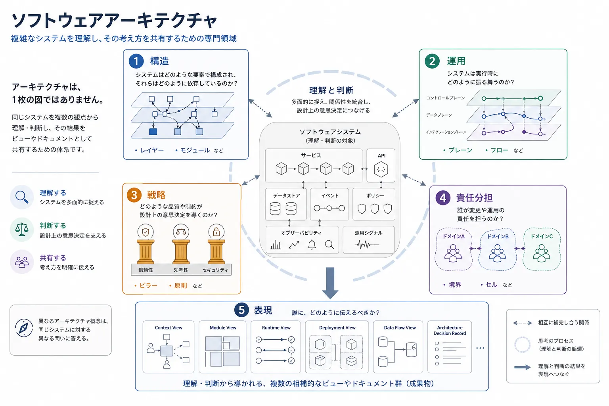

ソフトウェアアーキテクチャは、システムをどのように捉え、そこで何を判断し、その考え方をどう明確に共有するかを扱う専門領域です。
複雑さを理解し、トレードオフを評価し、リスクを見つけ、ソフトウェアの構築・運用・変更の方向性を意思決定に結びつけるために役立ちます。

経験のあるチームほど、ある対象をレイヤーと呼ぶべきか、プレーンと呼ぶべきか、サービス、モジュール、コンポーネント、あるいはピラーと呼ぶべきかで議論になります。
しかし、その議論の背後には、もっと本質的な論点が隠れていることが少なくありません。
用語が揺れるのは、アーキテクトが同じシステムを異なる観点から捉えているためです。

アーキテクチャは、1 枚の完璧な図ではありません。
同じソフトウェアについて、異なる問いに答えるための相補的なモデルの集合です。

## 判断のためのアーキテクチャ

アーキテクチャは、変更コストが高くなる前に考えるための道具です。
ソースコードや実行基盤だけに還元せず、構造、振る舞い、制約、結果を捉える方法をチームに与えます。

良いアーキテクチャ思考は、チームに次のことを可能にします。

- システムのどの部分がどこに依存しているかを理解する
- 変更がモジュール、サービス、チーム、データへどう波及し得るかを予測する
- 信頼性、コスト、性能、セキュリティ、提供速度の間にあるトレードオフを評価する
- 本番障害や組織的なボトルネックになる前にリスクを見つける
- 共通の判断基準を使って代替案を比較する

判断に使う成果物は、必ずしも整った公開文書である必要はありません。
不完全でも、一時的でも、狭い論点だけに集中していても構いません。
重要なのは、複雑さをチームが一緒に考えられる程度まで可視化することです。

## 共有のためのアーキテクチャ

アーキテクチャは、人に伝えるための手段でもあります。
経営層、エンジニア、運用担当者、セキュリティレビュー担当者、プロダクトチームでは、同じシステムに対して必要な見え方が異なります。
有用なアーキテクチャ文書は、対象読者と目的に応じて必要な詳細を選び取ります。

伝達のためのビューは、チームに次のことをもたらします。

- システムの狙いについて関係者の認識をそろえる
- 未知の領域に入るエンジニアの立ち上がりを助ける
- 実装前に設計をレビューする
- 運用上の責任分担を説明する
- 重要な意思決定の理由を記録する
- 将来の変更に向けた共通言語をつくる

1 枚の万能なアーキテクチャ図よりも、意図を持って作られた複数のビューの方が通常は有用です。
各ビューは、問いに答えるか、意思決定を支えるか、特定の読者がある懸念を理解する助けになるべきです。

## アーキテクチャは多面的である

現代のシステムは、1 つの視点だけでは理解しきれません。
同じプラットフォームでも、依存関係を考えるための構造ビュー、実行時の振る舞いを見る運用ビュー、設計上の優先順位を示す戦略ビュー、チーム責任を明らかにする責任分担ビュー、関係者に伝えるための説明ビューが必要になることがあります。

これらは互いに競合するアーキテクチャ定義ではありません。
相補的なレンズです。

| 観点     | 主な問い                                 | 代表的な概念                                   |
| -------- | ---------------------------------------- | ---------------------------------------------- |
| 構造     | 何が作られており、何が何に依存しているか | レイヤー、モジュール、コンポーネント、サービス |
| 運用     | システムは実行時にどう振る舞うか         | プレーン、フロー、パイプライン                 |
| 戦略     | どのような特性や制約が判断を形づくるか   | ピラー、原則、ポリシー                         |
| 責任分担 | 変更と運用の責任を誰が持つか             | ドメイン、境界、セル                           |
| 表現     | 何をどう説明すべきか                     | ビュー、ビューポイント、視点                   |

同じシステムでも、問いによって表し方は変わります。
レイヤー図は依存方向を説明するのに向いています。
コントロールプレーンとデータプレーンの図は、運用上の責任を説明するのに向いています。
フロー図は、リクエストやデータの移動を説明するのに向いています。
責任分担マップは、各部分を誰が変更し運用するかを説明するのに向いています。
セキュリティや信頼性のビューは、レビューに必要な詳細だけを意図的に抜き出します。

どれか 1 つだけが「アーキテクチャ」なのではありません。
各ビューは、特定の目的のために投影されたアーキテクチャの一面です。

## 中核概念

### レイヤー

レイヤーは、構造上の抽象化を表します。
たとえば次の問いに答える助けになります。

- 何が何に依存しているか
- どの抽象化がどの抽象化の上に成り立つか
- 依存関係はどの方向へ流れるべきか
- どの部分を変更から隔離すべきか

レイヤーは、アプリケーションアーキテクチャ、プラットフォームの積み上がり、プロトコルモデル、実行基盤の抽象化を考えるときに有用です。
一方で、図の中に並ぶ横長の箱を何でもレイヤーと呼んだり、デプロイ構成と混同したりすると誤解を招きます。

### プレーン

プレーンは、運用上の責任や制御経路を表します。
たとえば次の問いに答える助けになります。

- 誰が実行を制御しているか
- 誰がトラフィックやデータを処理しているか
- 運用、ポリシー、テレメトリ、オーケストレーションはどの経路で扱われるか
- どの関心事が構造上の境界を横断するか

コントロールプレーン、データプレーン、オブザーバビリティプレーン、ポリシープレーン、ワークフロープレーンは、しばしば複数のレイヤーをまたぎます。
そのため、構造としてはレイヤー化されたシステムが、同時にプレーンによって運用されることがあります。

### フローとパイプライン

フローとパイプラインは、時間の中での移動を表します。
リクエスト、イベント、データ、ジョブ、承認、フィードバックループが、どのようにシステム境界を通過していくかを示します。

フロー指向のビューは、順序、変換、障害点、キュー、リトライ、引き継ぎを理解するのに特に有効です。
実行中に何が起こるかを示すことで、構造ビューを補完します。

### ピラー

ピラーは、アーキテクチャ上の優先事項を表します。
信頼性、セキュリティ、拡張性、コスト効率、保守性、運用容易性、開発者体験のように、システムが何を重視して最適化すべきかを記述します。

ピラーは実行時コンポーネントではありません。
意思決定のためのレンズです。
特定の制約の下で、なぜある設計が別の設計より望ましいのかを説明する助けになります。

### 責任境界

責任境界は、変更と運用に関する責任の切れ目を表します。
技術的な境界と関係はありますが、サービス、レイヤー、デプロイ単位、組織図と同じものではありません。

責任分担のビューは、誰が安全に変更できるのか、誰が運用するのか、誰がインシデント対応を担うのか、誰が契約を定義するのか、誰が長期的な複雑さのコストを負うのかを明確にします。

### ビューとビューポイント

ビューは、意図して作る伝達用の成果物です。
対象読者と目的に応じて、関心事、詳細度、表現方法を選び取ります。

ビューポイントは、そのビューを構成するための見方や枠組みを定義します。
たとえば、開発者向けビュー、プラットフォーム運用ビュー、セキュリティレビュー向けビュー、経営層向けビューは、同じシステムを扱いながらも、強調する情報が異なります。

## 関心事からビューへ

明確なアーキテクチャ文書は、通常、図からではなく関心事から始まります。
その関心事が、どの観点で考えるべきか、どのトレードオフを評価すべきか、どのビューで伝えるべきかを決めます。

有効な進め方の 1 つは次の通りです。

1. 関心事を特定する。
2. 関連する観点を選ぶ。
3. 選択肢とトレードオフを検討する。
4. 想定読者向けのビューを作る。
5. そのビューを使って伝達または意思決定する。

たとえば、関心事が依存方向であれば、構造としてのレイヤービューが有効かもしれません。
関心事が実行時のポリシー適用なら、プレーンやフローのビューの方が適しているかもしれません。
関心事が説明責任なら、責任境界ビューがふさわしい成果物になるかもしれません。
経営層との認識合わせが目的なら、最適なビューは実装の詳細を大きく省略したものになることがあります。

## 読み進め方

このセクションは、1 本の長い記事というより、アーキテクチャ文書のライブラリとして構成しています。
まずこの概要を読み、その後は答えたい問いに応じて詳細ページを参照してください。












## 要約

アーキテクチャに関する用語は、恣意的に存在しているわけではありません。
レイヤー、プレーン、ピラー、フロー、境界、ビューといった概念があるのは、ソフトウェアシステムが 1 つの視点だけでは捉えきれないほど複雑だからです。

アーキテクチャの目的は、1 枚の完全な図を作ることではありません。
システムについて考え、より良い意思決定を行い、その判断をチームが共有理解のもとで構築・運用できる程度に明確に伝えることです。
