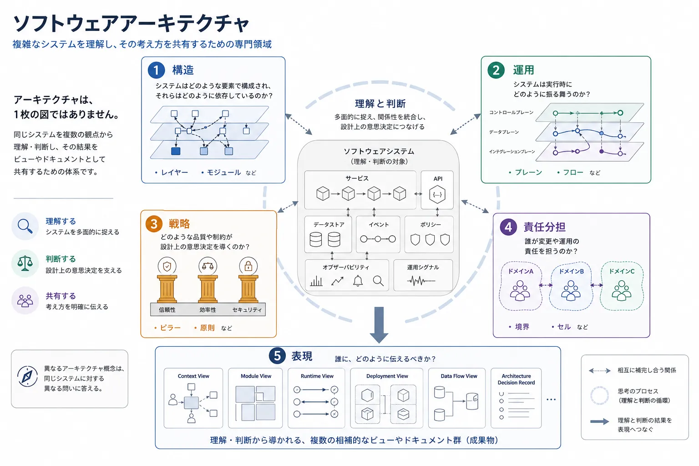
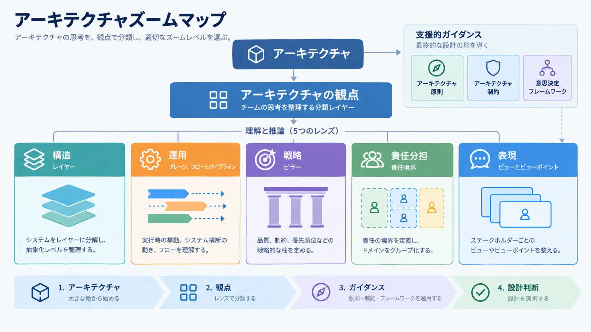
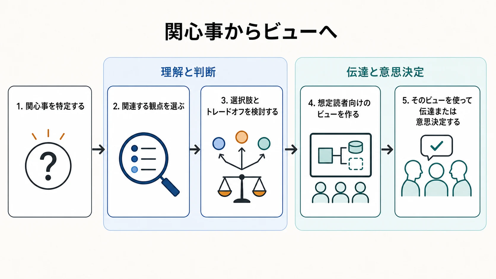

ソフトウェアアーキテクチャは、システムをどのように捉え、そこで何を判断し、その考え方をどう明確に共有するかを扱う専門領域です。
複雑さを理解し、トレードオフを評価し、リスクを見つけ、ソフトウェアの構築・運用・変更の方向性を意思決定に結びつけるために役立ちます。

経験のあるチームほど、ある対象をレイヤーと呼ぶべきか、プレーンと呼ぶべきか、サービス、モジュール、コンポーネント、あるいはピラーと呼ぶべきかで議論になります。
しかし、その議論の背後には、もっと本質的な論点が隠れていることが少なくありません。
用語が揺れるのは、アーキテクトが同じシステムを異なる観点から捉えているためです。

アーキテクチャは、1 枚の完璧な図ではありません。
同じソフトウェアについて、異なる問いに答えるための相補的なモデルの集合です。

## このセクションの読み方

まず答えたい問いを選び、その問いに必要なところまでシステムを段階的に詳しく見ていきます。アーキテクチャ文書で、考えられるすべての詳細レベルを扱う必要はありません。

### システムはどこに位置づけられるか

システムの目的、周囲の環境、関係する人や外部システムから始めます。 [アーキテクチャの観点](dimensions/) で考えるためのレンズを選び、 [責任境界](dimensions/ownership-boundaries/) で責任の所在を明らかにし、 [ビューとビューポイント](dimensions/views-and-viewpoints/) で対象読者に合った説明の枠組みを定めます。

### システムを構成する主要な要素は何か

システムの内側へ進み、構造上・運用上の大きな構成要素を捉えます。 [レイヤー](dimensions/layers/) では抽象化と依存方向を、 [プレーン](dimensions/planes/) では運用上の責務の分離を扱います。 [ピラー](dimensions/pillars/) は、それらの選択を形づくる品質特性や制約を明らかにします。

### 主要な構成要素はどのように連携するか

[フローとパイプライン](dimensions/flows-and-pipelines/) を使い、構成要素の間を通るリクエスト、イベント、データ、障害経路を追います。 [アーキテクチャ原則](principles/) で組織の持続的な指針を、 [アーキテクチャ制約](constraints/) で選択肢が満たすべき境界を定めてから、 [意思決定フレームワーク](decision-frameworks/) へ進みます。特定の読者に結果を説明するときは、 [ビューとビューポイント](dimensions/views-and-viewpoints/) に立ち返ります。

### アーキテクチャ・ズームマップ

このマップは、分類とズームレベルを分けて示します。 [アーキテクチャの観点](dimensions/) は、同じシステムを異なる視点で考えるためのハブです。関連セクションは、その設計を形づくる原則、制約、意思決定プロセスを補足します。

| カテゴリ                     | 代表的なトピック                                                                                                                                                                                                                                                                                      |
| ---------------------------- | ----------------------------------------------------------------------------------------------------------------------------------------------------------------------------------------------------------------------------------------------------------------------------------------------------- |
| **アーキテクチャの観点**     | [アーキテクチャの観点](dimensions/)、[レイヤー](dimensions/layers/)、[プレーン](dimensions/planes/)、[フローとパイプライン](dimensions/flows-and-pipelines/)、[ピラー](dimensions/pillars/)、[責任境界](dimensions/ownership-boundaries/)、[ビューとビューポイント](dimensions/views-and-viewpoints/) |
| **アーキテクチャガイダンス** | [アーキテクチャ原則](principles/)、[アーキテクチャ制約](constraints/)                                                                                                                                                                                                                                 |
| **意思決定**                 | [意思決定フレームワーク](decision-frameworks/)                                                                                                                                                                                                                                                        |

この構成により、ナビゲーションの意図が明確になります。セクションはまず思考レンズで整理され、そのうえで意思決定の文脈が接続されます。抽象度と分類を同じ図で混在させるよりも、こちらのほうが実務で使いやすい構造です。[^c4-introduction]

## 判断と共有のためのアーキテクチャ

アーキテクチャには、密接につながる 2 つの役割があります。
チームがシステムについて考えることを助け、その考え方を、理解、検証、承認、構築、運用する必要がある人へ伝えることを助けます。

共有されない判断は個人の中にとどまり、レビューが困難になります。
判断を伴わない伝達は、見た目が整っていても妥当な意思決定を反映していない成果物を生みます。
有用なアーキテクチャは、この 2 つの間を繰り返し行き来します。

### システムについて考える

アーキテクチャは、変更コストが高くなる前に考えるための道具です。
ソースコードや実行基盤だけに還元せず、構造、振る舞い、制約、結果を捉える方法をチームに与えます。

良いアーキテクチャ思考は、チームに次のことを可能にします。

- システムのどの部分がどこに依存しているかを理解する
- 変更がモジュール、サービス、チーム、データへどう波及し得るかを予測する
- 信頼性、コスト、性能、セキュリティ、提供速度の間にあるトレードオフを評価する
- 本番障害や組織的なボトルネックになる前にリスクを見つける
- 共通の判断基準を使って代替案を比較する

判断に使う成果物は、必ずしも整った公開文書である必要はありません。
不完全でも、一時的でも、狭い論点だけに集中していても構いません。
重要なのは、複雑さをチームが一緒に考えられる程度まで可視化することです。

### 判断の過程を共有する

経営層、エンジニア、運用担当者、セキュリティレビュー担当者、プロダクトチームでは、同じシステムに対して必要な見え方が異なります。
有用なアーキテクチャ文書は、対象読者と目的に応じて必要な詳細を選び取ります。

伝達のためのビューは、チームに次のことをもたらします。

- システムの狙いについて関係者の認識をそろえる
- 未知の領域に入るエンジニアの立ち上がりを助ける
- 実装前に設計をレビューする
- 運用上の責任分担を説明する
- 重要な意思決定の理由を記録する
- 将来の変更に向けた共通言語をつくる

1 枚の万能なアーキテクチャ図よりも、意図を持って作られた複数のビューの方が通常は有用です。
各ビューは、問いに答えるか、意思決定を支えるか、特定の読者がある懸念を理解する助けになるべきです。

### 関心事からビューへ

判断と共有は、関心事を通じてつながります。
関心事は、チームが何を理解する必要があるか、どの観点とトレードオフを検討するべきか、どのビューを使って想定読者へ結果を伝えるかを決めます。

この進め方は反復的です。

1. 関心事を特定する。
2. 関連する観点を選ぶ。
3. 選択肢とトレードオフを検討する。
4. 想定読者向けのビューを作る。
5. ビューから得たフィードバックを使って考え方を改善するか、意思決定を支える。

たとえば、関心事が依存方向であれば、構造としてのレイヤービューが有効かもしれません。
関心事が実行時のポリシー適用なら、プレーンやフローのビューの方が適しているかもしれません。
関心事が説明責任なら、責任境界ビューがふさわしい成果物になるかもしれません。
経営層との認識合わせが目的なら、最適なビューは実装の詳細を大きく省略したものになることがあります。

実務では、ここまでに出てきた概念を個別の用語としてではなく、つながった思考の体系として組み合わせて使います。
ピラーは文脈で重視すべき品質を明確にし、原則はそれを持続的な判断指針に変換します。
制約は、検討可能な選択肢を現実的な範囲に絞り込みます。
意思決定フレームワークは、個別の設計判断で比較とトレードオフを構造化します。
レイヤー、プレーン、フローは、その判断の結果として現れるアーキテクチャを記述し、ビューとビューポイントは対象読者に応じて必要な部分を伝達します。

この進め方は実務で有効ですが、厳密な一方向プロセスではありません。
判断によって新しい関心事が見つかることもあります。
共有用のビューが、根拠不足や説明の欠落を明らかにすることもあります。
実行時のふるまいの観察が、原則そのものの見直しを促すこともあります。
アーキテクチャは、判断と共有を往復しながら改善されるときに最も機能します。

## トピックページ

このセクションは、1 本の長い記事というより、アーキテクチャ文書のライブラリとして構成しています。
以下のトピックページから、いま答えたい問いに対応する領域へ直接進んでください。














## 要約

アーキテクチャに関する用語は、恣意的に存在しているわけではありません。
レイヤー、プレーン、ピラー、フロー、境界、ビューといった概念があるのは、ソフトウェアシステムが 1 つの視点だけでは捉えきれないほど複雑だからです。

アーキテクチャの目的は、1 枚の完全な図を作ることではありません。
システムについて考え、より良い意思決定を行い、その判断をチームが共有理解のもとで構築・運用できる程度に明確に伝えることです。

[^c4-introduction]: [C4 model: Introduction](https://c4model.com/introduction)
