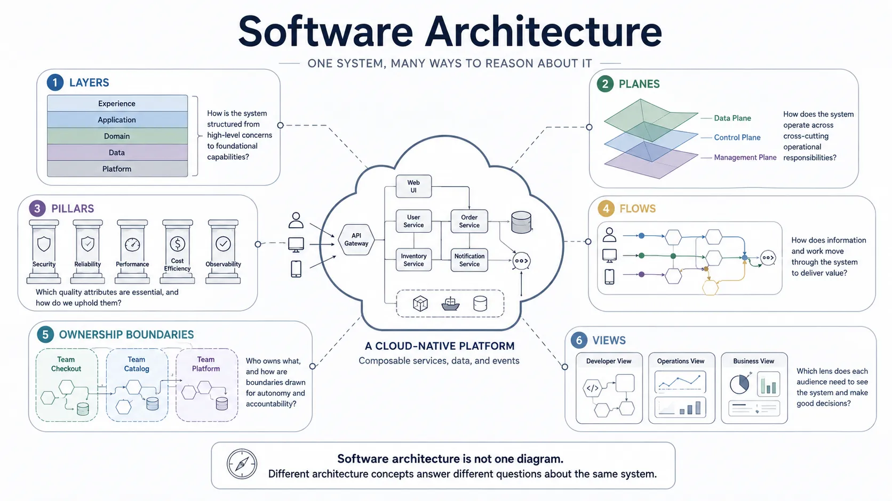

Software architecture is the discipline of reasoning about systems and communicating that reasoning clearly.
It helps teams understand complexity, evaluate tradeoffs, identify risks, and align people around decisions that shape how software is built, operated, and changed over time.

Experienced teams often argue about whether something should be called a layer, a plane, a service, a module, a component, or a pillar.
Those arguments usually hide a deeper issue.
The terminology differs because architects are often reasoning about different dimensions of the same system.

Architecture is not one perfect diagram.
It is a set of complementary models that help people answer different questions about the same software.

## Architecture as Reasoning

Architecture helps engineers think before the cost of change becomes high.
It gives teams a way to examine structure, behavior, constraints, and consequences without reducing the system to source code or runtime infrastructure alone.

Good architecture reasoning helps teams:

- Understand which parts of a system depend on each other
- Predict how change may spread across modules, services, teams, and data
- Evaluate tradeoffs between reliability, cost, performance, security, and delivery speed
- Identify risks before they become production incidents or organizational bottlenecks
- Compare alternative designs using shared criteria

Reasoning artifacts are not always polished publication artifacts.
They may be incomplete, temporary, or focused on one narrow decision.
Their value comes from making complexity visible enough that a team can think together.

## Architecture as Communication

Architecture also helps people communicate.
Executives, engineers, operators, security reviewers, and product teams do not need the same view of a system.
A useful architecture document selects the details that matter for a specific audience and purpose.

Communication views help teams:

- Align stakeholders around system intent
- Onboard engineers into unfamiliar domains
- Review designs before implementation
- Explain operational responsibilities
- Document why important decisions were made
- Create a shared language for future change

A single master architecture diagram is usually less useful than several intentional views.
Each view should answer a question, support a decision, or help a specific audience understand a concern.

## Architecture Is Multi-Dimensional

Modern systems are too complex to understand from one perspective.
The same platform may need a structural view for dependency reasoning, an operational view for runtime behavior, a strategic view for design priorities, an ownership view for team responsibility, and a communication view for stakeholder alignment.

These dimensions are not competing definitions of architecture.
They are complementary lenses.

| Dimension     | Primary question                                | Typical concepts                      |
| ------------- | ----------------------------------------------- | ------------------------------------- |
| Structural    | What is built, and what depends on what?        | Layers, modules, components, services |
| Operational   | How does the system behave at runtime?          | Planes, flows, pipelines              |
| Strategic     | What qualities and constraints shape decisions? | Pillars, principles, policies         |
| Ownership     | Who is responsible for change and operation?    | Domains, boundaries, cells            |
| Communication | How should this be explained?                   | Views, viewpoints, perspectives       |

The same system can be represented differently depending on the question.
A layered diagram may explain dependency direction.
A control-plane and data-plane diagram may explain operational responsibility.
A flow diagram may explain request or data movement.
An ownership map may explain who changes and operates each part.
A security or reliability view may select details needed for review.

No single view is "the architecture."
Each view is a projection of the architecture for a particular purpose.

## Core Concepts

### Layers

Layers represent structural abstraction.
They help answer questions such as:

- What depends on what?
- Which abstractions build on others?
- Where should dependencies flow?
- Which parts should be insulated from change?

Layers are useful for reasoning about application architecture, platform stacks, protocol models, and runtime abstractions.
They become misleading when teams use them to describe every horizontal box in a diagram or confuse them with deployment topology.

### Planes

Planes represent operational responsibility.
They help answer questions such as:

- Who controls execution?
- Who processes traffic or data?
- Which path handles operations, policy, telemetry, or orchestration?
- Which concerns cross structural boundaries?

Control planes, data planes, observability planes, policy planes, and workflow planes often cut across layers.
This is why a system can be structurally layered while also having operational planes that move through those layers.

### Flows and Pipelines

Flows and pipelines represent movement over time.
They show how requests, events, data, jobs, approvals, or feedback loops pass through system boundaries.

Flow-oriented views are especially useful for understanding sequencing, transformations, failure points, queues, retries, and handoffs.
They complement structural views by showing what happens during execution.

### Pillars

Pillars represent architectural priorities.
They describe the qualities a system must optimize for, such as reliability, security, scalability, cost efficiency, maintainability, operability, and developer experience.

Pillars are not runtime components.
They are decision lenses.
They help teams explain why one design is preferable to another under a specific set of constraints.

### Ownership Boundaries

Ownership boundaries describe responsibility for change and operation.
They are related to technical boundaries, but they are not the same thing as services, layers, deployment units, or organization charts.

Ownership views help clarify who can change a system safely, who operates it, who handles incidents, who defines contracts, and who pays the long-term complexity cost.

### Views and Viewpoints

A view is a deliberate communication artifact.
It selects the concerns, level of detail, and representation needed for a particular audience and purpose.

A viewpoint defines the framing used to construct that view.
For example, a developer view, platform operations view, security review view, and executive view may all describe the same system while emphasizing different information.

## From Concerns to Views

Clear architecture documentation usually starts with a concern rather than a diagram.
The concern determines the dimension to reason about, the tradeoffs to evaluate, and the view needed for communication.

One useful progression is:

1. Identify the concern.
2. Choose the relevant dimension.
3. Reason about options and tradeoffs.
4. Create a view for the intended audience.
5. Use the view to communicate or decide.

For example, if the concern is dependency direction, a structural layer view may help.
If the concern is runtime policy enforcement, a plane or flow view may be better.
If the concern is accountability, an ownership boundary view may be the right artifact.
If the concern is executive alignment, the best view may hide most implementation detail.

## Recommended Reading Flow

This section is organized as an architecture documentation library rather than one long article.
Start with the overview, then use the detailed pages according to the question you need to answer.

<!-- deno-fmt-ignore-start -->












<!-- deno-fmt-ignore-end -->

## Summary

Architecture terminology is not arbitrary.
Layers, planes, pillars, flows, boundaries, and views exist because software systems are too complex to understand from a single perspective.

The goal of architecture is not to produce one complete diagram.
The goal is to help people reason about systems, make better decisions, and communicate those decisions clearly enough that teams can build and operate software with shared understanding.
