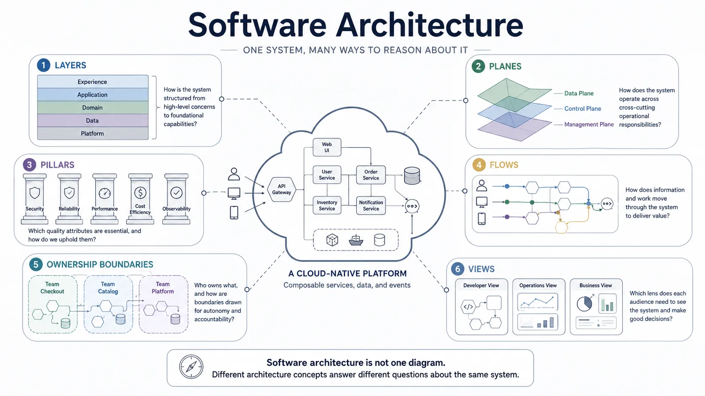
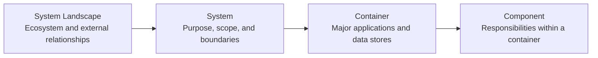
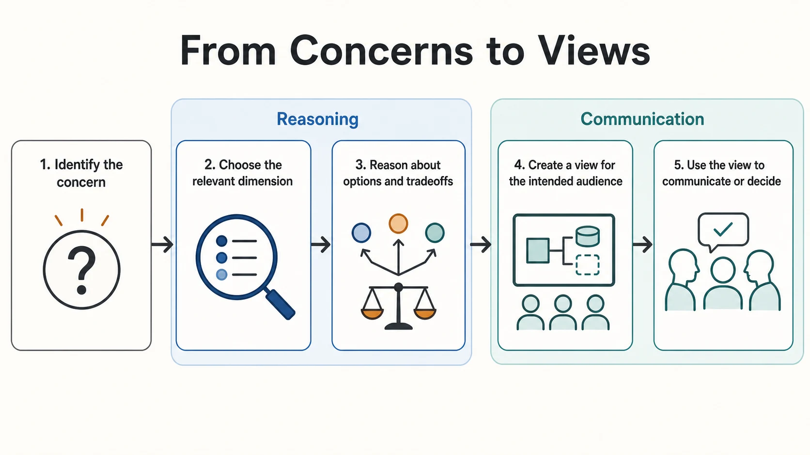
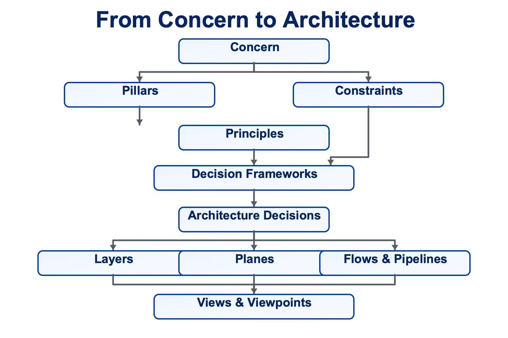

Software architecture is the discipline of reasoning about systems and communicating that reasoning clearly.
It helps teams understand complexity, evaluate tradeoffs, identify risks, and align people around decisions that shape how software is built, operated, and changed over time.

Experienced teams often argue about whether something should be called a layer, a plane, a service, a module, a component, or a pillar.
Those arguments usually hide a deeper issue.
The terminology differs because architects are often reasoning about different dimensions of the same system.

Architecture is not one perfect diagram.
It is a set of complementary models that help people answer different questions about the same software.

## How to Read This Section

Start with the question you need to answer, then move only as far into the system as that question requires. Most architecture documentation does not need every possible level of detail.

### Where does the system fit?

Begin with the system's purpose, its environment, and the people or systems around it. Use [Architecture Dimensions](dimensions/) to choose a useful reasoning lens, [Ownership Boundaries](ownership-boundaries/) to clarify responsibility, and [Views and Viewpoints](views-and-viewpoints/) to frame the explanation for a particular audience.

### What are its major building blocks?

Move inward to the system's large structural and operational parts. [Layers](layers/) explains abstraction and dependency direction, [Planes](planes/) separates operational responsibilities, and [Pillars](pillars/) identifies the qualities and constraints that shape those choices.

### How do those building blocks interact?

Use [Flows and Pipelines](flows-and-pipelines/) to trace requests, events, data, and failure paths between parts. Use [Architecture Principles](principles/) to carry persistent organizational guidance into [Decision Frameworks](decision-frameworks/), which connect those interactions to concerns, tradeoffs, and architectural decisions. Return to [Views and Viewpoints](views-and-viewpoints/) when the result needs to be communicated to a specific audience.

### Architecture Zoom Map

The map is a navigation aid, not a requirement that every topic fit a strict hierarchy. Move one abstraction level at a time and stop when the view answers the question. In practice, landscape, system, and container views are often enough; code-level detail is intentionally outside this long-lived navigation map and can usually be generated on demand.[^c4-diagrams][^c4-code]

```mermaid
flowchart LR
  landscape["System Landscape<br/>Ecosystem and external relationships"] --> system["System<br/>Purpose, scope, and boundaries"]
  system --> container["Container<br/>Major applications and data stores"]
  container --> component["Component<br/>Responsibilities within a container"]
```

| Navigation level     | Representative topics                                                                                                                            |
| -------------------- | ------------------------------------------------------------------------------------------------------------------------------------------------ |
| **System Landscape** | [Ownership Boundaries](ownership-boundaries/), [Views and Viewpoints](views-and-viewpoints/)                                                     |
| **System**           | [Architecture Dimensions](dimensions/), [Pillars](pillars/), [Architecture Principles](principles/), [Decision Frameworks](decision-frameworks/) |
| **Container**        | [Layers](layers/), [Planes](planes/)                                                                                                             |
| **Component**        | [Flows and Pipelines](flows-and-pipelines/), [Layers](layers/)                                                                                   |

Keeping scope, labels, and relationships explicit prevents a single diagram from mixing abstraction levels and becoming difficult to interpret.[^c4-introduction]

## Architecture as Reasoning and Communication

Architecture has two closely connected roles. It helps teams reason about a system, and it helps them communicate that reasoning to people who need to understand, challenge, approve, build, or operate it.

Reasoning without communication remains private and difficult to review. Communication without reasoning produces polished artifacts that may not reflect sound decisions. Useful architecture moves repeatedly between the two.

### Reasoning about the System

Architecture helps engineers think before the cost of change becomes high.
It gives teams a way to examine structure, behavior, constraints, and consequences without reducing the system to source code or runtime infrastructure alone.

Good architecture reasoning helps teams:

- Understand which parts of a system depend on each other
- Predict how change may spread across modules, services, teams, and data
- Evaluate tradeoffs between reliability, cost, performance, security, and delivery speed
- Identify risks before they become production incidents or organizational bottlenecks
- Compare alternative designs using shared criteria

Reasoning artifacts are not always polished publication artifacts.
They may be incomplete, temporary, or focused on one narrow decision.
Their value comes from making complexity visible enough that a team can think together.

### Communicating the Reasoning

Executives, engineers, operators, security reviewers, and product teams do not need the same view of a system.
A useful architecture document selects the details that matter for a specific audience and purpose.

Communication views help teams:

- Align stakeholders around system intent
- Onboard engineers into unfamiliar domains
- Review designs before implementation
- Explain operational responsibilities
- Document why important decisions were made
- Create a shared language for future change

A single master architecture diagram is usually less useful than several intentional views.
Each view should answer a question, support a decision, or help a specific audience understand a concern.

### From Concerns to Views

Reasoning and communication connect through concerns. A concern determines what the team needs to understand, which dimensions and tradeoffs it should examine, and which view will communicate the result to the intended audience.

The progression is iterative:

1. Identify the concern.
2. Choose the relevant dimension.
3. Reason about options and tradeoffs.
4. Create a view for the intended audience.
5. Use feedback from the view to refine the reasoning or support a decision.

For example, if the concern is dependency direction, a structural layer view may help.
If the concern is runtime policy enforcement, a plane or flow view may be better.
If the concern is accountability, an ownership boundary view may be the right artifact.
If the concern is executive alignment, the best view may hide most implementation detail.

## From Concern to Architecture

In practical architecture work, this reasoning-and-communication loop draws on the concepts in this section as a connected system rather than a flat vocabulary. Pillars identify what matters. Principles translate those priorities into persistent guidance. Decision frameworks apply that guidance to a specific choice. Layers, planes, and flows describe the resulting architecture, while views present the relevant parts to specific audiences.

This map is a practical progression, not a mandatory one-way sequence. A decision may expose a new concern, a view may reveal that a principle is difficult to apply, and structural or runtime analysis may change the evidence. The topic pages below explain each part of the system and the questions it helps answer.

## Topic Pages

This section is organized as an architecture documentation library rather than one long article.
Use the topic pages below to move directly to the areas that match the question you need to answer.













## Summary

Architecture terminology is not arbitrary.
Layers, planes, pillars, flows, boundaries, and views exist because software systems are too complex to understand from a single perspective.

The goal of architecture is not to produce one complete diagram.
The goal is to help people reason about systems, make better decisions, and communicate those decisions clearly enough that teams can build and operate software with shared understanding.

[^c4-diagrams]: [C4 model: Diagrams](https://c4model.com/diagrams)

[^c4-code]: [C4 model: Code diagram](https://c4model.com/diagrams/code)

[^c4-introduction]: [C4 model: Introduction](https://c4model.com/introduction)
