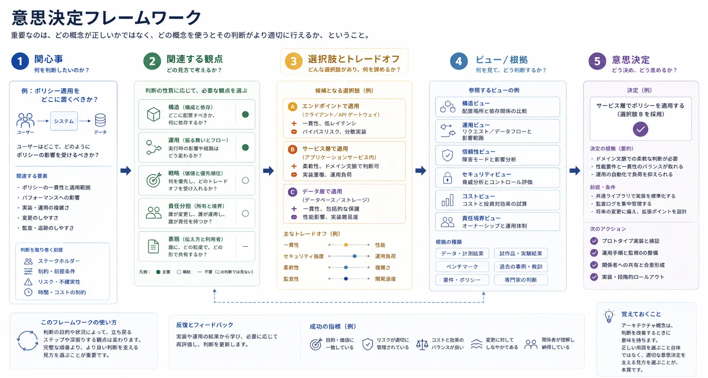
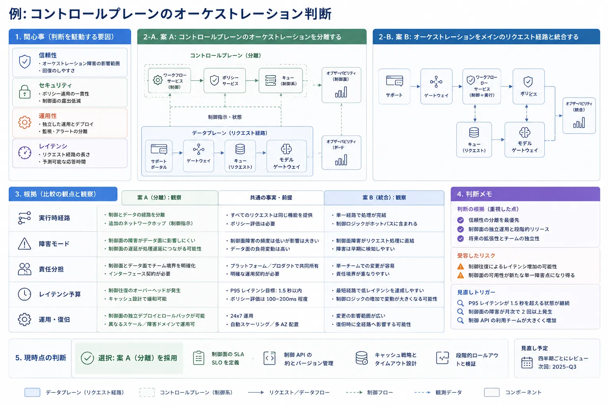

アーキテクチャ用語が役に立つのは、判断の質を高めるときだけです。
チームは、何がレイヤーで何がプレーンで何がサービスかを議論する前に、関心事、制約、トレードオフを明確にしなければ、弱い意思決定をしやすくなります。

## 定義

アーキテクチャの意思決定フレームワークとは、関心事、選択肢、トレードオフ、根拠、結果を結びつける再利用可能な考え方です。
アーキテクチャを形式だけの儀式へ変えずに、語彙から判断へ進む助けになります。

## なぜ意思決定フレームワークが重要か

多くのアーキテクチャ論争が失敗する理由は似ています。
チームが、問いに答える代わりにラベルを比較しているのです。
ある人は信頼性を考え、ある人はチームオーナーシップを考え、ある人は遅延を考えているかもしれません。
フレームワークがなければ、会話は技術的に見えても、実際には認識がずれたままです。

意思決定フレームワークは、チームに次のことを明示させることで議論の質を高めます。

- 何を決めようとしているのか
- どの関係者が影響を受けるのか
- どのリスクと制約が最も重要か
- どの根拠が必要か
- どの結果を受け入れるのか

## 関心事から始める

有用な判断の多くは、好みの設計案ではなく、狭く定義された関心事から始まります。

最低限、次の内容を明らかにするべきです。

- 誰がその判断を必要としているか
- どのリスクまたは問題へ対処しようとしているか
- 無視できない制約は何か
- 受け入れ可能な結果を定義する成功基準は何か

たとえば、監査の一貫性が局所的な自律性より重要であるため、ポリシー適用を集約すべきかもしれません。
あるいは、実行時遅延の制約から、重要経路ではローカル適用が必要かもしれません。

## 関連する観点を選ぶ

異なる判断には、異なるアーキテクチャレンズが必要です。

- 構造上の関心事には、通常、レイヤー、モジュール、コンポーネント、依存ビューが必要
- 運用上の関心事には、通常、プレーン、フロー、実行時挙動のビューが必要
- 戦略上の関心事には、通常、ピラー、原則、品質特性が必要
- 責任分担の関心事には、通常、ドメイン、チーム、データ、プラットフォーム境界の思考が必要
- 表現上の関心事には、通常、結果を説明する対象読者別ビューが必要

誤りは、間違った単語を使うことではありません。
問いに対して間違った観点を選ぶことです。

## 選択肢を明示的に比較する

選択肢を修辞的に擁護するのではなく、一貫した形式で比較すると、判断は強くなります。

その比較が機能するのは、各選択肢を同じレンズ群で見たときです。
そうでなければ、ある案は速度の観点で語られ、別の案はガバナンスの観点で語られ、さらに別の案は実装の都合で語られ、見かけ上は精密でも本当のトレードオフが隠れてしまいます。

次の表は、見える形で議論でき、結果へ結びつく項目で比較するための簡潔な枠組みです。

| 選択肢                 | 利点                                                               | コスト                                           | リスク                                                       | 可逆性       | 必要な根拠                                               |
| ---------------------- | ------------------------------------------------------------------ | ------------------------------------------------ | ------------------------------------------------------------ | ------------ | -------------------------------------------------------- |
| ポリシー適用を集約する | 統制が一貫し、監査が統一され、ガバナンスが単純になる               | 依存先が増え、遅延が集中し得る                   | コントロールプレーン障害やボトルネックが多くの経路へ波及する | 中程度       | 遅延予算、障害分析、監査要件                             |
| ポリシー適用を分散する | 局所的な遅延が低く、末端の自律性が高く、性能劣化時の柔軟性を持てる | 意味のずれ、展開の複雑さ、証跡の分散が起きやすい | サービス間で適用が不整合になる                               | 低から中程度 | 一貫性テスト、ポリシーのライフサイクルモデル、チーム能力 |

目的は表を完全にすることではありません。
トレードオフを表に出すことです。

## 判断の例

社内基盤が、AI 支援ワークフローにおいて、コントロールプレーンのオーケストレーションを主要なリクエスト経路から分離すべきかどうかを判断している状況を考えてみます。

関心事には、信頼性、セキュリティ、運用性が含まれるかもしれません。
運用の観点は、実行時経路を説明する助けになります。
戦略の観点は、一貫性と遅延のどちらが支配的な優先順位かを明らかにします。
責任分担の観点は、それぞれの能力を誰が運用するかを示します。
そのうえで、表現の観点を使えば、同じ結論をプラットフォームエンジニア向けと経営層向けで異なる形にまとめられます。

この流れが、用語だけを切り離して議論するより有用なのは、概念を判断へ直接結びつけられるからです。

## 判断を記録する

良いアーキテクチャ記録は、軽量でありながら明示的です。
通常は次の内容を含みます。

- 文脈
- 判断内容
- 比較した代替案
- 結果とトレードオフ
- 見直し条件または再検討の契機

重要なのはテンプレートそのものではありません。
その時点でなぜ妥当だったのか、何が変わればその判断が無効になるのかを残すことです。

## アーキテクチャ意思決定記録

アーキテクチャ意思決定記録（Architecture Decision Records: ADR）は、アーキテクチャ上の意思決定を記録するためによく使われる軽量なドキュメントです。
ADR に単一の公式標準があるわけではありませんが、実務では広く受け入れられている代表的な資料を参照することが一般的です。[^nygard] [^thoughtworks] [^adr]

今でも影響力が大きい形式は、Michael Nygard による ADR の説明です。
背景情報を記述し、判断を明示し、その結果を残すという構成が示されています。[^nygard]
組織的または運用上の影響が大きい判断では、これに加えて、比較した代替案、前提、リスク、見直し条件、判断軸を記録するチームも多くあります。

実務でよく使われる派生形には、次のようなものがあります。

| 形式                             | 主な用途                                                               |
| -------------------------------- | ---------------------------------------------------------------------- |
| Nygard ADR [^nygard]             | 明快さと速さを重視する最小限の意思決定記録                             |
| MADR [^madr]                     | より豊富なメタデータ、明示的な判断軸、代替案の記録                     |
| arc42 の ADR ガイダンス [^arc42] | より広いアーキテクチャ文書と併用する ADR                               |
| AWS の ADR ガイダンス [^aws]     | プラットフォームや運用上の関心事と結びついたクラウド指向の意思決定記録 |

ADR とアーキテクチャ記述標準の違いは重要です。
ISO/IEC/IEEE 42010 は、ステークホルダー、関心事、ビューポイント、ビューを中心に、アーキテクチャ記述をどう整理するかを定義します。[^iso42010]
それに対して ADR が答えるのは、なぜそのアーキテクチャ上の選択を行ったのかという別の問いです。

そのため ADR は、アーキテクチャビューの代替ではなく、補完物として使うのが有効です。
ビューは、ステークホルダーがシステムをどう理解するかを支えます。
ADR は、なぜその選択肢を採用したのかを残します。
両者を併用することで、判断、その根拠、そしてそれを最も適切に説明する表現を結びつけられます。

## よくある誤り

**判断を特定する前に図を描き始めること。** 最初に図から入ると、前提を検証する前に文書化してしまいがちです。

**どの文脈でもピラーが等しい重みを持つと考えること。** 意思決定フレームワークは、その判断で何が支配的な優先順位かを明らかにするべきであり、すべての品質を同じ重みで扱う前提を置くべきではありません。

**可逆性を無視すること。** 後から簡単に変えられる選択もあれば、深いコミットメントになる選択もあります。
同列に扱うと、リスク管理が甘くなります。

**トレードオフなしに結論だけを記録すること。** 結果だけを書いた判断記録は、文脈が変わったり選択が問い直されたりしたときに、急速に役に立たなくなります。

## 要約

意思決定フレームワークは、アーキテクチャ概念を実践的なものにします。
現実の関心事から始め、適切な思考レンズを選び、選択肢を明示的に比較し、最終判断の背後にある論理を残す助けになります。
そこで初めて、アーキテクチャの語彙は価値を持ちます。

[^nygard]: https://cognitect.com/blog/2011/11/15/documenting-architecture-decisions

[^thoughtworks]: https://www.thoughtworks.com/radar/techniques/lightweight-architecture-decision-records

[^adr]: https://adr.github.io/

[^madr]: https://adr.github.io/madr/

[^arc42]: https://arc42.org/overview

[^aws]: https://docs.aws.amazon.com/prescriptive-guidance/latest/architectural-decision-records/welcome.html

[^iso42010]: https://www.iso.org/standard/74393.html
