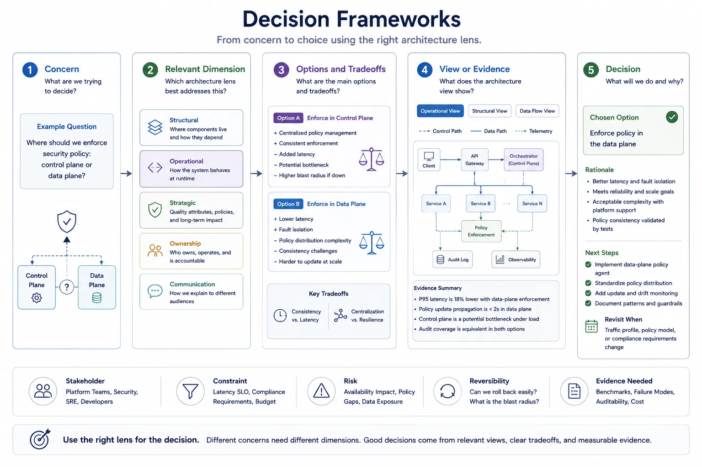
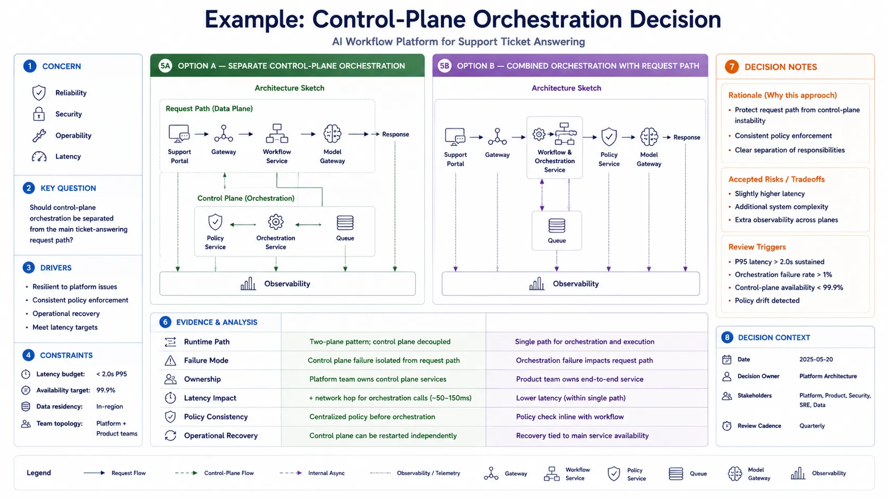

Architecture terminology is useful only when it improves judgment. Teams make weak decisions when they argue about whether something is a layer, a plane, or a service before they have clarified the concern, the constraints, and the tradeoffs involved.

## Definition

An architecture decision framework is a repeatable way to connect concerns, options, tradeoffs, evidence, and consequences. It helps teams move from vocabulary to judgment without turning architecture into ceremony for its own sake.

## Why Decision Frameworks Matter

Many architecture debates fail for the same reason: the team is comparing labels instead of answering a question. One person may be thinking about reliability, another about team ownership, and another about latency. Without a framework, the conversation appears technical but remains misaligned.

A decision framework improves the quality of discussion by forcing the team to state:

- What decision is being made
- Which stakeholders are affected
- Which risks and constraints matter most
- What evidence is needed
- What consequences the team is accepting

## Start with the Concern

Most useful decisions begin with a tightly framed concern rather than a preferred design.

At minimum, capture:

- The stakeholder who needs the decision
- The risk or problem being addressed
- The constraint that cannot be ignored
- The success criteria that define an acceptable outcome

For example, a team may need to decide whether policy enforcement should be centralized because audit consistency matters more than local autonomy, or whether runtime latency makes local enforcement necessary on critical paths.

## Choose the Relevant Dimension

Different decisions need different architecture lenses.

- Structural concerns usually need layers, modules, components, or dependency views.
- Operational concerns usually need planes, flows, or runtime behavior views.
- Strategic concerns usually need pillars, principles, or quality attributes.
- Ownership concerns usually need domain, team, data, or platform boundary reasoning.
- Communication concerns usually need audience-specific views that explain the result.

The mistake is not using the wrong word. The mistake is choosing the wrong dimension for the question.

## Compare Options Explicitly

A decision is stronger when options are compared in a consistent format instead of defended rhetorically.

That comparison works best when the team looks at each option through the same set of lenses. Otherwise one proposal is framed around speed, another around governance, and a third around implementation convenience, which makes the discussion look precise while hiding the real tradeoffs.

The table below provides a simple structure for comparing options on terms that are visible, debatable, and tied to consequences.

| Option                         | Benefits                                                          | Costs                                                   | Risks                                                 | Reversibility | Evidence needed                                            |
| ------------------------------ | ----------------------------------------------------------------- | ------------------------------------------------------- | ----------------------------------------------------- | ------------- | ---------------------------------------------------------- |
| Centralized policy enforcement | Consistent controls, unified audit, simpler governance            | Extra dependency, possible latency concentration        | Control-plane outage or bottleneck affects many paths | Medium        | Latency budget, failure analysis, audit requirements       |
| Distributed policy enforcement | Lower local latency, autonomy at edges, degraded-mode flexibility | Semantic drift, rollout complexity, fragmented evidence | Inconsistent enforcement across services              | Low to medium | Consistency tests, policy lifecycle model, team capability |

The goal is not to make the table exhaustive. The goal is to force tradeoffs into the open.

## Example Decision

Consider a decision about whether an internal platform should separate control-plane orchestration from the main request path for AI-assisted workflows.

The concern may involve reliability, security, and operability. The operational dimension helps explain runtime paths. The strategic dimension clarifies whether consistency or latency is the dominant priority. The ownership dimension shows who will run each capability. A communication view may then present the conclusion differently to platform engineers and leadership.

This progression is more useful than debating terminology in isolation because it connects the concept directly to the decision.

## Recording the Decision

Good architecture records are lightweight but explicit. They usually capture:

- Context
- Decision
- Alternatives considered
- Consequences and tradeoffs
- Review trigger or condition for revisiting the choice

The important point is not the template. It is preserving why the decision was reasonable at the time and what would invalidate it later.

## Architecture Decision Records

Architecture Decision Records, or ADRs, are the most common lightweight format teams use to preserve architectural reasoning. There is no single official ADR standard. In practice, teams usually borrow from a small set of widely adopted sources rather than following a formal specification.[^nygard] [^thoughtworks] [^adr]

The simplest and still most influential pattern comes from Michael Nygard's original ADR write-up: capture the context, state the decision, and record the consequences.[^nygard] Many teams extend that structure with alternatives considered, assumptions, risks, review triggers, or decision drivers when the choice has more organizational or operational impact.

Several established variants are common in practice:

| Format                      | Typical use                                                               |
| --------------------------- | ------------------------------------------------------------------------- |
| Nygard ADR [^nygard]        | Minimal decision records focused on clarity and speed                     |
| MADR [^madr]                | Richer metadata, explicit decision drivers, and alternatives              |
| arc42 ADR guidance [^arc42] | ADRs used alongside broader architecture documentation                    |
| AWS ADR guidance [^aws]     | Cloud-oriented decision records tied to platform and operational concerns |

The difference between ADRs and architecture description standards matters. ISO/IEC/IEEE 42010 describes how to organize architecture descriptions around stakeholders, concerns, viewpoints, and views.[^iso42010] ADRs answer a different question: why a particular architectural choice was made.

That makes ADRs a useful companion to architecture views rather than a replacement for them. A view helps stakeholders reason about the system. An ADR preserves why the team selected one option over another. Used together, they connect the decision, the evidence behind it, and the representation that best explains it.

## Common Mistakes

**Choosing a Diagram before Identifying the Decision.** If the team starts by drawing, it often documents assumptions instead of testing them.

**Treating Pillars as Equal in Every Context.** A decision framework should reveal which priorities dominate for this choice, not assume every quality carries the same weight.

**Ignoring Reversibility.** Some choices are easy to change later. Others are deep commitments. Treating them as equivalent leads to poor risk management.

**Recording Conclusions without Tradeoffs.** A decision record that states only the outcome becomes much less useful when the context changes or the choice is challenged later.

## Summary

Decision frameworks make architecture concepts practical. They help teams begin with the real concern, choose the right reasoning lens, compare options explicitly, and preserve the logic behind the final choice. That is where architecture vocabulary earns its value.

[^nygard]: https://cognitect.com/blog/2011/11/15/documenting-architecture-decisions

[^thoughtworks]: https://www.thoughtworks.com/radar/techniques/lightweight-architecture-decision-records

[^adr]: https://adr.github.io/

[^madr]: https://adr.github.io/madr/

[^arc42]: https://arc42.org/overview

[^aws]: https://docs.aws.amazon.com/prescriptive-guidance/latest/architectural-decision-records/welcome.html

[^iso42010]: https://www.iso.org/standard/74393.html
