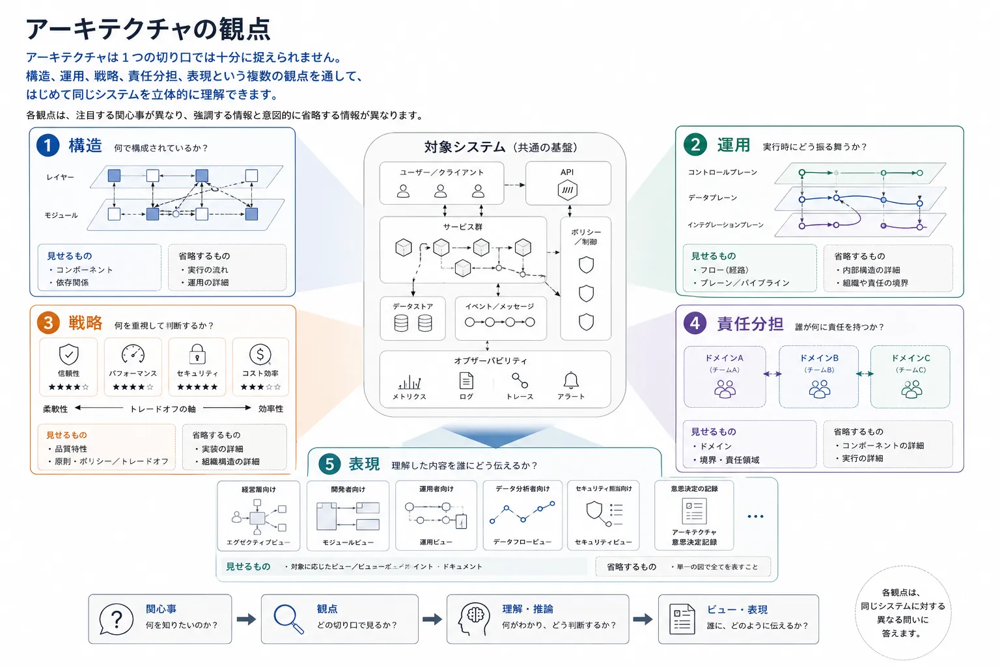
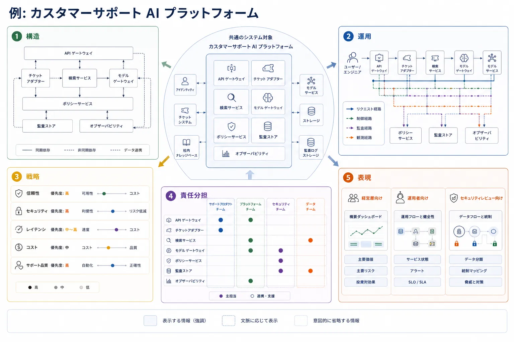

チームがあらゆる関心事を 1 枚の図や 1 つの語彙に押し込めようとすると、アーキテクチャは途端に分かりにくくなります。
依存方向、実行時の制御、設計上の優先順位、チームの説明責任、関係者への伝達は、いずれもアーキテクチャ上の関心事ですが、同じ種類の関心事ではありません。
アーキテクチャの観点とは、そのうちの 1 つを読み解けるようにするためのレンズです。

## 定義

アーキテクチャの観点とは、1 つのシステムを特定の視点から理解するための思考のレンズです。
チームが焦点の合った問いを立て、その問いに不要な詳細を意図的に脇へ置き、適切な判断基準で設計案を比較する助けになります。

観点は図そのものではありません。
図は表現です。
観点は、その表現で何を強調すべきかを決める枠組みです。

## なぜ観点が重要か

複数種類の思考を 1 つのモデルに混在させると、チームは明確さを失います。
1 枚の図で、サービス依存、実行時のリクエスト経路、チームごとの所有、セキュリティ統制、経営上の成果までを同時に示そうとすると、たいてい過密で曖昧な成果物になります。

観点が重要なのは、本来は別の関心事を切り分けられるからです。

- 構造上の問いは、何が作られていて、何が何に依存しているかを扱う
- 運用上の問いは、作業がどう移動し、システムが実行時にどう振る舞うかを扱う
- 戦略上の問いは、どの品質を重視してトレードオフを決めるかを扱う
- 責任分担の問いは、誰がシステムを変更し運用するかを扱う
- 表現上の問いは、特定の対象読者が何を理解する必要があるかを扱う

この切り分けは、アーキテクチャを分断するためのものではありません。
思考を明示するためのものです。
システムは 1 つでも、それを十分に理解するには複数のレンズが必要です。

## 中核となる観点

### 構造

構造の観点は、形と依存関係に注目します。
どのモジュールがどの基盤に依存しているか、抽象化がどこに置かれているか、変更がシステム内をどう波及すべきかといった問いに答える助けになります。
レイヤー、コンポーネント、サービス、インターフェース、モジュールは代表的な構造概念です。

### 運用

運用の観点は、実行時の振る舞いに注目します。
リクエスト、ジョブ、イベント、テレメトリ、ポリシー判断がシステム内をどう移動するかを説明します。
コントロールプレーン、データプレーン、パイプライン、ワークフロー、引き継ぎ点は代表的な運用概念です。

### 戦略

戦略の観点は、優先順位とトレードオフに注目します。
信頼性、セキュリティ、コスト効率、開発者の生産性など、アーキテクチャが何を最適化すべきかを捉えます。
ピラー、原則、品質特性、制約はここに属します。

### 責任分担

責任分担の観点は、責務に注目します。
誰があるサービスを安全に変更できるのか、誰がそれを運用するのか、誰がデータ契約を所有するのか、どこでチーム間依存が摩擦やリスクを生むのかを考える助けになります。
ドメイン、境界づけられたコンテキスト、プラットフォーム責務、サービスの責任境界は代表的な概念です。

### 表現

表現の観点は、説明の仕方に注目します。
どの関心事を選び取り、どの枠組みで整理し、どの対象読者に向けて示すべきかを決める助けになります。
ビュー、ビューポイント、レビュー用成果物、対象読者別サマリーは、アーキテクチャ思考を伝達へ変換する要素です。

## 比較表

| 観点     | 主な問い                                 | 代表的な概念                                         | 向いている用途                                   | ありがちな誤り                                 |
| -------- | ---------------------------------------- | ---------------------------------------------------- | ------------------------------------------------ | ---------------------------------------------- |
| 構造     | 何が作られており、何が何に依存しているか | レイヤー、モジュール、サービス、コンポーネント       | 依存関係の管理、抽象化、変更の隔離               | 実行時のトラフィックを構造依存と同一視する     |
| 運用     | 作業はどう実行され、どう移動するか       | プレーン、フロー、パイプライン、オーケストレーション | 障害分析、遅延の把握、実行時制御                 | 実行経路だけで構造が決まると考える             |
| 戦略     | 何を重視して最適化するのか               | ピラー、原則、品質特性、ポリシー                     | トレードオフ分析、レビュー、投資判断             | 価値観を並べるだけで判断基準に落とし込まない   |
| 責任分担 | 誰が何を変更し運用するのか               | ドメイン、チーム、プラットフォーム、契約、セル       | 説明責任、スケールする提供体制、インシデント対応 | 技術境界が自動的にチーム境界へ対応すると考える |
| 表現     | この対象読者は何を理解する必要があるか   | ビュー、ビューポイント、サマリー、レビュー文書       | 認識合わせ、オンボーディング、意思決定支援       | 1 枚の図で全員を満足させようとする             |

## 例: 1 つのプラットフォームに複数の観点

たとえば、サポートエンジニアが問い合わせ回答を支援する社内 AI アシスタントを動かしている顧客サポート組織を考えてみます。
その基盤は、アイデンティティ、チケットシステム、社内ナレッジベース、検索サービス、モデルゲートウェイ、ポリシー統制、監査ログ、可観測性と接続されています。

構造の観点では、この基盤はゲートウェイ、チケットアダプター、検索サービス、モデルゲートウェイ、ポリシーサービス、監査ストア、可観測性コンポーネントとして記述できます。
主要な関心事は、これらの能力がどう依存し合い、どこで変更を隔離すべきかです。

運用の観点では、同じシステムはリクエスト経路、制御経路、監査経路、可観測性経路として理解できます。
主要な関心事は、サポート要求が基盤をどう移動するか、どこでポリシーが適用されるか、どこで障害、遅延、証跡収集が起こるかです。

戦略の観点では、この基盤は信頼性、セキュリティ、遅延、コスト効率、サポート品質を重視するかもしれません。
その優先順位が、キャッシュ戦略、統制の配置、実行時隔離、顧客対応ワークフローでどこまで自動化を許容するかを左右します。

責任分担の観点では、サポートプロダクトチームがチケットワークフローとアシスタントの挙動を担い、プラットフォームチームが共有ランタイムとモデルゲートウェイを担い、セキュリティチームがポリシー統制を担い、データチームがナレッジと検索品質を担うかもしれません。
この責任分担は、提供速度と運用上の説明責任の両方に影響します。

表現の観点では、同じ基盤でも対象読者ごとに見せ方が変わります。
経営層には能力の概要が、運用担当者には実行経路と監査経路が、セキュリティレビュー担当者には信頼境界とポリシー適用点が必要です。

## ビューとの関係

観点は思考を支えます。
ビューは、その思考から生まれる伝達用の成果物です。
この違いは重要です。
チームは、対象読者と目的に応じた表現を決める前に、1 つ以上の観点で考えることが多いからです。

有用な流れの 1 つは次の通りです。

1. 関心事から始める。
2. その関心事に最も合う観点を選ぶ。
3. 選択肢、依存関係、リスク、トレードオフを考える。
4. 結果を対象読者へ伝えるためのビューを作る。

たとえば、関心事が依存関係の制御なら、通常は構造の観点が出発点になります。
関心事が実行時のポリシー適用なら、運用の観点の方が有用かもしれません。
そのうえで、最終的なビューは、それを受け取って行動する人たちに合わせて形づくられるべきです。

## 要約

アーキテクチャの観点は、競合する定義ではなく、相補的なレンズです。
チームが目の前の問いに対して適切な思考モデルを選び、構造、実行時の振る舞い、優先順位、責任分担、伝達を 1 つの過密な成果物に押し込めないようにする助けになります。
