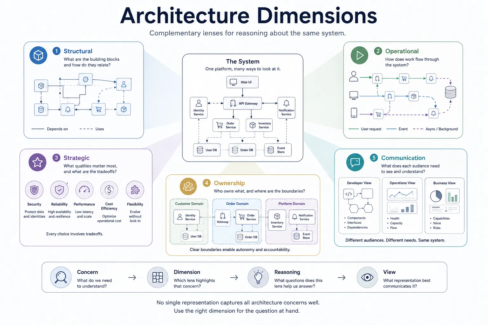
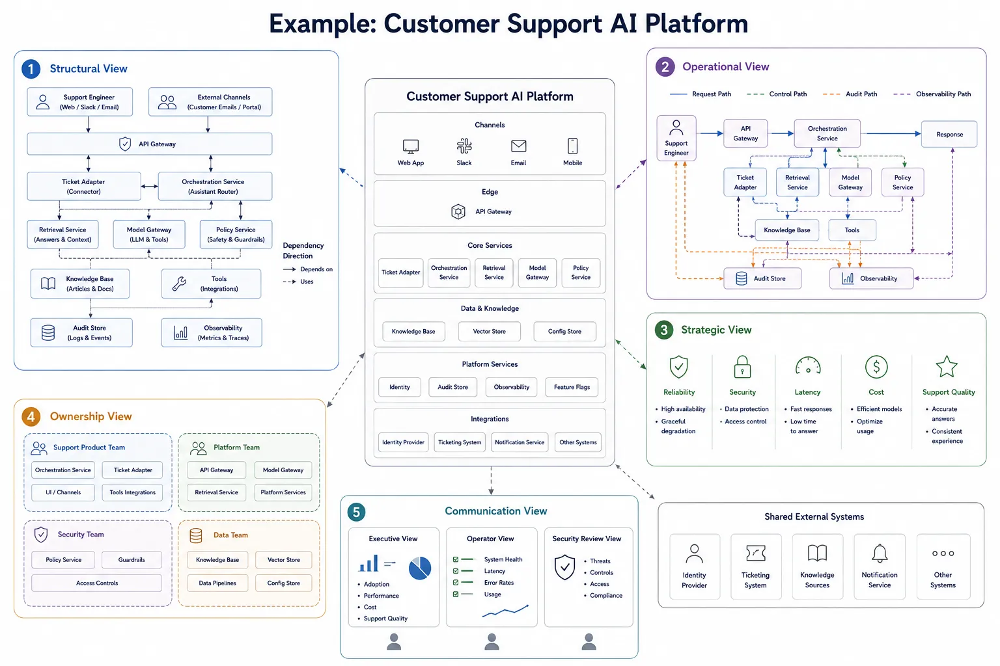

Architecture becomes confusing when teams try to force every concern into one diagram or one vocabulary. Dependency direction, runtime control, design priorities, team accountability, and stakeholder communication are all architectural concerns, but they are not the same kind of concern. An architecture dimension is the lens that makes one of those concerns legible.

## Definition

An architecture dimension is a reasoning lens for understanding one system from a specific perspective. It helps a team ask a focused question, ignore details that are not relevant to that question, and compare design options using the right criteria.

Dimensions are not the same thing as diagrams. A diagram is a representation. A dimension is the framing logic that determines what that representation should emphasize.

## Why Dimensions Matter

Teams lose clarity when they mix several kinds of reasoning in one model. A single picture may try to show service dependencies, runtime request paths, ownership by team, security controls, and executive outcomes at the same time. The result is usually overloaded and ambiguous.

Dimensions matter because they separate concerns that otherwise get conflated:

- Structural questions are about what is built and what depends on what.
- Operational questions are about how work moves and how the system behaves at runtime.
- Strategic questions are about which qualities should shape tradeoffs.
- Ownership questions are about who changes and operates the system.
- Communication questions are about what a specific audience needs to understand.

That separation does not fragment architecture. It makes reasoning explicit. One system still exists, but engineers need different lenses to understand it well.

## The Core Dimensions

### Structural

The structural dimension focuses on form and dependency. It helps answer questions such as which modules depend on which platforms, where abstractions sit, and how changes should propagate through the system. Layers, components, services, interfaces, and modules are common structural concepts.

### Operational

The operational dimension focuses on runtime behavior. It explains how requests, jobs, events, telemetry, and policy decisions move through the system. Control planes, data planes, pipelines, workflows, and handoff points are common operational concepts.

### Strategic

The strategic dimension focuses on priorities and tradeoffs. It captures what the architecture must optimize for, such as reliability, security, cost efficiency, or developer velocity. Pillars, principles, quality attributes, and constraints belong here.

### Ownership

The ownership dimension focuses on responsibility. It helps teams reason about who can change a service safely, who operates it, who owns the data contract, and where cross-team dependencies introduce friction or risk. Domains, bounded contexts, platform responsibilities, and service ownership boundaries are common concepts.

### Communication

The communication dimension focuses on explanation. It helps teams decide which concerns should be selected, framed, and presented for a particular audience. Views, viewpoints, review artifacts, and audience-specific summaries belong here because they turn architecture reasoning into communication.

## Comparison Table

| Dimension     | Primary question                            | Common concepts                                   | Useful for                                           | Common mistake                                                           |
| ------------- | ------------------------------------------- | ------------------------------------------------- | ---------------------------------------------------- | ------------------------------------------------------------------------ |
| Structural    | What is built, and what depends on what?    | Layers, modules, services, components             | Dependency management, abstraction, change isolation | Treating runtime traffic as if it were structural dependency             |
| Operational   | How does work execute and move?             | Planes, flows, pipelines, orchestration           | Failure analysis, latency reasoning, runtime control | Ignoring static boundaries and assuming execution paths define structure |
| Strategic     | What are we optimizing for?                 | Pillars, principles, quality attributes, policies | Tradeoff analysis, reviews, investment choices       | Listing values without turning them into decision criteria               |
| Ownership     | Who changes and operates what?              | Domains, teams, platforms, contracts, cells       | Accountability, scaling delivery, incident response  | Assuming technical boundaries automatically map to teams                 |
| Communication | What does this audience need to understand? | Views, viewpoints, summaries, review documents    | Alignment, onboarding, decision support              | Trying to satisfy every audience with one diagram                        |

## Example: One Platform, Many Dimensions

Consider a customer support organization that runs an internal AI assistant to help support engineers answer tickets. The platform connects identity, a ticketing system, an internal knowledge base, retrieval services, a model gateway, policy controls, audit logging, and observability.

From a structural perspective, the platform can be described as a gateway, ticket adapter, retrieval service, model gateway, policy service, audit store, and observability components. The key concern is how those capabilities depend on one another and where change should be isolated.

From an operational perspective, the same system can be understood through a request path, control path, audit path, and observability path. The key concern is how support requests move through the platform, where policy is enforced, and where failures, delays, or evidence collection occur.

From a strategic perspective, the platform may prioritize reliability, security, latency, cost efficiency, and support quality. Those priorities shape decisions such as caching strategy, control placement, runtime isolation, and how much automation is acceptable in customer-facing support workflows.

From an ownership perspective, the support product team may own ticket workflows and assistant behavior, the platform team may own the shared runtime and model gateway, the security team may own policy controls, and the data team may own knowledge and retrieval quality. That division of responsibility affects both delivery speed and operational accountability.

From a communication perspective, the same platform may be presented differently to each audience: executives may need a compact capability view, operators may need the runtime and audit paths, and security reviewers may need the trust boundaries and policy enforcement points.

## Relationship to Views

Dimensions support reasoning. Views are the communication artifacts produced from that reasoning. The distinction matters because a team often reasons through one or more dimensions before deciding how to package the result for a specific audience and purpose.

One useful chain is:

1. Start with the concern.
2. Choose the dimension that best fits that concern.
3. Reason about options, dependencies, risks, and tradeoffs.
4. Produce a view that communicates the result to the intended audience.

For example, if the concern is dependency control, the structural dimension is usually the right starting point. If the concern is runtime policy enforcement, the operational dimension may be more useful. The resulting view should then be shaped for the people who need to act on it.

## Summary

Architecture dimensions are complementary lenses, not competing definitions of architecture. They help teams choose the right reasoning model for the question in front of them and avoid collapsing structure, runtime behavior, priorities, ownership, and communication into one overloaded artifact.
