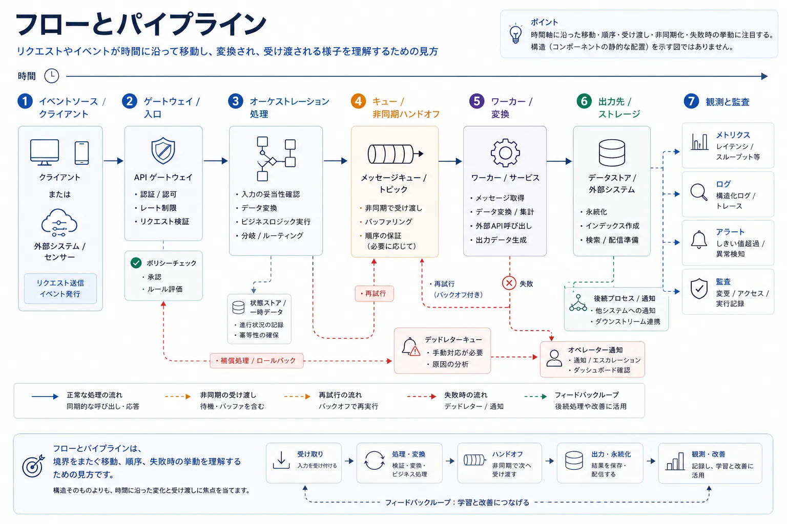
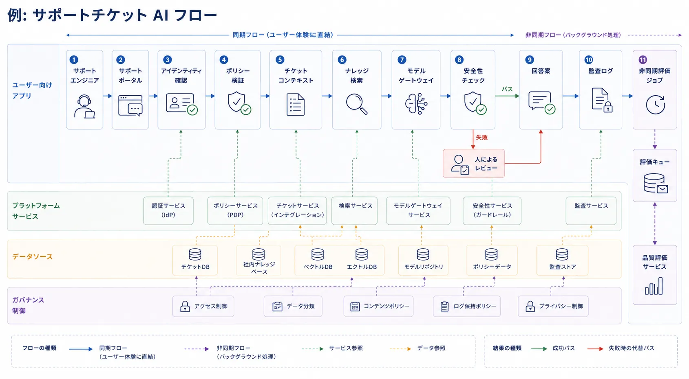

フロー指向のビューが重要なのは、多くのアーキテクチャ上の問いが、実際には時間の中での移動に関する問いだからです。
主題は、何が存在するかではなく、何が起こるかです。
何がアクションを開始し、どの境界をまたぎ、どこでデータの形が変わり、どこで待ちが発生し、どこで障害を検知または回復しなければならないかを扱います。

## 定義

フローとパイプラインは、作業が時間の中でシステムをどう移動するかを示す動的なビューです。
リクエスト、イベント、ジョブ、承認、データ変換、フィードバックループを、静的な構造ではなく、連続する段階と受け渡しとして記述します。

両者の違いは厳密でないことが多くあります。
フローは、一般に端から端までの移動を強調します。
パイプラインは、段階的な変換を強調することが多い概念です。
実務では、どちらも実行と時間変化を考えるための方法とみなせます。

## なぜフローが重要か

フロービューは、次のような問いに答える助けになります。

- 最初に何が起き、次に何が起き、最後に何が起きるか
- どこでデータの形が変わるか
- リクエスト、イベント、ジョブはどの境界をまたぐか
- システムはどこで失敗し、詰まり、遅くなるか
- どの段階が同期的で、どの段階が非同期で、どこで再試行や手動承認が発生するか

これらは、性能、回復性、準拠性、運用にとって重要な問いです。
静的なシステム図だけでは、キューの滞留、結果整合性、承認待ちの遅延を同じ明確さで表現できません。

## フローの種類

### リクエストフロー

リクエストフローは、ユーザーまたはサービスからの呼び出しが、ゲートウェイ、サービス、ポリシー、キャッシュ、下流依存へどう移動するかを記述します。
遅延分析、障害切り分け、信頼境界のレビューに向いています。

### データフロー

データフローは、情報がソースから到達先へどう移動するかを記述します。
抽出、変換、検証、保存、消費を含みます。
リネージやガバナンスを考えるときに有用です。

### イベントフロー

イベントフローは、生成者が発行し、ブローカーが配布し、消費者が反応する流れを記述します。
アーキテクチャが非同期協調に依存している場合に特に有効です。

### ワークフローまたはオーケストレーションフロー

ワークフロービューは、分岐ロジック、再試行、タイムアウト処理、複数のサービスやエージェントにまたがる調整を含む多段階実行を示します。

### CI/CD パイプライン

デリバリーパイプラインもアーキテクチャフローの 1 つです。
コード、設定、テスト、ポリシー、デプロイ承認が本番へ向かってどう移動するかを説明します。

### ML / AI パイプライン

AI パイプラインには、データ取り込み、ラベリング、特徴抽出、評価、デプロイ、ガードレールチェック、フィードバック収集が含まれることがあります。
ここでは、どのコンポーネントがあるかと同じくらい、順序と変換が重要です。

### 承認とガバナンスのフロー

システムによっては、スキーマ変更、アクセス要求、リリースゲート、モデル昇格に人間またはポリシーによる承認が必要です。
それらが提供速度やリスクへ実質的に影響するなら、アーキテクチャに含めるべきです。

## フロービューと他のモデルの違い

フロービューは、主題が順序、受け渡し、時間の中での移動であるときに最も有効です。
一方で、すべての構造依存やすべてのデプロイ詳細を同時に説明することを期待すると、使いどころを外します。

次の比較は、フロー指向の文書化が得意な点と、他のアーキテクチャモデルの方が主たるレンズとして適している点を明確にします。

| モデル           | 得意な説明                       | 弱くなりがちな説明                   |
| ---------------- | -------------------------------- | ------------------------------------ |
| レイヤー         | 構造上の抽象化と依存方向         | タイミング、順序、再試行、受け渡し   |
| プレーン         | システム全体にまたがる実行時責務 | 詳細な段階ごとの実行                 |
| 責任境界         | 変更と運用の説明責任             | 端から端までのリクエストやデータ移動 |
| デプロイトポロジ | 配置とインフラストラクチャの形   | 変換ロジックと業務上の順序           |

だからこそ、チームには構造図とフロービューの両方が必要になることがあります。
一方は何が存在するかを説明し、もう一方は何が起こるかを説明します。

## フロービューに含めるべきもの

有用なフロー文書には、通常、次のような要素が含まれます。

- 起点となる主体またはトリガー
- 主要な段階と変換
- システム境界と信頼境界
- キュー、非同期ハンドオフ、保存先への接点
- エラーパス、再試行、補償アクション、またはデッドレターの振る舞い
- 証跡が残る可観測性、監査、承認のポイント

目的は、すべてのメソッド呼び出しを描くことではありません。
重要な移動とリスクを見えるようにすることです。

## 例: 1 つのエンドツーエンドフロー

サポートエンジニアが社内 AI アシスタントに顧客問い合わせへの回答草案を作らせる場面を考えてみます。
その要求は、アイデンティティ確認、ポリシー検証、チケット文脈の取得、社内ナレッジの検索、モデル実行、安全性レビュー、監査ログ記録、非同期の品質評価を通過します。

具体的なフロービューでは、要求はサポートポータルで始まり、アイデンティティとポリシーのチェックを通過し、チケット文脈と補助知識を収集し、モデルゲートウェイを経て、安全性チェックが成功すれば草案応答を返します。
監査ログはこのフローの一部として記録され、主要な応答経路が終わった後も非同期の評価ジョブが続きます。

安全性チェックに失敗した場合には、人間によるレビュー分岐を含むこともありますし、監査ログの後にキューを介した非同期引き継ぎがあることもあります。
こうした時間、制御、レビューに関する経路こそが、フロー指向のビューで可視化したい詳細です。

## よくある誤り

**障害経路を省くこと。** 正常系だけではほとんどの場合不十分です。
本番運用で再試行、フォールバック、手動介入が重要なら、フロー文書にも含めるべきです。

**すべての内部呼び出しを描くこと。** 詳細が多すぎると、ビューはノイズになります。
フローは、答えたい問いに関係する判断、変換、受け渡しを強調するべきです。

**静的な依存図と実行時の順序を 1 つに混ぜること。** 両方を 1 つの成果物へ詰め込むと、どちらの明確さも落ちがちです。
フロービューは移動に集中させた方がよいことが多くあります。

**キュー、再試行、結果整合性を隠すこと。** 遅延、滞留、正しさの問題はしばしばそこから生まれます。
省いてしまうと、誤った安心感を与えます。

## 要約

フローとパイプラインは、時間の中での移動を扱うアーキテクチャビューです。
順序、変換、障害、調整を、静的な構造モデルでは表しきれない形で考える助けになります。
実装の些末な詳細に沈まず、重要な受け渡し、遅延、回復経路を可視化するときに最も有用です。
