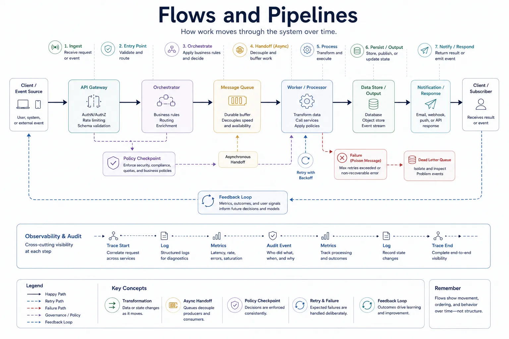
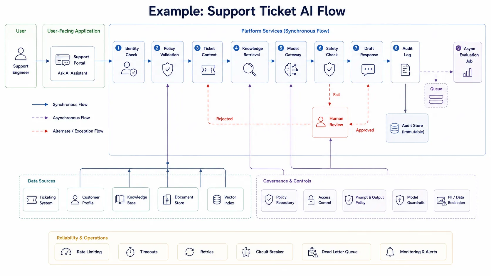

Flow-oriented views matter because many architectural questions are really questions about movement over time. They are not primarily about what exists, but about what happens: what starts an action, which boundaries it crosses, where data changes shape, where waiting occurs, and where failure must be detected or recovered.

## Definition

Flows and pipelines are dynamic views of how work moves through a system over time. They describe requests, events, jobs, approvals, data transformations, and feedback loops as sequences of steps and handoffs rather than as static structure.

The distinction between the two is often loose. A flow usually emphasizes end-to-end movement. A pipeline often emphasizes staged transformation. In practice, both are ways to reason about execution and change over time.

## Why Flows Matter

Flow views help answer questions such as:

- What happens first, next, and last?
- Where does data change shape?
- Which boundaries does a request, event, or job cross?
- Where can the system fail, block, or slow down?
- Which steps are synchronous, asynchronous, retried, or manually approved?

These are critical questions for performance, resilience, compliance, and operations. A static system diagram cannot show queue buildup, eventual consistency, or approval delays with the same clarity.

## Types of Flows

### Request Flow

Request flows describe how a user or service call moves through gateways, services, policies, caches, and downstream dependencies. They are useful for latency analysis, fault isolation, and trust-boundary review.

### Data Flow

Data flows describe how information moves from source to destination, including extraction, transformation, validation, storage, and consumption. They are useful for lineage reasoning and governance.

### Event Flow

Event flows describe how producers publish, brokers distribute, and consumers react. They are especially useful when the architecture relies on asynchronous coordination.

### Workflow or Orchestration Flow

Workflow views show multi-step execution that may include branching logic, retries, timeout handling, and coordination across several services or agents.

### CI/CD Pipeline

Delivery pipelines are also architectural flows. They explain how code, configuration, tests, policies, and deployment approvals move toward production.

### ML or AI Pipeline

AI pipelines often include ingestion, labeling, feature extraction, evaluation, deployment, guardrail checks, and feedback capture. These are flow-oriented concerns because sequence and transformation matter as much as the components involved.

### Approval and Governance Flow

Some systems depend on human or policy approvals for schema changes, access requests, release gates, or model promotion. These steps belong in the architecture when they materially affect delivery or risk.

## Flow Views vs. Other Models

Flow views are most useful when the main question is about sequence, handoff, and movement through time. They become less useful when teams expect them to explain every structural dependency or every deployment detail at once.

The comparison below clarifies where flow-oriented documentation is strong and where other architecture models provide a better primary lens.

| Model                | Best at explaining                              | Usually weak at explaining                   |
| -------------------- | ----------------------------------------------- | -------------------------------------------- |
| Layers               | Structural abstraction and dependency direction | Timing, sequencing, retries, handoffs        |
| Planes               | Runtime responsibility across the system        | Detailed step-by-step execution              |
| Ownership boundaries | Accountability for change and operation         | End-to-end request or data movement          |
| Deployment topology  | Placement and infrastructure shape              | Transformation logic and business sequencing |

This is why teams often need both a structural diagram and a flow view. One explains what exists. The other explains what happens.

## What to Include in a Flow View

Useful flow documentation usually includes:

- The initiating actor or trigger
- Major steps and transformations
- System and trust boundaries
- Queues, asynchronous handoffs, and storage touchpoints
- Error paths, retries, compensating actions, or dead-letter behavior
- Observability, audit, or approval points where evidence is recorded

The goal is not to draw every method call. The goal is to make the important movement and risk visible.

## Example: One End-to-End Flow

Imagine a support engineer asking an internal AI assistant to draft an answer for a customer ticket. The request passes through identity checks, policy validation, ticket context retrieval, internal knowledge retrieval, model execution, safety review, audit logging, and asynchronous quality evaluation.

In a concrete flow view, the request begins in a support portal, moves through identity and policy checks, collects ticket context and supporting knowledge, passes through a model gateway, and returns a draft response if the safety check succeeds. Audit logging happens as part of the flow, and an asynchronous evaluation job continues after the main response path completes.

The same flow may also include a human-review branch when the safety check fails, along with a queued asynchronous handoff after audit logging. Those timing, control, and review paths are exactly the details that a flow-oriented view makes visible.

## Common Mistakes

**Omitting Failure Paths.** The happy path is rarely enough. If retries, fallbacks, or manual intervention matter in production, they belong in the flow documentation.

**Drawing Every Internal Call.** Too much detail turns the view into noise. A flow should highlight the decisions, transformations, and handoffs that matter to the question being answered.

**Mixing Static Dependency Diagrams with Runtime Sequence.** Combining both models into one artifact often makes each less clear. It is better to let the flow view focus on movement.

**Hiding Queues, Retries, and Eventual Consistency.** These are often where latency, backlog, and correctness problems emerge. Omitting them creates false confidence.

## Summary

Flows and pipelines are architecture views for movement over time. They help teams reason about sequencing, transformation, failure, and coordination in ways that static structural models cannot. They are most useful when they make the important handoffs, delays, and recovery paths visible without collapsing into implementation trivia.
