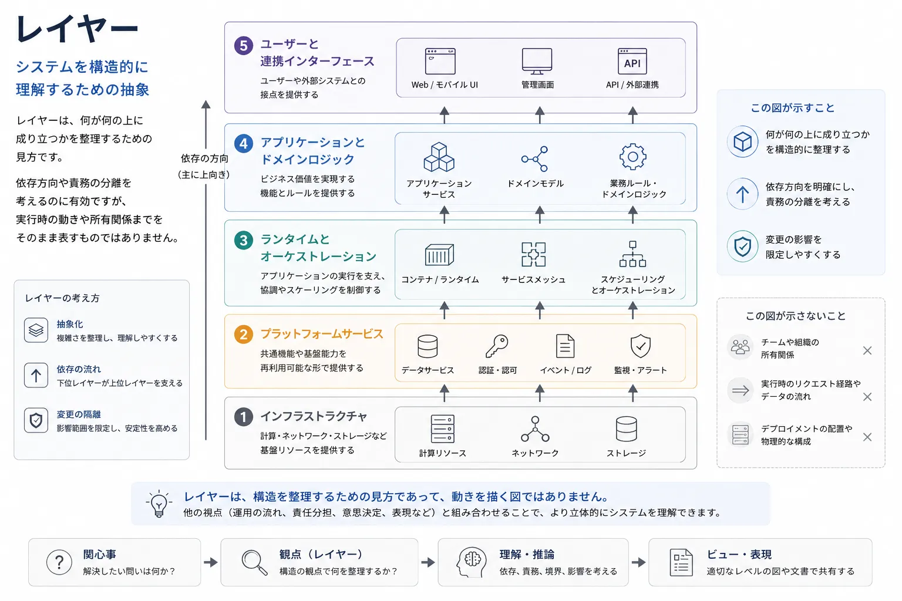
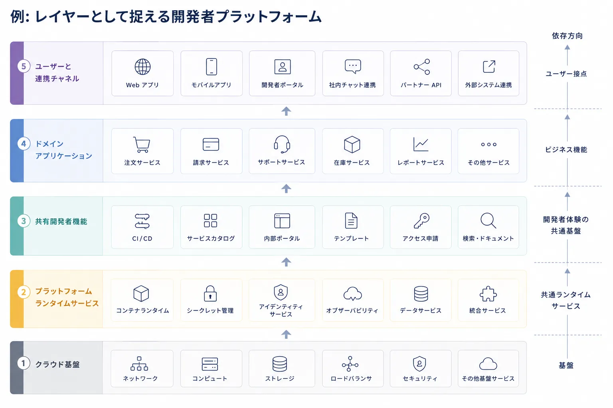

レイヤーは、構造上の抽象化を考える助けになるため、最も古くからあり、今でも有用なアーキテクチャ概念の 1 つです。
それは万能の設計命令ではなく、システムのあらゆる性質を説明するものでもありません。
それでもなお、何が何の上に成り立っているかを理解するための実践的な方法であり続けています。

## 定義

レイヤーとは、責務と依存関係を整理するための構造上の抽象化です。
レイヤー化されたモデルでは、システム要素をその役割と依存構造の中での相対的位置によってまとめます。
これにより、どの抽象化がどの抽象化に依存しているか、どの境界で直接結合を避けるべきかを見通せます。

重要なのは、見た目として積み上がっていることではありません。
重要なのは、依存方向を持つ構造です。

## なぜレイヤーがあるのか

レイヤー思考は、狭いが重要な問いに答える助けになります。

- 何が何に依存しているか
- どの抽象化がより低い能力の上に成り立つか
- 依存関係はどの方向へ流れるべきか
- どの部分を変更から隔離すべきか

こうした問いは多くの文脈で現れます。
アプリケーションチームは、ドメインロジックとインフラストラクチャを分けるときに必要とします。
プラットフォームチームは、ランタイムサービスとその下にあるクラウド基盤を区別するときに必要とします。
プロトコル設計者は、転送、セッション、アプリケーションの関心事を切り分けるときに必要とします。

レイヤーが必要なのは、依存方向が不明確なソフトウェアシステムは脆くなりやすいからです。
システムのあらゆる部分が直接どこへでも到達できると、変更の波及は予測しにくくなり、考えるコストが急激に高まります。

## よくある例

### OSI モデル

OSI モデルは、ネットワークにおける古典的なレイヤー抽象です。
現実のシステムが常にそのまま当てはまることに価値があるのではなく、物理的な転送の関心事と、より高位のプロトコルやアプリケーションの関心事を区別する考え方を教えてくれる点に価値があります。

### クリーンアーキテクチャと関連するアプリケーションモデル

クリーンアーキテクチャ、ヘキサゴナルアーキテクチャ、および近い設計パターンは、ドメインロジック、アプリケーションオーケストレーション、インターフェース、インフラストラクチャの関心事を分けるためにレイヤーを使います。
通常の狙いは、結合を下げ、中心となる業務ルールが外部技術へ直接依存しないようにすることです。

### アプリケーションスタック

多くのチームは、プレゼンテーションレイヤー、アプリケーションレイヤー、データアクセスレイヤー、永続化レイヤーといった形でシステムを捉えます。
この見方は、ラベルがスライド上の任意の箱ではなく、実際の依存構造を反映している場合に有効です。

### クラウドプラットフォームのスタック

クラウドプラットフォームは、インフラストラクチャ、コンテナランタイム、プラットフォームサービス、アプリケーションサービス、ユーザー向けインターフェースとして理解できることがあります。
レイヤーの見方は、どこで抽象化が基盤能力の上に成り立っているか、どこで変更を隔離すべきかを明確にします。

### AI ランタイムやエージェントプラットフォームのスタック

AI システムも構造として記述できます。
たとえば、下位にモデルプロバイダーやベクトルストアがあり、その上にオーケストレーションサービスがあり、さらにその上にドメインワークフローがあり、最上位にプロダクトインターフェースがある、という見方です。
このビューは、置き換え可能性、依存関係の封じ込め、統合境界を考える助けになります。

## レイヤーが得意なこと

**依存関係の把握。** レイヤーは依存方向を明示します。
たとえば、ドメインレイヤーがインフラストラクチャの詳細に依存すべきでないなら、レイヤー化モデルはその規律を述べ、レビューする方法を与えます。

**抽象化の管理。** レイヤーは概念を適切な高さに配置する助けになります。
低位の転送に関する関心事が、高位の業務抽象へ漏れ出すべきではありません。漏れ出るなら、それは意図的な理由がある場合に限るべきです。

**変更の隔離。** 構造上の境界が適切に選ばれていれば、下位の実装を置き換えたり変更したりしても、上位の意図を全面的に書き換えずに済みます。
分散システムが一般化した現在でもレイヤーが有用なのは、このためです。

**教育とオンボーディング。** レイヤー化モデルは、複雑なシステムを説明するのに向いています。
新しく加わったエンジニアに、実行時の細部を覚える前の安定したメンタルモデルを与えられます。

## よくある誤り

**レイヤーをデプロイ階層として扱うこと。** レイヤーは構造上の抽象化を表すのであって、物理的な配置をそのまま表すとは限りません。
1 つのクラスターにデプロイされたサービスが、概念上は複数のレイヤーにまたがることもありますし、複数レイヤーが同時に配置されることもあります。

**すべての依存関係が厳密に縦方向だと思い込むこと。** 実際のシステムでは、慎重に管理されたレイヤー横断のやり取り、共通ユーティリティ、補助的なインフラストラクチャが存在することがあります。
レイヤー化モデルは、世界を単純化しすぎるためではなく、意図された依存ルールを明確にするために使うべきです。

**レイヤーと責任境界を混同すること。** レイヤーはチームではありません。
1 つのチームが複数レイヤーにまたがる能力を担うこともありますし、1 つのレイヤーに複数チームが関与することもあります。

**実行時の制御経路を構造図へ押し込むこと。** レイヤーは、非同期パイプライン、ワークフローオーケストレーション、コントロールとデータの分離を説明するには不向きです。
そうしたものは通常、フローやプレーンで表現した方が適切です。

## 他の概念との比較

レイヤーという言葉は、本来は別のアーキテクチャレンズに属する考え方まで覆うように拡張されがちです。
そこで混乱が始まります。
問いが構造上の抽象化と依存方向に関するものであればレイヤーは有用ですが、実行時の振る舞い、戦略的優先順位、実装単位、配置場所については他の概念の方が向いています。

次の比較は、その違いを明確に保つためのものです。

| 概念       | 表しているもの                 | 主な問い                         |
| ---------- | ------------------------------ | -------------------------------- |
| レイヤー   | 構造上の抽象化と依存方向       | 何が何の上に成り立つか           |
| プレーン   | 構造を横断する実行時責務       | 作業はどう制御または処理されるか |
| ピラー     | 戦略的な優先順位や品質のレンズ | 何を重視して最適化するのか       |
| モジュール | 具体的なコードや能力の単位     | 何がひとまとまりで実装されるか   |
| ティア     | デプロイや実行配置上のまとまり | どこで動くのか                   |

## 例: 開発者プラットフォーム

顧客向けアプリケーションを構築・運用するために、プロダクトチームが利用する社内開発者プラットフォームを運営している中規模のソフトウェア企業を考えてみます。
そのプラットフォームには、クラウドインフラストラクチャ、共有ランタイムサービス、開発者向けセルフサービス機能、ドメインアプリケーション、外部連携チャネルが含まれます。

レイヤー化ビューでは、土台にクラウドインフラストラクチャがあり、その上にプラットフォームランタイムサービスがあり、さらにその上に共有開発者機能があり、その上位でドメインアプリケーションがそれらを利用し、最上位にユーザー向けまたは連携向けのチャネルが現れます。
代表的な能力としては、基盤にネットワーク、コンピュート、ストレージがあり、ランタイムレイヤーにコンテナランタイム、シークレット、アイデンティティ、可観測性があり、共有能力レイヤーに CI/CD、サービスカタログ、社内ポータル、テンプレートがあり、アプリケーションレイヤーに注文、請求、サポートといったドメインサービスがあります。

この構造により、アイデンティティをどこに置くべきか、プロダクトチームがどの能力へ直接依存すべきか、どの部分を各ドメイン内で重複させず共有基盤として保つべきか、といった実践的な構造上の問いに答えやすくなります。

## 要約

レイヤーが今も有用なのは、抽象化、依存方向、変更の隔離を考える助けになるからです。
その価値は、あらゆるシステムがレイヤー化されるべきだという主張ではなく、何が何の上に成り立つかという構造上の問いに対して、狭く正直に使われる構造モデルである点にあります。
