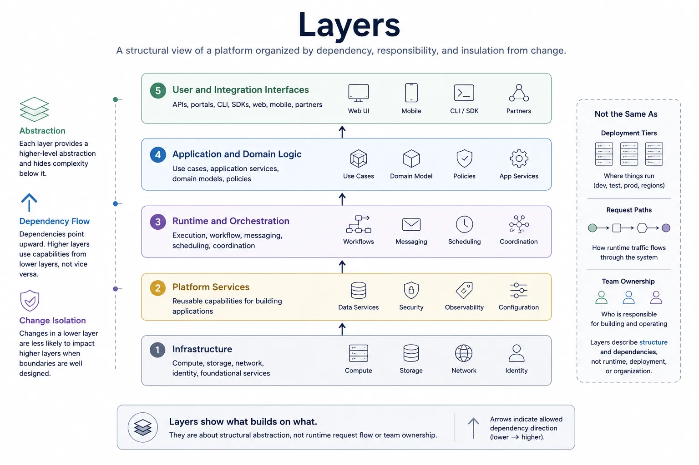
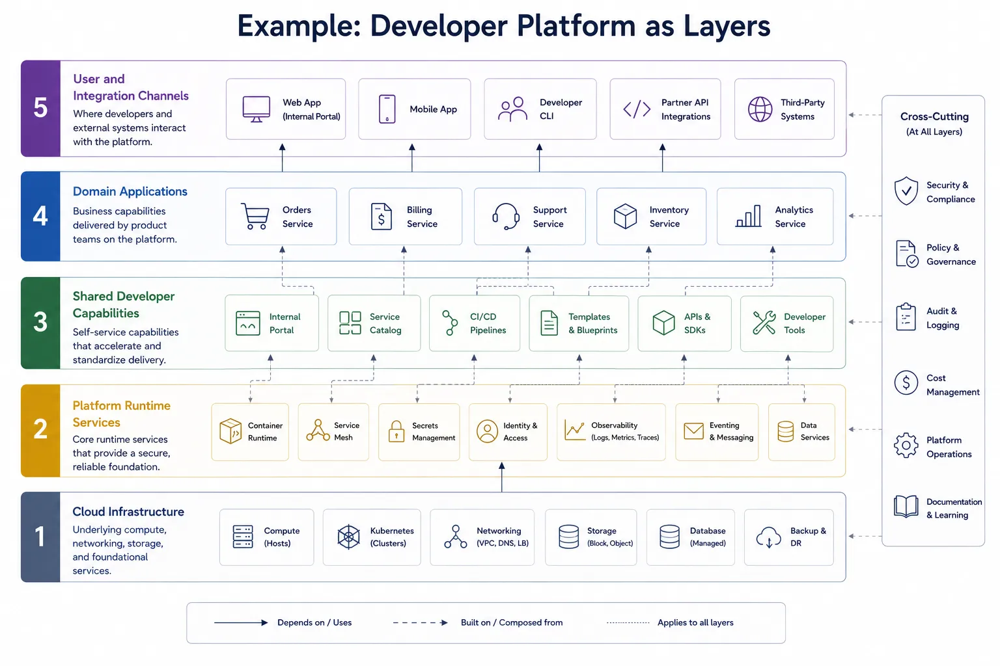

Layers are one of the oldest and most useful architecture concepts because they help engineers reason about structural abstraction. They are not a universal design mandate, and they do not explain every property of a system, but they remain a practical way to understand what builds on what.

## Definition

A layer is a structural abstraction that organizes responsibilities and dependencies. A layered model groups system elements according to their role and relative position in the dependency structure, so teams can see which abstractions rely on others and which boundaries should resist direct coupling.

The key idea is not visual stacking. The key idea is directional structure.

## Why Layers Exist

Layered thinking helps answer a narrow but important set of questions:

- What depends on what?
- Which abstractions build on lower-level capabilities?
- Where should dependencies flow?
- Which parts should be insulated from change?

Those questions appear in many contexts. Application teams need them when separating domain logic from infrastructure. Platform teams need them when distinguishing runtime services from the underlying cloud substrate. Protocol designers need them when separating transport, session, and application concerns.

Layers exist because software systems become fragile when dependency direction is unclear. If every part of the system can directly reach every other part, change spreads unpredictably and reasoning becomes expensive.

## Common Examples

### OSI Model

The OSI model is a classic layered abstraction for networking. Its lasting value is not that real systems always match the model exactly, but that it teaches engineers to distinguish physical transport concerns from higher-level protocol and application concerns.

### Clean Architecture and Similar Application Models

Clean Architecture, hexagonal architecture, and related patterns use layers to separate domain logic, application orchestration, interfaces, and infrastructure concerns. The goal is usually to reduce coupling and keep core business rules from depending directly on external technologies.

### Application Stacks

Many teams reason about systems in terms such as presentation layer, application layer, data access layer, and persistence layer. This can be useful when the labels reflect real dependency structure rather than arbitrary boxes in a slide deck.

### Cloud Platform Stacks

A cloud platform may be understood as infrastructure, container runtime, platform services, application services, and user-facing interfaces. The layered view helps clarify where abstractions build on platform capabilities and where changes should be isolated.

### AI Runtime or Agent Platform Stacks

An AI system can also be described structurally: model providers and vector stores at one level, orchestration services above them, domain workflows above orchestration, and product interfaces above that. This view helps engineers reason about substitution, dependency containment, and integration boundaries.

## What Layers are Good for

**Dependency Reasoning.** Layers make dependency direction explicit. If the domain layer should not depend on infrastructure details, the layered model provides a way to state and review that rule.

**Abstraction Management.** Layers help teams place concepts at the right level. A low-level transport concern should not leak into a high-level business abstraction unless there is a deliberate reason.

**Change Isolation.** When the structural boundaries are well chosen, teams can replace or modify lower-level implementations without rewriting higher-level intent. This is one reason layers remain valuable even in modern distributed systems.

**Teaching and Onboarding.** Layered models are effective for explaining complex systems. They give new engineers a stable mental map before they have to learn the full runtime detail.

## Common Mistakes

**Treating Layers as Deployment Tiers.** Layers describe structural abstraction, not necessarily physical placement. A service deployed in one cluster may still participate in several conceptual layers, and several layers may be deployed together.

**Assuming All Dependencies are Strictly Vertical.** Real systems often include carefully controlled cross-layer interactions, shared utilities, or supporting infrastructure. A layered model should clarify the intended dependency rules, not pretend the world is simpler than it is.

**Confusing Layers with Ownership Boundaries.** A layer is not a team. Teams may own capabilities across several layers, and one layer may involve several teams.

**Forcing Runtime Control Paths into Structural Diagrams.** Layers are poor tools for explaining asynchronous pipelines, workflow orchestration, or control/data separation. Those are usually better expressed as flows or planes.

## Comparison with Other Concepts

Layer terminology is often stretched to cover ideas that belong to a different architecture lens. That is where confusion begins. A layer is useful when the question is about structural abstraction and dependency direction, but other concepts are better suited to runtime behavior, strategic priorities, implementation units, or deployment placement.

The comparison below keeps those distinctions explicit so teams can choose the right model for the question they are trying to answer.

| Concept | What it represents                              | Primary question                          |
| ------- | ----------------------------------------------- | ----------------------------------------- |
| Layer   | Structural abstraction and dependency direction | What builds on what?                      |
| Plane   | Runtime responsibility across structure         | How is work controlled or processed?      |
| Pillar  | Strategic priority or quality lens              | What are we optimizing for?               |
| Module  | A concrete unit of code or capability           | What is packaged or implemented together? |
| Tier    | A deployment or runtime placement grouping      | Where does this run?                      |

## Example: Developer Platform

Consider a mid-size software company that operates an internal developer platform used by product teams to build and run customer-facing applications. The platform includes cloud infrastructure, shared runtime services, developer self-service capabilities, domain applications, and external integration channels.

In a layered view, cloud infrastructure sits at the base, platform runtime services build on it, shared developer capabilities sit above the runtime, domain applications consume those shared capabilities, and user or integration channels appear at the top. Representative capabilities may include networking, compute, and storage at the foundation; container runtime, secrets, identity, and observability in the runtime layer; CI/CD, a service catalog, an internal portal, and templates in the shared capability layer; and domain services such as orders, billing, and support in the application layer.

That structure helps teams answer practical structural questions such as where identity belongs, which capabilities product teams should depend on directly, and which parts of the platform should remain shared rather than duplicated inside each domain application.

## Summary

Layers remain valuable because they help teams reason about abstraction, dependency direction, and change isolation. They are most useful when used narrowly and honestly: not as a claim that every system must be layered, but as a structural model for questions that are fundamentally about what builds on what.
