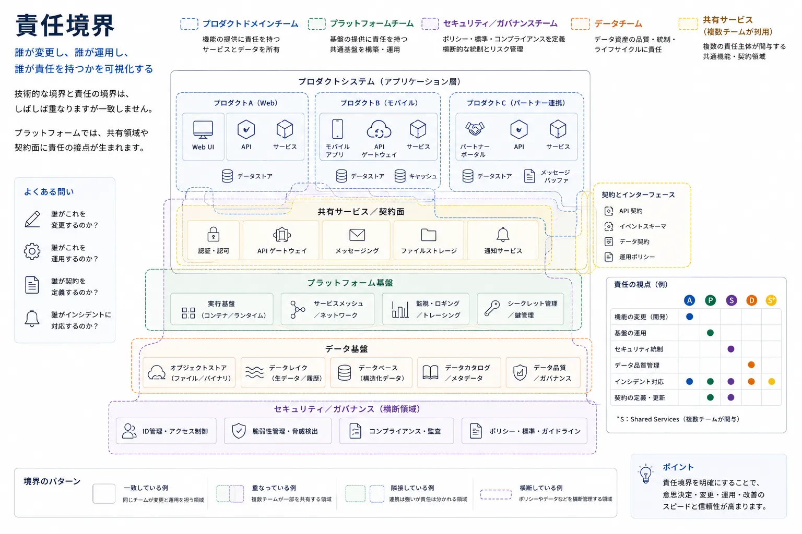
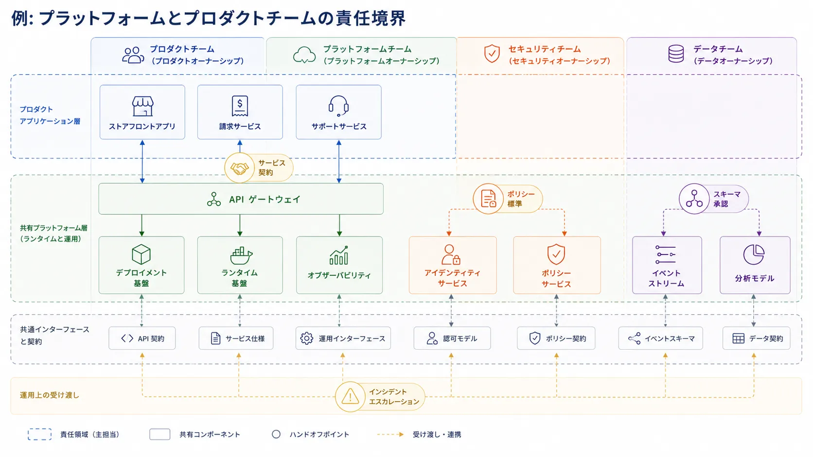

ソフトウェアアーキテクチャは、技術的な構造だけでなく、その構造を誰が安全に変更し、誰が運用できるかによっても形づくられます。
責任境界が重要なのは、結合が純粋に技術的なものではないからです。
そこには運用、組織、契約も関わっています。

## 定義

責任境界とは、システムの一部を変更し、運用し、統制する責任を分ける境界です。
誰が変更を行うのか、障害時に誰が対応するのか、契約を誰が定義するのか、長期的な複雑さのコストを誰が引き受けるのかを明確にします。

これらの境界は技術アーキテクチャと関係していますが、サービス、モジュール、レイヤー、デプロイ単位と同一ではありません。

## なぜ責任分担がアーキテクチャなのか

責任分担は、提供速度、信頼性、インシデント対応、プラットフォーム戦略、継続的な調整なしにシステムを進化させる能力へ影響します。
技術的にきれいでも責任が曖昧な境界は、実務では脆いことが少なくありません。
多少不完全でも責任が明確な境界の方が、はるかに運用しやすいことがあります。

責任分担がアーキテクチャなのは、それが組織の中で作業が流れる形を変えるからです。

- どのコンポーネントを誰が安全に変更できるかに影響する
- インシデントをどれだけ速く診断し解決できるかを左右する
- ポリシー、スキーマ、インターフェースの変更が広い調整を要するかどうかを決める
- 共有能力が有効なプラットフォームになるのか、放置された依存先になるのかに影響する

## 代表的な責任分担の概念

### ドメイン

ドメインは、業務またはプラットフォームの責任領域です。
ドメインオーナーシップは、変更を専門知識と業務文脈に結びつける助けになります。

### 境界づけられたコンテキスト

境界づけられたコンテキストは、モデルの概念的な境界と言語の境界です。
あるモデルを担うチームは、その言語と契約の進化も担うべきことが多いため、責任分担へ強く影響します。

### サービスオーナーシップ

サービスオーナーシップは、あるサービスを誰が構築し、運用し、支援するかを示します。
ここには、運用上の期待値、信頼性目標、変更統制も含まれます。

### プラットフォームオーナーシップ

プラットフォームオーナーシップは、他チームが利用する共有能力を対象とします。
たとえば、アイデンティティ、ランタイムツール群、CI/CD 基盤、可観測性の土台、ポリシーフレームワークなどです。

### データオーナーシップ

データオーナーシップは、スキーマの意味、品質期待値、アクセスポリシー、ライフサイクルルールを誰が定義するかを明確にします。
保存基盤の管理責任とは分かれていることが多くあります。

### セルまたはテナント境界

一部のアーキテクチャでは、セル、リージョン、テナント分割を責任と運用の単位として導入します。
これらの境界は、隔離、影響半径、サポートモデルを左右します。

### 共有能力

検索、イベント配信、モデルルーティングのような共有能力は、複数チームが依存していても明示的なオーナーシップが必要です。
共有されていることは、所有者がいないことを意味しません。

## 責任分担と技術構造の違い

責任分担は、責務がサービス、ドメイン、共有プラットフォームの周囲に集まりやすいため、しばしばシステムの技術的な形と混同されます。
しかし、責任分担は別種のアーキテクチャ関心事です。
ソフトウェアがどうまとめられ、どう配置されるかだけでなく、変更と運用に対して誰が説明責任を持つかを扱います。

次の比較は、責任境界と、それと重なりやすい技術構造を切り分けるためのものです。

| 概念         | 主な焦点           | 典型的な問い                               |
| ------------ | ------------------ | ------------------------------------------ |
| 責任境界     | 変更と運用の責任   | 誰が判断し、運用し、支援するのか           |
| レイヤー     | 構造上の抽象化     | 何が何に依存しているか                     |
| サービス     | 技術的な能力の境界 | ここでは何の機能を公開しているか           |
| モジュール   | コード構成         | コード上で何が一緒にまとめられ変更されるか |
| デプロイ単位 | 実行時の配置       | 何が一緒にリリースされスケールするか       |
| プレーン     | 運用上の役割       | この経路はどの実行時責務を担うか           |

これらの概念は互いに影響し合いますが、同義語として扱うべきではありません。
1 つのチームが複数のサービスを担うこともありますし、複数のチームが 1 つのレイヤー化されたプラットフォームへ貢献することもあります。
共有コントロールプレーンを 1 つのチームが運用し、複数のプロダクトチームがそれに依存することもあります。

## 設計上の問い

責任分担の文書が有用になるのは、具体的な問いに答えるときです。

- これを安全に変更できるのは誰か
- 日々の運用を担うのは誰か
- インシデント対応とエスカレーションを担うのは誰か
- インターフェースやスキーマの変更を定義し承認するのは誰か
- ポリシー変更を承認するのは誰か
- この依存関係が複雑になったとき、そのコストを負うのは誰か

これらの答えが曖昧なら、図が示す以上に、そのアーキテクチャは遅く危うく感じられることが多くあります。

## 例: プラットフォームとプロダクトチーム

現代的によくある形は、プロダクトドメインのオーナーシップと共有プラットフォームのオーナーシップを組み合わせたものです。
いくつかのプロダクトアプリケーションが共有の社内基盤上で動き、プロダクトチームが顧客向けサービスを担い、プラットフォームチームが共有ランタイム能力を担い、セキュリティチームがアイデンティティとポリシー統制を担い、データチームが共有イベント契約と分析契約を担う会社を想像してください。

そのシステムでは、ストアフロントアプリ、請求サービス、サポートサービス、API ゲートウェイ、デプロイ基盤、ランタイム基盤、アイデンティティサービス、ポリシーサービス、可観測性スタック、イベントストリーム、分析モデルといったコンポーネントが、異なる責任関係に同時に属することがあります。
サービス契約、ポリシー標準、スキーマ承認、インシデントエスカレーションのような引き継ぎ点は、箱そのものと同じくらい重要です。

これはアーキテクチャの欠陥ではありません。
1 つのシステムが同時に複数の妥当な責任境界を持ち得ることを示しており、重要なのは契約、責務、エスカレーション経路を明示することです。

## よくある誤り

**すべてのサービスが 1 つのチームに対応すると考えること。** サービス数とチーム構造は、長期的にはきれいに一致しません。
無理に一致させると、不自然な境界や不要な分断を生みます。

**共有プラットフォームを所有者のいないユーティリティとして扱うこと。** 共有インフラや開発者プラットフォームには、明確なプロダクト思考、運用責任、ライフサイクル判断が必要です。

**データやポリシーのオーナーシップを無視すること。** サービスオーナーシップだけ明確で、スキーマの意味、アクセスポリシー、監査責任が曖昧なことは珍しくありません。
この空白は後で高くつきます。

**エスカレーション経路とアーキテクチャ境界を混同すること。** インシデント時のエスカレーションは複数チームをまたぐことがあります。
それは、システムに一貫した責任分担がないことを意味しません。
境界と依存関係を正直に文書化する必要があるという意味です。

## 要約

責任境界がアーキテクチャ上重要なのは、誰がシステムを効果的に変更し、運用し、統制できるかを決めるからです。
特に、共有プラットフォーム、データ契約、チーム間依存が実際の変更コストを左右するシステムでは、技術境界と同じくらい丁寧に文書化されるべきです。
