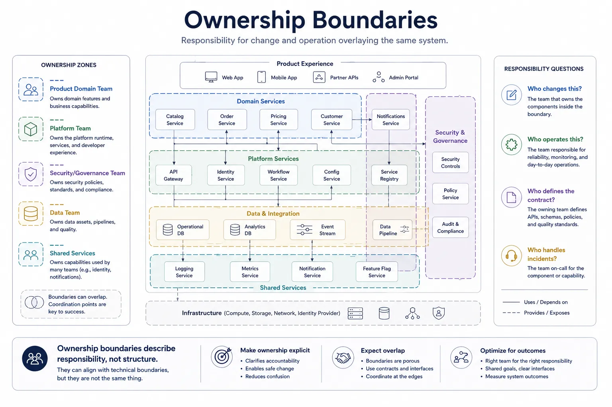
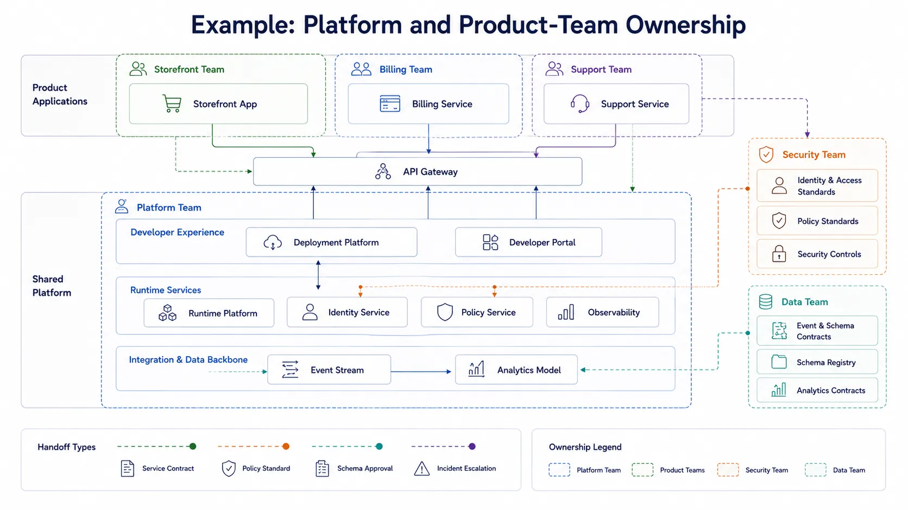

Software architecture is shaped not only by technical structure, but by who can safely change and operate that structure. Ownership boundaries matter because coupling is never purely technical. It is also operational, organizational, and contractual.

## Definition

Ownership boundaries divide responsibility for changing, operating, and governing parts of a system. They clarify who makes changes, who responds when things fail, who defines the contract, and who carries the long-term complexity cost.

These boundaries are related to the technical architecture, but they are not identical to services, modules, layers, or deployment units.

## Why Ownership is Architectural

Ownership affects delivery speed, reliability, incident handling, platform strategy, and the ability to evolve a system without constant coordination. A clean technical boundary with unclear ownership is usually fragile in practice. A slightly imperfect technical boundary with clear responsibility may be far easier to operate.

Ownership is architectural because it changes how work flows through the organization:

- It affects who can change a component safely.
- It shapes how quickly incidents are diagnosed and resolved.
- It determines whether policy, schema, or interface changes require broad negotiation.
- It influences whether shared capabilities become effective platforms or neglected dependencies.

## Common Ownership Concepts

### Domain

A domain is an area of business or platform responsibility. Domain ownership helps teams align change with expertise and business context.

### Bounded Context

A bounded context is a conceptual and language boundary around a model. It often influences ownership because a team that owns a model should usually own the evolution of its language and contracts.

### Service Ownership

Service ownership identifies who builds, runs, and supports a given service. This includes operational expectations, reliability targets, and change control.

### Platform Ownership

Platform ownership covers shared capabilities used by other teams, such as identity, runtime tooling, CI/CD infrastructure, observability foundations, or policy frameworks.

### Data Ownership

Data ownership clarifies who defines schema meaning, quality expectations, access policy, and lifecycle rules. It is often separate from storage administration.

### Cell or Tenant Boundary

Some architectures introduce cells, regions, or tenant partitions as ownership and operational units. These boundaries can shape isolation, blast radius, and support models.

### Shared Capability

Shared capabilities such as search, eventing, or model routing may need explicit ownership even when several teams depend on them. Shared does not mean ownerless.

## Ownership vs. Technical Structure

Ownership is often confused with the technical shape of a system because responsibility tends to cluster around services, domains, or shared platforms. Even so, ownership is a different kind of architectural concern. It is about accountability for change and operation, not just how software is packaged or deployed.

The comparison below helps separate ownership boundaries from the technical structures they often overlap with.

| Concept            | Main focus                              | Typical question                                  |
| ------------------ | --------------------------------------- | ------------------------------------------------- |
| Ownership boundary | Responsibility for change and operation | Who decides, runs, and supports this?             |
| Layer              | Structural abstraction                  | What depends on what?                             |
| Service            | Technical capability boundary           | What function is exposed here?                    |
| Module             | Code organization                       | What is packaged or changed together in code?     |
| Deployment unit    | Runtime placement                       | What is released or scaled together?              |
| Plane              | Operational role                        | What runtime responsibility does this path serve? |

These concepts often influence one another, but they should not be treated as synonyms. One team may own several services. Several teams may contribute to one layered platform. A shared control plane may be operated by one team while several product teams depend on it.

## Design Questions

Ownership documentation becomes useful when it answers concrete questions:

- Who can change this safely?
- Who operates it day to day?
- Who handles incidents and escalation?
- Who defines and approves interface or schema changes?
- Who approves policy changes?
- Who pays the complexity cost when this dependency grows?

If those answers are unclear, the architecture will often feel slower and riskier than the diagrams suggest.

## Example: Platform + Product Teams

A common modern model combines product-domain ownership with shared platform ownership. Imagine a company running several product applications on a shared internal platform, where product teams own customer-facing services, the platform team owns shared runtime capabilities, the security team owns identity and policy controls, and the data team owns shared event and analytics contracts.

In that system, components such as a storefront app, billing service, support service, API gateway, deployment platform, runtime platform, identity service, policy service, observability stack, event stream, and analytics model may all participate in different ownership relationships. Handoffs such as service contracts, policy standards, schema approval, and incident escalation matter as much as the boxes themselves.

This is not a flaw in the architecture. It reflects the fact that one system can carry several valid ownership boundaries at once, and the important design task is to make the contracts, responsibilities, and escalation paths explicit.

## Common Mistakes

**Assuming Every Service Maps to One Team.** Service count and team topology rarely stay perfectly aligned. Forcing them to match can create awkward boundaries or unnecessary fragmentation.

**Treating Shared Platforms as Ownerless Utilities.** Shared infrastructure and developer platforms need explicit product thinking, operational ownership, and lifecycle decisions.

**Ignoring Data and Policy Ownership.** Teams often define service ownership clearly while leaving schema semantics, access policy, or audit responsibility ambiguous. That gap becomes expensive later.

**Confusing Escalation Paths with Architecture Boundaries.** An escalation route may cross several teams during an incident. That does not mean the system lacks coherent ownership. It means the boundaries and dependencies need to be documented honestly.

## Summary

Ownership boundaries are architectural because they determine who can change, operate, and govern a system effectively. They should be documented as carefully as technical boundaries, especially in systems where shared platforms, data contracts, and cross-team dependencies shape the real cost of change.
