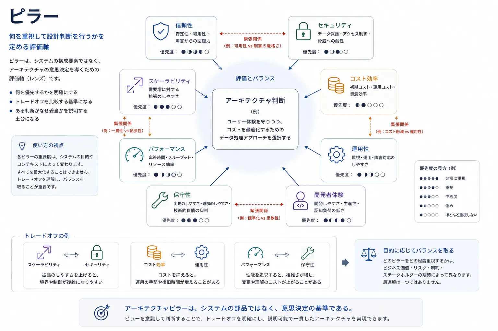
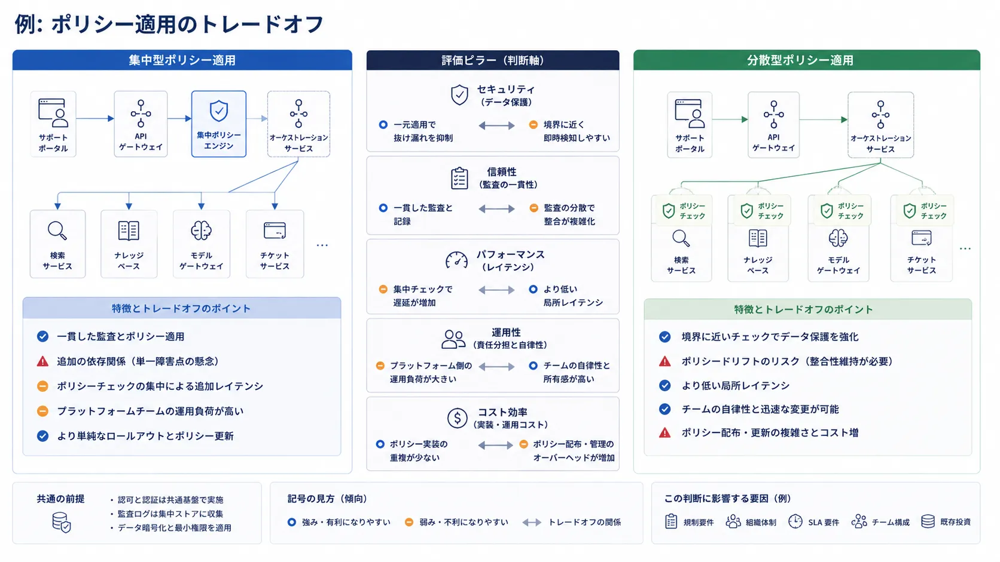

ピラーが必要なのは、アーキテクチャが構造や実行時の振る舞いだけで決まるものではないからです。
そこには判断があります。
チームは、何を最も重視するのかを表現する方法を持たなければ、直感だけで設計案を争うことになります。

## 定義

ピラーとは、アーキテクチャ上の意思決定を導くために使う戦略的な品質または優先順位です。
システムが何を最適化し、何を守り、何のバランスを取るべきかを示します。
ピラーは、実行時コンポーネントでもなければ、依存構造でもありません。
意思決定のためのレンズです。

レイヤーが何が何の上に成り立つかを示し、プレーンがシステムの振る舞い方を示すなら、ピラーは設計が何を達成しようとしているかを示します。

## なぜピラーがあるのか

ピラーは、繰り返し現れる 3 つの問いに答える助けになります。

- 何を重視して最適化するのか
- どの品質がトレードオフを形づくるべきか
- ある設計を受け入れ可能と判断する基準は何か

この枠組みがなければ、アーキテクチャ議論は局所的な好みへ流れがちです。
あるエンジニアは遅延を重視し、別のエンジニアは実装速度を重視し、さらに別のエンジニアは準拠性を重視するかもしれません。
ピラーは、こうした優先順位を明示し、トレードオフを正直に議論できるようにします。

## 代表的なピラー

### 信頼性

信頼性は、通常時だけでなく性能劣化時にも予測可能に動作することへ焦点を当てます。
冗長化、障害隔離、依存先の選択、運用実務に影響します。

### セキュリティ

セキュリティは、システム、データ、操作を誤用や侵害から守ることへ焦点を当てます。
信頼境界、アイデンティティ、認可、監査可能性、既定の安全姿勢に影響します。

### スケーラビリティ

スケーラビリティは、需要、データ量、テナント数、組織の複雑さが増えたときにシステムがどう振る舞うかへ焦点を当てます。
パーティショニング、キャッシュ、並行性、自動化の判断を左右します。

### パフォーマンス

パフォーマンスは、遅延、スループット、応答性、資源効率へ焦点を当てます。
実行時の配置、プロトコル選択、バッファリング、システム構成に影響します。

### コスト効率

コスト効率は、インフラや運用コストを制御不能にせずにシステム目標を達成することへ焦点を当てます。
サービス境界、保存期間戦略、スケーリング方針、基盤の再利用に影響します。

### 運用性

運用性は、システムをどれだけ観測しやすく、診断しやすく、回復しやすく、管理しやすいかへ焦点を当てます。
テレメトリ設計、制御面、障害処理に影響します。

### 保守性

保守性は、システムがどれだけ安全かつ効率的に進化できるかへ焦点を当てます。
結合度、抽象化の深さ、文書化、境界の明確さに影響します。

### 開発者体験

開発者体験は、エンジニアがその基盤上でどれだけ効果的に構築、テスト、リリース、運用支援できるかへ焦点を当てます。
ツール群、ゴールデンパス、インターフェースの明確さ、セルフサービス機能へ影響することが多くあります。

## ピラーが意思決定へ与える影響

ピラーが役立つのは、現実の判断を形づくるときだけです。
実務では、ピラーはしばしば次のような形になります。

- 設計原則
- レビュー基準
- プラットフォームポリシー
- エンジニアリング標準
- 許容可能な選択肢への制約

たとえば、信頼性が最上位のピラーなら、最大限の機能柔軟性よりも、単純な依存関係、性能劣化時の振る舞い、強い可観測性が好まれるかもしれません。
開発者体験が強いピラーなら、短期的な実装コストが増えても、基盤はセルフサービスワークフローへの投資を選ぶかもしれません。

この考え方は、主要なクラウドの設計ガイダンスにも見られます。[AWS Well-Architected Framework](https://docs.aws.amazon.com/wellarchitected/latest/framework/welcome.html)、[Microsoft Azure Well-Architected Framework](https://learn.microsoft.com/en-us/azure/well-architected/)、[Google Cloud Architecture Framework](https://cloud.google.com/architecture/framework) は、いずれもベンダー固有の形でアーキテクチャ上の優先順位を整理した文書です。これらはピラーにもとづく設計思考の実例として有用ですが、どれか 1 つを普遍的な定義とみなすべきではありません。

## ピラーとレイヤー、プレーンの違い

チームはしばしば、構造、実行時の振る舞い、判断基準を同じ図や同じ会話の中で扱うため、ピラーを他のアーキテクチャ概念と混同します。
しかし、違いは重要です。
ピラーは、システムがどう配置されているかや、どう実行されるかを説明するものではありません。
何を重視して最適化しようとしているかを説明するものです。

次の比較は、ピラーを構造概念や運用概念から切り分けるためのものです。

| 概念     | 表しているもの             | 典型的な用途                             |
| -------- | -------------------------- | ---------------------------------------- |
| ピラー   | 戦略的な品質または優先順位 | トレードオフを評価し、設計をレビューする |
| レイヤー | 構造上の抽象化             | 依存関係と変更境界を管理する             |
| プレーン | 実行時責務                 | 制御、実行、観測を説明する               |
| サービス | 具体的な能力または境界     | 振る舞いを実装し公開する                 |

ピラーは、トポロジ、コードのまとまり、デプロイ配置、責任分担を表しません。
ある設計方向が別の方向より望ましい理由を表します。

## 例: トレードオフ分析

AI サポート基盤チームが、ポリシー適用を 1 つのゲートウェイへ集約するべきか、それとも各プロダクトワークフローへ分散させるべきかを判断しているとします。

どちらの選択肢も成立し得ます。
集約型の適用は、監査の一貫性を高め、切り替えを単純化し、顧客データ保護に対してセキュリティチームがより強く統制できるかもしれません。
分散型のチェックは、局所的な遅延を減らし、チームの自律性を高め、プロダクトワークフローがドメイン固有の要件へすばやく適応できるかもしれません。

このトレードオフは、セキュリティ、信頼性、パフォーマンス、運用性、コスト効率といった具体的なピラーを通して比較すると明確になります。
あるピラーは一貫した証跡収集を支持し、別のピラーは依存関係の増加によるリスクを強調し、さらに別のピラーは遅延やポリシードリフトへの懸念を強調するかもしれません。

どのピラーも間違っているわけではありません。
アーキテクチャ上の価値は、その緊張関係を見えるようにし、どの優先順位を上位に置き、どの妥協を許容するかを明示できる点にあります。

## よくある誤り

**ピラーを多く並べすぎること。** すべてが最優先なら、どのトレードオフも解けません。
有用なピラーの集合は、設計へ圧力をかけられる程度に選択的であるべきです。

**ピラーをスライド向けの標語として扱うこと。** ピラーはスローガンではありません。
実際の設計へ影響する標準、問い、制約につながるべきです。

**ピラー同士のトレードオフを無視すること。** セキュリティ、速度、コスト、開発者体験はしばしば異なる方向へ引っ張ります。
良いアーキテクチャは、その緊張を見えるようにします。

**理想論と強制可能な基準を混同すること。** 単純さや革新を重視するのは自然です。
しかし、レビューや意思決定を導ける観測可能な基準へ翻訳した方が、はるかに役に立ちます。

## 要約

ピラーは、戦略的な意思決定レンズです。
アーキテクチャが何を重視して最適化すべきかを説明し、トレードオフを評価する実践的な基盤を与えます。
価値が生まれるのは一覧そのものではなく、それがどれだけ明確に設計判断を形づくるかにあります。
