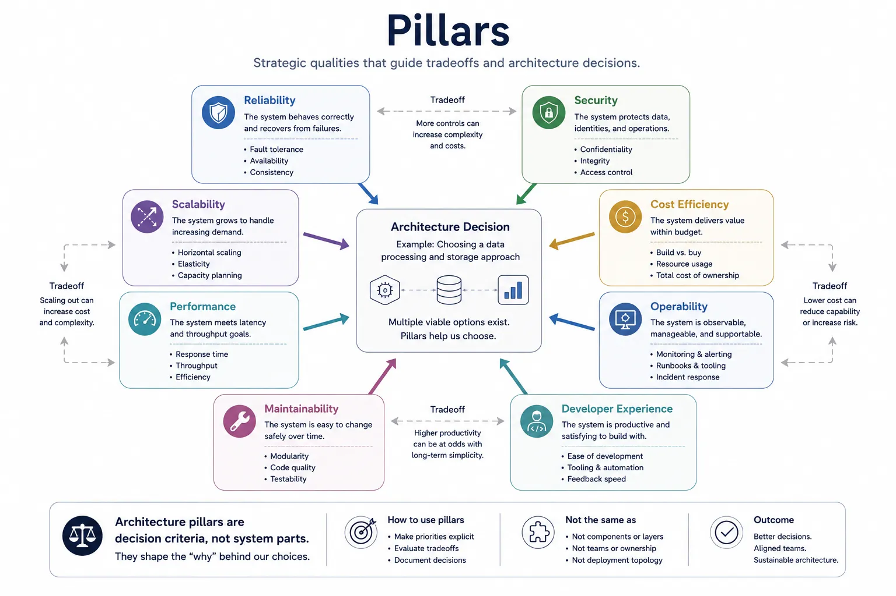
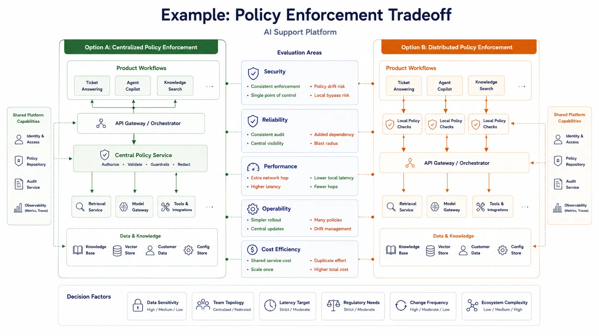

Pillars exist because architecture is not only about structure and runtime behavior. It is also about judgment. Teams need a way to express what matters most so they can evaluate design options consistently instead of arguing from intuition alone.

## Definition

A pillar is a strategic quality or priority used to guide architecture decisions. Pillars describe what a system should optimize for, protect, or balance. They are decision lenses, not runtime components and not dependency structures.

If layers answer what builds on what, and planes answer how the system behaves, pillars answer what the design is trying to achieve.

## Why Pillars Exist

Pillars help teams answer three recurring questions:

- What are we optimizing for?
- Which qualities should shape tradeoffs?
- How will we judge whether a design is acceptable?

Without that framing, architecture discussions tend to drift toward local preferences. One engineer may optimize for latency, another for implementation speed, and another for compliance. Pillars make those priorities explicit so tradeoffs can be discussed honestly.

## Common Pillars

### Reliability

Reliability focuses on predictable operation under expected and degraded conditions. It influences redundancy, failure isolation, dependency choices, and operational practices.

### Security

Security focuses on protecting systems, data, and actions from misuse or compromise. It influences trust boundaries, identity, authorization, auditability, and default safety posture.

### Scalability

Scalability focuses on how the system behaves as demand, data volume, tenants, or organizational complexity increases. It often shapes partitioning, caching, concurrency, and automation decisions.

### Performance

Performance focuses on latency, throughput, responsiveness, and resource efficiency. It influences runtime placement, protocol choices, buffering, and system composition.

### Cost Efficiency

Cost efficiency focuses on achieving system goals without uncontrolled infrastructure or operational cost. It influences service boundaries, retention strategies, scaling policies, and platform reuse.

### Operability

Operability focuses on how easy the system is to observe, diagnose, recover, and manage. It influences telemetry design, control surfaces, and failure handling.

### Maintainability

Maintainability focuses on how safely and efficiently the system can evolve. It influences coupling, abstraction depth, documentation, and boundary clarity.

### Developer Experience

Developer experience focuses on how effectively engineers can build, test, release, and support software on the platform. It often influences tooling, golden paths, interface clarity, and self-service capabilities.

## How Pillars Influence Decisions

A pillar becomes useful only when it shapes a real decision. In practice, pillars often become:

- Design principles
- Review criteria
- Platform policies
- Engineering standards
- Constraints on acceptable options

For example, if reliability is a top pillar, teams may prefer simpler dependencies, degraded-mode behavior, and strong observability over maximum feature flexibility. If developer experience is a strong pillar, the platform may invest in self-service workflows even when that increases short-term implementation cost.

This way of thinking also appears in major cloud guidance. [AWS Well-Architected Framework](https://docs.aws.amazon.com/wellarchitected/latest/framework/welcome.html), [Microsoft Azure Well-Architected Framework](https://learn.microsoft.com/en-us/azure/well-architected/), and [Google Cloud Architecture Framework](https://cloud.google.com/architecture/framework) each publish vendor-specific sets of architectural priorities. Those guides are useful real-world examples of pillar-based design thinking, even though no single vendor framework should be treated as the universal definition.

## Pillars vs. Layers and Planes

Pillars are often confused with other architecture concepts because teams use the same diagrams and conversations to discuss structure, runtime behavior, and decision criteria. The distinction matters because a pillar does not describe how a system is arranged or how it executes. It describes what the design is trying to optimize for.

The comparison below separates pillars from structural and operational concepts so the role of each model stays clear.

| Concept | What it represents              | Typical use                                 |
| ------- | ------------------------------- | ------------------------------------------- |
| Pillar  | Strategic quality or priority   | Evaluate tradeoffs and review designs       |
| Layer   | Structural abstraction          | Manage dependencies and change boundaries   |
| Plane   | Runtime responsibility          | Explain control, execution, and observation |
| Service | Concrete capability or boundary | Implement and expose behavior               |

Pillars do not describe topology, code packaging, deployment placement, or ownership. They describe why one design direction may be preferred over another.

## Example: Tradeoff Analysis

Consider an AI support platform team deciding whether policy enforcement should be centralized in one gateway or distributed across each product workflow.

Both options are plausible. Centralized enforcement may improve consistent audit behavior, simplify rollout, and give security stronger control over customer data protection. Distributed checks may reduce local latency, increase team autonomy, and let product workflows adapt more quickly to domain-specific needs.

The tradeoff becomes clearer when the team evaluates each option through concrete pillars such as security, reliability, performance, operability, and cost efficiency. One pillar may favor consistent evidence collection, another may highlight added dependency risk, and another may emphasize latency or policy-drift concerns.

None of those pillars is wrong. The architectural value comes from making the tensions visible so the team can state which priorities dominate and what compromises are acceptable.

## Common Mistakes

**Listing Too Many Pillars.** If everything is a top priority, nothing helps resolve tradeoffs. A useful set of pillars is selective enough to create design pressure.

**Treating Pillars as Branding Language.** Pillars are not slogans for slide decks. They should lead to standards, questions, and constraints that influence real designs.

**Ignoring Tradeoffs between Pillars.** Security, speed, cost, and developer experience often pull in different directions. Good architecture makes those tensions visible instead of pretending they disappear.

**Confusing Aspirational Values with Enforceable Criteria.** It is reasonable to value simplicity or innovation. It is more useful to translate those values into observable criteria that can guide reviews and decisions.

## Summary

Pillars are strategic decision lenses. They help teams explain what the architecture must optimize for and provide a practical basis for evaluating tradeoffs. Their value comes not from the list itself, but from how clearly they shape design judgment.
