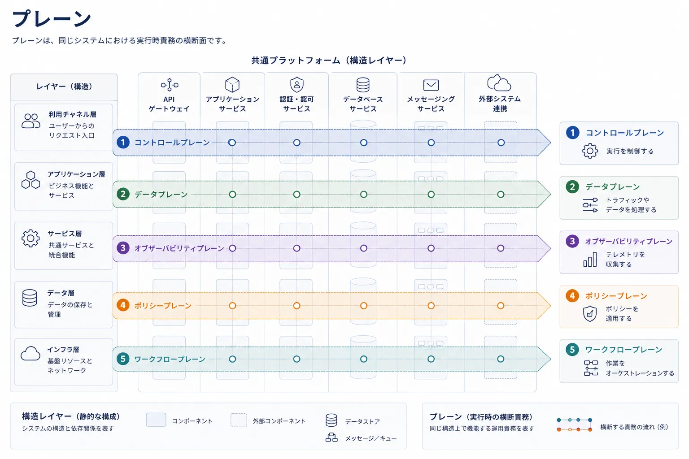
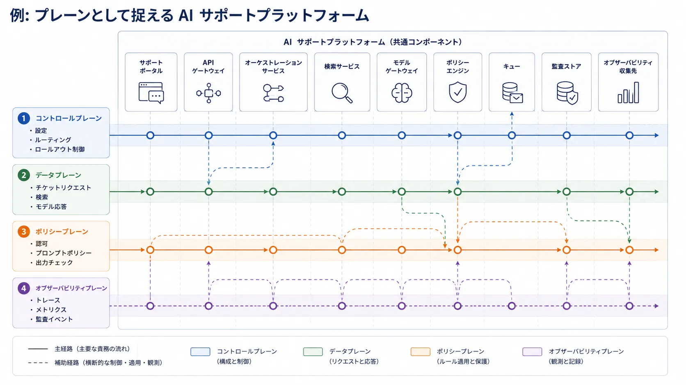

プレーンという用語は、構造境界をまたぐ実行時責務を説明する必要があるときに現れます。
コントロールプレーン、データプレーン、管理プレーン、オブザーバビリティプレーンが有用なのは、システムが動作している最中に、作業がどう指示され、実行され、統制され、観測されるかを示せるからです。

## 定義

プレーンとは、ある種類の実行時責務を中心に切り取った、システムの運用上の断面です。
複数のサービス、レイヤー、インフラストラクチャ境界を横断していても、共通の運用上の役割を果たす活動を 1 つのまとまりとして捉えます。

プレーンの狙いは、構造だけでシステムを説明したふりをせず、実行時の振る舞いを見えるようにすることです。

## なぜプレーンがあるのか

プレーンは、構造モデルでは明確に答えにくい問いに向いています。

- 誰が実行を制御しているか
- 誰がトラフィックやデータを処理しているか
- どの経路がポリシー、テレメトリ、オーケストレーション、管理を担っているか
- どの関心事が複数の構造コンポーネントを横断しているか

こうした問いが重要なのは、現代のプラットフォームでは、システムが複数の実行経路の重なりとして振る舞うことが多いからです。
あるリクエスト経路はゲートウェイとモデル提供コンポーネントを通過し、あるポリシー経路は集約された意思決定サービスを参照し、あるオブザーバビリティ経路はほぼすべての部分からトレースとログを収集するかもしれません。

## 代表的なプレーン

### コントロールプレーン

コントロールプレーンは、設定、調整、ポリシー配布、オーケストレーション、配置判断を担います。
通常は、システムの他の部分へ何を起こすべきかを指示しますが、必ずしもユーザートラフィックの本流をそのまま流すわけではありません。

### データプレーン

データプレーンは、主要なワークロードを処理します。
ネットワーク基盤ならパケット転送かもしれませんし、AI 基盤ならリクエストルーティング、検索、推論、結果の組み立てかもしれません。
一般に、スループット、遅延、障害影響が最も可視化されやすい場所です。

### 管理プレーン

管理プレーンは、運用管理のための機能を支えます。
プロビジョニング、アクセス制御、アップグレード、保守、設定変更のための運用インターフェースを含みます。
システムによってはコントロールプレーンと大きく重なりますが、運用管理と自動制御が別の関心事である場合には区別が有用です。

### オブザーバビリティプレーン

オブザーバビリティプレーンは、トレース、メトリクス、ログ、監査シグナルを運びます。
動いているシステムを理解するには、ユーザー作業の経路だけでなく、証跡のための経路も必要だからです。

### ポリシープレーン

ポリシープレーンは、挙動、アクセス、安全性、準拠性を統制するルールを評価または配布します。
ポリシーロジックを各所に埋め込む構成もあれば、集約または半集約する構成もあります。
ポリシープレーンという見方は、その関心事を主要なリクエスト経路と混同せずに説明する助けになります。

### ワークフロープレーン

ワークフロープレーンは、長時間実行や多段階の処理を調整します。
ジョブ、再試行、承認、非同期オーケストレーション、複数サービスやエージェントにまたがるタスク計画を含むシステムで特に有用です。

## プレーンとレイヤーの違い

レイヤーとプレーンは、別々の問題を解くための概念です。
レイヤー化モデルは依存関係と抽象化を説明し、プレーンモデルは運用上の責務を説明します。

| 観点           | レイヤー                     | プレーン                                   |
| -------------- | ---------------------------- | ------------------------------------------ |
| 主な目的       | 構造を考えること             | 実行時を考えること                         |
| 主な問い       | 何が何に依存しているか       | 作業はどう制御または処理されるか           |
| 代表的な概念   | モジュール、サービス、抽象化 | 制御、データ、ポリシー、可観測性           |
| 向いている用途 | 変更の隔離と抽象化の管理     | 障害分析、トラフィック経路、統制経路の把握 |
| よくある誤用   | 実行時フローを構造とみなす   | あらゆるサブシステム名をプレーンと呼ぶ     |

同じシステムがレイヤー化され、同時に複数のプレーンを持つことは普通です。
コントロールプレーンは、異なる構造レイヤーに属する API ゲートウェイ、サービスレジストリ、スケジューラ、ポリシーストアを横断するかもしれません。

## 例: クラウドネイティブな AI 基盤

顧客サポート向け AI 基盤があり、チケット回答リクエストを処理しつつ、設定、トラフィック、ポリシー、テレメトリ、監査証跡をそれぞれ別の実行時責務として管理している状況を考えてみます。

共有プラットフォームには、サポートポータル、API ゲートウェイ、オーケストレーションサービス、検索サービス、モデルゲートウェイ、ポリシーエンジン、キュー、監査ストア、オブザーバビリティの集約先が含まれるかもしれません。
これらのコンポーネント自体は同じでも、実行経路の見方を変えると別の責務が見えてきます。

コントロールプレーンは、設定、ルーティング、段階的な切り替えを管理します。
データプレーンは、チケット要求、検索処理、モデル応答、返却される回答を運びます。
ポリシープレーンは、認可、プロンプトポリシー、出力チェックを担います。
オブザーバビリティプレーンは、トレース、メトリクス、監査イベントを収集します。
4 つのプレーンすべてが、異なる実行時目的のために同じ基盤コンポーネントを横断します。

プレーンという用語が有用なのはこのためです。
実行時の各関心事を、それぞれ完全に別のシステムだと見せかけるのではなく、1 つの共有基盤上の運用責務として説明できます。

## 実例としての OpenChoreo

[OpenChoreo](https://openchoreo.dev/docs/) は、プラットフォームをマルチプレーンアーキテクチャとして明示的に文書化しているため、具体例として有用です。
そのアーキテクチャは、コントロール、データ、ワークフロー、オブザーバビリティの責務を分離しながら、全体としては 1 つの一貫した内部開発者プラットフォームを提供します。

OpenChoreo では、コントロールプレーンが中央オーケストレータとして機能します。
Platform API と Developer API を通じて宣言された望ましい状態を調停し、他のプレーンが何を行うべきかを調整します。
データプレーンは、アプリケーションワークロードを実行し、実行時の分離を適用し、ゲートウェイトポロジーを通じてトラフィックを公開します。
ワークフロープレーンは、CI、GitOps、その他の自動化タスクを担い、主要なリクエスト経路と混同すべきではない処理を引き受けます。
オブザーバビリティプレーンは、ワークフローおよびデータプレーン全体からログ、メトリクス、トレース、アラートを収集し、制御アクションと同じ経路にすべての証跡を流さなくても、チームがシステム挙動を調べられるようにします。

この例が有用なのは、プレーンが単なる図のラベルではないことを示しているからです。
実際のプラットフォームでは、プレーンごとにスケーリング特性、セキュリティ境界、デプロイおよびアップグレードのライフサイクルを分けながらも、1 つのシステムとして連携できます。
OpenChoreo はまた、プレーンという用語が複数のレイヤーを同時に横断しうることも示しています。
API、コントローラ、ワークロード、ゲートウェイ、テレメトリコンポーネントは、どの実行時関心事を説明しているかに応じて、異なるプレーンに参加します。

## よくある誤り

**あらゆるサブシステムをプレーンとして扱うこと。** すべてのラベル付きボックスがプレーンになるわけではありません。
プレーンは、複数の構造コンポーネントを横断する意味のある実行時責務、またはシステム挙動を説明するために必要な断面であるべきです。

**静的な組織図にプレーン用語を使うこと。** プレーンは運用の概念であって、報告ラインや静的な責任地図ではありません。

**曖昧なラベルで信頼性やセキュリティを覆い隠すこと。** ポリシープレーンや管理プレーンと呼ぶだけでは不十分です。
そこでは何が判断され、何が依存し、障害時にどう扱われるのかを文書化する必要があります。

**制御経路とユーザーのリクエスト経路を混同すること。** 多くのインシデントは、挙動を設定するシステムと主たるワークロードを運ぶシステムを同じものとして扱った結果として起こります。
この 2 つを分けて考えることで、診断と設計レビューの質が上がります。

## 要約

プレーンは、構造境界を横断する実行時の制御、処理、統制、観測を説明したいときに有用です。
レイヤーを置き換えるのではなく補完する概念であり、流行のラベルで図を飾るためではなく、実際の運用挙動を明確にするために使われるときに最も価値を持ちます。
