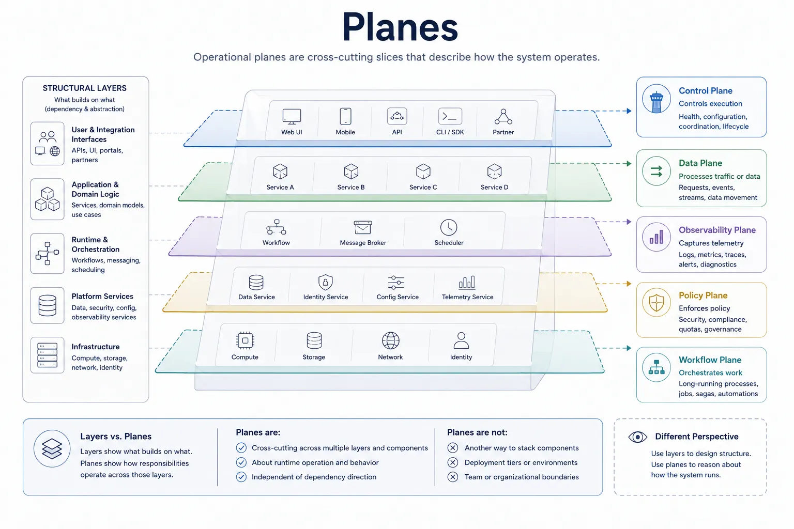
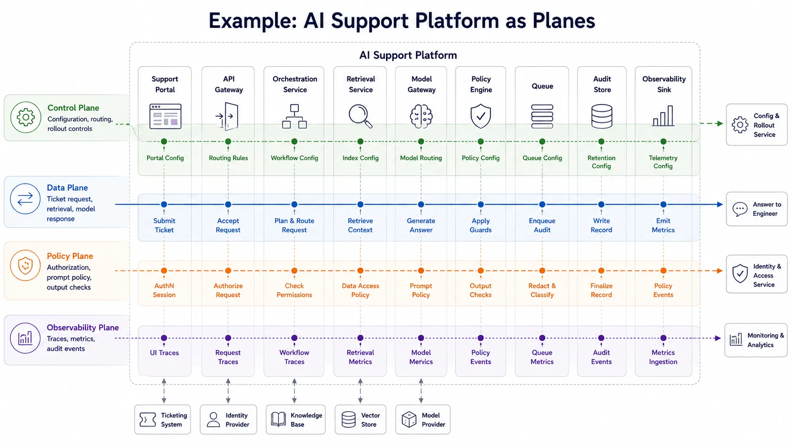

Plane terminology appears whenever engineers need to explain runtime responsibility that cuts across structural boundaries. Control planes, data planes, management planes, and observability planes are useful because they describe how work is directed, executed, governed, and observed while the system is running.

## Definition

A plane is an operational slice of a system organized around a type of runtime responsibility. It groups together activities that serve a common operational role even when those activities cross multiple services, layers, or infrastructure boundaries.

The point of a plane is to make runtime behavior visible without pretending that structure alone explains the system.

## Why Planes Exist

Planes help answer questions that structural models cannot answer clearly:

- Who controls execution?
- Who processes traffic or data?
- Which path handles policy, telemetry, orchestration, or management?
- Which concerns cross several structural components?

These questions matter in modern platforms because the system often behaves as several overlapping runtime paths. A request path may move through gateways and model-serving components, a policy path may consult a centralized decision service, and an observability path may collect traces and logs from nearly every part of the system.

## Common Planes

### Control Plane

The control plane manages configuration, coordination, policy distribution, orchestration, and placement decisions. It typically tells other parts of the system what should happen, but it does not necessarily carry the full volume of user traffic.

### Data Plane

The data plane processes the main workload. In a network platform this may be packet forwarding. In an AI platform it may be request routing, retrieval, inference, and result assembly. The data plane is usually where throughput, latency, and failure impact are most visible.

### Management Plane

The management plane supports administration. It includes operational interfaces for provisioning, access control, upgrades, maintenance, and configuration changes. In some systems it overlaps heavily with the control plane, but the distinction can still be useful when operational administration and automated control are separate concerns.

### Observability Plane

The observability plane carries traces, metrics, logs, and audit signals. It exists because understanding a running system requires a path for evidence, not just a path for user work.

### Policy Plane

The policy plane evaluates or distributes rules that govern behavior, access, safety, or compliance. In some architectures policy logic is embedded locally; in others it is centralized or partially centralized. The policy plane helps explain that concern without confusing it with the main request path.

### Workflow Plane

The workflow plane coordinates long-running or multi-step execution. It is useful when a system includes jobs, retries, approvals, asynchronous orchestration, or agent-style task planning across several services.

## Planes vs. Layers

Layers and planes solve different problems. A layered model explains dependency and abstraction. A plane model explains operational responsibility.

| Aspect           | Layers                                      | Planes                                            |
| ---------------- | ------------------------------------------- | ------------------------------------------------- |
| Main purpose     | Structural reasoning                        | Runtime reasoning                                 |
| Primary question | What depends on what?                       | How is work controlled or processed?              |
| Typical concepts | Modules, services, abstractions             | Control, data, policy, observability              |
| Best use         | Change isolation and abstraction management | Failure analysis, traffic paths, governance paths |
| Common misuse    | Treating runtime flow as structure          | Treating every subsystem label as a plane         |

The same system can be layered and also have several planes. That is normal. A control plane may cross API gateways, service registries, schedulers, and policy stores that sit in different structural layers.

## Example: Cloud-Native AI Platform

Consider a customer support AI platform that serves ticket-answering requests while separate runtime responsibilities manage configuration, traffic, policy, telemetry, and audit evidence.

The shared platform may include a support portal, an API gateway, an orchestration service, a retrieval service, a model gateway, a policy engine, a queue, an audit store, and an observability sink. Those components remain the same even when the runtime paths are viewed differently.

The control plane manages configuration, routing, and rollout controls. The data plane carries the ticket request, retrieval step, model response, and returned answer. The policy plane handles authorization, prompt policy, and output checks. The observability plane captures traces, metrics, and audit events. All four planes cross the same underlying components for different runtime purposes.

That is why plane terminology is useful: it explains operational responsibility across one shared platform rather than pretending each runtime concern belongs to a separate isolated subsystem.

## OpenChoreo as a Real-World Example

[OpenChoreo](https://openchoreo.dev/docs/) is a useful concrete reference because it explicitly documents its platform as a multi-plane architecture. Its architecture separates control, data, workflow, and observability responsibilities while still presenting one cohesive internal developer platform.

In OpenChoreo, the control plane acts as the central orchestrator. It reconciles desired platform and developer state through platform and developer APIs, then coordinates what other planes should do. The data plane runs application workloads, applies runtime isolation, and exposes traffic through gateway topologies. The workflow plane handles CI, GitOps, and other automation tasks that should not be confused with the main request path. The observability plane collects logs, metrics, traces, and alerts across the workflow and data planes so teams can inspect behavior without routing all evidence through the same path as control actions.

This example is useful because it shows that planes are not just diagram labels. In a real platform, they can have distinct scaling behavior, security boundaries, and deployment lifecycles while still working together as one system. OpenChoreo also illustrates that plane terminology can cross several layers at once: APIs, controllers, workloads, gateways, and telemetry components all participate in different planes depending on the runtime concern being described.

## Common Mistakes

**Treating Every Subsystem as a Plane.** Not every labeled box deserves plane status. A plane should describe a meaningful runtime responsibility that crosses structural components or helps explain system behavior.

**Using Plane Terminology for Static Organization Charts.** Planes are about operation, not reporting relationships or static ownership maps.

**Hiding Reliability or Security Concerns behind Vague Labels.** Calling something a policy plane or management plane is not enough. The documentation still needs to explain what decisions are made there, what depends on it, and how failure is handled.

**Confusing Control Paths with User Request Paths.** Many incidents happen because teams assume the system that configures behavior is the same system that carries the primary workload. Keeping those paths distinct improves diagnosis and design review.

## Summary

Planes are useful when engineers need to explain runtime control, execution, governance, and observation across structural boundaries. They complement layers rather than replace them, and they are most valuable when used to clarify real operational behavior instead of decorate diagrams with fashionable labels.
