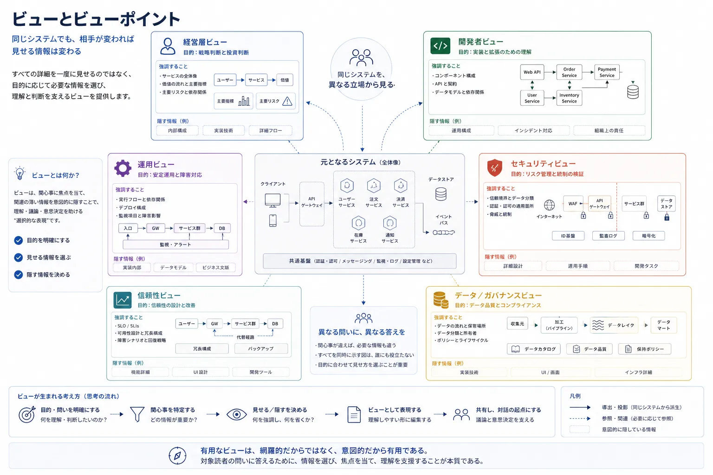
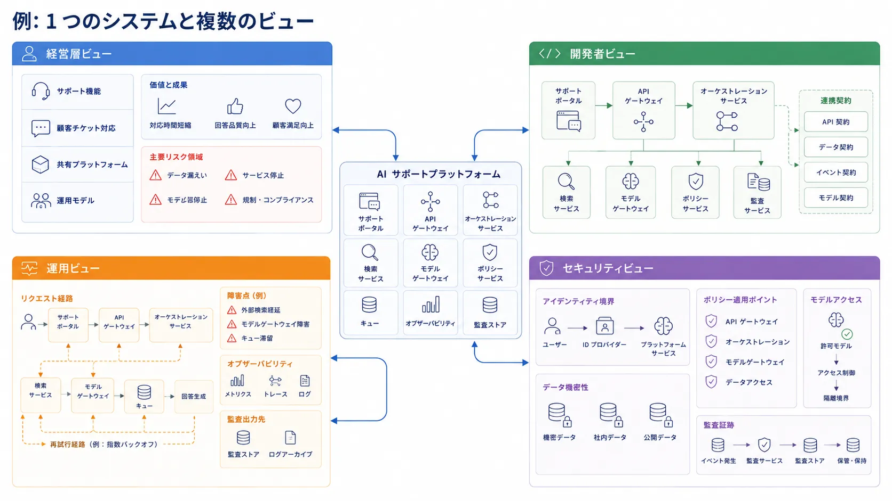

チームが 1 枚の図ですべての関係者を満足させられると思い込むと、アーキテクチャの伝達は失敗します。
経営層、開発者、運用担当者、セキュリティレビュー担当者は、同じ詳細度も同じ切り口も必要としていません。
ビューとビューポイントは、その違いを意図的に扱うためにあります。

## 定義

アーキテクチャビューとは、特定の対象読者と目的のために、選び取られたシステム上の関心事を表現したものです。
ビューポイントとは、そのビューを構成するために使う見方や慣例です。

ビューは成果物です。
ビューポイントは、その背後にある論理です。

## なぜビューが必要か

関係者ごとに、行動するために必要な情報は異なります。
信頼性レビュー担当者には、障害ドメインと回復前提が必要です。
開発者には、依存境界と統合ポイントが必要です。
経営層には、主要な能力、リスクの集中箇所、運用モデルだけで十分な場合もあります。

有用なビューは、必ず何かを隠します。
それは弱さではありません。
むしろ本質です。
ビューは、重要な関心事を選び取り、それ以外を取り除くべきです。

## ビュー、ビューポイント、図、モデル、観点

これらの用語は密接に関連しているため、実務ではしばしば混同されます。
しかし、それぞれがアーキテクチャ伝達の中で別の役割を持っています。
あるものは思考のレンズを定義し、あるものは枠組みを定義し、あるものは結果を示す成果物を定義します。

次の比較は、それぞれの役割を切り分けるためのものです。

| 用語           | 意味                           | 実務上の役割                       |
| -------------- | ------------------------------ | ---------------------------------- |
| ビュー         | 選び取られた関心事の表現       | 明確な対象読者へ何かを伝える       |
| ビューポイント | ビューを作るための枠組みや規則 | 何を含め何を強調するかを決める     |
| 図             | 視覚的な表現形式               | ビューを表す 1 つの方法            |
| モデル         | システムを構造化して表したもの | 複数ビューの元になる材料           |
| 観点           | 構造や運用のような思考レンズ   | どの関心事へ焦点を当てるかを決める |

この違いが重要なのは、チームが図そのものと、図の背後にある思考を混同しがちだからです。
図は、土台となるビューポイントと、選び取った関心事が明示されているときにだけ有用になります。

## 代表的なアーキテクチャビュー

### 経営層ビュー

経営層ビューは、通常、実装詳細よりも、業務能力、主要な依存関係、リスクの集中、運用モデルを強調します。

### 開発者ビュー

開発者ビューは、通常、サービス、モジュール、インターフェース、依存方向、統合パターンを強調します。

### プラットフォーム運用ビュー

運用ビューは、実行時責務、制御面、障害ドメイン、可観測性、回復経路へ焦点を当てます。

### セキュリティレビュー向けビュー

セキュリティビューは、信頼境界、アイデンティティフロー、ポリシー適用点、データ感度、監査の仕組みを強調します。

### 信頼性レビュー向けビュー

信頼性ビューは、依存関係、冗長性、負荷経路、性能劣化時の振る舞い、運用制約を強調します。

### データまたは統合ビュー

データまたは統合ビューは、契約、パイプライン、リネージ、変換点、イベントフロー、利用者との関係へ焦点を当てます。

### ガバナンスビュー

ガバナンスビューは、オーナーシップ、承認経路、ポリシー統制点、準拠性の証跡、レビュー責務を強調します。

## 有用なビューの作り方

有用なビューは、通常、単純な順序で組み立てられます。

1. 対象読者とその関心事から始める。
2. 関連するアーキテクチャ観点を選ぶ。
3. 適切な抽象度を選ぶ。
4. 判断または理解に必要な文脈だけを含める。
5. 目的から注意をそらす詳細を除く。

たとえば、プラットフォーム運用ビューでは、運用の観点と責任分担の観点を併用するかもしれません。
セキュリティレビュー向けビューでは、構造、運用、ポリシーの関心事を組み合わせるかもしれません。
価値が生まれるのは、対象読者と問いを明示することです。

## 例: 1 つのシステムに複数のビュー

複数の対象読者へ説明しなければならない 1 つの AI サポート基盤を考えてみます。

経営層ビューは、サポート能力、共有基盤、運用モデル、主要リスク領域に焦点を当てるかもしれません。
開発者ビューは、サポートポータル、API ゲートウェイ、オーケストレーションサービス、検索サービス、モデルゲートウェイ、統合契約を示すかもしれません。
運用ビューは、リクエスト経路、キュー、可観測性、再試行経路、障害点、監査の集約先に焦点を当てるかもしれません。
セキュリティビューは、アイデンティティ境界、データ感度、ポリシー適用、モデルアクセス、監査証跡を強調するかもしれません。

これらはすべて同じ基盤を記述していますが、それぞれ異なる詳細を選び、別の詳細を意図的に省きます。
そこにビューの意味があります。
ビューは、アーキテクチャを劣化させた短縮版ではなく、特定の対象読者のために形づくられた意図的な表現です。

これらのどれも、それ単体で完全なアーキテクチャではありません。
それぞれが、特定の目的のために投影された同一システムの一面です。

## よくある誤り

**巨大な 1 枚図を作ること。** すべての対象読者を 1 つの成果物で満たそうとすると、詳細すぎる読者にも曖昧すぎる読者にも中途半端な図になりがちです。

**正確さと網羅性を混同すること。** すべてを示さなくても、ビューは正確であり得ます。
良いアーキテクチャ伝達は、積み上げではなく選択に依存します。

**実装図をそのまま経営層向け説明へ流用すること。** 実装詳細は、意思決定層の議論にとって適切な抽象度ではないことが多くあります。
ビューは対象読者が形づくるべきです。

**対象読者と目的を省くこと。** ビューに想定読者や問いがなければ、そのビューが成功しているかを判断しにくくなります。

## 要約

ビューとビューポイントは、アーキテクチャ思考を使える伝達へ変えるための仕組みです。
適切な対象読者に対して、適切な詳細度を選び、すべてを均等に説明する万能図という誤った目標を避ける助けになります。
