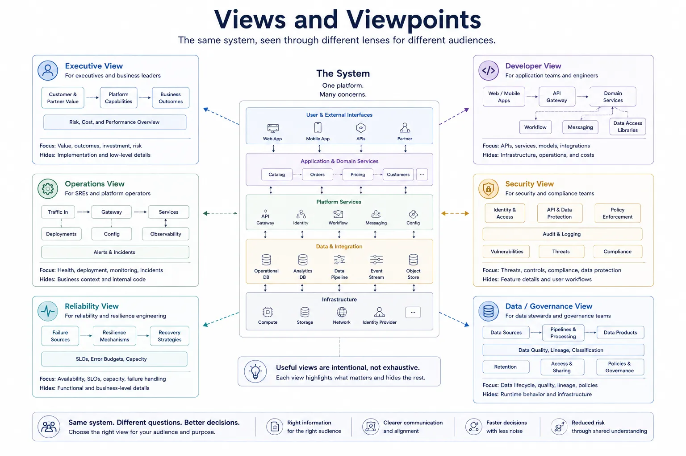

Architecture communication fails when teams assume one diagram can satisfy every stakeholder. Executives, developers, operators, and security reviewers do not need the same level of detail or the same framing. Views and viewpoints exist to make that difference intentional.

## Definition

An architecture view is a representation of selected system concerns for a specific audience and purpose. A viewpoint is the framing or convention used to construct that view.

The view is the artifact. The viewpoint is the logic behind it.

## Why Views Exist

Different stakeholders need different information to act effectively. A reliability reviewer needs failure domains and recovery assumptions. A developer needs dependency boundaries and integration points. An executive may only need the major capabilities, risk concentrations, and operating model.

Every useful view hides detail. That is not a weakness. It is the whole point. A view should select the concerns that matter and remove the rest.

## Views, Viewpoints, Diagrams, Models, and Dimensions

These terms are closely related, which is why teams often blur them in practice. The problem is that each term describes a different role in architecture communication: some define the reasoning lens, some define the framing, and some define the artifact used to present the result.

The comparison below separates those roles so the documentation process stays deliberate rather than accidental.

| Term      | Meaning                                            | Practical role                               |
| --------- | -------------------------------------------------- | -------------------------------------------- |
| View      | A representation of selected concerns              | Communicates something to a defined audience |
| Viewpoint | The framing rules used to create a view            | Determines what is included and emphasized   |
| Diagram   | A visual rendering                                 | One possible format for a view               |
| Model     | A structured representation of the system          | Provides source material for several views   |
| Dimension | A reasoning lens such as structural or operational | Helps decide which concerns to focus on      |

This distinction matters because teams often confuse the picture with the reasoning behind the picture. A diagram is only useful if the underlying viewpoint and selected concerns are explicit.

## Common Architecture Views

### Executive View

An executive view usually emphasizes business capabilities, major dependencies, risk concentration, and operating model rather than implementation detail.

### Developer View

A developer view usually emphasizes services, modules, interfaces, dependency direction, and integration patterns.

### Platform Operations View

An operations view focuses on runtime responsibilities, control surfaces, failure domains, observability, and recovery paths.

### Security Review View

A security view highlights trust boundaries, identity flows, policy enforcement points, data sensitivity, and audit mechanisms.

### Reliability Review View

A reliability view emphasizes dependencies, redundancy, load paths, degraded modes, and operational constraints.

### Data or Integration View

A data or integration view focuses on contracts, pipelines, lineage, transformation points, event flows, and consumer relationships.

### Governance View

A governance view highlights ownership, approval paths, policy control points, compliance evidence, and review responsibilities.

## Building a Useful View

Useful views usually follow a simple sequence:

1. Start with the stakeholder and their concern.
2. Choose the relevant architecture dimensions.
3. Select the right level of abstraction.
4. Include enough context to support a decision or understanding.
5. Exclude detail that distracts from the purpose.

For example, a platform operations view may use operational and ownership dimensions together. A security review view may combine structural, operational, and policy concerns. The value comes from being explicit about the intended audience and question.

## Example: One System, Several Views

Consider the same enterprise AI platform described in several ways.

An executive view may show shared capabilities, policy guardrails, and the relationship between product teams and the platform team. A developer view may show service boundaries, orchestration components, and integration contracts. An operations view may focus on control and data paths, queues, audit signals, and failure concentration. A security view may focus on identity boundaries, privileged tools, data classifications, and policy checkpoints.

None of these views is the full architecture by itself. Each is a deliberate projection of the same system for a specific purpose.

An image should appear here showing multiple audience-specific views derived from the same system.

## Common Mistakes

**Creating One Giant Diagram.** Trying to satisfy every audience with one artifact usually creates a diagram that is too detailed for some readers and too vague for others.

**Confusing Accuracy with Completeness.** A view can be accurate without showing everything. Good architecture communication depends on selection, not accumulation.

**Reusing an Implementation Diagram for Executive Alignment.** Implementation detail is often the wrong level of abstraction for leadership discussions. The audience should shape the view.

**Omitting Audience and Purpose.** If a view has no named audience or question, it becomes difficult to judge whether it is successful.

## Summary

Views and viewpoints are how architecture reasoning becomes usable communication. They help teams choose the right level of detail for the right audience and avoid the false goal of one master architecture diagram that explains everything equally well.
