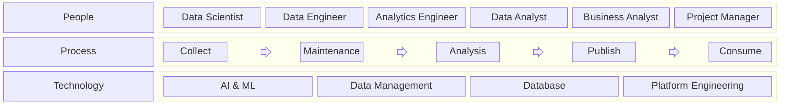

+++
date = '2025-05-06T20:17:09+09:00'
title = 'Data & Analytics'
+++

Data analytics is a series of activities that involve recognizing patterns in data, uncovering insights from the past to
the future, and connecting them to actions using quantitative outcomes. It encompasses everything from collecting,
organizing, and storing data to analyzing it, publishing the results, and applying them.

An organization’s effectiveness is built upon three foundational pillars: People, Processes, and Technology.

**People**

- Teams and Roles - ex. Data Scientist, Data Engineer, Data Analyst
- Maturity Model

**Process**

- Collect - Collect data sets by systematically and manually.
- Maintenance - Organize and maintain data sets on a data platform.
- Analysis - Analyze data sets for specific business cases or exploration.
- Publish - Publish data sets via APIs, dashboards, notebooks, or classic reports.
- Consume - Consume data sets for business operations and applications.

**Technology**

- AI and Machine Learning
- Data Management
- Database
- Platform Engineering

