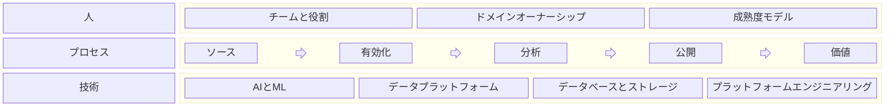

+++
date = '2026-02-19T21:00:00+09:00'
title = 'データ'
weight = 1
+++

データ（Data）とは、現実世界またはシステムが生成する事象を構造化または非構造化で表現し、処理・分析・共有・統制のために永続的に保存されたものです。
本セクションでは、スケーラブルで信頼性が高く、コンプライアンスに適合したデータシステムを実現するための原則、アーキテクチャ、実践、運用モデルを整理します。
取得からエンジニアリング、分析、ガバナンス、セキュリティ、価値創出に至るまで、データのライフサイクル全体を扱い、**戦略的資産としてのデータ**を管理するための指針を示します。

データは次のレイヤー構造として捉えられます。

- **価値創出層** – 分析と共有
- **基盤実装層** – エンジニアリング、アーキテクチャ、メタデータ
- **データ取得層** – データ収集
- **統制層** – ガバナンス、セキュリティ、プライバシー

これらのレイヤーは、価値創出とリスク統制のバランスをとる一貫した運用モデルを形成します。

**基本原則**

- データをプロダクトとして、かつインフラとして扱う
- スケーラビリティと自動化を前提に設計する
- ガバナンスとセキュリティを設計段階から組み込む
- メタデータによる発見性を高める
- 技術アーキテクチャを事業価値と整合させる

## 1. 価値創出層

価値創出層（Value Layer）は、管理されたデータを測定可能なビジネス成果へと変換します。
洞察の生成、意思決定の支援、価値交換を主眼とし、内部・外部の双方での活用を促進します。

### データ分析

データ分析（Data Analytics）は、構造化・非構造化データを実行可能な知見へと変換します。

- **可視化とレポーティング** – インタラクティブなダッシュボード、標準化されたレポート、KPI監視による状況把握
- **意思決定支援システム** – 分析モデルやシナリオシミュレーションによる運用・戦略判断の支援
- **洞察生成** – 探索的分析、仮説検証、パターン発見による隠れた関係性の発掘
- **分類と予測** – セグメンテーション、予測、異常検知、最適化のための機械学習モデル
- **セルフサービス分析の有効化** – セマンティック層と統制されたデータアクセスにより業務利用者を支援
- **パフォーマンスと効果測定** – 成果を閉ループで評価し、モデルと戦略を継続的に改善

**目的:** 不確実性の低減、意思決定の迅速化、成果の定量的改善。

### データ共有

データ共有（Data Sharing）は、組織内外の境界を越えてデータ資産を統制された形で流通・収益化する取り組みです。

- **データ交換メカニズム** – API、ストリーミング、バッチ出力による構造化データの配布
- **データマーケットプレイス** – 発見性、アクセス統制、価値創出を支える内外プラットフォーム
- **データクリーンルーム** – 機密性の高い生データを公開せずに共同分析を可能にする環境
- **外部連携モデル** – パートナーエコシステム、フェデレーテッド分析、組織横断のデータプロダクト
- **利用ガバナンスとライセンス** – 契約管理、利用追跡、ポリシー執行
- **価値実現と収益化** – 信頼された共有を通じた収益創出、コスト最適化、エコシステム拡張

**目的:** 信頼、コンプライアンス、統制を維持しつつ、内部分析を越えてデータ価値を拡張する。

## 2. 基盤実装層

基盤実装層（Enablement Layer）は、スケーラブルで信頼性が高く、進化可能なデータシステムを構築するための技術的・組織的基盤を提供します。
データが生産され、統制され、発見され、消費されるまでの流れをドメイン横断で効率化します。

### データエンジニアリング

データエンジニアリング（Data Engineering）は、データフローを運用可能な形にし、パイプラインの信頼性・スケール・可観測性を担保します。

- **ワークフローオーケストレーション** – スケジューリング、依存関係管理、イベント駆動によるバッチ・ストリーミング実行
- **プラットフォームエンジニアリング** – 再利用可能なデータプラットフォーム、共通サービス、標準ツールの開発
- **インフラ管理** – 計算資源、ストレージ、ネットワーク、クラウドリソースのプロビジョニングと耐障害性
- **パイプラインの信頼性と可観測性** – 監視、アラート、SLA管理、障害復旧
- **データ変換と処理** – ETL/ELT設計、ストリーム処理、ワークロード最適化
- **CI/CDと自動化** – インフラのコード化とデータパイプラインの自動デプロイ

**目的:** 予測可能な性能と運用安定性を備えた本番品質のデータシステムを提供する。

### データアーキテクチャ

データアーキテクチャ（Data Architecture）は、データの配置・配布・境界を定める構造設計の原則を定義します。

- **プラットフォームとストレージ設計** – レイクハウス、ウェアハウス、ハイブリッド、マルチクラウドを用途に合わせて設計
- **データメッシュとドメイン指向設計** – 連邦的な所有モデルと分散型ドメイン責任
- **データプロダクト** – データセットに対するプロダクト指向の設計、所有、SLA、ライフサイクル管理
- **データモデルとドメインモデル** – 概念・論理・物理モデルによる意味整合性の確保
- **相互運用性と統合パターン** – 標準化されたインターフェースとデータ契約
- **スケーラビリティと進化戦略** – 成長と変化に耐えるアーキテクチャパターン

**目的:** 技術システムと組織設計を整合させる構造的ブループリントを提供する。

### データマネジメント

データマネジメント（Data Management）は、データの信頼性、利用性、持続性を長期にわたり維持します。

- **データ品質管理** – 検証ルール、プロファイリング、異常検知、継続的な品質監視
- **データアクセス性** – ロールベースアクセス、発見性、統制されたセルフサービス
- **マスターデータ管理**（Master Data Management） – システム横断の正規エンティティ、エンティティ解決とマッチング、参照データ管理
- **ライフサイクル管理** – 保持ポリシー、アーカイブ戦略、計画的なデータ廃止
- **運用持続性** – コスト最適化、容量計画、長期保守性
- **標準化と文書化** – 命名規約、データ標準、共通定義
- **サービスレベル管理** – 可用性、鮮度、信頼性のコミット

**目的:** 高い信頼性、利用性、運用効率を維持する。

### メタデータ

メタデータ（Metadata）はデータエコシステムの接着剤として機能し、透明性・自動化・スケールを可能にします。

- **発見と自動化** – 検索可能なカタログ、自動分類、インテリジェントな推薦
- **リネージと可観測性** – データフローの端から端までの追跡と影響分析
- **セマンティック層** – 業務に整合した定義、指標の標準化、物理ストレージからの抽象化
- **アクティブメタデータ** – リアルタイムのポリシー執行、自動品質チェック、イベント駆動最適化
- **データ契約とスキーマ統制** – バージョニングと互換性管理
- **影響・依存関係分析** – 変更管理を支えるメタデータ駆動の洞察

**目的:** メタデータを静的文書から、運用の統制面（コントロールプレーン）へと進化させる。

## 3. データ取得層

データ取得層（Source Layer）は、データがエコシステムに入る起点を定めます。
内部システム、外部パートナー、デバイス、公開ソースからの取得方法を統制し、取り込みの瞬間から真正性・完全性・トレーサビリティを確保します。
この層は外部の現実と内部プラットフォームの境界を定義し、下流の処理と価値創出の基盤を形成します。

### ランディングゾーン

- **生データ取り込みストレージ** – 受領データを元の形式で不変に保持
- **スキーマと形式の検証** – 到着時点での構造チェックと基本的な整合性検証
- **データ分離とアクセス統制** – 権限で隔離された環境
- **初期メタデータ取得** – ソース、タイムスタンプ、リネージ、取り込み文脈の記録

### データ収集

- **ソース統合** – API、データベース、ストリーミング、サードパーティフィード、CDC（Change Data Capture）
- **自動抽出** – スケジュール取得、バッチ取り込み、イベント駆動キャプチャ
- **オープンデータと外部取得** – 公開データセット、パートナーデータ、ライセンスデータ
- **同意とコンプライアンス対応** – 法的根拠の追跡、利用制限、ポリシー整合

## 4. 統制層

統制層（Control Layer）は、ガバナンス、セキュリティ、プライバシー、コンプライアンスをライフサイクル全体に組み込み、データエコシステムを保護します。
価値創出とリスク管理、規制適合、説明責任のバランスを確保し、制約ではなく信頼の基盤として機能します。

### データガバナンス

- **ポリシー枠組みと執行** – データポリシーの定義、運用化、自動執行
- **規制・コンプライアンス管理** – 法令、業界標準、契約要件への適合
- **役割、オーナーシップ、スチュワードシップ** – データドメインと資産の明確な責任分界
- **監査可能性と統制監視** – トレーサビリティ、レポーティング、継続的な適合確認

### データセキュリティとプライバシー

- **リスク評価と脅威管理** – データ関連リスクの特定、評価、低減
- **機微データ保護** – 分類、暗号化、マスキング、安全な取り扱い
- **個人データガバナンス** – 同意管理、適法処理、データ主体の権利対応
- **アクセス制御と継続監視** – IDベースのアクセス、ログ、異常検知、インシデント対応

## 運用モデル: PPT

組織のデータ活用力は、**人・プロセス・技術**という三つの基盤に支えられます（People, Processes, Technology）。
アーキテクチャが構造を定め、ガバナンスが統制を担う一方で、持続的な成果はこの三要素が統合的に機能する運用モデルに依存します。

### 人

人（People）は、データエコシステムにおける所有、説明責任、能力成熟度を規定します。
明確な役割、ドメイン責任、スキル開発が運用卓越性の鍵となります。

- **チームと役割** – データエンジニア、データサイエンティスト、データアナリスト、データアーキテクト、データスチュワード、プラットフォームエンジニアなどの責務
- **ドメインオーナーシップ** – データプロダクトとデータドメインの明確な責任
- **協業モデル** – 事業、エンジニアリング、コンプライアンス、セキュリティの横断連携
- **成熟度モデル** – アドホックからプロダクト指向・自動化・フェデレーテッド運用への段階的進化
- **能力開発** – 分析、エンジニアリング、ガバナンス、AIの継続的なスキル向上

**目的:** 明確なオーナーシップを確立し、組織能力を継続的に進化させる。

### プロセス

プロセス（Process）は、データが生成から価値実現に至るまで組織内を流れる方法を定義します。
ソース、基盤実装、価値創出、統制の各層にわたるライフサイクルを運用化します。
**DataOps** は、データエンジニアリングと分析の運用を規定するデリバリ手法であり、DevOpsの原則をデータライフサイクルに適用して信頼性と速度を高めます。

- **ソース** – 内部システム、外部パートナー、API、公開ソースからデータを体系的・手動的に収集
- **有効化** – ガバナンスされたデータ基盤での整理、検証、変換、保守
- **分析** – 具体的なビジネス用途や探索的発見のための分析・モデリング
- **公開** – API、ダッシュボード、ノートブック、データプロダクト、正式レポートで提供
- **価値** – 業務オペレーション、意思決定プロセス、デジタルアプリケーションへの統合
- **監視と改善** – 利用、品質、性能、成果を継続的に観測し改善

**目的:** 再現性、可観測性、スケール性のあるデータライフサイクルを構築する。

### 技術

技術（Technology）は、データ能力を効率的かつ安全にスケールさせるための基盤と自動化を提供します。

- **AIと機械学習** – 予測モデリング、分類、最適化、インテリジェント自動化
- **データマネジメントプラットフォーム** – カタログ、品質フレームワーク、ガバナンスツール、セマンティック層
- **データベースとストレージ** – ウェアハウス、レイクハウス、トランザクションシステム、分散ストレージ
- **プラットフォームエンジニアリング** – クラウド基盤、オーケストレーション、CI/CD、可観測性、自動化
- **セキュリティとプライバシー技術** – 暗号化、ID管理、監視、ポリシー執行

**目的:** 堅牢な技術基盤によって信頼性、スケーラビリティ、自動化、イノベーションを実現する。

### 統合的な見取り図

- 人は所有と専門性を提供します。
- プロセスは再現性と規律を担保します。
- 技術はスケールと自動化を実現します。

これら三つの柱が整合して初めて、データは戦略的資産として機能し、価値創出と同時に信頼性、回復力、コンプライアンスを維持できます。

