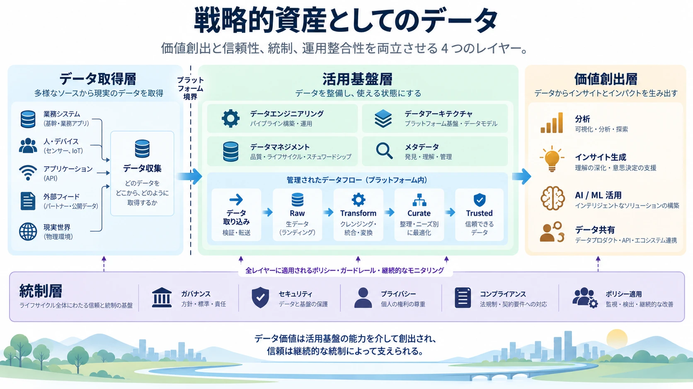
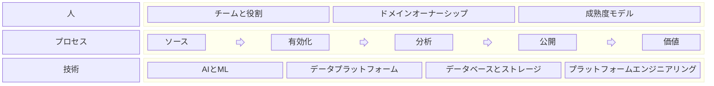

データ（Data）とは、現実世界またはシステムが生成する事象を構造化または非構造化で表現し、処理・分析・共有・統制のために永続的に保存されたものです。
本セクションでは、スケーラブルで信頼性が高く、コンプライアンスに適合したデータシステムを実現するための原則、アーキテクチャ、実践、運用モデルを整理します。
取得からエンジニアリング、分析、ガバナンス、セキュリティ、価値創出に至るまで、データのライフサイクル全体を扱い、**戦略的資産としてのデータ**を管理するための指針を示します。

データは次のレイヤー構造として捉えられます。

- **価値創出層** – 分析と共有
- **活用基盤層** – エンジニアリング、アーキテクチャ、メタデータ
- **データ取得層** – データ収集
- **統制層** – ガバナンス、セキュリティ、プライバシー

これらのレイヤーは、価値創出とリスク統制のバランスをとる一貫した運用モデルを形成します。

**基本原則**

- データをプロダクトとして、かつインフラとして扱う
- スケーラビリティと自動化を前提に設計する
- ガバナンスとセキュリティを設計段階から組み込む
- メタデータによる発見性を高める
- 技術アーキテクチャを事業価値と整合させる

## データ領域のトピック

データ領域の全体像から、個別の能力や運用上の論点へ進むためのページです。














## 1. 価値創出層

価値創出層（Value Layer）は、管理されたデータを測定可能なビジネス成果へと変換します。
洞察の生成、意思決定の支援、価値交換を主眼とし、内部・外部の双方での活用を促進します。

### データ分析

データ分析（Data Analytics）は、構造化・非構造化データを実行可能な知見へと変換します。

- **可視化とレポーティング** – インタラクティブなダッシュボード、標準化されたレポート、KPI監視による状況把握
- **洞察生成** – 探索的分析、要因分解、仮説検証、根本原因の調査による観測結果の説明
- **分類と予測** – セグメンテーション、予測、異常検知、リスク推定のための統計モデルと機械学習モデル
- **意思決定支援システム** – 分析モデル、シナリオシミュレーション、最適化による行動の推奨と運用・戦略判断の支援
- **パフォーマンスと効果測定** – 成果を閉ループで評価し、モデルと戦略を継続的に改善

**目的:** 不確実性の低減、意思決定の迅速化、成果の定量的改善。

### データ共有

データ共有（Data Sharing）は、組織内外の境界を越えてデータ資産を統制された形で流通・収益化する取り組みです。

- **データ交換メカニズム** – API、ストリーミング、バッチ出力による構造化データの配布
- **データマーケットプレイス** – 発見性、アクセス統制、価値創出を支える内外プラットフォーム
- **データクリーンルーム** – 機密性の高い生データを公開せずに共同分析を可能にする環境
- **外部連携モデル** – パートナーエコシステム、フェデレーテッド分析、組織横断のデータプロダクト
- **利用ガバナンスとライセンス** – 契約管理、利用追跡、ポリシー執行
- **価値実現と収益化** – 信頼された共有を通じた収益創出、コスト最適化、エコシステム拡張

**目的:** 信頼、コンプライアンス、統制を維持しつつ、内部分析を越えてデータ価値を拡張する。

## 2. 活用基盤層

活用基盤層（Enablement Layer）は、スケーラブルで信頼性が高く、進化可能なデータシステムを構築するための技術的・組織的基盤を提供します。
データが生産され、統制され、発見され、消費されるまでの流れをドメイン横断で効率化します。

### データエンジニアリング

データエンジニアリング（Data Engineering）は、データフローを運用可能な形にし、パイプラインの信頼性・スケール・可観測性を担保します。

- **ワークフローオーケストレーション** – スケジューリング、依存関係管理、イベント駆動によるバッチ・ストリーミング実行
- **プラットフォームエンジニアリング** – 再利用可能なデータプラットフォーム、共通サービス、標準ツールの開発
- **インフラ管理** – 計算資源、ストレージ、ネットワーク、クラウドリソースのプロビジョニングと耐障害性
- **パイプラインの信頼性と可観測性** – 監視、アラート、SLA管理、障害復旧
- **データ変換と処理** – ETL/ELT設計、ストリーム処理、ワークロード最適化
- **CI/CDと自動化** – インフラのコード化とデータパイプラインの自動デプロイ

**目的:** 予測可能な性能と運用安定性を備えた本番品質のデータシステムを提供する。

### データアーキテクチャ

データアーキテクチャ（Data Architecture）は、データの配置・配布・境界を定める構造設計の原則を定義します。

- **プラットフォームとストレージ設計** – レイクハウス、ウェアハウス、ハイブリッド、マルチクラウドを用途に合わせて設計
- **データメッシュとドメイン指向設計** – 連邦的な所有モデルと分散型ドメイン責任
- **データプロダクト** – データセットに対するプロダクト指向の設計、所有、SLA、ライフサイクル管理
- **データモデルとドメインモデル** – 概念・論理・物理モデルによる意味整合性の確保
- **相互運用性と統合パターン** – 標準化されたインターフェースとデータ契約
- **分析利用アーキテクチャ** – セマンティック層、統制されたデータアクセス、再利用可能な分析インターフェースによるセルフサービス分析の実現
- **スケーラビリティと進化戦略** – 成長と変化に耐えるアーキテクチャパターン

**目的:** 技術システムと組織設計を整合させる構造的ブループリントを提供する。

### データマネジメント

データマネジメント（Data Management）は、データの信頼性、利用性、持続性を長期にわたり維持します。

- **データ品質管理** – 検証ルール、プロファイリング、異常検知、継続的な品質監視
- **データアクセス性** – ロールベースアクセス、発見性、統制されたセルフサービス
- **マスタデータ管理**（Master Data Management） – システム横断の正規エンティティ、エンティティ解決とマッチング、参照データ管理
- **ライフサイクル管理** – 保持ポリシー、アーカイブ戦略、計画的なデータ廃止
- **運用持続性** – コスト最適化、容量計画、長期保守性
- **標準化と文書化** – 命名規約、データ標準、共通定義
- **サービスレベル管理** – 可用性、鮮度、信頼性のコミット

**目的:** 高い信頼性、利用性、運用効率を維持する。

### メタデータ

メタデータ（Metadata）はデータエコシステムの接着剤として機能し、透明性・自動化・スケールを可能にします。

- **発見と自動化** – 検索可能なカタログ、自動分類、インテリジェントな推薦
- **リネージと可観測性** – データフローの端から端までの追跡と影響分析
- **セマンティック層** – 業務に整合した定義、指標の標準化、物理ストレージからの抽象化
- **アクティブメタデータ** – リアルタイムのポリシー執行、自動品質チェック、イベント駆動最適化
- **データ契約とスキーマ統制** – バージョニングと互換性管理
- **影響・依存関係分析** – 変更管理を支えるメタデータ駆動の洞察

**目的:** メタデータを静的文書から、運用の統制面（コントロールプレーン）へと進化させる。

## 3. データ取得層

データ取得層（Source Layer）は、運用システム、アプリケーション、人、デバイス、パートナー、外部提供元のどこでデータが生まれ、どのように取得されるかを表します。
取得時点の来歴と、必要に応じて同意や法的根拠を明確にし、エンジニアリングの仕組みがデータを管理対象のプラットフォームへ移す前段を扱います。
これはソース境界を捉えるライフサイクル上の見方であり、収集とプラットフォームへの移動を必ず別の物理システムに分けるという意味ではありません。

### データ収集

データ収集の中心となる問いは、**データはどこから来て、どのように取得されるか**です。

- **運用システムとアプリケーション** – 業務システム、アプリケーションが生成する記録、API などの提供側インターフェース
- **デバイスと人による入力** – センサー、テレメトリ生成、アプリケーション計測、調査、フォーム、手作業による収集
- **外部からの取得** – パートナーフィード、外部提供ファイル、公開データセット、ライセンスデータ
- **取得時の文脈** – 来歴、必要に応じた同意や法的根拠、利用制限、ソースの所有者

データが生成または収集された後は、 [データ取り込み](/ja/docs/data/engineering/ingestion/) がプラットフォーム境界を越えて、永続的な管理対象状態へ確実に移します。CDC、増分読み取り、再試行、チェックポイント、リプレイ、配信保証は、データ収集ではなく取り込みの仕組みです。

### ランディングゾーン

ランディングゾーンはソース境界の近くにありますが、一般にはすでに管理対象のデータプラットフォームの一部です。ソースや収集手段ではなく、 [データ取り込み](/ja/docs/data/engineering/ingestion/) によって作られる永続的な到着地点です。ストレージを状態や責務ごとに分けるゾーニングでは、到着時の生データを後続の処理済み・整備済みデータから分離します。

- **生データ取り込みストレージ** – 受領データを元の形式で不変に保持
- **スキーマと形式の検証** – 到着時点での構造チェックと基本的な整合性検証
- **データ分離とアクセス統制** – 権限で隔離された環境
- **初期メタデータ取得** – ソース、タイムスタンプ、リネージ、取り込み文脈の記録

## 4. 統制層

統制層（Control Layer）は、ガバナンス、セキュリティ、プライバシー、コンプライアンスをライフサイクル全体に組み込み、データエコシステムを保護します。
価値創出とリスク管理、規制適合、説明責任のバランスを確保し、制約ではなく信頼の基盤として機能します。

### [データガバナンス](/ja/docs/data/governance/)

ガバナンスは期待事項と説明責任を定め、 [データマネジメント](/ja/docs/data/management/) はそれらを満たす継続的な業務を実行します。 [メタデータ](/ja/docs/data/metadata/) は、ポリシー、資産、管理策、証跡を結ぶ文脈とシグナルを提供します。

- **ポリシー枠組みと執行** – データポリシーの定義、運用化、自動執行
- **規制・コンプライアンス管理** – 法令、業界標準、契約要件への適合
- **役割、オーナーシップ、スチュワードシップ** – データドメインと資産の明確な責任分界
- **監査可能性と統制監視** – トレーサビリティ、レポーティング、継続的な適合確認

### [データセキュリティ](/ja/docs/data/security/)

データセキュリティは、システムの境界とライフサイクルの各状態にわたり、不正な開示、不適切な変更、損失、停止から情報を守ります。

- **脅威と露出の評価** – 資産、コピー、境界、開示・完全性・可用性への脅威の特定
- **保護と取り扱いの統制** – 分類、暗号化、マスキング、トークン化、安全な転送と保存
- **損失防止と監視** – 持ち出し制限、アクセステレメトリ、異常検知、抽出シグナル
- **対応と復旧** – 封じ込め、認証情報と鍵のローテーション、完全性確認、復元

### [データプライバシー](/ja/docs/data/privacy/)

- **適切な処理** – 目的限定、最小化、透明性、人に関する情報の正当な利用
- **個人データの概念** – 識別可能性、機微性、推論、文脈依存のリスク
- **個人の利益** – 適切な場合の同意、参加、権利、期待
- **設計段階からのプライバシー** – 責任ある処理、保持、削除をデータフローへ組み込む

ガバナンス、セキュリティ、プライバシーは重なりますが、独立した兄弟領域です。ガバナンスは所有、ポリシー、意思決定権、証跡を定めます。セキュリティは侵害と損失からデータを守ります。プライバシーは人に関する情報の処理が適切かを判断します。

## 運用モデル: PPT

組織のデータ活用力は、**人・プロセス・技術**という三つの基盤に支えられます（People, Processes, Technology）。
アーキテクチャが構造を定め、ガバナンスが統制を担う一方で、持続的な成果はこの三要素が統合的に機能する運用モデルに依存します。

### 人

人（People）は、データエコシステムにおける所有、説明責任、能力成熟度を規定します。
明確な役割、ドメイン責任、スキル開発が運用卓越性の鍵となります。

- **チームと役割** – データエンジニア、データサイエンティスト、データアナリスト、データアーキテクト、データスチュワード、プラットフォームエンジニアなどの責務
- **ドメインオーナーシップ** – データプロダクトとデータドメインの明確な責任
- **協業モデル** – 事業、エンジニアリング、コンプライアンス、セキュリティの横断連携
- **成熟度モデル** – アドホックからプロダクト指向・自動化・フェデレーテッド運用への段階的進化
- **能力開発** – 分析、エンジニアリング、ガバナンス、AIの継続的なスキル向上

**目的:** 明確なオーナーシップを確立し、組織能力を継続的に進化させる。

### プロセス

プロセス（Process）は、データが生成から価値実現に至るまで組織内を流れる方法を定義します。
データ取得層、活用基盤層、価値創出層、統制層の各層にわたるライフサイクルを運用化します。
**DataOps** は、データエンジニアリングと分析の運用を規定するデリバリ手法であり、DevOpsの原則をデータライフサイクルに適用して信頼性と速度を高めます。

- **ソース** – 内部システム、外部パートナー、API、公開ソースからデータを体系的・手動的に収集
- **有効化** – ガバナンスされたデータ基盤での整理、検証、変換、保守
- **分析** – 具体的なビジネス用途や探索的発見のための分析・モデリング
- **公開** – API、ダッシュボード、ノートブック、データプロダクト、正式レポートで提供
- **価値** – 業務オペレーション、意思決定プロセス、デジタルアプリケーションへの統合
- **監視と改善** – 利用、品質、性能、成果を継続的に観測し改善

**目的:** 再現性、可観測性、スケール性のあるデータライフサイクルを構築する。

### 技術

技術（Technology）は、データ能力を効率的かつ安全にスケールさせるための基盤と自動化を提供します。

- **AIと機械学習** – 予測モデリング、分類、最適化、インテリジェント自動化
- **データマネジメントプラットフォーム** – カタログ、品質フレームワーク、ガバナンスツール、セマンティック層
- **データベースとストレージ** – ウェアハウス、レイクハウス、トランザクションシステム、分散ストレージ
- **プラットフォームエンジニアリング** – クラウド基盤、オーケストレーション、CI/CD、可観測性、自動化
- **セキュリティとプライバシー技術** – 暗号化、ID管理、監視、ポリシー執行

**目的:** 堅牢な技術基盤によって信頼性、スケーラビリティ、自動化、イノベーションを実現する。

### 統合的な見取り図

- 人は所有と専門性を提供します。
- プロセスは再現性と規律を担保します。
- 技術はスケールと自動化を実現します。

これら三つの柱が整合して初めて、データは戦略的資産として機能し、価値創出と同時に信頼性、回復力、コンプライアンスを維持できます。

```mermaid
block-beta
columns 5
  人
  block:Ppl:4
    Team["チームと役割"]
    Ownership["ドメインオーナーシップ"]
    Maturity["成熟度モデル"]
  end
  プロセス
  block:Pr:4
    ソース
    blockArrowId1<[" "]>(right)
    有効化
    blockArrowId2<[" "]>(right)
    分析
    blockArrowId3<[" "]>(right)
    公開
    blockArrowId4<[" "]>(right)
    価値
  end
  技術
  block:Tech:4
    AIML["AIとML"]
    DataPlatform["データプラットフォーム"]
    Database["データベースとストレージ"]
    PE["プラットフォームエンジニアリング"]
  end
```
