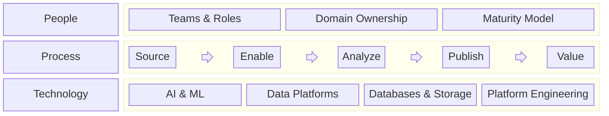

+++
date = '2026-02-18T21:00:00+09:00'
title = 'Data'
weight = 1
+++

Data is a structured or unstructured representation of real-world or system-generated phenomena, stored in a persistent form to enable processing, analysis, sharing, and control.
This section organizes principles, architectures, practices, and operational models that enable scalable, reliable, and compliant data systems.
It covers the full lifecycle of data — from acquisition and engineering to analytics, governance, security, and value realization, which is required to manage **data as a strategic asset**.

The data can be understood as a layered system:

- **Value Layer** – Analytics and sharing
- **Enablement Layer** – Engineering, architecture, metadata
- **Source Layer** – Data collection
- **Control Layer** – Governance, security, privacy

Together, these layers establish a coherent operating model that balances value creation with risk control.

**Guiding Principles**

- Treat data as a product and as infrastructure
- Design for scalability and automation
- Embed governance and security by design
- Enable discoverability through metadata
- Align technical architecture with business value

## 1. Value Layer

The Value Layer transforms managed data into measurable business impact.
It focuses on insight generation, decision enablement, and value exchange — internally and externally.

### Data Analytics

Data Analytics converts structured and unstructured data into actionable intelligence.

- **Visualization & Reporting** – Interactive dashboards, standardized reporting, and KPI monitoring to provide situational awareness
- **Decision Support Systems** – Analytical models and scenario simulations that inform operational and strategic decisions
- **Insight Generation** – Exploratory analysis, hypothesis testing, and pattern discovery to uncover hidden relationships
- **Classification & Prediction** – Machine learning models for segmentation, forecasting, anomaly detection, and optimization
- **Self-Service Analytics Enablement** – Semantic layers and governed data access to empower business users
- **Performance & Impact Measurement** – Closed-loop evaluation of outcomes to continuously refine models and strategies

**Objective:** Reduce uncertainty, accelerate decisions, and improve measurable outcomes.

### Data Sharing

Data Sharing enables controlled distribution and monetization of data assets across organizational and ecosystem boundaries.

- **Data Exchange Mechanisms** – APIs, streaming interfaces, and batch exports for structured data distribution
- **Data Marketplaces** – Internal and external platforms for discoverability, controlled access, and value realization
- **Data Clean Rooms** – Privacy-preserving environments for collaborative analysis without exposing raw sensitive data
- **External Collaboration Models** – Partner ecosystems, federated analytics, and cross-organization data products
- **Usage Governance & Licensing** – Contractual controls, usage tracking, and policy enforcement
- **Value Realization & Monetization** – Revenue generation, cost optimization, and ecosystem expansion through trusted sharing

**Objective:** Extend the value of data beyond internal analytics while maintaining trust, compliance, and control.

Here is an enriched and structurally aligned version of your **Enablement Layer** section, keeping a consistent capability-oriented tone with the Value Layer.

## 2. Enablement Layer

The Enablement Layer provides the technical and organizational foundations required to build scalable, reliable, and evolvable data systems.
It ensures that data can be produced, governed, discovered, and consumed efficiently across domains.

### Data Engineering

Data Engineering operationalizes data flows and ensures that pipelines are reliable, scalable, and observable.

- **Workflow Orchestration** – Scheduling, dependency management, and event-driven execution of batch and streaming pipelines
- **Platform Engineering** – Development of reusable data platforms, shared services, and standardized tooling
- **Infrastructure Management** – Compute, storage, networking, and cloud resource provisioning with scalability and resilience
- **Pipeline Reliability & Observability** – Monitoring, alerting, SLA management, and failure recovery mechanisms
- **Data Transformation & Processing** – ETL/ELT design, stream processing, and workload optimization
- **CI/CD & Automation** – Infrastructure-as-code and automated deployment of data pipelines

**Objective:** Deliver production-grade data systems with predictable performance and operational stability.

### Data Architecture

Data Architecture defines the structural design principles and system boundaries that govern how data is organized and distributed.

- **Platform & Storage Architecture** – Lakehouse, warehouse, hybrid, and multi-cloud architectures aligned with workload requirements
- **Data Mesh & Domain-Oriented Design** – Federated ownership models and decentralized data domain responsibilities
- **Data Products** – Product-oriented thinking applied to datasets, including ownership, SLAs, and lifecycle management
- **Data Models & Domain Models** – Conceptual, logical, and physical modeling to ensure semantic consistency
- **Interoperability & Integration Patterns** – Standardized interfaces and data contracts across systems
- **Scalability & Evolution Strategy** – Architectural patterns that support growth and change over time

**Objective:** Provide a coherent structural blueprint that aligns technical systems with organizational design.

### Data Management

Data Management ensures that data remains trustworthy, usable, and sustainable over time.

- **Data Quality Management** – Validation rules, profiling, anomaly detection, and continuous quality monitoring
- **Data Accessibility** – Role-based access, discoverability, and governed self-service capabilities
- **Master Data Management** (MDM) - Authoritative entities across systems and domains, entity resolution & matching, reference data management
- **Lifecycle Management** – Retention policies, archival strategies, and controlled data decommissioning
- **Operational Sustainability** – Cost optimization, capacity planning, and long-term maintainability
- **Standardization & Documentation** – Naming conventions, data standards, and shared definitions
- **Service Level Management** – Availability, freshness, and reliability commitments

**Objective:** Maintain high levels of trust, usability, and operational efficiency.

### Metadata

Metadata provides the connective tissue across the data ecosystem, enabling transparency, automation, and scale.

- **Discovery & Automation** – Searchable catalogs, automated classification, and intelligent recommendations
- **Lineage & Observability** – End-to-end traceability of data flows and impact analysis
- **Semantic Layer** – Business-aligned definitions, metrics standardization, and abstraction from physical storage
- **Active Metadata** – Real-time policy enforcement, automated quality checks, and event-driven system optimization
- **Data Contracts & Schema Governance** – Versioning and compatibility management
- **Impact & Dependency Analysis** – Change management through metadata-driven insights

**Objective:** Turn metadata from static documentation into an operational control plane for the data ecosystem.

## 3. Source Layer

The Source Layer establishes the entry point of data into the ecosystem.
It governs how data is acquired from internal systems, external partners, devices, and public sources, ensuring authenticity, integrity, and traceability from the moment of ingestion.
This layer defines the boundaries between external reality and internal data platforms, forming the foundation upon which all downstream processing and value creation depend.

### Landing Zone

- **Raw Data Ingestion Storage** – Immutable storage for incoming data in its original format
- **Schema & Format Validation** – Structural checks and basic integrity validation upon arrival
- **Data Isolation & Access Control** – Segregated environments with controlled permissions
- **Initial Metadata Capture** – Source, timestamp, lineage, and ingestion context recording

### Data Collection

- **Source Integration** – APIs, databases, streaming systems, third-party feeds, CDC (Change Data Capture)
- **Automated Extraction** – Scheduled scraping, batch ingestion, and event-driven capture
- **Open Data & External Acquisition** – Public datasets, partner data, licensed sources
- **Consent & Compliance Handling** – Legal basis tracking, usage restrictions, and policy alignment

## 4. Control Layer

The Control Layer safeguards the data ecosystem by embedding governance, security, privacy, and compliance mechanisms across all stages of the lifecycle.
It ensures that value creation is balanced with risk management, regulatory alignment, and accountability. Rather than acting as a constraint, this layer provides the trust framework that enables sustainable, scalable, and responsible data operations.

### Data Governance

- **Policy Framework & Enforcement** – Definition, operationalization, and automated enforcement of data policies
- **Regulatory & Compliance Management** – Alignment with legal, industry, and contractual requirements
- **Roles, Ownership & Stewardship** – Clear accountability models for data domains and assets
- **Auditability & Control Monitoring** – Traceability, reporting, and continuous compliance verification

### Data Security & Privacy

- **Risk Assessment & Threat Management** – Identification, evaluation, and mitigation of data-related risks
- **Sensitive Data Protection** – Classification, encryption, masking, and secure handling controls
- **Personal Data Governance** – Consent management, lawful processing, and data subject rights support
- **Access Control & Continuous Monitoring** – Identity-based access, logging, anomaly detection, and incident response

## Operating Model: PPT

An organization’s data effectiveness is built upon three foundational pillars: **People, Processes, and Technology**.
While architecture defines structure and governance defines control, sustainable impact depends on how these three dimensions work together as an integrated operating model.

### People

People define ownership, accountability, and capability maturity across the data ecosystem. Clear roles, domain responsibilities, and skill development are essential to operational excellence.

- **Teams & Roles** – Defined responsibilities across roles such as Data Engineer, Data Scientist, Data Analyst, Data Architect, Data Steward, and Platform Engineer
- **Domain Ownership** – Clear accountability for data products and data domains
- **Collaboration Model** – Cross-functional alignment between business, engineering, compliance, and security
- **Maturity Model** – Structured progression from ad-hoc data practices to product-oriented, automated, and federated data operations
- **Capability Development** – Continuous skill enhancement in analytics, engineering, governance, and AI

**Objective:** Establish clear ownership and continuously evolve organizational capability.

### Process

Processes define how data flows through the organization from creation to value realization.
They operationalize the lifecycle across Source, Enablement, Value, and Control layers.
**DataOps** is a delivery methodology which governs how data engineering and analytics operate, applying DevOps principles to data lifecycle delivery, improving reliability and speed.

- **Source** – Collect datasets systematically and manually from internal systems, external partners, APIs, and public sources
- **Enable** – Organize, validate, transform, and maintain datasets on a governed data platform
- **Analyze** – Apply analytics and modeling for specific business use cases or exploratory discovery
- **Publish** – Deliver datasets and insights via APIs, dashboards, notebooks, data products, or formal reports
- **Value** – Integrate datasets into business operations, decision processes, and digital applications
- **Monitor & Improve** – Continuously observe usage, quality, performance, and outcomes to refine processes

**Objective:** Create a repeatable, observable, and scalable data lifecycle.

### Technology

Technology provides the infrastructure and automation required to scale data capabilities efficiently and securely.

- **AI & Machine Learning** – Predictive modeling, classification, optimization, and intelligent automation
- **Data Management Platforms** – Catalogs, quality frameworks, governance tooling, and semantic layers
- **Databases & Storage Systems** – Warehouses, lakehouses, transactional systems, and distributed storage architectures
- **Platform Engineering** – Cloud infrastructure, orchestration frameworks, CI/CD pipelines, observability, and automation
- **Security & Privacy Technologies** – Encryption, identity management, monitoring, and policy enforcement systems

**Objective:** Enable reliability, scalability, automation, and innovation through a robust technical foundation.

### Integrated View

- People provide ownership and expertise.
- Processes ensure repeatability and discipline.
- Technology enables scale and automation.

Only when these three pillars are aligned can data operate as a strategic asset — delivering value while maintaining trust, resilience, and compliance.

