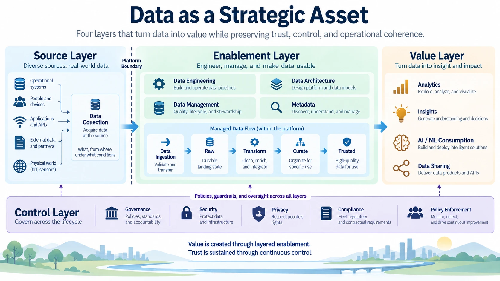
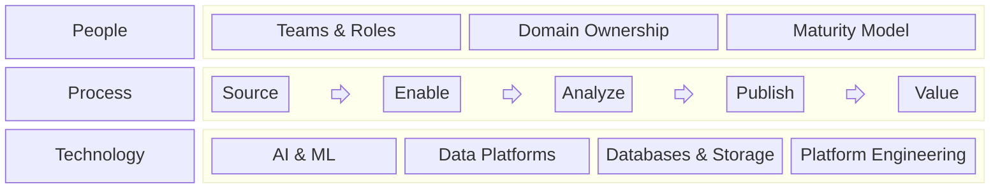

Data is a structured or unstructured representation of real-world or system-generated phenomena, stored in a persistent form to enable processing, analysis, sharing, and control.
This section organizes principles, architectures, practices, and operational models that enable scalable, reliable, and compliant data systems.
It covers the full lifecycle of data — from acquisition and engineering to analytics, governance, security, and value realization, which is required to manage **data as a strategic asset**.

The data can be understood as a layered system:

- **Value Layer** – Analytics and sharing
- **Enablement Layer** – Engineering, architecture, metadata
- **Source Layer** – Data collection
- **Control Layer** – Governance, security, privacy

Together, these layers establish a coherent operating model that balances value creation with risk control.

**Guiding Principles**

- Treat data as a product and as infrastructure
- Design for scalability and automation
- Embed governance and security by design
- Enable discoverability through metadata
- Align technical architecture with business value

## Explore Data Topics

Use these pages to move from the overall data landscape into a specific capability or operating concern.















## 1. Value Layer

The Value Layer transforms managed data into measurable business impact.
It focuses on insight generation, decision enablement, and value exchange — internally and externally.

### Data Analytics

Data Analytics converts structured and unstructured data into actionable intelligence.

- **Visualization & Reporting** – Interactive dashboards, standardized reporting, and KPI monitoring to provide situational awareness
- **Insight Generation** – Exploratory analysis, factor decomposition, hypothesis testing, and root-cause investigation to explain observed outcomes
- **Classification & Prediction** – Statistical and machine learning models for segmentation, forecasting, anomaly detection, and risk estimation
- **Decision Support Systems** – Analytical models, scenario simulations, and optimization that recommend actions and inform operational and strategic decisions
- **Performance & Impact Measurement** – Closed-loop evaluation of outcomes to continuously refine models and strategies

**Objective:** Reduce uncertainty, accelerate decisions, and improve measurable outcomes.

### [Data Sharing](/docs/data/sharing/)

Data Sharing enables controlled distribution and monetization of data assets across organizational and ecosystem boundaries.

- **Data Exchange Mechanisms** – APIs, streaming interfaces, and batch exports for structured data distribution
- **Data Marketplaces** – Internal and external platforms for discoverability, controlled access, and value realization
- **Data Clean Rooms** – Privacy-preserving environments for collaborative analysis without exposing raw sensitive data
- **External Collaboration Models** – Partner ecosystems, federated analytics, and cross-organization data products
- **Usage Governance & Licensing** – Contractual controls, usage tracking, and policy enforcement
- **Value Realization & Monetization** – Revenue generation, cost optimization, and ecosystem expansion through trusted sharing

**Objective:** Extend the value of data beyond internal analytics while maintaining trust, compliance, and control.

## 2. Enablement Layer

The Enablement Layer provides the technical and organizational foundations required to build scalable, reliable, and evolvable data systems.
It ensures that data can be produced, governed, discovered, and consumed efficiently across domains.

### Data Engineering

Data Engineering operationalizes data flows and ensures that pipelines are reliable, scalable, and observable.

- **Workflow Orchestration** – Scheduling, dependency management, and event-driven execution of batch and streaming pipelines
- **Platform Engineering** – Development of reusable data platforms, shared services, and standardized tooling
- **Infrastructure Management** – Compute, storage, networking, and cloud resource provisioning with scalability and resilience
- **Pipeline Reliability & Observability** – Monitoring, alerting, SLA management, and failure recovery mechanisms
- **Data Transformation & Processing** – ETL/ELT design, stream processing, and workload optimization
- **CI/CD & Automation** – Infrastructure-as-code and automated deployment of data pipelines

**Objective:** Deliver production-grade data systems with predictable performance and operational stability.

### Data Architecture

Data Architecture defines the structural design principles and system boundaries that govern how data is organized and distributed.

- **Platform & Storage Architecture** – Lakehouse, warehouse, hybrid, and multi-cloud architectures aligned with workload requirements
- **Data Mesh & Domain-Oriented Design** – Federated ownership models and decentralized data domain responsibilities
- **Data Products** – Product-oriented thinking applied to datasets, including ownership, SLAs, and lifecycle management
- **Data Models & Domain Models** – Conceptual, logical, and physical modeling to ensure semantic consistency
- **Interoperability & Integration Patterns** – Standardized interfaces and data contracts across systems
- **Analytics Consumption Architecture** – Semantic layers, governed data access, and reusable analytical interfaces that enable self-service analytics
- **Scalability & Evolution Strategy** – Architectural patterns that support growth and change over time

**Objective:** Provide a coherent structural blueprint that aligns technical systems with organizational design.

### Data Management

Data Management ensures that data remains trustworthy, usable, and sustainable over time.

- **Data Quality Management** – Validation rules, profiling, anomaly detection, and continuous quality monitoring
- **Data Accessibility** – Role-based access, discoverability, and governed self-service capabilities
- **Master Data Management** (MDM) - Authoritative entities across systems and domains, entity resolution & matching, reference data management
- **Lifecycle Management** – Retention policies, archival strategies, and controlled data decommissioning
- **Operational Sustainability** – Cost optimization, capacity planning, and long-term maintainability
- **Standardization & Documentation** – Naming conventions, data standards, and shared definitions
- **Service Level Management** – Availability, freshness, and reliability commitments

**Objective:** Maintain high levels of trust, usability, and operational efficiency.

### Metadata

Metadata provides the connective tissue across the data ecosystem, enabling transparency, automation, and scale.

- **Discovery & Automation** – Searchable catalogs, automated classification, and intelligent recommendations
- **Lineage & Observability** – End-to-end traceability of data flows and impact analysis
- **Semantic Layer** – Business-aligned definitions, metrics standardization, and abstraction from physical storage
- **Active Metadata** – Real-time policy enforcement, automated quality checks, and event-driven system optimization
- **Data Contracts & Schema Governance** – Versioning and compatibility management
- **Impact & Dependency Analysis** – Change management through metadata-driven insights

**Objective:** Turn metadata from static documentation into an operational control plane for the data ecosystem.

## 3. Source Layer

The Source Layer describes where data originates and how it is obtained from operational systems, applications, people, devices, partners, and external providers.
It establishes provenance and relevant consent or legal basis at acquisition, before engineering mechanisms transfer the data into the managed platform.
This is a lifecycle view of the source boundary, not a requirement that collection and platform entry be implemented as separate physical systems.

### [Data Collection](/docs/data/collection/)

Data Collection asks: **What data should we acquire, from where, under what conditions, and how is it captured at the source?**

- **Source Selection** – Operational systems, applications, people, devices, partners, public sources, and commercial providers evaluated for authority and fitness
- **Collection Design** – Purpose, population, observation unit, scope, granularity, frequency, timing, and sampling
- **Capture Methods** – Instrumentation, transactional capture, measurement, telemetry, surveys, forms, and external acquisition
- **Acquisition Context** – Provenance, source ownership, reliability, limitations, authorized basis, and usage restrictions

Collection determines what becomes observable before engineering begins. Once data is produced or collected, [Data Ingestion](/docs/data/engineering/ingestion/) handles its reliable transfer across the platform boundary into a durable, platform-managed state. CDC, incremental reads, retries, checkpoints, replay, and delivery guarantees remain ingestion mechanics rather than collection concepts.

### Landing Zone

A landing zone sits close to the source boundary but is generally already part of the managed data platform. It is the durable arrival point created by [Data Ingestion](/docs/data/engineering/ingestion/), rather than a source or collection mechanism. In a zoned storage design, it keeps landed or raw data distinct from later processed and curated states.

- **Raw Data Ingestion Storage** – Immutable storage for incoming data in its original format
- **Schema & Format Validation** – Structural checks and basic integrity validation upon arrival
- **Data Isolation & Access Control** – Segregated environments with controlled permissions
- **Initial Metadata Capture** – Source, timestamp, lineage, and ingestion context recording

## 4. Control Layer

The Control Layer safeguards the data ecosystem by embedding governance, security, privacy, and compliance mechanisms across all stages of the lifecycle.
It ensures that value creation is balanced with risk management, regulatory alignment, and accountability. Rather than acting as a constraint, this layer provides the trust framework that enables sustainable, scalable, and responsible data operations.

### [Data Governance](/docs/data/governance/)

Governance defines expectations and accountability; [Data Management](/docs/data/management/) performs the ongoing work required to satisfy them. [Metadata](/docs/data/metadata/) supplies the context and signals that connect policies, assets, controls, and evidence.

- **Policy Framework & Enforcement** – Definition, operationalization, and automated enforcement of data policies
- **Regulatory & Compliance Management** – Alignment with legal, industry, and contractual requirements
- **Roles, Ownership & Stewardship** – Clear accountability models for data domains and assets
- **Auditability & Control Monitoring** – Traceability, reporting, and continuous compliance verification

### [Data Security](/docs/data/security/)

Data Security protects information against unauthorized disclosure, improper alteration, loss, and disruption across systems and lifecycle states.

- **Threat & Exposure Assessment** – Identification of assets, copies, boundaries, and credible disclosure, integrity, and availability threats
- **Protection & Handling Controls** – Classification, encryption, masking, tokenization, secure transport, and storage safeguards
- **Loss Prevention & Monitoring** – Egress restrictions, access telemetry, anomaly detection, and extraction signals
- **Response & Recovery** – Containment, credential and key rotation, integrity verification, and trusted restoration

### [Data Privacy](/docs/data/privacy/)

- **Appropriate Processing** – Purpose limitation, minimization, transparency, and justified use of information about people
- **Personal Data Concepts** – Identifiability, sensitivity, inference, and context-dependent privacy risk
- **Individual Interests** – Consent where appropriate, participation, rights, and expectations
- **Privacy by Design** – Embedding responsible processing, retention, and deletion into data flows

Governance, security, and privacy overlap but remain independent sibling concerns. Governance establishes ownership, policy, decision rights, and evidence. Security protects data against compromise and loss. Privacy determines whether processing information about people is appropriate.

## Operating Model: PPT

An organization’s data effectiveness is built upon three foundational pillars: **People, Processes, and Technology**.
While architecture defines structure and governance defines control, sustainable impact depends on how these three dimensions work together as an integrated operating model.

### People

People define ownership, accountability, and capability maturity across the data ecosystem. Clear roles, domain responsibilities, and skill development are essential to operational excellence.

- **Teams & Roles** – Defined responsibilities across roles such as Data Engineer, Data Scientist, Data Analyst, Data Architect, Data Steward, and Platform Engineer
- **Domain Ownership** – Clear accountability for data products and data domains
- **Collaboration Model** – Cross-functional alignment between business, engineering, compliance, and security
- **Maturity Model** – Structured progression from ad-hoc data practices to product-oriented, automated, and federated data operations
- **Capability Development** – Continuous skill enhancement in analytics, engineering, governance, and AI

**Objective:** Establish clear ownership and continuously evolve organizational capability.

### Process

Processes define how data flows through the organization from creation to value realization.
They operationalize the lifecycle across Source, Enablement, Value, and Control layers.
**DataOps** is a delivery methodology which governs how data engineering and analytics operate, applying DevOps principles to data lifecycle delivery, improving reliability and speed.

- **Source** – Collect datasets systematically and manually from internal systems, external partners, APIs, and public sources
- **Enable** – Organize, validate, transform, and maintain datasets on a governed data platform
- **Analyze** – Apply analytics and modeling for specific business use cases or exploratory discovery
- **Publish** – Deliver datasets and insights via APIs, dashboards, notebooks, data products, or formal reports
- **Value** – Integrate datasets into business operations, decision processes, and digital applications
- **Monitor & Improve** – Continuously observe usage, quality, performance, and outcomes to refine processes

**Objective:** Create a repeatable, observable, and scalable data lifecycle.

### Technology

Technology provides the infrastructure and automation required to scale data capabilities efficiently and securely.

- **AI & Machine Learning** – Predictive modeling, classification, optimization, and intelligent automation
- **Data Management Platforms** – Catalogs, quality frameworks, governance tooling, and semantic layers
- **Databases & Storage Systems** – Warehouses, lakehouses, transactional systems, and distributed storage architectures
- **Platform Engineering** – Cloud infrastructure, orchestration frameworks, CI/CD pipelines, observability, and automation
- **Security & Privacy Technologies** – Encryption, identity management, monitoring, and policy enforcement systems

**Objective:** Enable reliability, scalability, automation, and innovation through a robust technical foundation.

### Integrated View

- People provide ownership and expertise.
- Processes ensure repeatability and discipline.
- Technology enables scale and automation.

Only when these three pillars are aligned can data operate as a strategic asset — delivering value while maintaining trust, resilience, and compliance.

```mermaid
block-beta
columns 5
  People
  block:Ppl:4
    Team["Teams & Roles"]
    Ownership["Domain Ownership"]
    Maturity["Maturity Model"]
  end
  Process
  block:Pr:4
    Source
    blockArrowId1<[" "]>(right)
    Enable
    blockArrowId2<[" "]>(right)
    Analyze
    blockArrowId3<[" "]>(right)
    Publish
    blockArrowId4<[" "]>(right)
    Value
  end
  Technology
  block:Tech:4
    AIML["AI & ML"]
    DataPlatform["Data Platforms"]
    Database["Databases & Storage"]
    PE["Platform Engineering"]
  end
```
