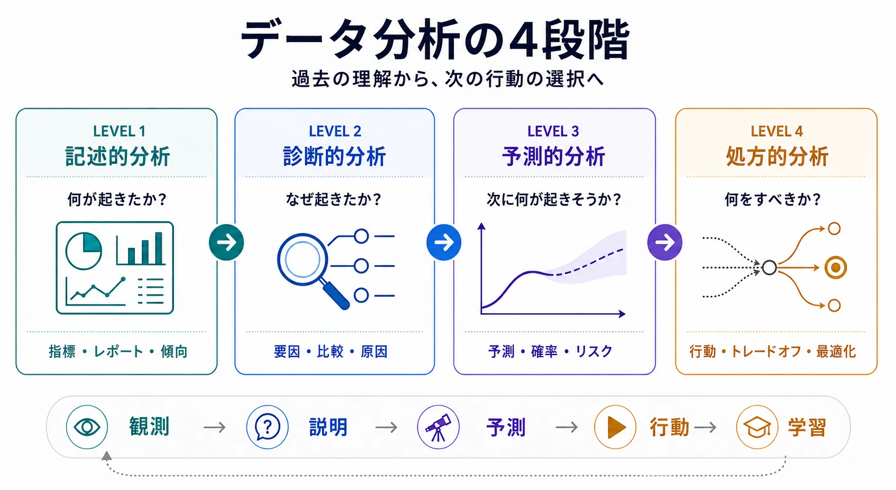

データ分析とは、データを体系的に利用して不確実性を減らし、意思決定を改善する活動です。ビジネス、プロダクト、システムに関する観測結果を、人が解釈して行動に結び付けられる根拠へと変換します。

データ分析は、しばしば4段階のモデルで説明されます。各段階は、それぞれ異なる意思決定上の問いに答えます。

| レベル | 分析の種類 | 主な問い           | 代表的な成果物                       |
| ------ | ---------- | ------------------ | ------------------------------------ |
| 1      | 記述的分析 | 何が起きたか       | 指標、レポート、ダッシュボード、傾向 |
| 2      | 診断的分析 | なぜ起きたか       | 寄与要因と、検証された説明           |
| 3      | 予測的分析 | 次に何が起きそうか | 予測値、確率、リスクスコア           |
| 4      | 処方的分析 | 何をすべきか       | 推奨される行動とトレードオフ         |

この4段階は観測から行動への進展を表しますが、ビジネス価値や技術的な高度さの順位ではありません。不正確な予測より、信頼できる記述指標の方が有用な場合があります。また、処方的な推奨は、その基礎となる根拠以上に信頼できるものにはなりません。実務では、成熟した分析チームは意思決定に応じて各段階を行き来します。

未知のデータにこれらの手法を適用する前に、 [データ理解](data-understanding/) を通じて、データが何を意味し、どう振る舞い、意図した分析に適しているかを明らかにします。

## 4段階の分析モデル

### 記述的分析

記述的分析（Descriptive Analytics）は、観測されたデータを要約し、何が、どこで起き、状況が時間とともにどう変化したかを明らかにします。原因の説明や将来予測を始める前に、現在または過去の状態について共通認識を作ります。

代表的な手法は、集計、セグメンテーション、分布分析、トレンド分析、可視化です。売上レポート、サービス稼働状況のダッシュボード、コンバージョンファネル、在庫サマリー、業務スコアカードなどが典型的な成果物です。

例えば、オンラインサービスで月次の顧客離反率が3%から4.5%に上昇したと報告したとします。この記述は観測された変化を示していますが、離反率が上昇した理由や、その上昇が今後も続くかどうかまでは明らかにしません。

優れた記述的分析には、次の要素が必要です。

- 明確に定義された指標とディメンション
- 明示された対象集団と期間
- 比較可能な基準値または目標値
- 確認可能なデータの鮮度と品質
- 通常の変動と意味のあるシグナルを区別するための十分な文脈

記述的分析は、残りの段階の基礎です。顧客、取引、アクティブユーザー、集計期間の意味についてチーム間で合意できていなければ、高度な分析は不一致を解消するどころか増幅させます。

### 診断的分析

診断的分析（Diagnostic Analytics）は、観測された結果がなぜ起きたかを調べます。大きな変化を、原因となり得る要因へ絞り込み、利用可能な根拠がその説明を支持するかを検証します。

代表的な手法は、ドリルダウン分析、コホートおよびセグメント比較、相関分析、仮説検定、要因分解、異常調査、根本原因分析です。データだけでは意図や文脈を説明できない場合、顧客のフィードバックやインシデント記録などの定性的な根拠で定量分析を補完することもあります。

顧客離反の例を続けると、料金変更後、特定地域の新規顧客に離反率の上昇が集中していると判明するかもしれません。これは離反率を報告するだけよりも踏み込んだ分析ですが、慎重な解釈が必要です。料金変更と離反率の間に関係があっても、一方が他方を引き起こしたとは限りません。季節性、競合の活動、サービス障害、顧客構成の変化なども影響している可能性があります。

そのため、効果的な診断では次の概念を区別します。

- **相関（correlation）**：複数の変数が同時に変化する関係
- **寄与（contribution）**：ある要因が観測結果の一部を説明する関係
- **因果（causation）**：ある要因を変えることで結果にも変化が生じる関係

因果関係を主張するには、通常、ランダム化実験、自然実験、準実験的手法、十分に裏付けられた因果モデルなど、より強い設計が必要です。目的は都合の良い説明を作ることではなく、精査に耐えられる説明を特定することです。

### 予測的分析

予測的分析（Predictive Analytics）は、明示された条件の下で、次に何が起きそうかを推定します。過去および現在のデータに含まれるパターンから、予測値、分類、確率、リスクスコアを生成します。

代表的な手法は、統計的予測、回帰、分類、生存時間分析、時系列モデル、機械学習です。需要予測、顧客離反リスク、不正検知、設備故障、配送遅延、キャパシティ計画などに利用されます。

顧客離反の例では、予測モデルは各アクティブ顧客が今後30日以内に離反する確率を推定します。この出力は将来の事実ではありません。利用可能なデータ、モデルの前提、環境の安定性を条件とした推定値です。

有用な予測は、不確実性と適用条件を明らかにする必要があります。評価は一つの抽象的な正解率だけに依存せず、支援する意思決定を反映すべきです。重要な評価事項には次のものがあります。

- 偽陽性と偽陰性のコスト
- 予測確率のキャリブレーション
- 重要な顧客または業務セグメントごとの性能
- 予測対象期間と信頼区間
- データドリフト、コンセプトドリフト、モデルの劣化
- 行動に間に合うタイミングで予測を提供できるか

予測だけでは、組織が何をすべきかは決まりません。離反確率が高い顧客であっても、維持コストが高い、オファーに反応しにくい、または介入を妨げる制約があるかもしれません。こうしたトレードオフは次の段階で扱います。

### 処方的分析

処方的分析（Prescriptive Analytics）は、予測やシナリオに、目的、制約、コスト、便益、リスクを組み合わせて行動を推奨します。何が起きそうかだけでなく、実行可能な対応のうち、どれが望ましい結果を生む可能性が最も高いかを問います。

代表的な手法は、最適化、シミュレーション、意思決定分析、オペレーションズ・リサーチ、因果推論、強化学習、ルールベースの意思決定システムです。在庫配分、経路計画、要員配置、価格設定、治療の選択、ネクストベストアクションなどに利用されます。

顧客離反の例では、処方的システムは、どの顧客に連絡し、どの維持施策を提示し、限られた介入予算をどう配分するかを推奨します。適切な推奨では、離反リスクだけでなく、施策によって生じる増分効果を考慮します。介入の有無にかかわらず離反する顧客や残留する顧客が多ければ、すべての高リスク顧客に連絡することはリソースの浪費になります。

処方的分析では、意思決定の境界を明示する必要があります。

- **目的：** どの成果を最適化するのか
- **行動：** 実際に実行できる介入は何か
- **制約：** どのような制限を守る必要があるか
- **トレードオフ：** コスト、便益、リスク、公平性、時間のバランスをどう取るか
- **権限：** どの意思決定を自動化でき、どれに人の判断が必要か
- **フィードバック：** 結果をどのように測定し、意思決定プロセスの改善に利用するか

推奨は、結果に責任を持つ人が理解できる程度の説明可能性を維持すべきです。影響の大きい意思決定には、監督、監査可能性、フォールバック動作、推奨へ異議を唱えたり上書きしたりする手段も必要です。

## 4段階を連携させる

このモデルは、4つの独立した能力ではなく、一連の意思決定上の問いとして理解すると有効です。

1. **観測する：** 記述的分析が結果とその文脈を明らかにする
2. **説明する：** 診断的分析が、考えられる理由を検証する
3. **見通す：** 予測的分析が、将来の結果と不確実性を推定する
4. **行動する：** 処方的分析が、実行可能な対応とトレードオフを評価する
5. **学習する：** 行動の結果が新たな記述データとなり、フィードバックループを閉じる

すべての問いに4段階すべてを使う必要はありません。規制報告は記述的分析だけで完結することがあります。インシデント調査は診断的な結論で終わるかもしれません。予測が、自動的な推奨を介さずに人の計画を支援する場合もあります。どの段階まで進むかは、意思決定、利用可能な根拠、リスク、誤った場合のコストによって決まります。

このモデルは反復的でもあります。予想外の予測誤差から、診断で見落としていた要因が見つかることがあります。介入の失敗から、誤った因果の前提が明らかになることもあります。新たなビジネス上の制約によって、予測が正確なままでも最善の処方が変わる場合があります。

## 共通する基礎能力

基盤が弱ければ、高度な手法を使っても補うことはできません。信頼できる分析には、モデル全体に共通するいくつかの能力が必要です。

### 意思決定の定義

意思決定そのものと、それに責任を持つ人から始めます。成果、対象期間、実行可能な行動、誤った場合の影響を定義します。これにより、測定はできても実際の選択につながらない指標を最適化する事態を防げます。

### データ品質とセマンティクス

指標、エンティティ、時間枠には一貫した定義が必要です。データリネージ、鮮度、完全性、既知の制約を確認できるようにします。分析結果は、目的とする用途に必要な精度で現実のプロセスを表現しなければなりません。

### 適切な手法

必要な信頼性を満たして問いに答えられる、最も単純な手法を選びます。複雑さが正当化されるのは、より高度な手法を利用できるからではなく、意思決定を実質的に改善する場合です。

### 検証と不確実性

すべての段階に不確実性があります。記述には測定誤差、診断には交絡、予測には推定誤差、処方には反応の不確実性があります。前提と不確実性は、結果とともに伝える必要があります。

### ガバナンスと説明責任

アクセス制御、プライバシー、セキュリティ、公平性、規制上の義務は、分析ライフサイクル全体に適用されます。また組織は、指標の定義、分析手法、モデルの性能、それらに基づく意思決定の責任者を明確にしなければなりません。

## よくある誤解

- **4段階は必須の成熟度階段ではありません。** レベル4への到達自体を目的にせず、意思決定に必要な能力を育てるべきです。
- **予測は説明ではありません。** 結果の因果的な説明にならない変数を使っても、モデルが正確に予測できる場合があります。
- **処方は意思決定の自動化と同義ではありません。** 推奨は人の判断を支援できます。自動化の可否はリスクと説明責任に応じて決めるべきです。
- **ダッシュボードは必ずしも初歩的ではありません。** 適切に設計された記述的分析は、複雑な業務を調整し、より深い分析が必要な時点を明らかにできます。
- **データ量が増えても、意思決定が必ず改善するわけではありません。** 量と同じくらい、関連性、代表性、意味の一貫性、提供の適時性が重要です。

## まとめ

4段階モデルは、明確な進展によってデータと意思決定を結び付けます。

- 記述的分析（Descriptive Analytics）は、**何が起きたか**を明らかにする
- 診断的分析（Diagnostic Analytics）は、**なぜ起きたか**を調べる
- 予測的分析（Predictive Analytics）は、**次に何が起きそうか**を推定する
- 処方的分析（Prescriptive Analytics）は、**何をすべきか**を推奨する

このモデルの価値は、4つの問いを区別しながら、それぞれの根拠を結び付けることにあります。優れたデータ分析は、最も高度な手法へ急いで進むものではありません。分析レベルを意思決定に合わせ、不確実性を明示し、行動の結果から学習します。
