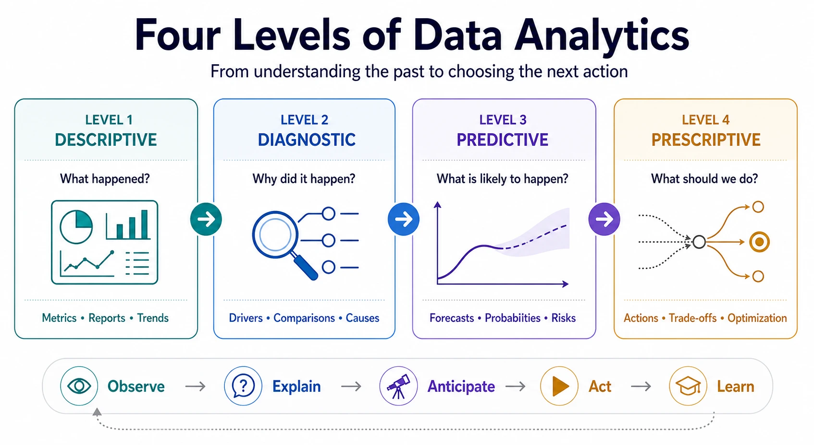

Data analytics is the disciplined use of data to reduce uncertainty and improve decisions. It turns observations about a business, product, or system into evidence that people can interpret and act on.

The work is often described as a four-level model. Each level answers a different decision question:

| Level | Analytics type         | Primary question          | Typical output                               |
| ----- | ---------------------- | ------------------------- | -------------------------------------------- |
| 1     | Descriptive analytics  | What happened?            | Metrics, reports, dashboards, and trends     |
| 2     | Diagnostic analytics   | Why did it happen?        | Contributing factors and tested explanations |
| 3     | Predictive analytics   | What is likely to happen? | Forecasts, probabilities, and risk scores    |
| 4     | Prescriptive analytics | What should we do?        | Recommended actions and trade-offs           |

The levels form a progression from observation to action, but they are not a ranking of business value or technical sophistication. A reliable descriptive metric can be more useful than an inaccurate prediction, and a prescriptive recommendation is only as trustworthy as the evidence beneath it. In practice, mature analytics teams move between the levels as a decision requires.

## The Four-Level Model

### Level 1: Descriptive Analytics

Descriptive analytics summarizes observed data to establish what happened, where it happened, and how conditions changed over time. It creates a shared view of the current or historical state before anyone attempts to explain or forecast it.

Common methods include aggregation, segmentation, distribution analysis, trend analysis, and visualization. Typical outputs are revenue reports, service-health dashboards, conversion funnels, inventory summaries, and operational scorecards.

For example, an online service may report that monthly customer churn increased from 3% to 4.5%. That statement describes an observed change. It does not yet establish why churn increased or whether the increase will continue.

Good descriptive analytics depends on:

- clearly defined metrics and dimensions
- an explicit population and time period
- comparable baselines or targets
- visible data freshness and quality
- enough context to distinguish a signal from normal variation

Descriptive analytics is the foundation for the remaining levels. If teams disagree about the meaning of a customer, transaction, active user, or reporting period, more advanced analysis will amplify the disagreement rather than resolve it.

### Level 2: Diagnostic Analytics

Diagnostic analytics investigates why an observed outcome occurred. It narrows a broad change into plausible contributing factors and tests whether the available evidence supports them.

Common methods include drill-down analysis, cohort and segment comparison, correlation analysis, hypothesis testing, decomposition, anomaly investigation, and root-cause analysis. Qualitative evidence, such as customer feedback or incident records, may complement quantitative analysis when the data alone cannot explain intent or context.

Continuing the churn example, an analyst might find that the increase is concentrated among new customers in one region following a pricing change. This is stronger than simply reporting churn, but it still requires care. A relationship between the pricing change and churn does not automatically prove that one caused the other. Seasonality, competitor activity, service issues, and changes in customer mix may also contribute.

Effective diagnostic work therefore distinguishes among:

- **correlation**, where variables change together
- **contribution**, where a factor accounts for part of an observed outcome
- **causation**, where changing a factor produces a change in the outcome

Causal claims usually require stronger designs, such as randomized experiments, natural experiments, quasi-experimental methods, or well-supported causal models. The goal is not to produce a convenient explanation, but to identify explanations that remain credible under scrutiny.

### Level 3: Predictive Analytics

Predictive analytics estimates what is likely to happen under stated conditions. It uses patterns in historical and current data to produce forecasts, classifications, probabilities, or risk scores.

Common methods include statistical forecasting, regression, classification, survival analysis, time-series modeling, and machine learning. Typical uses include demand forecasting, churn risk, fraud detection, equipment failure, delivery delay, and capacity planning.

In the churn example, a predictive model might estimate the probability that each active customer will leave within the next 30 days. The output is not a fact about the future. It is an estimate conditioned on the available data, the model assumptions, and the stability of the environment.

A useful prediction should make its uncertainty and operating conditions visible. Evaluation should reflect the decision being supported rather than rely on a single abstract accuracy score. Relevant considerations include:

- the cost of false positives and false negatives
- calibration of predicted probabilities
- performance across important customer or operational segments
- the forecast horizon and confidence interval
- data drift, concept drift, and model decay
- whether the prediction arrives early enough to support action

Prediction does not determine what an organization should do. A customer may have a high churn probability while also being expensive to retain, unlikely to respond to an offer, or subject to constraints that prevent intervention. Those trade-offs belong to the next level.

### Level 4: Prescriptive Analytics

Prescriptive analytics recommends actions by combining predictions or scenarios with objectives, constraints, costs, benefits, and risks. It asks not only what may happen, but which feasible response is most likely to improve the desired outcome.

Common methods include optimization, simulation, decision analysis, operations research, causal inference, reinforcement learning, and rule-based decision systems. Typical uses include inventory allocation, route planning, workforce scheduling, pricing, treatment selection, and next-best-action systems.

For churn, a prescriptive system might recommend which customers to contact, which retention action to offer, and how to allocate a limited intervention budget. A sound recommendation would consider expected incremental impact rather than churn risk alone. Contacting every high-risk customer may waste resources if many would leave regardless or remain without intervention.

Prescriptive analytics requires explicit decision boundaries:

- **Objective:** What outcome is being optimized?
- **Actions:** Which interventions are actually available?
- **Constraints:** What limits must be respected?
- **Trade-offs:** How are cost, benefit, risk, fairness, and time balanced?
- **Authority:** Which decisions may be automated, and which require human judgment?
- **Feedback:** How will outcomes be measured and used to improve the decision process?

Recommendations should remain explainable enough for the people accountable for the outcome. High-impact decisions also need oversight, auditability, fallback behavior, and a way to challenge or override the recommendation.

## How the Levels Work Together

The model is best understood as a sequence of decision questions rather than four isolated capabilities:

1. **Observe:** Descriptive analytics establishes the outcome and its context.
2. **Explain:** Diagnostic analytics tests plausible reasons for that outcome.
3. **Anticipate:** Predictive analytics estimates future outcomes and uncertainty.
4. **Act:** Prescriptive analytics evaluates feasible responses and their trade-offs.
5. **Learn:** The results of an action become new descriptive data, closing the feedback loop.

A team does not need to use all four levels for every question. A regulatory report may be purely descriptive. An incident investigation may end with a diagnostic conclusion. A forecast may support human planning without automated recommendations. The appropriate stopping point depends on the decision, available evidence, risk, and cost of being wrong.

The model is also iterative. Unexpected predictive errors can reveal a missing diagnostic factor. A failed intervention can expose an incorrect causal assumption. A new business constraint can change the best prescription even when the prediction remains accurate.

## Shared Foundations

Higher-level methods do not compensate for weak foundations. Reliable analytics requires several capabilities across the entire model.

### Decision framing

Start with the decision and the people responsible for it. Define the outcome, time horizon, available actions, and consequences of error. This prevents teams from optimizing metrics that are measurable but disconnected from an actual choice.

### Data quality and semantics

Metrics, entities, and time windows need consistent definitions. Lineage, freshness, completeness, and known limitations should be visible. The analytical result must represent the real-world process closely enough for its intended use.

### Appropriate methods

Choose the simplest method that can answer the question with sufficient reliability. Complexity is justified when it materially improves the decision, not merely when a more advanced technique is available.

### Validation and uncertainty

Every level contains uncertainty: measurement error in description, confounding in diagnosis, estimation error in prediction, and uncertain responses in prescription. Assumptions and uncertainty should be communicated alongside results.

### Governance and accountability

Access controls, privacy, security, fairness, and regulatory obligations apply throughout the analytics lifecycle. The organization must also assign ownership for metric definitions, analytical methods, model performance, and the decisions made from them.

## Common Misconceptions

- **The levels are not a mandatory maturity ladder.** Organizations should develop the capabilities their decisions require rather than pursue Level 4 as an end in itself.
- **Prediction is not explanation.** A model can predict accurately using variables that do not provide a causal account of the outcome.
- **Prescription is not automatic decision-making.** Recommendations can support human judgment, and automation should depend on risk and accountability.
- **Dashboards are not inherently basic.** Well-designed descriptive analytics can coordinate complex operations and reveal when deeper analysis is necessary.
- **More data does not guarantee better decisions.** Relevance, representativeness, semantic consistency, and timely delivery matter as much as volume.

## Summary

The four-level model connects data to decisions through a clear progression:

- Descriptive analytics establishes **what happened**.
- Diagnostic analytics investigates **why it happened**.
- Predictive analytics estimates **what is likely to happen**.
- Prescriptive analytics recommends **what should be done**.

The value of the model lies in keeping these questions distinct while connecting their evidence. Strong analytics does not rush toward the most advanced technique. It matches the analytical level to the decision, makes uncertainty visible, and learns from the outcomes of action.
