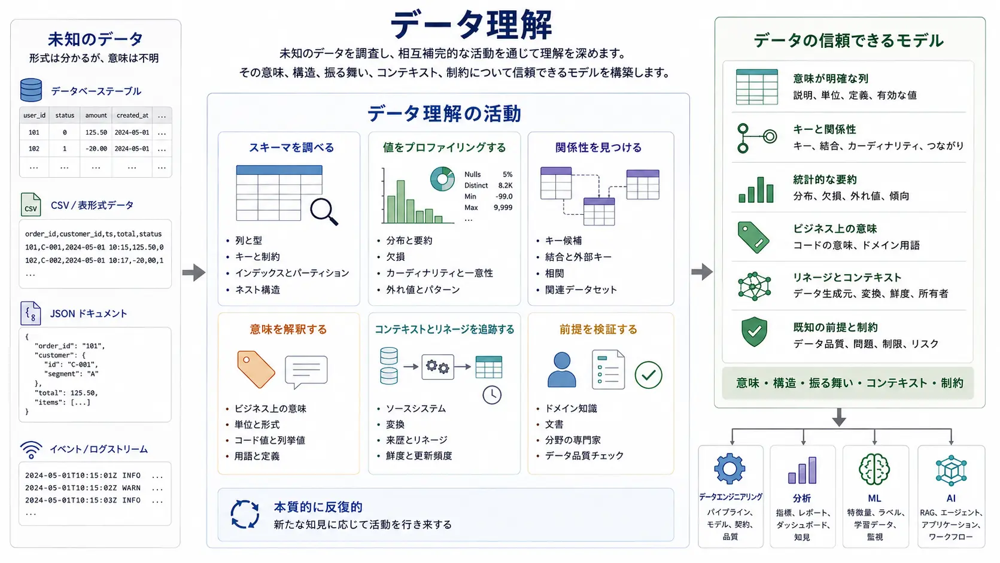
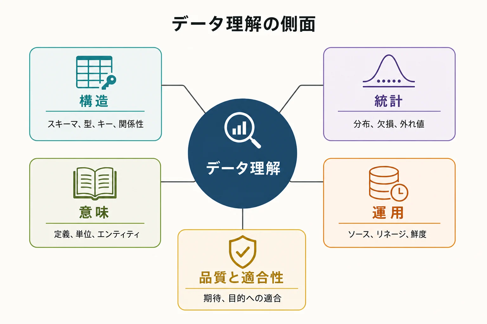
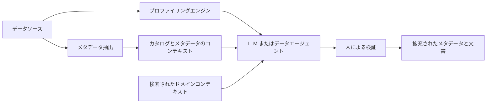

データ理解（Data Understanding）とは、データの意味、構造、振る舞い、来歴、関係性、品質、制約について、適切に利用するために十分な知識を構築するプロセスです。

データ理解は単一の手法ではなく、複数の活動を包含する概念です。データの発見、メタデータの調査、プロファイリング、関係性の分析、リネージの調査、品質評価、ドメイン上の解釈は、それぞれデータセットの異なる側面を明らかにします。その結果として、データが何であり、何を意味し、どのように振る舞い、特定の目的に適しているかを示す、信頼できる人間および計算機向けのモデルが得られます。

この図は、データ理解を一つの調査活動として示しています。実務者は相互補完的な活動を反復しながら行き来し、根拠を蓄積して、データの信頼できるモデルを構築します。データエンジニアリング、分析、機械学習、AI は、そのモデルを基盤として利用する後続活動であり、データ理解そのものの段階ではありません。

## データ理解が重要な理由

テーブル、ファイル、イベントストリーム、ログ、API にアクセスできることは、それらをすぐに利用できることを意味しません。スキーマから `customer_id` が文字列であることは分かっても、その値が安定しているか、一意か、再利用されるか、ゲスト購入では欠落するかは分かりません。タイムスタンプ型だけでは、タイムゾーンも、それが表すビジネスイベントも特定できません。統計的に問題のないフィールドであっても、意思決定の対象として誤った母集団を表している可能性があります。

データ理解は、誤った解釈に基づいて技術的には正しいシステムを構築してしまうリスクを減らします。実務者が、関連しながらも異なる次の 4 つを判断するための根拠を提供します。

- **データが何であるか** — 資産、レコード、フィールド、形式、キー、関係性
- **データが何を意味するか** — エンティティ、定義、単位、コード、ドメイン上の慣習
- **データがどう振る舞うか** — 分布、欠損、変化、異常、運用上の周期
- **データが適しているか** — 特定の分析、エンジニアリング、ML、AI 用途への適合性

適合性は常に目的に依存します。1 日遅れの日次スナップショットは月次レポートには十分でも、不正検知には適さないかもしれません。登録済み顧客について完全なデータセットでも、ゲスト利用者を体系的に除外している場合があります。したがって、一般的な品質スコアを算出するだけではデータ理解は完了しません。

## データ理解の側面

次の側面は互いに重なり、補強し合います。これは調査のための実用的なモデルであり、正式な標準ではありません。

### 構造の理解

構造の理解は、スキーマ、フィールド、型、制約、キー、パーティション、ネスト、関係性など、データの表現方法を扱います。形式だけでなく粒度も確認します。テーブルの 1 行が注文、注文明細、ステータス遷移、日次スナップショットのいずれを表すかを取り違えると、すべての型が正しくても、結合や集計を誤ります。

半構造化データでは、省略可能なフィールド、ネストされたフィールド、配列、変化するペイロードのバージョン、イベントエンベロープも構造に含まれます。CSV と Parquet は似た列を公開していても、型やメタデータに関する保証が大きく異なります。API ではページネーション、フィルタリング、レスポンスのバージョン管理も考慮が必要です。ただし、データ理解をファイル形式の解説にすり替えるべきではありません。

### 統計的な理解

統計的な理解では、分布、カーディナリティ、欠損、偏り、相関、重複、外れ値など、観測された値を調べます。支配的なパターンと例外を明らかにし、宣言された型や制約が実際のデータと一致するかを検証します。

統計が説明するのは振る舞いであって、意味ではありません。強い相関は、有用な因果関係ではなく、共通の前処理で行われた計算、母集団フィルター、データリークを反映している可能性があります。外れ値はエラーかもしれませんが、まれに発生する有効な値や、データセットで最も重要なレコードかもしれません。

### 意味の理解

意味の理解は、フィールドやレコードをドメインの概念に結び付けます。ビジネス定義、単位、コードの意味、エンティティ、用語、暗黙の前提を明らかにします。たとえば「顧客」が、アカウント、個人、請求先、有効な契約者のどれを意味するかを確認します。

この側面は、ビジネス用語集、オーナー、分野の専門家、ソースシステムの文書、 [セマンティックレイヤー](../../metadata/semantic-layer/) に依存することがよくあります。通常、値だけから意味を復元することはできません。

### 運用の理解

運用の理解は、ソースシステム、所有者、更新頻度、リネージ、変換、保持、バックフィル、鮮度など、データがどのように生成され、変化するかを説明します。イベント時刻と取り込み時刻、現在状態テーブルと追記専用の履歴を区別します。

一見した異常が、パイプラインのスケジュール、遅延到着イベント、スキーマ移行、データ生成元での訂正によるものなら、運用コンテキストが不可欠です。リネージと運用メタデータについては、 [メタデータ](../../metadata/) で詳しく説明しています。

### 品質と適合性

品質評価では、完全性、妥当性、一貫性、一意性、測定可能な場合の正確性、適時性など、明示された期待とデータを比較します。より包括的な品質モデルについては、 [データ品質の側面](../../management/data-quality-dimensions/) を参照してください。

適合性の評価はさらに進み、観測結果を意図した用途と関連付けます。母集団の網羅性、代表性、許可された利用、不確実性、誤りのコストを考慮します。品質はこの判断の根拠ですが、判断そのものではありません。

## データ理解とデータプロファイリング

データプロファイリングは、データ理解の中で使われる手法です。プロファイリングは実際の値や構造を観測し、データ理解はその観測結果をメタデータ、関係性、来歴、定義、目的と組み合わせます。

| 概念                   | 主な問い                                                       |
| ---------------------- | -------------------------------------------------------------- |
| データディスカバリー   | どのようなデータが、どこに存在するか                           |
| メタデータの調査       | データはどのように表現され、説明されているか                   |
| データプロファイリング | 実際の値にはどのようなパターンや分布があるか                   |
| 意味の理解             | ドメインの文脈でデータは何を意味するか                         |
| データ品質             | データは定義された期待を満たしているか                         |
| データリネージ         | データはどこから来て、どのように変換されたか                   |
| データ理解             | このデータについて総合的に何が分かっており、適切に利用できるか |

代表的なプロファイリング結果には、行数、null 比率、個別値、カーディナリティ、最小値と最大値、分布、統計的要約、推論された型、パターン、重複、外れ値、相関があります。これらは解釈すべき事実を効率的に明らかにします。

たとえば、`status` という列に `0`、`1`、`9` が含まれているとします。値と出現頻度を見つけることはプロファイリングです。`9` が「アカウント閉鎖後も保持されるレコード」を意味し、移行時に導入され、キャンペーンから除外すべきであると判断するには、意味、履歴、目的に関する知識が必要です。プロファイリングは根拠を提供しますが、ビジネス上の意味までは提供しません。

異常についても同じ境界があります。注文金額が負である場合、返金、取り消し、訂正、データ破損のいずれかを示している可能性があります。頻度と分布はプロファイリングできますが、その値が有効かどうかは、取引の意味とソースシステムの振る舞いによって決まります。

## 実践的なワークフロー

データ理解は反復的な活動です。後の段階で得られた知見によって、より良い問いを持って前の段階へ戻ることがあります。

1. **取得または接続する。** 認可され、再現可能なアクセスを確立します。ローカルファイルを文脈のない生の事実として扱わず、ソース、抽出時刻、対象範囲、形式、フィルターを記録します。
2. **棚卸しする。** データセット、テーブル、ファイル、API リソース、イベント型、パーティションを一覧化します。明らかな対象、期間、量、オーナー候補を特定します。
3. **メタデータを調べる。** スキーマ、説明、制約、契約、カタログ項目、更新記録、機密性分類を確認します。矛盾や欠落は事実ではなく、解決すべき問いとして記録します。
4. **値をプロファイリングする。** 件数、欠損、カーディナリティ、範囲、分布、パターン、重複、代表的なサンプルを算出します。集計値が重要な集団を隠す場合は、結果をセグメント別に確認します。
5. **関係性を見つける。** 宣言済みまたは候補となるキー、結合の網羅率、時間的関係、階層、共起、類似性を検証します。推論された関係は、検証されるまでは仮説です。
6. **意味を解釈する。** フィールドをドメインエンティティ、定義、単位、コード体系、ビジネスイベントに対応付けます。粒度と、欠如、ゼロ、null の意味を明確にします。
7. **品質を評価する。** 観測結果を文書化された期待と比較し、例外を調べます。既知の欠陥と、有効だが通常とは異なる振る舞いを区別します。
8. **ドメイン知識で検証する。** オーナーや分野の専門家と結果を確認します。リネージとソースシステムの振る舞いを使って曖昧さを解消します。
9. **理解を文書化する。** 定義、根拠、未解決の問い、前提、適合性の判断、再現可能なチェックを、カタログ、文書、データプロダクトのインターフェースに記録します。

このワークフローは、リレーショナルテーブル、CSV、Parquet、JSON 文書、イベント、ログ、API に適用できます。具体的な調査方法は変わっても、表現、振る舞い、コンテキスト、用途を結び付ける必要性は変わりません。

## メタデータとコンテキスト

メタデータは生のレコードを調べる量を減らし、重要な根拠へ注意を向けるのに役立ちます。

- **技術および構造メタデータ** — 名前、スキーマ、型、キー、制約、形式、保存場所
- **運用メタデータ** — 実行、鮮度、利用状況、障害、所有者、サービスレベル
- **ビジネスメタデータ** — 用語、定義、指標、ポリシー、意図した用途
- **リネージ** — ソース、変換、出力、依存関係のつながり
- **推論メタデータ** — ツールが導出した型候補、分類、関係、説明、類似性のシグナル

[データカタログ](../../metadata/#data-discovery) はこれらのシグナルを検索可能にし、共有された [メタデータ](../../metadata/) レイヤーはそれらを結び付けます。ただし、メタデータも疑う余地のない真実ではなく、根拠の一つです。説明が古い、リネージが手作業を含んでいない、宣言された制約が強制されていない、自動推論されたラベルが誤っている可能性があります。十分な理解を得るには、メタデータを観測データおよびドメインの知見と比較します。

## データ理解の自動化

自動化により、広範囲で再現可能な調査が実用的になります。決定論的および統計的な手法は、スキーマの列挙、基本型の推論、プロファイルの計算、パターンと異常の検出、外部キー候補の検証、分布の比較、エンティティの特定、データセット間の類似性測定に利用できます。品質フレームワークは既知の期待を反復可能なチェックに変換し、メタデータプラットフォームはリネージや運用シグナルによってカタログ項目を補強します。

これらの手法は、対象の特性を測定でき、根拠を提示できる場合に最も有効です。型推論は解析できなかった値を、キー候補検出は一意性と網羅率を、関係検出は一致したレコードと一致しなかったレコードを示せます。

AI 支援による解釈は、説明文の候補作成、類似概念の対応付け、プロファイルの要約、技術構造からビジネス言語への変換など、構造化されていない作業を扱います。その出力は確率的な仮説です。もっともらしい説明は正式な定義ではなく、意味的な類似性は 2 つのフィールドを交換可能だと証明するものではありません。

## データ理解における生成 AI

大規模言語モデルとデータエージェントは、スキーマ、プロファイル、カタログ、チケット、文書、クエリ履歴に分散していた根拠を統合できます。

- スキーマとプロファイリング結果の要約
- 未知の列の説明と説明文候補の作成
- 技術スキーマからビジネス言語への変換
- 異種データセット間の結合や対応付けの提案
- 探索クエリとデータ品質チェック候補の生成
- 意味上の不整合が疑われる箇所の特定
- データセット文書の初期パッケージの作成

有用なアーキテクチャでは、根拠の収集と解釈を分離します。

モデルはデータセット全体を無条件に取り込むのではなく、メタデータ、統計、慎重に選んだサンプル、リネージ、検索されたドメインコンテキストをもとに推論するのが一般的です。これにより追跡可能性が高まり、コンテキストウィンドウとコストへの負荷を抑えられます。データの露出も減らせますが、メタデータやサンプル自体に機密情報が含まれる可能性には注意が必要です。

このアーキテクチャには、アクセス制御、データ最小化、承認されたモデル境界、監査可能性、明確な保持規則が必要です。説明、文書、データ値をエージェントのコンテキストへ入れる場合、プロンプトインジェクションも起こり得ます。検索された内容は評価対象となる根拠であり、信頼された命令として扱ってはいけません。人によるレビューの強度は機密性と影響に応じて決め、生成されたメタデータには来歴と信頼度を残し、正式な定義を暗黙に置き換えないようにします。

## 人とドメイン知識

データセットから観測できない事実もあります。社内製品コードが廃止済みの製品を指す、過去のステータスが移行の都合でのみ存在する、日付が暦日ではなく会計上の規則に従う、といった例です。「顧客」の定義も、営業、請求、サポート、プライバシーの各部門で異なる可能性があります。null は不明、対象外、非表示、未到着、正当なゲスト取引などを意味し得ます。

分野の専門家とデータオーナーは、プロセス、例外、意図した意味についてのコンテキストを提供します。ビジネス用語集は共有定義を保持し、カタログは定義を資産やオーナーと結び付け、文書は慣習を記録し、リネージは変換を示します。ソースシステムの専門家は、抽出後のデータからは見えない振る舞いを説明します。

自動化は根拠を見つけ、解釈を提案できますが、組織における真実を独力で確定することはできません。優れたプロセスは不確実性を可視化し、問いを説明責任のある人へ送り、検証済みの回答を後の利用者のために記録します。

## 例：未知の顧客・注文データセットを理解する

ある分析担当者が、収益と顧客維持の調査のために `customers`、`orders`、`order_items`、`status_history` テーブルを受け取ったとします。

棚卸しとスキーマ調査によって、テーブルの種類、識別子の候補、宣言された型が分かります。プロファイリングの結果、`customers.customer_id` は一意ですが、`orders.customer_id` は null を許容し、繰り返し現れることが分かります。結合分析では、null でない注文識別子の大半が顧客と一致しますが、一部の古いデータは一致しません。

これらの観測結果は、重要な問いに答えるというより、問いを明確にします。

- 用語集とオーナーへの確認により、`customer_id` が個人、世帯、アカウントのどれを識別するかを確定します。
- 値のプロファイリングで `status` に `0`、`1`、`9` があることを確認し、ソース文書で各コードと適用期間を調べます。
- タイムスタンプのメタデータは UTC を示していますが、夏時間の切り替わり付近のサンプルとソースオーナーへの確認によって、取り込み前に変換されたかを確定します。
- 負の合計値は返金イベント周辺に集中しています。リネージから、返品は元の注文の更新ではなく、取り消し注文として表現されていることが分かります。
- 顧客 ID の欠損は、取得エラーではなく、文書化されたゲスト購入経路と一致します。
- キー候補と結合網羅率の検証により、注文明細と注文の関係を確認し、時系列プロファイリングによって遅延到着するステータスイベントを特定します。
- パイプラインのメタデータから鮮度を確認し、テストアカウントを除外する変換処理が取り込み前に行われていることを特定します。

最終的な適合性の判断は調査目的に依存します。返金処理を定義すれば計上収益の分析には使える一方、ゲスト購入と一致しない過去のアカウントが許容できない母集団の欠落を生むなら、顧客維持分析には適さない可能性があります。成果物はクリーンなテーブルだけではありません。粒度、意味、リネージ、制約、前提、承認された用途を記録したモデルです。

## 後続活動との関係

### データエンジニアリング

変換、ターゲットスキーマ、パイプライン、契約、品質管理を設計する前に、ソースの粒度、キー、変化、遅延、障害モードを理解する必要があります。そうしなければ、構造的な妥当性を保ちながら誤った意味を組み込むパイプラインが生まれます。より広い位置付けについては [データ](../../) ハブを参照してください。

### 分析と BI

結論を導く前に、指標、ディメンション、母集団、フィルター、除外条件について根拠のある定義が必要です。データ理解は、 [データ分析](../) と統制されたセマンティックモデルの調査基盤になります。

### 機械学習

機械学習ではさらに、ラベルの意味、リーク、分布シフト、サブグループの網羅性、欠損、バイアス、代表性を確認します。これらは、見かけ上の予測性能が汎化できるかを左右します。 [機械学習](/docs/ai/machine-learning/) と [AI のためのデータ](/docs/ai/data-for-ai/) も参照してください。

### 生成 AI と RAG

インデックス作成や検索の前に、ソースの権威性、意味、文書とチャンクの境界、エンティティ、メタデータ、鮮度、権限、品質を理解する必要があります。これらの選択によって、システムが何を検索し、信頼できるかが決まります。 [検索拡張生成](/docs/ai/context-engineering/rag/) と [コンテキストエンジニアリング](/docs/ai/context-engineering/) も参照してください。

### データガバナンス

ガバナンスは、技術的な観測結果を所有者、定義、リネージ、分類、ポリシー、説明責任と結び付けます。データ理解はガバナンスが解決すべき根拠と曖昧さを表面化し、ガバナンスはその判断を持続可能かつ強制可能にします。

## ツールとエコシステム

単一のツールだけでデータ理解を実現することはできません。SQL エンジン、ノートブック、データフレームツールは調査と探索を支援します。プロファイリングライブラリと品質フレームワークは根拠を計算し、期待をチェックとして実装します。カタログとメタデータプラットフォームは、発見、所有、リネージ、定義を公開します。オブザーバビリティプラットフォームは実行時の振る舞いを追加し、セマンティックレイヤーは共有された分析上の意味を安定させます。AI 支援ツールはこれらのシグナルを統合し、次に問うべきことを明らかにします。

ツールは、データの規模、機密性、インターフェース、意図した意思決定に合わせて選びます。長期的に重要なのは、特定の製品ではなく、ワークフローと根拠の記録です。

## まとめ

データ理解は、未知のデータへのアクセスを、その構造、振る舞い、意味、来歴、関係性、品質、制約についての根拠ある知識へ変換します。プロファイリングはその中で不可欠な手法ですが、それだけではビジネス上の意味や用途への適合性を確定できません。

規律あるワークフローは、自動化された根拠をメタデータ、リネージ、ドメインの専門知識、用途別の判断と組み合わせます。その成果は、後続のエンジニアリング、分析、ML、AI が安全に利用できるように文書化された事実、前提、不確実性、適合性の判断です。

## 参考資料

- [W3C Data Catalog Vocabulary (DCAT) Version 3](https://www.w3.org/TR/vocab-dcat-3/) — データセットおよびデータサービスのカタログメタデータと発見可能性のための標準語彙
- [ISO/IEC 25012:2008](https://www.iso.org/standard/35736.html) — 一般的なデータ品質モデル
- [NIST AI Risk Management Framework](https://www.nist.gov/itl/ai-risk-management-framework) — AI 支援による解釈を統制して利用する際にも関連するリスク管理ガイダンス
- 補足: [Cross-industry standard process for data mining](https://en.wikipedia.org/wiki/Cross-industry_standard_process_for_data_mining) — CRISP-DM とその各フェーズに関する補助的な概要
