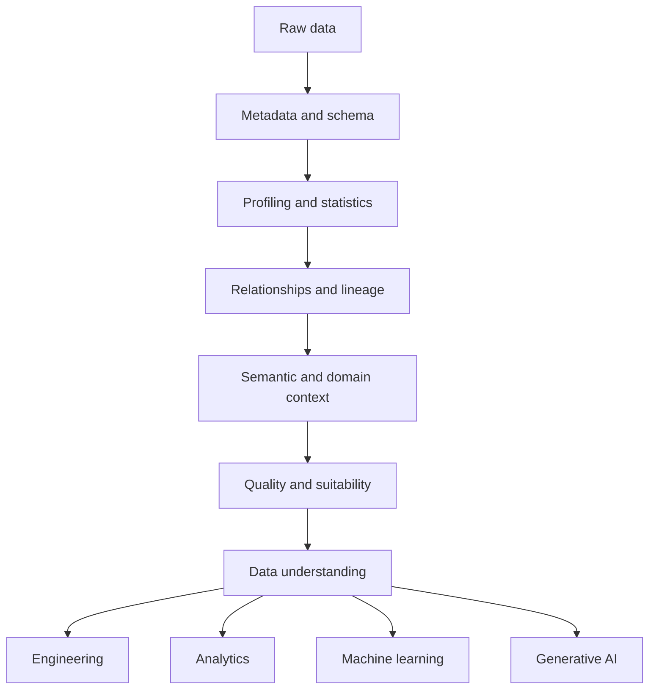
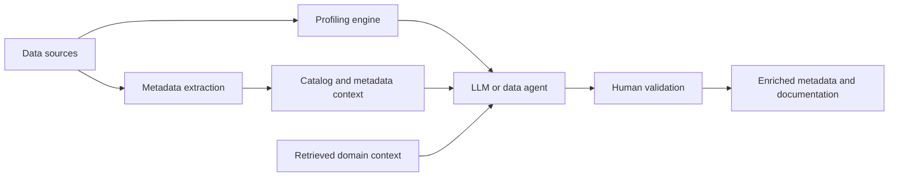

Data Understanding is the process of building sufficient knowledge about data—its meaning, structure, behavior, provenance, relationships, quality, and limitations—to use it appropriately.

It is an umbrella activity rather than a single technique. Discovery, metadata inspection, profiling, relationship analysis, lineage investigation, quality assessment, and domain interpretation each reveal a different part of the dataset. The result is a reliable mental and computational model of the data: what it is, what it means, how it behaves, and whether it is fit for a particular purpose.

The term appears in data mining and data science methods such as CRISP-DM, but its scope varies across communities. This page uses a broader editorial synthesis that applies before analytics, data engineering, machine learning, and generative AI; it is not presented as a universal industry taxonomy.

## Why Data Understanding Matters

Access to a table, file, event stream, log, or API does not imply that it is ready to use. A schema may show that `customer_id` is a string without showing whether it is stable, unique, reused, or absent for guest purchases. A timestamp type does not reveal its timezone or the business event it represents. A statistically clean field can still encode the wrong population for a decision.

Data Understanding reduces the chance of building a technically correct system on a false interpretation. It gives practitioners evidence for four related but distinct judgments:

- **What the data is** — assets, records, fields, formats, keys, and relationships
- **What the data means** — entities, definitions, units, codes, and domain conventions
- **How the data behaves** — distributions, missingness, change, anomalies, and operational rhythms
- **Whether it is suitable** — fitness for a defined analytical, engineering, ML, or AI use

Suitability is always purpose-dependent. A delayed daily snapshot may be adequate for monthly reporting but unsuitable for fraud detection. A dataset may be complete for registered customers while systematically excluding guest users. Understanding therefore does not end with a general quality score.

## Dimensions of Data Understanding

The following dimensions overlap and reinforce one another. They are a working model for investigation, not a formal standard.

### Structural Understanding

Structural understanding covers how data is represented: schemas, fields, types, constraints, keys, partitions, nesting, and relationships. It asks about grain as well as shape. A table may contain one row per order, order line, status transition, or daily snapshot; confusing these grains produces incorrect joins and measures even when every type is valid.

For semi-structured data, structure includes optional and nested fields, arrays, evolving payload versions, and event envelopes. CSV and Parquet files may expose similar columns while carrying very different type and metadata guarantees. APIs may add pagination, filtering, and response-version behavior. These details matter, but Data Understanding should not become a format tutorial.

### Statistical Understanding

Statistical understanding examines the observed values: distributions, cardinality, missingness, skew, correlations, duplicates, and outliers. It reveals dominant patterns and exceptions, and it helps test whether declared types and constraints match reality.

Statistics describe behavior, not meaning. A strong correlation may reflect a shared upstream calculation, a population filter, or leakage rather than a useful causal relationship. An outlier may be an error, a rare valid case, or the most important record in the dataset.

### Semantic Understanding

Semantic understanding connects fields and records to domain concepts. It establishes business definitions, units, code meanings, entities, terminology, and implicit assumptions. It asks whether “customer” means an account, a person, a billing party, an active subscriber, or something else.

This dimension often depends on business glossaries, owners, subject-matter experts, source-system documentation, and the [semantic layer](../../metadata/semantic-layer/). Meaning usually cannot be recovered from values alone.

### Operational Understanding

Operational understanding explains how the data came to be and how it changes: source systems, ownership, refresh frequency, lineage, transformations, retention, backfills, and freshness. It distinguishes an event time from an ingestion time and a current-state table from an append-only history.

Operational context is essential when apparent anomalies are consequences of pipeline schedules, late-arriving events, schema migrations, or upstream corrections. The [Metadata](../../metadata/) topic examines lineage and operational metadata in greater depth.

### Quality and Suitability

Quality assessment compares data with explicit expectations such as completeness, validity, consistency, uniqueness, accuracy where measurable, and timeliness. [Data Quality Dimensions](../../management/data-quality-dimensions/) provides a more complete quality model.

Suitability goes further by relating those observations to an intended use. It considers population coverage, representativeness, permissible use, uncertainty, and the cost of error. Quality is evidence in that decision; it is not the decision itself.

## Data Understanding and Data Profiling

Data Profiling is a technique used within Data Understanding. Profiling computes observations about actual values and structures; understanding combines those observations with metadata, relationships, provenance, definitions, and purpose.

| Concept                | Primary question                                                               |
| ---------------------- | ------------------------------------------------------------------------------ |
| Data Discovery         | What data exists and where?                                                    |
| Metadata Inspection    | How is it represented and described?                                           |
| Data Profiling         | What patterns and distributions exist in the actual values?                    |
| Semantic Understanding | What does the data mean in its domain context?                                 |
| Data Quality           | Does the data meet defined expectations?                                       |
| Data Lineage           | Where did the data come from and how was it transformed?                       |
| Data Understanding     | What do we collectively know about this data, and can we use it appropriately? |

Typical profiling outputs include row counts, null ratios, distinct values, cardinality, minima and maxima, distributions, statistical summaries, inferred types, patterns, duplicates, outliers, and correlations. They efficiently reveal facts that deserve interpretation.

Suppose a column named `status` contains `0`, `1`, and `9`. Finding its values and frequencies is profiling. Determining that `9` means “record retained after account closure,” that it was introduced during a migration, and that closed accounts must be excluded from a campaign requires semantic, historical, and purpose-specific knowledge. Profiling supplied evidence; it did not supply the business meaning.

The same boundary applies to anomalies. A negative order total may indicate a refund, a reversal, a correction, or corrupt data. Its frequency and distribution can be profiled, but its validity depends on transaction semantics and source-system behavior.

## A Practical Workflow

Data Understanding is iterative. Later discoveries often require returning to earlier stages with better questions.

1. **Acquire or connect.** Establish authorized, reproducible access. Record the source, extract time, scope, format, and any filters rather than treating a local file as context-free raw truth.
2. **Inventory.** List datasets, tables, files, API resources, event types, and partitions. Identify obvious subjects, time ranges, volumes, and candidate owners.
3. **Inspect metadata.** Read schemas, descriptions, constraints, contracts, catalog entries, refresh records, and sensitivity classifications. Note contradictions and missing metadata as questions, not facts.
4. **Profile values.** Compute counts, missingness, cardinality, ranges, distributions, patterns, duplicates, and representative samples. Segment results where aggregate statistics could hide important populations.
5. **Discover relationships.** Test declared and candidate keys, join coverage, temporal relationships, hierarchy, co-occurrence, and similarity. An inferred relationship is a hypothesis until validated.
6. **Interpret semantics.** Map fields to domain entities, definitions, units, code sets, and business events. Clarify grain and the meaning of absence, zero, and null.
7. **Assess quality.** Compare observations with documented expectations and investigate exceptions. Separate known defects from valid but unusual behavior.
8. **Validate with domain knowledge.** Review findings with owners and subject-matter experts. Use lineage and source-system behavior to resolve ambiguity.
9. **Document understanding.** Capture definitions, evidence, unresolved questions, assumptions, suitability decisions, and reproducible checks in the catalog, documentation, or data product interface.

The workflow applies to relational tables, CSV and Parquet files, JSON documents, events, logs, and APIs. The exact inspection methods change, but the need to connect representation, behavior, context, and intended use remains.

## Metadata and Context

Metadata can reduce the need to inspect raw records and can direct attention to the most relevant evidence:

- **Technical and structural metadata** describes names, schemas, types, keys, constraints, formats, and storage locations.
- **Operational metadata** describes runs, freshness, usage, failures, ownership, and service levels.
- **Business metadata** describes terms, definitions, metrics, policies, and intended use.
- **Lineage** connects sources, transformations, outputs, and dependencies.
- **Inferred metadata** adds candidate types, classifications, relationships, descriptions, and similarity signals derived by tools.

A [data catalog](../../metadata/#data-discovery) can make these signals searchable and a shared [metadata](../../metadata/) layer can connect them. Metadata is still evidence rather than unquestionable truth. Descriptions can be stale, lineage can omit manual steps, declared constraints may not be enforced, and automatically inferred labels may be wrong. Good understanding compares metadata with observed data and domain testimony.

## Automated Data Understanding

Automation makes broad, repeatable inspection practical. Deterministic and statistical techniques can enumerate schemas, infer primitive types, compute profiles, detect patterns and anomalies, test candidate foreign keys, compare distributions, identify entities, and measure similarity between datasets. Quality frameworks can turn known expectations into repeatable checks, while metadata platforms can enrich catalog records with lineage and operational signals.

These techniques are strongest when the target property is measurable and the method can expose its evidence. A type inference can report which values failed to parse; a candidate-key detector can report uniqueness and coverage; a relationship detector can report matched and unmatched records.

AI-assisted interpretation addresses less structured work: generating candidate descriptions, mapping similar concepts, summarizing profiles, and translating technical structure into domain language. Its outputs are probabilistic hypotheses. A plausible description is not an authoritative definition, and semantic similarity is not proof that two fields are interchangeable.

## Generative AI for Data Understanding

Large language models and data agents can synthesize evidence that would otherwise remain scattered across schemas, profiles, catalogs, tickets, documentation, and query history. They can:

- summarize schemas and profiling results
- explain unfamiliar columns and propose candidate descriptions
- translate technical schemas into business language
- suggest joins and mappings between heterogeneous datasets
- generate exploratory queries and proposed quality checks
- identify suspicious semantic inconsistencies
- assemble an initial dataset documentation package

A useful architecture keeps evidence gathering separate from interpretation:

The model should generally reason over metadata, statistics, carefully selected samples, lineage, and retrieved domain context rather than blindly ingesting an entire dataset. This improves traceability and reduces context-window and cost pressure. It can also reduce data exposure, although metadata and samples may themselves contain sensitive information.

The architecture needs access controls, data minimization, approved model boundaries, auditability, and clear retention rules. Prompt injection can also arise when descriptions, documents, or data values are placed into an agent's context. Retrieved content must remain evidence to evaluate, not trusted instructions. Human review should be proportional to sensitivity and impact, and generated metadata should preserve provenance and confidence rather than silently replacing authoritative definitions.

## Human and Domain Knowledge

Some facts are not observable in the dataset. Internal product codes may refer to retired offerings. A historical status may exist only because of a migration. A date may follow an accounting calendar rather than a civil calendar. “Customer” may be defined differently by sales, billing, support, and privacy teams. A null can mean unknown, not applicable, suppressed, not yet arrived, or a legitimate guest transaction.

Subject-matter experts and data owners supply context about processes, exceptions, and intended meaning. Business glossaries preserve shared definitions. Catalogs connect definitions to assets and owners. Documentation records conventions. Lineage reveals transformations. Source-system experts explain behavior that is invisible after extraction.

Automation can find evidence and propose interpretations, but it cannot independently establish organizational ground truth. The strongest process makes uncertainty visible, routes questions to accountable people, and records the validated answer for later users.

## Example: An Unfamiliar Customer and Order Dataset

Suppose an analyst receives `customers`, `orders`, `order_items`, and `status_history` tables for a revenue-retention study.

Inventory and schema inspection establish that several tables exist, expose candidate identifiers, and show their declared types. Profiling then reveals that `customers.customer_id` is unique, while `orders.customer_id` is nullable and repeated. Join analysis shows that most non-null order identifiers match customers, but a small historical segment does not.

Those observations raise rather than settle the important questions:

- A glossary and an owner confirm whether `customer_id` identifies a person, household, or account.
- Value profiling shows that `status` contains `0`, `1`, and `9`; source documentation explains each code and its historical scope.
- Timestamp metadata suggests UTC, but samples around a daylight-saving transition and confirmation from the source owner establish whether conversion occurred upstream.
- Negative totals cluster around refund events. Lineage shows that returns are represented as reversal orders rather than updates to original orders.
- Missing customer identifiers align with a documented guest-checkout path instead of a capture defect.
- Candidate-key and join-coverage tests show how order lines relate to orders, while temporal profiling reveals late-arriving status events.
- Pipeline metadata provides freshness and identifies a transformation that excludes test accounts.

The final suitability decision depends on the study. The data may support booked-revenue analysis after refund handling is defined, but not customer retention if guest purchases and unmatched historical accounts create unacceptable population gaps. The deliverable is therefore not only a clean table. It is a documented model of grain, meaning, lineage, limitations, assumptions, and approved uses.

## Relationship to Downstream Work

### Data Engineering

Engineers need to understand source grain, keys, evolution, latency, and failure modes before designing transformations, target schemas, pipelines, contracts, and controls. Otherwise, pipelines can preserve structural validity while encoding the wrong semantics. The broader [Data](../../) hub places engineering alongside architecture, management, and metadata.

### Analytics and BI

Analysts need defensible definitions of metrics, dimensions, populations, filters, and exclusions before drawing conclusions. Data Understanding is the investigative foundation beneath [Data Analytics](../) and governed semantic models.

### Machine Learning

ML work adds questions about label meaning, leakage, distribution shift, subgroup coverage, missingness, bias, and representativeness. These concerns shape whether apparent predictive performance can generalize. See [Machine Learning](/docs/ai/machine-learning/) and [Data for AI](/docs/ai/data-for-ai/).

### Generative AI and RAG

Before indexing or retrieval, teams need to understand source authority, semantics, document and chunk boundaries, entities, metadata, freshness, permissions, and quality. These choices determine what a system can retrieve and trust. See [Retrieval-Augmented Generation](/docs/ai/context-engineering/rag/) and [Context Engineering](/docs/ai/context-engineering/).

### Data Governance

Governance connects technical observations with ownership, definitions, lineage, classifications, policies, and accountability. Understanding surfaces the evidence and ambiguity that governance must resolve; governance makes the resulting decisions durable and enforceable.

## Tools and Ecosystem

No single tool produces Data Understanding. SQL engines, notebooks, and dataframe tools support inspection and exploration. Profiling libraries and quality frameworks calculate evidence and encode expectations. Catalogs and metadata platforms expose discovery, ownership, lineage, and definitions. Observability platforms add runtime behavior. Semantic layers stabilize shared analytical meaning. AI-assisted tools synthesize these signals and help formulate the next questions.

Tool choice should follow the data scale, sensitivity, interfaces, and intended decision. The durable capability is the workflow and its evidence trail, not a particular product.

## Summary

Data Understanding turns access to unfamiliar data into justified knowledge about its structure, behavior, meaning, provenance, relationships, quality, and limitations. Profiling is an essential technique within that process, but it cannot establish business meaning or fitness for use on its own.

A disciplined workflow combines automated evidence with metadata, lineage, domain expertise, and purpose-specific judgment. Its output is a documented set of facts, assumptions, uncertainties, and suitability decisions that downstream engineering, analytics, ML, and AI work can safely build upon.

## References

- [IBM SPSS Modeler: Data Understanding Overview](https://www.ibm.com/docs/en/spss-modeler/19.0.0?topic=understanding-data-overview) — CRISP-DM's data-understanding phase and its relationship to exploration, quality, and documentation
- [W3C Data Catalog Vocabulary (DCAT) Version 3](https://www.w3.org/TR/vocab-dcat-3/) — a standard vocabulary for dataset and data-service catalog metadata and discoverability
- [ISO/IEC 25012:2008](https://www.iso.org/standard/35736.html) — a general data-quality model
- [NIST AI Risk Management Framework](https://www.nist.gov/itl/ai-risk-management-framework) — risk-management guidance relevant to governed use of AI-assisted interpretation
