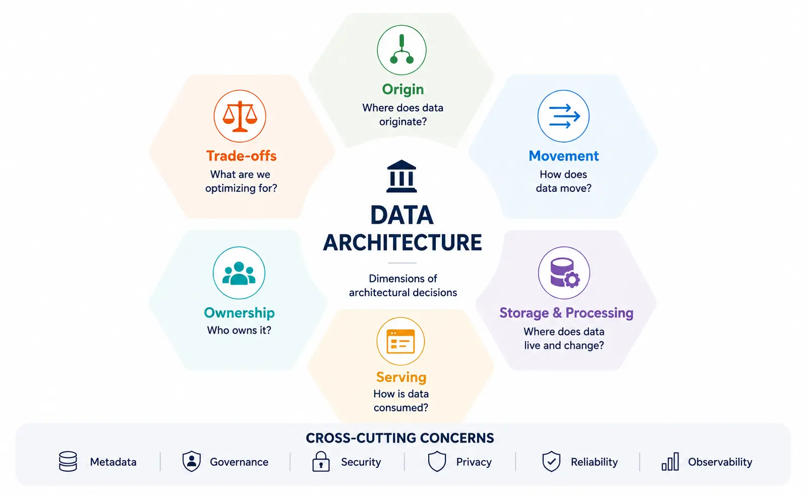

Organizations rarely operate one database or one pipeline. Data is created and consumed across operational applications, analytical systems, SaaS services, event streams, AI systems, external providers, and organizational boundaries. Each connection introduces choices about persistence, movement, semantics, control, and responsibility.

Data architecture is the set of structural decisions that determines where data lives, how it moves, how systems interact, how operational and analytical workloads are separated or combined, where controls apply, and how the landscape can evolve. A diagram of databases may describe part of an architecture, but the architecture also includes interfaces, flows, ownership boundaries, and the reasoning behind them.

This page is a map of that decision space. It establishes a reusable mental model and directs deeper questions to focused pages.








## What Data Architecture Covers

Data architecture spans technology, information flow, and organizational responsibility.

- **Sources and consumers:** which applications, people, partners, devices, models, and agents produce or use data
- **Storage and persistence:** which system records operational state, analytical history, files, events, indexes, and derived representations
- **Movement and integration:** whether data crosses a boundary through batch, APIs, replication, change data capture (CDC), messaging, streaming, or federation
- **Transformation:** where validation, enrichment, aggregation, modeling, and semantic interpretation occur
- **Serving and access:** how SQL, APIs, semantic layers, search, features, and data products expose usable information
- **Metadata and control:** how systems record meaning, lineage, ownership, policy, quality, and operational state
- **Reliability and observability:** how freshness, completeness, failures, dependencies, and service commitments become visible
- **Security and privacy boundaries:** where identity, authorization, isolation, minimization, retention, and audit controls apply
- **Ownership boundaries:** which central, platform, product, or domain team is accountable for each interface and outcome

Adjacent disciplines overlap with this scope, but emphasize different questions.

| Discipline                                    | Primary emphasis                                                                                                                                                                         |
| --------------------------------------------- | ---------------------------------------------------------------------------------------------------------------------------------------------------------------------------------------- |
| **Data Architecture**                         | Structural organization, boundaries, relationships, and consequential design decisions across data systems                                                                               |
| **Data Engineering**                          | Building and operating the pipelines, transformations, and services that implement those decisions                                                                                       |
| **Data Platform**                             | Reusable infrastructure and capabilities on which data producers and consumers run workloads                                                                                             |
| [**Data Management**](/docs/data/management/) | Keeping data trustworthy, accessible, usable, and sustainable throughout its lifecycle                                                                                                   |
| **Data Governance**                           | Decision rights, policies, accountability, and controls; see [Data Governance](/docs/data/governance/) and [Federated Data Governance](/docs/data/governance/federated-data-governance/) |

These are working boundaries, not exclusive territories. A data contract, for example, can be an architectural interface, an engineering artifact, a platform capability, and a governance control at the same time.

## A Decision Framework

Architectures become easier to compare when described as decisions rather than product inventories.

### Where does data originate?

Operational databases, applications, SaaS systems, files, APIs, devices, external datasets, and event streams differ in authority, change behavior, interface stability, and ownership. Identify the system of record and the events or snapshots it can reliably expose.

### How does data move?

Batch ingestion favors bounded, reconcilable delivery. CDC propagates database changes with low source impact but inherits log and schema semantics. Messaging and event streaming reduce time-to-reaction while adding ordering, replay, and compatibility decisions. APIs preserve domain interfaces but create runtime dependencies. Federation leaves data in place but couples queries to remote availability and performance. See [Data Integration and Flow](integration-and-flow/) and [Data Exchange Mechanisms](/docs/data/sharing/data-exchange-mechanisms/).

### Where is data stored?

Operational databases optimize application transactions. Warehouses optimize governed analytical queries. Lakes and object storage retain large, varied datasets. Lakehouses add table-management capabilities over object storage. Specialized databases, indexes, and caches serve workloads that general-purpose stores handle poorly. The decision should follow access patterns, consistency, retention, isolation, and cost—not a universal hierarchy of technologies.

### Where is data transformed?

Transformation may occur in a source application, ingestion pipeline, stream processor, warehouse or lakehouse, [semantic layer](/docs/data/metadata/semantic-layer/), or consuming application. Moving logic toward a producer can preserve domain meaning; centralizing it can improve reuse and consistency. Every placement changes coupling, latency, testability, and accountability.

### How is data served?

SQL tables, APIs, metrics, search indexes, feature systems, streams, and [data products](/docs/data/metadata/data-products/) expose different contracts. A serving interface should make meaning, freshness, compatibility, access policy, and failure behavior explicit to its consumers.

### Who owns it?

Central data teams can create consistency and economies of scale. Domain teams can retain context and local accountability. Platform teams can provide common paved roads. Federated models combine these responsibilities, but only work when interfaces and decision rights are explicit. [Data Mesh](/docs/data/metadata/data-mesh/) is one domain-oriented model; it is not the only way to distribute ownership.

## Architectural Reference Model

The following model is a lens, not a mandatory pipeline. A request may bypass storage, a stream may feed an application directly, and a federated query may reach a source at consumption time.

The cross-cutting concerns need enforcement points at several boundaries. [Metadata](/docs/data/metadata/) connects definitions, lineage, ownership, and automation; [Data Privacy](/docs/data/privacy/) shapes collection and use; reliability and observability reveal whether interfaces meet their promises.

## Architecture Landscape

Architecture labels describe different dimensions rather than one list of competing solutions:

- **Workload and storage:** operational systems, warehouses, lakes, and lakehouses
- **Movement and processing:** batch, Lambda, Kappa, streaming, and event-driven approaches
- **Ownership and coordination:** centralized, federated, distributed, [Data Mesh](/docs/data/metadata/data-mesh/), and Data Fabric approaches

These dimensions are commonly combined. An organization might use domain ownership inspired by Data Mesh, store analytical tables in a lakehouse, and integrate applications through events. See [Data Architecture Patterns](patterns/) for definitions, useful contexts, and trade-offs across the major patterns.

### Navigate Through Multiple Lenses

The same topic appears under several lenses because the architecture is multidimensional.

| Lens                      | Starting points                                                                                                                                                                                                  |
| ------------------------- | ---------------------------------------------------------------------------------------------------------------------------------------------------------------------------------------------------------------- |
| **Architectural concern** | Storage and processing; [Integration and Flow](integration-and-flow/); [Semantic Layer](/docs/data/metadata/semantic-layer/); [Metadata](/docs/data/metadata/); [Data Privacy](/docs/data/privacy/); reliability |
| **Data movement**         | [Batch, CDC, APIs, replication, messaging, streaming, and federation](integration-and-flow/)                                                                                                                     |
| **Architecture style**    | [Centralized, shared-platform, event-driven, streaming, federated, and domain-oriented patterns](patterns/); [Data Mesh](/docs/data/metadata/data-mesh/)                                                         |
| **Workload**              | [Analytics](/docs/data/analytics/); operational applications; real-time decisions; [Machine Learning](/docs/ai/machine-learning/); [Data for AI](/docs/ai/data-for-ai/)                                          |
| **Organizational model**  | Centralized, federated, domain-oriented, and platform-oriented ownership; [Data Teams](/docs/data/teams/)                                                                                                        |

### Choose by Problem

| If you are trying to...           | Start with...                                                                                                                                                        |
| --------------------------------- | -------------------------------------------------------------------------------------------------------------------------------------------------------------------- |
| Build an analytical foundation    | Warehouse and lakehouse in [Architecture Patterns](patterns/) and [Modern Data Architecture](modern-data-architecture/)                                              |
| Reduce batch latency              | CDC and streaming in [Data Integration and Flow](integration-and-flow/)                                                                                              |
| Integrate loosely coupled systems | Event-driven patterns in [Data Architecture Patterns](patterns/)                                                                                                     |
| Scale ownership across domains    | [Data Mesh](/docs/data/metadata/data-mesh/) and [Federated Data Governance](/docs/data/governance/federated-data-governance/)                                        |
| Understand how information moves  | [Data Integration and Flow](integration-and-flow/)                                                                                                                   |
| Establish reusable infrastructure | The Data Platform boundary in [What Data Architecture Covers](#what-data-architecture-covers) and [Modern Data Architecture](modern-data-architecture/)              |
| Govern distributed data           | [Data Governance](/docs/data/governance/) and [Metadata](/docs/data/metadata/)                                                                                       |
| Feed ML or AI applications        | [Data for AI](/docs/ai/data-for-ai/), [Semantic Layer](/docs/data/metadata/semantic-layer/), and [Retrieval-Augmented Generation](/docs/ai/context-engineering/rag/) |

## Data Architecture for AI

AI expands the set of data representations and consumers an architecture must support. Documents, images, audio, embeddings, vector indexes, features, prompts, and retrieved context have different update, provenance, retention, and access requirements from conventional analytical tables. Retrieval paths may need fresh operational context at interactive latency, while training and evaluation require reproducible snapshots.

AI agents are data consumers with the added ability to select tools and initiate actions. Their access should preserve enterprise identity, authorization, lineage, and purpose boundaries rather than create an ungoverned copy of enterprise data. Vector search is one retrieval mechanism, not a substitute for source quality, metadata, ranking, or authorization.

The architectural task is to connect trustworthy sources to bounded AI interfaces while retaining evidence about origin, transformation, retrieval, and use. Detailed model and retrieval design belongs in [Data for AI](/docs/ai/data-for-ai/), [AI Infrastructure](/docs/ai/ai-infrastructure/), [Context Engineering](/docs/ai/context-engineering/), and [Retrieval-Augmented Generation](/docs/ai/context-engineering/rag/).

## Where to Go Next

Start with [Data Architecture Principles](principles/) when establishing design criteria, [Data Architecture Patterns](patterns/) when comparing structures, [Data Integration and Flow](integration-and-flow/) when a boundary or latency problem dominates, and [Modern Data Architecture](modern-data-architecture/) when evaluating a heterogeneous platform roadmap.

Future focused pages can deepen warehouse, lake, lakehouse, event-driven, streaming, data-contract, CDC, metadata, semantic-layer, platform, data-product, real-time, and AI-oriented architectures without turning this hub into a catalog.

## Further Reading

- [Martin Fowler: Lambda Architecture](https://martinfowler.com/bliki/LambdaArchitecture.html) — a concise account of the dual batch and speed paths and their complexity
- [Jay Kreps: Questioning the Lambda Architecture](https://www.oreilly.com/radar/questioning-the-lambda-architecture/) — the original argument associated with the Kappa alternative
- [Martin Fowler: Data Mesh Principles and Logical Architecture](https://martinfowler.com/articles/data-mesh-principles.html) — the four principles and their architectural implications
- [NIST Big Data Interoperability Framework, Volume 6: Reference Architecture](https://www.nist.gov/publications/nist-big-data-interoperability-framework-volume-6-reference-architecture) — a vendor-neutral reference architecture and role model
