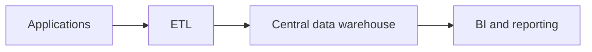

“Modern data architecture” is a flexible industry term, not a precise standard. At its most useful, it describes capabilities for operating a heterogeneous, cloud-era data estate: elastic storage and compute, batch and streaming flows, multiple workload-specific stores, automated metadata and controls, reusable platform services, and governed access for analytics, applications, machine learning, and AI.

It should not mean “an architecture that bought newer products.”

## From One Dominant Analytical Path

A traditional simplified path is often represented as:

This model remains useful. It creates a controlled analytical boundary, reconciles operational sources, and supports shared reporting. Its limitations become visible when organizations need unstructured data, independent domain delivery, interactive APIs, low-latency events, data science experimentation, or many specialized workloads.

Modern estates commonly evolve toward a graph of interacting capabilities:

The second diagram is not a target topology. It shows why architecture shifts from selecting one central store to governing interactions among several paths.

## Common Capabilities

### Cloud Object Storage and Decoupled Compute

Object storage provides durable, elastic storage for large and varied datasets. Independent compute engines can scale for ingestion, transformation, SQL, and machine learning. This separation can improve flexibility and workload isolation, while requiring deliberate catalog, table, security, and cost controls.

### Warehouses and Lakehouses

Cloud warehouses continue to provide managed analytical performance and governance. Lakehouses add table-management and transactional capabilities over lake-style storage. Many organizations use both because workload, engine, portability, and operating requirements differ.

### CDC, Streaming, and Event-Driven Integration

CDC reduces the delay between operational commits and downstream state. Streaming processors produce continuous views and reactions. Domain events let independent systems coordinate through meaningful changes. These capabilities reduce latency but add always-on operational state, compatibility, ordering, replay, and observability concerns. See [Data Integration and Flow](../integration-and-flow/).

### Specialized Data Stores

Search indexes, key-value stores, graph databases, time-series systems, vector indexes, and caches optimize specific access patterns. Polyglot persistence can improve workload fit, but every additional representation brings synchronization, lineage, governance, and lifecycle work.

### Semantic and Product Interfaces

A [semantic layer](/docs/data/metadata/semantic-layer/) separates governed business meaning from physical tables. [Data products](/docs/data/metadata/data-products/) package data, metadata, interfaces, ownership, and service expectations for consumption. These approaches make a heterogeneous physical estate more coherent without pretending it is one database.

### Metadata-Driven Operations and DataOps

Automated lineage, classification, quality signals, policy context, and usage telemetry allow systems and teams to respond to change. [Active Metadata](/docs/data/metadata/active-metadata/) describes metadata as part of the operational control plane. DataOps applies iterative delivery, testing, automation, observability, and feedback to data work; tools alone do not create that operating discipline.

### Domain Ownership and Shared Platforms

Central teams cannot own every domain definition at unlimited scale. Domain-oriented ownership can place accountability near context, while a shared platform supplies interoperable self-service capabilities. [Data Mesh](/docs/data/metadata/data-mesh/) formalizes one version of this combination with federated governance. It requires organizational change, not merely a distributed technology stack.

### ML and AI Consumers

ML adds training, features, evaluation, and model-serving paths. Generative AI adds unstructured corpora, embeddings, vector or hybrid retrieval, prompt-time context, and agents that access enterprise systems. [Data for AI](/docs/ai/data-for-ai/) explains the data foundations; [Retrieval-Augmented Generation](/docs/ai/context-engineering/rag/) explains why retrieval quality depends on the full governed path rather than vector search alone.

## Benefits and New Complexity

| Capability gained                  | Complexity introduced                                                   |
| ---------------------------------- | ----------------------------------------------------------------------- |
| Elastic, workload-specific scale   | Cost attribution, quotas, and capacity behavior across services         |
| Faster and continuous data         | Stateful operations, replay, ordering, and schema compatibility         |
| Multiple fit-for-purpose engines   | Copies, synchronization, catalogs, identity, and portability            |
| Domain autonomy                    | Cross-domain interoperability, discovery, and federated decisions       |
| Self-service platform capabilities | Product management, support, paved-road boundaries, and exceptions      |
| Automated metadata and policy      | Metadata quality, control feedback loops, and explainability            |
| AI-ready retrieval and context     | Unstructured-data quality, provenance, access filtering, and evaluation |

Modernization can move complexity rather than reduce it. A managed service may remove server operations while adding a proprietary control plane. An open table format may reduce storage lock-in while leaving catalog and engine behavior coupled. A real-time pipeline may improve freshness while increasing the number of failure modes users experience.

## Evaluate Capabilities, Not Labels

Ask concrete questions:

- Which workloads and latency targets justify separate paths?
- Which system is authoritative for each entity, event, metric, and policy?
- Can teams discover and access data through stable, governed interfaces?
- Can changes be traced from source to consumer and safely replayed or reconciled?
- Are compute, storage, and copies observable in cost and service terms?
- Do platform abstractions preserve important workload differences?
- Can ownership scale without fragmenting semantics and controls?
- Can AI consumers receive current, authorized, attributable context?

“Modern” should describe architectural capabilities and constraints: evolvability, interoperability, automation, timely data, governed self-service, observable reliability, and support for diverse consumers. A new product is modern only when it improves those properties for the organization's actual problems.
