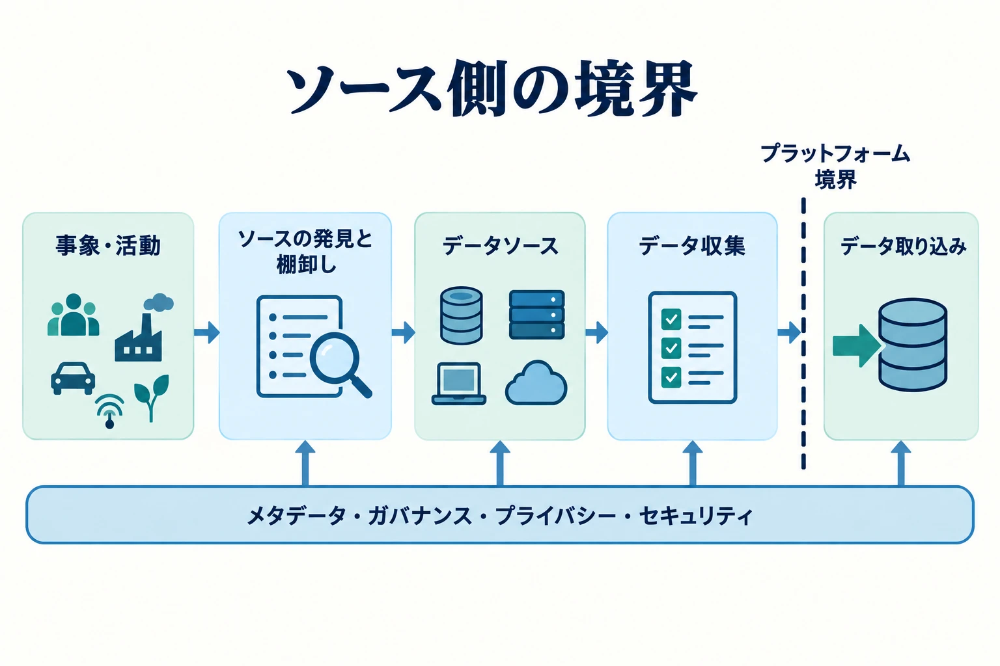

データ収集（Data Collection）とは、現実世界の事象やソースシステムからデータを特定・選択・取得・記録し、目的、来歴、制約が明らかな状態でデータエコシステムへ受け渡せるようにするプロセスです。中心となる問いは、**どのデータを、どこから、どのような条件のもとで取得し、ソース側でどのように記録するか**です。

データ収集は、データベースからレコードを抽出することより広い概念です。組織が何を観測可能にするかを最初に決定します。計測設計、ソース選定、標本抽出、タイミング、許可された利用目的に関する判断は、後続のすべての処理で利用できる根拠を形づくります。

## ソース側の境界

これは概念上の責任境界であり、必ず別々の物理システムとして実装するという意味ではありません。アプリケーションがイベントを記録して直ちに発行する場合でも、イベントの定義はデータ収集に属し、管理対象のプラットフォームへ確実に転送する仕組みはデータ取り込みに属します。

## ソースの発見と棚卸し

データ収集は、特定のソースを選ぶ前から始まります。まず、目的に必要な根拠を提供し得るシステム、アプリケーション、デバイス、インターフェース、提供元、既存のデータ保有状況を把握する必要があります。**ソースの発見と棚卸し**は、十分な情報に基づいて収集を判断できるように、このソース環境を可視化する活動です。

ディスカバリーでは、候補となるソースを特定し、そのソースが何を生成または保持しているか、誰が所有・運用しているか、どの対象や活動を表しているか、どのようにアクセスできるか、どの頻度で変化するか、どのような法的・契約上・セキュリティ上・技術上の制約があるかを記録します。また、重複するソース、文書化されていないインターフェース、不明確な所有関係、必要な事象を観測できない重要な欠落も明らかにします。

この活動だけで収集が承認されたり、ソースが利用目的に適合すると証明されたりするわけではありません。候補となるソースについては、正規性、関連性、来歴、品質上の限界、継続性、コスト、許可される利用を引き続き評価する必要があります。ディスカバリーは地図を提供し、ソース選定と収集設計が、その地図から何を取得すべきかを決定します。

ソースのディスカバリーは、メタデータカタログが支える [データディスカバリー](/ja/docs/data/metadata/#data-discovery) とは異なります。ソースのディスカバリーは、取得前に入力候補を特定するため、組織の外側またはソース境界へ目を向けます。データディスカバリーは、管理対象のデータ環境ですでに表現されているデータ資産を、人やシステムが見つけられるようにします。両者はメタデータを相互に受け渡すべきですが、支援するライフサイクル上の判断は異なります。

この能力は三つの問いで整理できます。

1. **何を収集するか。** 目的、対象母集団、観測単位、項目、粒度、タイミング、許容できる欠落を定義します。
2. **どこから、どのように取得するか。** 正規のソースを特定し、対象となる事象と文脈を保持できる方法を選びます。
3. **収集時にどのような制約や偏りが生じるか。** 網羅範囲、測定、選択、ソースの信頼性、権限、コストを理解してから、結果を根拠として扱います。

## データ収集とデータ取り込み

| 観点         | データ収集                                     | [データ取り込み](/ja/docs/data/engineering/ingestion/)      |
| ------------ | ---------------------------------------------- | ----------------------------------------------------------- |
| 主な関心     | 適切なデータを取得すること                     | データを確実に移動すること                                  |
| 境界         | 現実世界とソースシステム側                     | 管理対象プラットフォームへの入口                            |
| 代表的な問い | 何を、なぜ、誰から、どの制約のもとで取得するか | どのように、いつ、どの配信保証で移すか                      |
| 例           | 計測、調査、ソース選定、外部データ取得         | バッチ転送、CDC、イベント取り込み、チェックポイント、再試行 |
| 主なリスク   | 偏り、不適切な収集、不明確な来歴、網羅不足     | 欠落、重複、順序の乱れ、リプレイ不能、ソースへの負荷        |

API、ファイル、データベース、センサー、イベントストリーム、外部フィードなどの用語は、両方の領域に現れます。データ収集は、それらのソースがどの情報を提供し、目的に適合し、正規の情報源であるかを考えます。データ取り込みは、レコードをプラットフォーム境界の内側へ移す方法を考えます。バッチと増分ロード、CDC、プッシュとプル、リプレイ、バックプレッシャー、配信セマンティクスの詳細は、データ取り込みが扱います。

## 収集からランディングゾーンまで

ソースからプラットフォームまでの経路には、三つの異なる責任があります。

- **データ収集** は、目的、範囲、方法、来歴、ソース側の制約を含め、ソースでデータを成立させる、または取得します。
- **データ取り込み** は、そのデータをプラットフォーム境界の内側へ確実に転送します。
- **ランディングゾーン** は、到着したデータを後続処理の前に保持できる、プラットフォーム側の管理された最初の場所または状態です。

ランディングゾーンは収集方法ではありません。ソースの表現や初期メタデータを保持することはありますが、データがプラットフォームの管理下に入った後に存在します。システム境界、ソース構成、統合パターンなどの構造的な選択は [データアーキテクチャ](/ja/docs/data/architecture/) が扱い、転送の実装と運用は [データエンジニアリング](/ja/docs/data/engineering/) が扱います。

## データ収集の能力









## 隣接領域との関係

- [データアーキテクチャ](/ja/docs/data/architecture/) は、システム境界、ソースと利用側の構成、統合の構造的選択を定義します。データ収集は、そのアーキテクチャにおけるソース側の能力です。
- [メタデータ](/ja/docs/data/metadata/) は、発見、リネージ、意味、自動制御の仕組みを提供します。収集時には、ソース、所有者、観測時刻、収集方法、制限などの来歴を保持する必要があります。
- [データ品質](/ja/docs/data/management/data-quality-dimensions/) は、品質の一般的な枠組みを提供します。収集上の判断は、品質管理が始まる前から完全性、正確性、適時性、代表性を左右します。
- [データガバナンス](/ja/docs/data/governance/) は、ポリシー、説明責任、標準、許可される利用を定めます。 [データセキュリティ](/ja/docs/data/security/) は保護と取り扱いの管理策を定め、 [データプライバシー](/ja/docs/data/privacy/) は人に関する情報を収集・処理すべきか、どの条件で行うかを扱います。
- [データ共有](/ja/docs/data/sharing/) は、統制されたデータを利用者や他組織へ提供します。データ収集はソースから組織のデータ環境へ取り込み、データ共有はその環境から配布または公開します。

## まとめ

データ収集は、組織が何を知り得るかを決めます。適切な収集では、データがプラットフォーム境界を越える前に、目的、ソースの正規性、方法、範囲、来歴、制限、既知の限界を明確にします。データ取り込みはそのデータを確実に移動できますが、記録されなかった観測を復元したり、選択や測定時に生じたすべての偏りを取り除いたりすることはできません。
