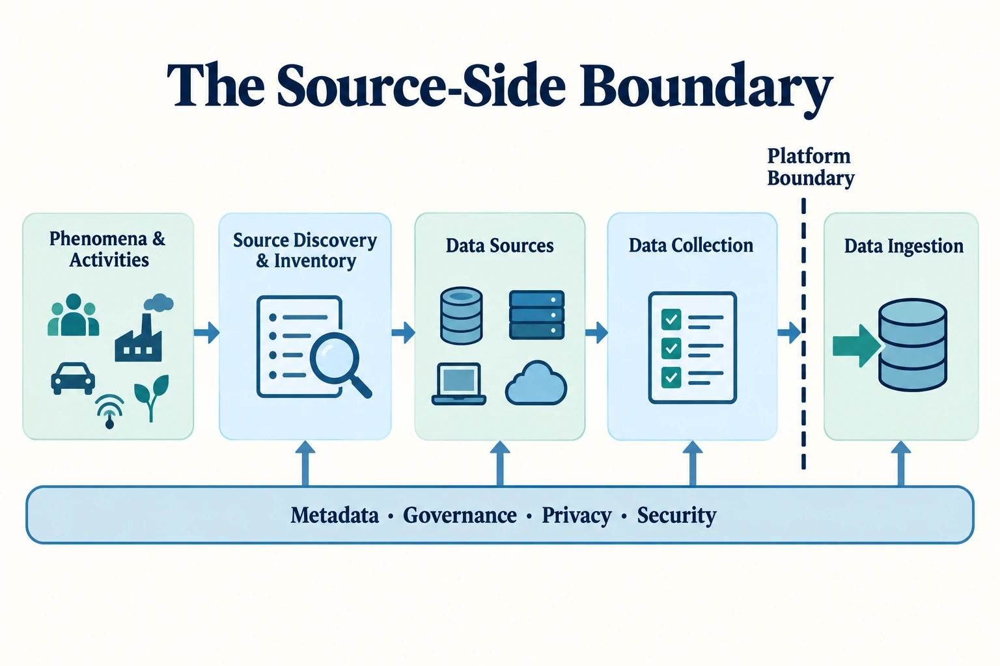

Data Collection is the process of identifying, selecting, acquiring, and capturing data from real-world phenomena and source systems so that it can enter the data ecosystem with a known purpose, provenance, and set of constraints. Its central question is: **What data should we acquire, from where, under what conditions, and how is it captured at the source?**

Collection is broader than extracting records from a database. It determines what becomes observable to an organization in the first place. Decisions about instrumentation, source selection, sampling, timing, and permitted use shape the evidence available to every later process.

## The Source-Side Boundary

This is a conceptual boundary, not a requirement for separate physical systems. An application may capture an event and publish it immediately, but the decisions that define the event belong to collection; the mechanism that transfers it reliably into a managed platform belongs to ingestion.

## Source Discovery and Inventory

Collection begins before a specific source is selected. Organizations must first establish what systems, applications, devices, interfaces, providers, and existing data holdings could supply evidence for the intended purpose. **Source discovery and inventory** makes that landscape visible enough to support an informed collection decision.

Discovery should identify candidate sources and record their basic context: what they produce or hold, who owns and operates them, which populations and activities they represent, how they can be accessed, how often they change, and which legal, contractual, security, or technical constraints apply. The inventory should also expose duplicate sources, undocumented interfaces, unclear ownership, and important gaps where the required phenomenon is not observable.

This activity does not authorize collection or prove that a source is fit for use. Candidate sources still require evaluation for authority, relevance, provenance, quality limitations, continuity, cost, and permissible use. Discovery provides the map; source selection and collection design determine what the organization should acquire from it.

Source discovery is distinct from the [Data Discovery](/docs/data/metadata/#data-discovery) supported by metadata catalogs. Source discovery looks outward or toward the source boundary to identify possible inputs before acquisition. Data discovery helps people and systems find data assets that are already represented within the managed data environment. The two activities should exchange metadata, but they serve different lifecycle decisions.

Three questions organize the capability:

1. **What should we collect?** Define the purpose, population, observation unit, fields, granularity, timing, and acceptable omissions.
2. **Where and how can we obtain it?** Identify authoritative sources and choose methods that preserve the relevant phenomenon and context.
3. **What constraints and biases arise at collection time?** Understand coverage, measurement, selection, source reliability, permissions, and cost before treating the result as evidence.

## Collection and Ingestion

| Dimension         | Data Collection                                                   | [Data Ingestion](/docs/data/engineering/ingestion/)             |
| ----------------- | ----------------------------------------------------------------- | --------------------------------------------------------------- |
| Primary concern   | Acquiring the right data                                          | Moving data reliably                                            |
| Boundary          | Real-world and source-system side                                 | Entry into the managed platform                                 |
| Typical questions | What, why, from whom, and under what constraints?                 | How, when, and with what delivery guarantees?                   |
| Examples          | Instrumentation, surveys, source selection, external acquisition  | Batch transfer, CDC, event ingestion, checkpoints, retries      |
| Major risks       | Bias, inappropriate collection, poor provenance, missing coverage | Loss, duplication, ordering failure, replay gaps, source impact |

Terms such as APIs, files, databases, sensors, event streams, and external feeds can appear on both sides. Collection considers what information those sources make available and whether it is suitable and authoritative. Ingestion considers how records cross the platform boundary. Detailed treatment of batch and incremental loads, CDC, push and pull, replay, backpressure, and delivery semantics therefore remains in Data Ingestion.

## From Collection to a Landing Zone

The source-to-platform path has three distinct responsibilities:

- **Data Collection** establishes or acquires data at the source, including its purpose, scope, method, provenance, and source-side constraints.
- **Data Ingestion** transfers that data reliably across the platform boundary.
- A **landing zone** is the controlled initial platform-side location or state where incoming data can be retained before later processing.

A landing zone is not a collection method. It may preserve source representations and initial metadata, but it exists after data has crossed into platform management. The broader structural choices—system boundaries, source topology, and integration patterns—belong to [Data Architecture](/docs/data/architecture/), while implementation and operation of the transfer belong to [Data Engineering](/docs/data/engineering/).

## Collection Capabilities









## Relationships with Neighboring Topics

- [Data Architecture](/docs/data/architecture/) defines system boundaries, source and consumer topology, and structural integration choices. Collection is the source-side capability within that architecture.
- [Metadata](/docs/data/metadata/) provides the mechanisms for discovery, lineage, semantics, and automated control. Collection should preserve source, owner, observation time, method, restrictions, and other provenance needed by those mechanisms.
- [Data Quality](/docs/data/management/data-quality-dimensions/) provides the general quality framework. Collection decisions strongly influence completeness, accuracy, timeliness, and representativeness before quality controls can operate.
- [Data Governance](/docs/data/governance/) establishes policies, accountability, standards, and permissible use. [Data Security](/docs/data/security/) defines protection and handling controls. [Data Privacy](/docs/data/privacy/) asks whether and how information about people should be collected and processed.
- [Data Sharing](/docs/data/sharing/) makes governed data available to consumers or other organizations. Collection brings data into the landscape from sources; sharing distributes or exposes data from the landscape.

## Summary

Data Collection establishes what an organization can know. Strong collection makes purpose, source authority, method, scope, provenance, restrictions, and limitations explicit before data crosses the platform boundary. Data Ingestion can then move that data reliably, but it cannot recover observations that were never captured or remove every bias introduced when they were selected and measured.
