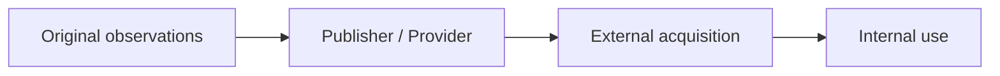

External and third-party data is acquired from outside the organization's direct operational control. Sources include partners, suppliers, commercial providers, public bodies, open-data publishers, research institutions, and web-accessible resources. Acquisition can broaden coverage or provide knowledge that would be impractical to collect directly, while introducing dependencies and restrictions that internal pipelines cannot remove.

## Establish the Provenance Chain

The immediate supplier may not be the originator. A reseller may aggregate public records, partner contributions, inferred attributes, and licensed reference data. Record the chain where possible:

For each stage, understand who collected or transformed the data, under which method and authority, and which version was supplied. A provider's reputation does not substitute for dataset-level provenance.

## Acquisition Considerations

- **License and permitted use:** identify allowed purposes, users, combinations, derivative works, and territories.
- **Contractual restrictions:** understand confidentiality, security, retention, deletion, audit, and incident obligations.
- **Redistribution and attribution:** determine whether original or derived data may be republished and what notices are required.
- **Update expectations:** define cadence, delivery windows, corrections, late changes, and notice of schema or definition changes.
- **Source continuity:** assess whether the publisher, collection program, or access route is likely to persist.
- **Quality uncertainty:** examine coverage, collection method, validation, known error, and fitness for the internal purpose.
- **Versioning:** retain supplier release, effective period, acquisition time, and correction history so results can be reproduced.
- **Supplier dependency:** plan for price changes, access withdrawal, degraded service, and replacement difficulty.

Public accessibility does not imply unrestricted use, stable availability, or high quality. Web collection additionally depends on changing pages, technical controls, terms, intellectual-property considerations, privacy expectations, and the ability to interpret content in context. Applicable obligations require qualified legal or policy review rather than assumptions based on access alone.

## Acquisition Is Not Data Sharing

[Data Collection](/docs/data/collection/) views external data as an **input** to the organization's data landscape. [Data Sharing](/docs/data/sharing/) views data as an asset made available **to consumers or ecosystems** under a governed producer-consumer relationship.

The same exchange may participate in both viewpoints: a partner shares a dataset, while the receiving organization acquires it. The receiving side must evaluate source authority, collection method, provenance, restrictions, and suitability; the providing side must govern the product, interface, entitlement, and ongoing relationship.

[Open Data](/docs/data/sharing/open-data/) illustrates the distinction. For collection, open data is a potential source whose license, provenance, coverage, and versions require evaluation. For sharing, open data is a publication and distribution model designed for broad reuse.

## Operating the Dependency

Assign an internal owner for the supplier relationship and an owner for the dataset's use. Preserve licenses, terms, provider contacts, provenance, permitted-use decisions, and release metadata alongside the asset. Monitor definition changes and source continuity, and define what happens to stored and derived data if rights expire or the agreement ends.

The transfer mechanism—scheduled files, APIs, database access, or streams—belongs to [Data Ingestion](/docs/data/engineering/ingestion/). Acquisition requirements should inform that mechanism without duplicating its reliability design.

## Summary

External data extends what an organization can observe but also imports another party's methods, uncertainties, rights, and operating risk. Treat acquisition as a governed dependency with a traceable provenance chain, explicit permissions, version history, and an exit plan.
