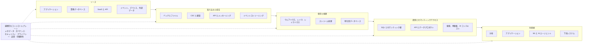

組織が運用するデータベースやパイプラインは、通常一つではありません。データは業務アプリケーション、分析システム、SaaS、イベントストリーム、AI システム、外部提供元、組織境界をまたいで生成・利用されます。接続点が増えるたびに、永続化、移動、意味、統制、責任に関する判断が必要になります。

データアーキテクチャ（Data Architecture）とは、データをどこに置き、どう移動させ、システムをどう連携させ、業務処理と分析処理をどう分離または統合し、どこに統制を適用し、全体をどう進化させるかを定める構造的な意思決定の集合です。データベース構成図はアーキテクチャの一部を表しますが、インターフェース、フロー、オーナーシップ境界、判断理由もアーキテクチャに含まれます。

本ページは、この意思決定領域を見渡すための案内図です。再利用可能なメンタルモデルを示し、個別の論点を専門ページへ案内します。








## データアーキテクチャが扱う範囲

データアーキテクチャは、技術、情報フロー、組織責任にまたがります。

- **データソースと利用者:** どのアプリケーション、人、パートナー、デバイス、モデル、エージェントがデータを生成・利用するか
- **ストレージと永続化:** 業務状態、分析履歴、ファイル、イベント、索引、派生表現をどのシステムに記録するか
- **移動と統合:** バッチ、API、複製、変更データキャプチャ（CDC）、メッセージング、ストリーミング、フェデレーションのどれで境界を越えるか
- **変換:** 検証、付加、集約、モデリング、意味解釈をどこで行うか
- **提供とアクセス:** SQL、API、セマンティック層、検索、特徴量、データプロダクトを通じて情報をどう利用可能にするか
- **メタデータと統制:** 意味、リネージ、オーナーシップ、ポリシー、品質、運用状態をどう記録するか
- **信頼性と可観測性:** 鮮度、完全性、障害、依存関係、サービス上の約束をどう可視化するか
- **セキュリティとプライバシー境界:** アイデンティティ、認可、分離、最小化、保持、監査をどこに適用するか
- **オーナーシップ境界:** 中央、プラットフォーム、プロダクト、ドメインチームのうち、どこが各インターフェースと成果に責任を持つか

隣接領域は重なり合いますが、重視する問いが異なります。

| 領域                                                | 主な焦点                                                                                                                                                                                 |
| --------------------------------------------------- | ---------------------------------------------------------------------------------------------------------------------------------------------------------------------------------------- |
| **データアーキテクチャ**                            | データシステム全体の構造、境界、関係、重要な設計判断                                                                                                                                     |
| **データエンジニアリング**                          | アーキテクチャを実装するパイプライン、変換、サービスの構築と運用                                                                                                                         |
| **データプラットフォーム**                          | データ生成側と利用側のワークロードを支える再利用可能なインフラと機能                                                                                                                     |
| [**データマネジメント**](/ja/docs/data/management/) | ライフサイクル全体を通じた信頼性、アクセス性、利用性、持続性の維持                                                                                                                       |
| **データガバナンス**                                | 意思決定権、ポリシー、説明責任、統制。 [データガバナンス](/ja/docs/data/governance/) と [フェデレーテッド・データガバナンス](/ja/docs/data/governance/federated-data-governance/) を参照 |

これらは実務上の境界であり、排他的な区分ではありません。たとえばデータ契約は、アーキテクチャ上のインターフェースであると同時に、エンジニアリング成果物、プラットフォーム機能、ガバナンス統制にもなります。

## 意思決定のフレームワーク

製品一覧ではなく、意思決定として記述するとアーキテクチャを比較しやすくなります。

### データはどこで生まれるか

業務データベース、アプリケーション、SaaS、ファイル、API、デバイス、外部データセット、イベントストリームは、権威性、変更方法、インターフェースの安定性、オーナーシップが異なります。記録の正本となるシステムと、そのシステムが信頼性を持って公開できるイベントまたはスナップショットを特定します。

### データはどう移動するか

バッチ取り込みは、境界が明確で照合しやすい配信に向きます。CDC はデータベース変更を低遅延で伝播しますが、ログとスキーマの意味を引き継ぎます。メッセージングとイベントストリーミングは反応時間を短縮する一方、順序、再生、互換性の判断が必要です。API はドメインインターフェースを維持できますが、実行時依存を生みます。フェデレーションはデータを元の場所に残せますが、リモート側の可用性と性能に依存します。 [データ統合とフロー](integration-and-flow/) および [データ交換メカニズム](/ja/docs/data/sharing/data-exchange-mechanisms/) を参照してください。

### データをどこに保存するか

業務データベースはアプリケーションのトランザクションに、ウェアハウスは統制された分析クエリに適しています。データレイクとオブジェクトストレージは、大量で多様なデータを保持します。レイクハウスはオブジェクトストレージ上にテーブル管理機能を加えます。特化型データベース、索引、キャッシュは、汎用ストアが不得意なワークロードを担います。製品の序列ではなく、アクセスパターン、整合性、保持、分離、コストに基づいて決めます。

### データをどこで変換するか

変換は、ソースアプリケーション、取り込みパイプライン、ストリームプロセッサ、ウェアハウスやレイクハウス、 [セマンティック層](/ja/docs/data/metadata/semantic-layer/) 、利用アプリケーションで行えます。処理を生成側に寄せるとドメインの意味を保ちやすく、中央に集めると再利用と一貫性を高めやすくなります。配置の選択は、結合度、遅延、テスト容易性、説明責任を変えます。

### データをどう提供するか

SQL テーブル、API、指標、検索索引、特徴量システム、ストリーム、 [データプロダクト](/ja/docs/data/metadata/data-products/) は、それぞれ異なる契約を提供します。提供インターフェースでは、意味、鮮度、互換性、アクセスポリシー、障害時の振る舞いを明示します。

### 誰が所有するか

中央データチームは一貫性と規模の経済を生み出せます。ドメインチームは文脈とローカルな説明責任を維持できます。プラットフォームチームは共通の標準経路を提供できます。フェデレーテッドモデルはこれらを組み合わせますが、インターフェースと意思決定権が明確でなければ機能しません。 [データメッシュ](/ja/docs/data/metadata/data-mesh/) はドメイン指向モデルの一つであり、オーナーシップを分散する唯一の方法ではありません。

## アーキテクチャ参照モデル

次のモデルは思考のためのレンズであり、必須のパイプラインではありません。リクエストがストレージを経由しない場合も、ストリームがアプリケーションへ直接流れる場合も、フェデレーテッドクエリが利用時にソースへ到達する場合もあります。

横断的な関心事には、複数の境界に執行点が必要です。 [メタデータ](/ja/docs/data/metadata/) は定義、リネージ、オーナーシップ、自動化を接続し、 [データプライバシー](/ja/docs/data/privacy/) は収集と利用を形作ります。品質と可観測性は、インターフェースが約束を満たしているかを明らかにします。

## アーキテクチャの全体像

アーキテクチャの名称は、競合する解決策の一覧ではなく、異なる次元を表します。

- **ワークロードとストレージ:** 業務システム、ウェアハウス、レイク、レイクハウス
- **移動と処理:** バッチ、Lambda、Kappa、ストリーミング、イベント駆動
- **オーナーシップと協調:** 中央集約、フェデレーテッド、分散型、 [データメッシュ](/ja/docs/data/metadata/data-mesh/) 、データファブリック

これらの次元は通常、組み合わせて使われます。たとえば、データメッシュに着想を得たドメインオーナーシップを採用し、分析テーブルをレイクハウスに保存し、イベントでアプリケーションを統合できます。主要パターンの定義、適用場面、トレードオフは [データアーキテクチャパターン](patterns/) を参照してください。

### 複数の視点から探す

アーキテクチャは多次元であるため、同じトピックが複数の視点に現れます。

| 視点                         | 出発点                                                                                                                                                                                                             |
| ---------------------------- | ------------------------------------------------------------------------------------------------------------------------------------------------------------------------------------------------------------------ |
| **アーキテクチャ上の関心事** | 保存と処理、 [統合とフロー](integration-and-flow/) 、 [セマンティック層](/ja/docs/data/metadata/semantic-layer/) 、 [メタデータ](/ja/docs/data/metadata/) 、 [データプライバシー](/ja/docs/data/privacy/) 、信頼性 |
| **データ移動**               | [バッチ、CDC、API、複製、メッセージング、ストリーミング、フェデレーション](integration-and-flow/)                                                                                                                  |
| **アーキテクチャスタイル**   | [中央集約、共通基盤、イベント駆動、ストリーミング、フェデレーテッド、ドメイン指向のパターン](patterns/) 、 [データメッシュ](/ja/docs/data/metadata/data-mesh/)                                                     |
| **ワークロード**             | [データ分析](/ja/docs/data/analytics/) 、業務アプリケーション、リアルタイム判断、 [機械学習](/ja/docs/ai/machine-learning/) 、 [AI のためのデータ](/ja/docs/ai/data-for-ai/)                                       |
| **組織モデル**               | 中央集約、フェデレーテッド、ドメイン指向、プラットフォーム指向のオーナーシップ、 [データチーム](/ja/docs/data/teams/)                                                                                              |

### 解決したい問題から選ぶ

| 実現したいこと                              | 最初に読むページ                                                                                                                                                    |
| ------------------------------------------- | ------------------------------------------------------------------------------------------------------------------------------------------------------------------- |
| 分析基盤を構築する                          | [アーキテクチャパターン](patterns/) のウェアハウスとレイクハウス、および [モダンデータアーキテクチャ](modern-data-architecture/)                                    |
| バッチ遅延を減らす                          | [データ統合とフロー](integration-and-flow/) の CDC とストリーミング                                                                                                 |
| 疎結合なシステムを統合する                  | [データアーキテクチャパターン](patterns/) のイベント駆動パターン                                                                                                    |
| ドメイン横断でオーナーシップを拡張する      | [データメッシュ](/ja/docs/data/metadata/data-mesh/) と [フェデレーテッド・データガバナンス](/ja/docs/data/governance/federated-data-governance/)                    |
| 情報の移動を理解する                        | [データ統合とフロー](integration-and-flow/)                                                                                                                         |
| 再利用可能なインフラを整備する              | [データアーキテクチャが扱う範囲](#データアーキテクチャが扱う範囲) のデータプラットフォーム境界と [モダンデータアーキテクチャ](modern-data-architecture/)            |
| 分散データを統制する                        | [データガバナンス](/ja/docs/data/governance/) と [メタデータ](/ja/docs/data/metadata/)                                                                              |
| ML や AI アプリケーションへデータを供給する | [AI のためのデータ](/ja/docs/ai/data-for-ai/) 、 [セマンティック層](/ja/docs/data/metadata/semantic-layer/) 、 [検索拡張生成](/ja/docs/ai/context-engineering/rag/) |

## AI のためのデータアーキテクチャ

AI は、アーキテクチャが支えるべきデータ表現と利用者の範囲を広げます。文書、画像、音声、埋め込み、ベクトル索引、特徴量、プロンプト、取得コンテキストは、従来の分析テーブルとは異なる更新、来歴、保持、アクセス要件を持ちます。検索経路では対話的な遅延で最新の業務コンテキストが必要になる一方、学習と評価には再現可能なスナップショットが必要です。

AI エージェントは、ツールを選び、アクションを開始できるデータ利用者です。アクセス時には、企業データの統制されていないコピーを作るのではなく、企業のアイデンティティ、認可、リネージ、利用目的の境界を維持すべきです。ベクトル検索は検索手段の一つであり、ソース品質、メタデータ、ランキング、認可の代替ではありません。

アーキテクチャ上の課題は、出所、変換、検索、利用に関する証拠を保ちながら、信頼できるソースを境界の明確な AI インターフェースへ接続することです。詳細は [AI のためのデータ](/ja/docs/ai/data-for-ai/) 、 [AI インフラストラクチャ](/ja/docs/ai/ai-infrastructure/) 、 [コンテキストエンジニアリング](/ja/docs/ai/context-engineering/) 、 [検索拡張生成](/ja/docs/ai/context-engineering/rag/) を参照してください。

## 次に読むページ

設計基準を定めるなら [データアーキテクチャの原則](principles/) 、構造を比較するなら [データアーキテクチャパターン](patterns/) 、境界や遅延が主要課題なら [データ統合とフロー](integration-and-flow/) 、異種混在基盤のロードマップを検討するなら [モダンデータアーキテクチャ](modern-data-architecture/) から始めてください。

今後、ウェアハウス、レイク、レイクハウス、イベント駆動、ストリーミング、データ契約、CDC、メタデータ、セマンティック層、プラットフォーム、データプロダクト、リアルタイム、AI 指向アーキテクチャを個別ページとして拡張できます。これにより、本ハブを巨大な用語集にせず、各テーマを深掘りできます。

## 参考資料

- [Martin Fowler: Lambda Architecture](https://martinfowler.com/bliki/LambdaArchitecture.html) — バッチ経路と高速経路の二重構造、およびその複雑性を簡潔に説明
- [Jay Kreps: Questioning the Lambda Architecture](https://www.oreilly.com/radar/questioning-the-lambda-architecture/) — Kappa という代替案につながった原典
- [Martin Fowler: Data Mesh Principles and Logical Architecture](https://martinfowler.com/articles/data-mesh-principles.html) — 4 原則とアーキテクチャ上の意味
- [NIST Big Data Interoperability Framework, Volume 6: Reference Architecture](https://www.nist.gov/publications/nist-big-data-interoperability-framework-volume-6-reference-architecture) — ベンダー中立の参照アーキテクチャと役割モデル
