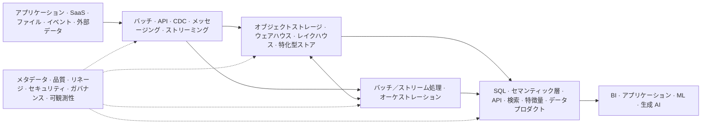

「モダンデータアーキテクチャ」は厳密な標準ではなく、柔軟な業界用語です。有用な意味では、異種混在するクラウド時代のデータ環境を運用する能力を指します。具体的には、弾力的なストレージと計算資源、バッチとストリーミングのフロー、複数のワークロード特化型ストア、自動化されたメタデータと統制、再利用可能なプラットフォームサービス、分析・アプリケーション・機械学習・AI 向けの統制されたアクセスです。

単に「新しい製品を購入したアーキテクチャ」を意味するものではありません。

## 一つの主要分析経路からの変化

従来の単純化された経路は、次のように表せます。

このモデルは現在も有効です。統制された分析境界を作り、業務ソースを照合し、共通レポーティングを支えます。非構造化データ、ドメインによる独立した提供、対話的 API、低遅延イベント、データサイエンスの探索、多数の特化型ワークロードが必要になると限界が現れます。

モダンな環境は、相互作用する能力のグラフへ進化することが一般的です。

二つ目の図は目標構成ではありません。一つの中央ストアを選ぶ問題から、複数経路の相互作用を統制する問題へアーキテクチャが移行する理由を示しています。

## 一般的な能力

### クラウドオブジェクトストレージと計算資源の分離

オブジェクトストレージは、大量で多様なデータに耐久性と弾力性のある保存を提供します。独立した計算エンジンは、取り込み、変換、SQL、機械学習ごとにスケールできます。この分離は柔軟性とワークロード分離を高める一方、カタログ、テーブル、セキュリティ、コストを意図的に統制する必要があります。

### ウェアハウスとレイクハウス

クラウドウェアハウスは、管理された分析性能とガバナンスを引き続き提供します。レイクハウスは、レイク型ストレージにテーブル管理とトランザクション機能を加えます。ワークロード、エンジン、可搬性、運用要件が異なるため、多くの組織は両方を利用します。

### CDC、ストリーミング、イベント駆動統合

CDC は業務コミットから下流状態への遅延を減らします。ストリームプロセッサは継続的なビューと反応を生成します。ドメインイベントは、意味のある変更を通じて独立システムを協調させます。これらは遅延を減らす一方、常時稼働する状態、互換性、順序、再生、可観測性を複雑にします。 [データ統合とフロー](../integration-and-flow/) を参照してください。

### 特化型データストア

検索索引、キーバリューストア、グラフデータベース、時系列システム、ベクトル索引、キャッシュは、特定のアクセスパターンを最適化します。ポリグロット永続化はワークロード適合性を高めますが、表現を増やすたびに同期、リネージ、ガバナンス、ライフサイクルの作業が増えます。

### セマンティックインターフェースとプロダクトインターフェース

[セマンティック層](/ja/docs/data/metadata/semantic-layer/) は、統制された業務上の意味を物理テーブルから分離します。 [データプロダクト](/ja/docs/data/metadata/data-products/) は、データ、メタデータ、インターフェース、オーナーシップ、サービス期待値を利用可能な単位へまとめます。これらは、異種混在する物理環境を一つのデータベースだと見なすことなく、一貫した利用体験を作ります。

### メタデータ駆動の運用と DataOps

自動化されたリネージ、分類、品質シグナル、ポリシー文脈、利用テレメトリによって、システムとチームは変化に対応できます。 [アクティブメタデータ](/ja/docs/data/metadata/active-metadata/) は、メタデータを運用コントロールプレーンの一部として説明しています。DataOps は、反復的な提供、テスト、自動化、可観測性、フィードバックをデータ業務に適用します。ツールを導入するだけでは、この運用規律は生まれません。

### ドメインオーナーシップと共通プラットフォーム

中央チームだけで、すべてのドメイン定義を無制限に所有することはできません。ドメイン指向オーナーシップは説明責任を文脈の近くに置き、共通プラットフォームは相互運用可能なセルフサービス機能を提供します。 [データメッシュ](/ja/docs/data/metadata/data-mesh/) は、この組み合わせの一形態をフェデレーテッドガバナンスとともに定義します。分散技術スタックだけでなく、組織変革が必要です。

### ML と AI の利用者

ML は、学習、特徴量、評価、モデル提供の経路を追加します。生成 AI は、非構造化コーパス、埋め込み、ベクトルまたはハイブリッド検索、プロンプト時コンテキスト、企業システムへアクセスするエージェントを追加します。データ基盤は [AI のためのデータ](/ja/docs/ai/data-for-ai/) 、ベクトル検索だけでなく統制された経路全体が検索品質を決める理由は [検索拡張生成](/ja/docs/ai/context-engineering/rag/) を参照してください。

## 利点と新たな複雑性

| 得られる能力                       | 新たに生じる複雑性                                       |
| ---------------------------------- | -------------------------------------------------------- |
| 弾力的でワークロード固有のスケール | 複数サービスにまたがるコスト配賦、クォータ、容量動作     |
| より高速で継続的なデータ           | 状態を持つ運用、再生、順序、スキーマ互換性               |
| 用途別の複数エンジン               | コピー、同期、カタログ、アイデンティティ、可搬性         |
| ドメインの自律性                   | ドメイン横断の相互運用、発見、フェデレーテッドな意思決定 |
| セルフサービス基盤                 | プロダクト管理、サポート、標準経路の境界、例外処理       |
| 自動化されたメタデータとポリシー   | メタデータ品質、統制のフィードバックループ、説明可能性   |
| AI 対応の検索とコンテキスト        | 非構造化データ品質、来歴、アクセスフィルタリング、評価   |

モダナイゼーションは、複雑性を減らさず別の場所へ移すことがあります。マネージドサービスはサーバー運用をなくす一方、独自コントロールプレーンを加える場合があります。オープンテーブル形式はストレージのロックインを減らす一方、カタログとエンジン動作への結合を残します。リアルタイムパイプラインは鮮度を改善する一方、利用者が経験する障害モードを増やします。

## ラベルではなく能力を評価する

次の具体的な問いを使います。

- どのワークロードと遅延目標が、独立した経路を正当化するか
- 各エンティティ、イベント、指標、ポリシーの正本はどのシステムか
- チームは安定した統制済みインターフェースを通じてデータを発見・利用できるか
- ソースから利用側まで変更を追跡し、安全に再生または照合できるか
- 計算資源、ストレージ、コピーをコストとサービスの観点で観測できるか
- プラットフォームの抽象化は、重要なワークロード差異を維持しているか
- 意味と統制を断片化させず、オーナーシップを拡張できるか
- AI の利用側へ、最新で認可済みかつ出所を追跡できるコンテキストを届けられるか

「モダン」とは、進化可能性、相互運用性、自動化、適時なデータ、統制されたセルフサービス、観測可能な信頼性、多様な利用者への対応といったアーキテクチャ能力と制約を表すべきです。新製品がモダンなのは、組織が実際に抱える問題に対してこれらの特性を改善する場合だけです。

[データアーキテクチャのハブ](../) に戻るか、 [データアーキテクチャパターン](../patterns/) で構造的な選択を分類し、 [データアーキテクチャの原則](../principles/) をモダナイゼーション判断へ適用してください。
