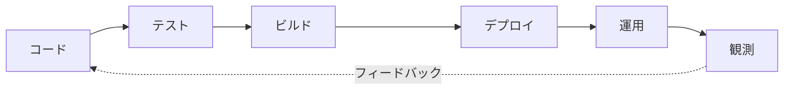
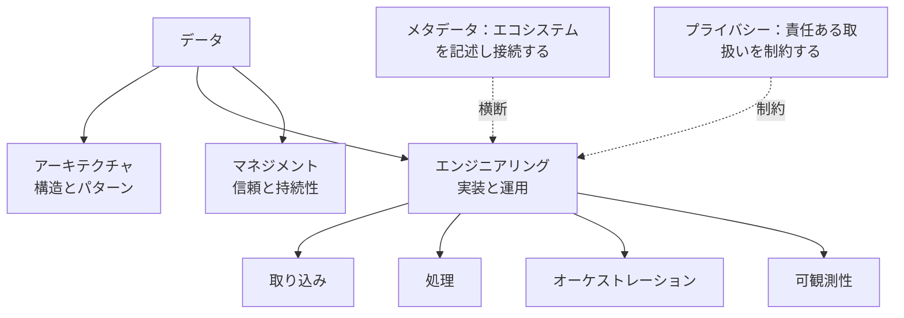

データエンジニアリング（Data Engineering）は、データを下流のシステムや人が利用できる形へ移動・変換する仕組みを設計、実装、自動化、運用する分野です。中心となる問いは、**信頼できるデータフローとデータプラットフォームをどのように構築・運用するか**です。

対象は ETL だけではありません。パイプライン、分散処理、再利用可能なプラットフォーム機能、インフラ、デプロイ、運用プラクティスまでを含みます。本番のデータフローには、信頼性、スケーラビリティ、再現性、復旧性、可観測性、保守性、性能、コストへの配慮が必要です。

## データエンジニアリングのライフサイクル

これは概念モデルであり、必須の直線的アーキテクチャではありません。実際のシステムには分岐、フィードバックループ、イベントストリーム、複数のストレージ層、独立したデータ提供側と利用側、バッチとストリーミングの経路があります。オーケストレーション、可観測性、自動化、信頼性がフロー全体を横断し、運用可能にします。

## 中核となるエンジニアリング能力








これらの能力を組み合わせることで、データを移動し、処理し、作業を調整し、システムを観測して、状況が変化しても信頼できる形で運用するという、データエンジニアリングの焦点が明確になります。

### データ取り込み

[データ取り込み](ingestion/) は、運用データベース、ファイル、API、外部提供元、イベントストリームからデータをプラットフォームへ運びます。バッチ・増分抽出、変更データキャプチャ（CDC）、プッシュ・プル方式、再試行、順序、重複、ソースへの負荷を扱います。

### データ処理

[データ処理](processing/) は、フィルタリング、結合、集計、付加情報、検証により、ソースや中間表現を利用可能なデータセットへ変換します。ETL と ELT、バッチ処理とストリーム処理、パーティショニング、状態、チェックポイント、耐障害性を含みます。

### データオーケストレーション

[データオーケストレーション](orchestration/) はワークフローと依存関係を調整します。スケジュールまたはイベント駆動の実行、ワークフロー状態、再試行、タイムアウト、バックフィル、パラメータ、障害対応を管理します。

### データ可観測性

[データ可観測性](observability/) は、実行状態、鮮度、レイテンシ、量、スキーマ変更、上下流への影響といった運用シグナルを提供します。何が起き、なぜ起きているかを明らかにする能力であり、データ品質管理そのものではありません。

## 信頼できるデータパイプライン

パイプラインは、一度だけ正しい結果を出せば完成するものではありません。入力の変化、障害、再試行、規模の拡大、運用変更の下でも、信頼できる結果を継続して生成する必要があります。

- **冪等性と重複処理** — 再試行による意図しない副作用を防ぐ
- **再試行、チェックポイント、リプレイ、復旧** — 一時的・部分的な障害から安全に回復する
- **バックフィル** — 現行処理を妨げずに過去区間を再計算する
- **スキーマ進化** — 変更をサイレントな破損にしない
- **依存関係管理と障害分離** — 問題の不要な連鎖を防ぐ
- **遅延到着と重複** — 順不同や再配信を正しく扱う
- **スケーラビリティ、性能、コスト** — 目標を適切な資源で満たす

## バッチとストリーミング

**バッチ処理** は境界のあるデータセットを対象とし、スケジュールまたはトリガーで実行されます。定期的な再計算やバックフィルに適しています。

**ストリーム処理** は継続的またはほぼ継続的なイベントを対象とし、イベント時刻、状態、ウィンドウ、チェックポイント、遅延イベント、リプレイを扱います。

両者は排他的な陣営ではありません。本番環境では、継続的なイベント取り込み、ストリームによる一部計算、バッチによる照合や履歴再計算を組み合わせることが一般的です。構造上の選択はデータアーキテクチャが扱い、データエンジニアリングは選択された経路を実装・運用します。

## プラットフォームエンジニアリング

データプラットフォームエンジニアリングは、標準化された取り込み、処理環境、オーケストレーション、デプロイ、可観測性、インフラのプロビジョニング、開発者体験、セルフサービス機能を再利用可能なサービスとして提供します。本イテレーションでは独立ページを作成せず、将来の拡張領域として位置付けます。

## CI/CD と自動化

自動テスト、制御されたビルド、環境昇格、Infrastructure as Code、スキーマ移行、デプロイ自動化、デプロイ後の検証により、変更を再現可能かつ監査可能にします。

## 隣接するデータ領域との関係

### データエンジニアリングとデータアーキテクチャ

データアーキテクチャは、構造上の選択、システム境界、アーキテクチャパターン、構成要素の関係を定義します。データエンジニアリングは、それらを実現するパイプラインとプラットフォーム機能を実装・運用します。

### データエンジニアリングとデータマネジメント

[データマネジメント](/ja/docs/data/management/) は、品質、アクセス性、ライフサイクル、標準化、文書化、サービスレベル、運用持続性に関する期待を定めます。データエンジニアリングは、パイプライン検証、監視、復旧、自動化などの仕組みでその期待を実装します。品質の詳細は [データ品質の次元](/ja/docs/data/management/data-quality-dimensions/) を参照してください。

### データエンジニアリングとメタデータ

エンジニアリングシステムは、スキーマ、リネージ、実行記録、依存関係、所有、鮮度、運用状態などの [メタデータ](/ja/docs/data/metadata/) を生成・利用します。カタログ、セマンティックレイヤー、アクティブメタデータ、メタデータガバナンスの詳細は既存ページで扱います。

### データエンジニアリングとデータプライバシー

パイプラインは、適切なアクセス制御、データ最小化、マスキングや変換、保持・削除、セキュアな転送・保存など、 [データプライバシー](/ja/docs/data/privacy/) が定める要件を実装します。原則、ガバナンス、適法な処理、権利は専用ページで扱います。
