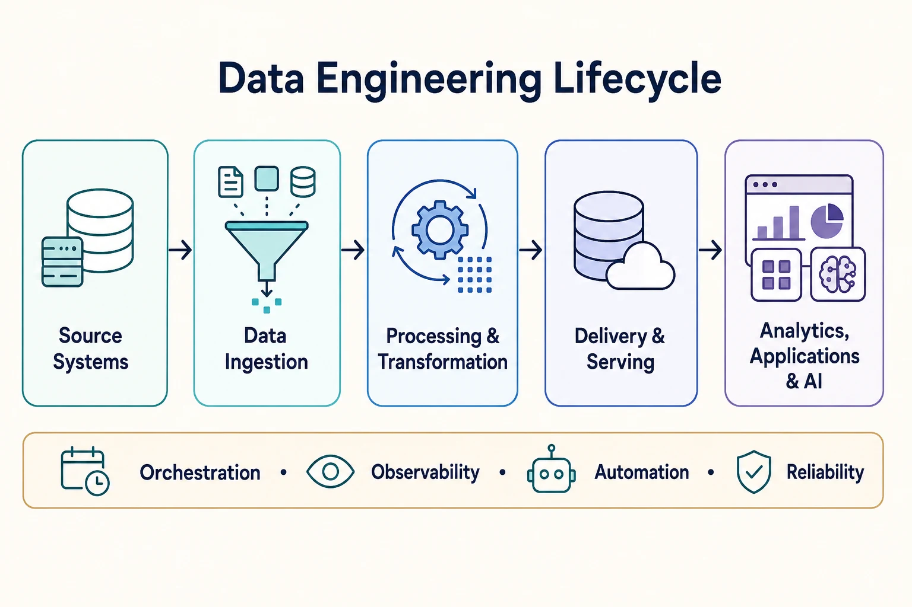
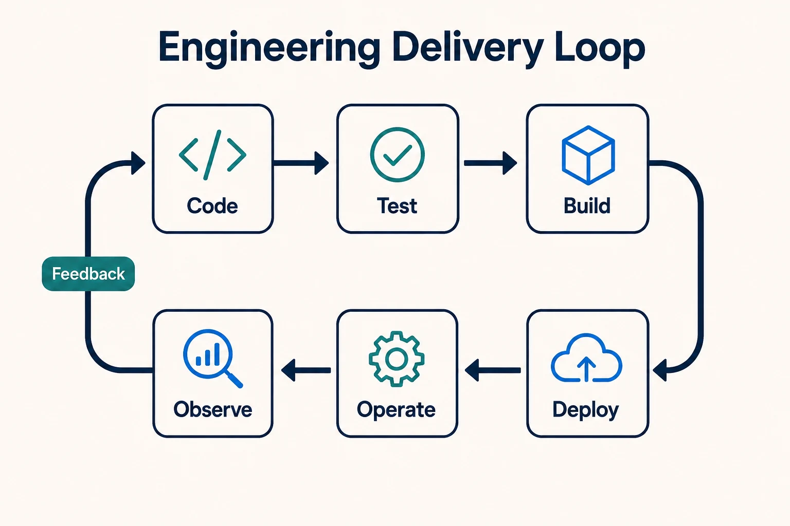
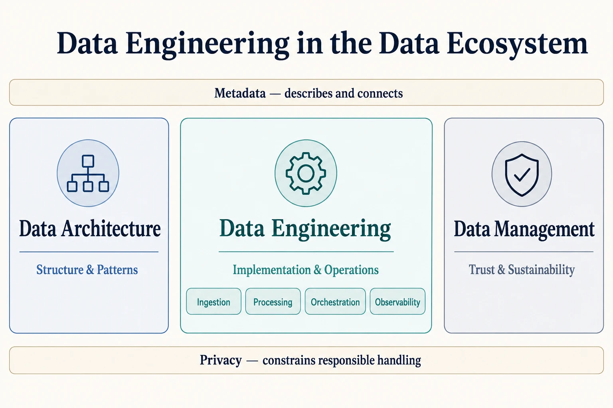

Data Engineering is the discipline of designing, implementing, automating, and operating systems that move and transform data into forms that downstream systems and people can use. Its central question is: **How do we build and operate reliable data flows and data platforms?**

The discipline is broader than ETL. It includes pipelines, distributed processing, reusable platform capabilities, infrastructure, deployment, and operational practices. A production data flow must be reliable, scalable, repeatable, recoverable, observable, maintainable, performant, and cost-aware.

## The Data Engineering Lifecycle

A useful mental model follows data from its producers to its consumers:

This is a conceptual flow, not a required linear architecture. Real systems contain branches, feedback loops, event streams, multiple storage layers, independent producers and consumers, and combinations of batch and streaming paths. Orchestration, observability, automation, and reliability span the entire flow and make it operable.

## Core Engineering Capabilities








Together, these capabilities provide a focused engineering view: move data, process it, coordinate the work, and observe the resulting system so it can operate reliably as conditions change.

### Data Ingestion

[Data Ingestion](ingestion/) gets data from operational databases, files, APIs, external providers, and event streams into the platform. It includes batch and incremental extraction, Change Data Capture (CDC), push and pull delivery, and controls for retries, ordering, duplication, and source-system impact.

### Data Processing

[Data Processing](processing/) turns source or intermediate representations into useful datasets through filtering, joins, aggregation, enrichment, and validation. It includes ETL and ELT, batch and stream processing, and distributed-computation concerns such as partitioning, state, checkpoints, and fault tolerance.

### Data Orchestration

[Data Orchestration](orchestration/) coordinates workflows and their dependencies. It manages scheduling or event-driven execution, workflow state, retries, timeouts, backfills, parameterization, and failure handling across otherwise independent workloads.

### Data Observability

[Data Observability](observability/) provides signals about the operational state of pipelines and data flows, including execution status, freshness, latency, volume, schema change, and upstream or downstream impact. Observability asks what is happening and why; it does not replace the broader discipline of data quality management.

## Building Reliable Data Pipelines

A pipeline is not complete merely because it produces the correct result once. It must continue producing trustworthy results under changing inputs, failures, retries, scale, and operational change.

Recurring engineering properties include:

- **Idempotency and duplicate handling** so a retry does not create unintended additional effects
- **Retries, checkpoints, replay, and recovery** so transient and partial failures can be handled safely
- **Backfills** so historical intervals can be recomputed without disrupting current delivery
- **Schema evolution** so producers and consumers can change without silent corruption
- **Dependency management and failure isolation** so one problem does not cascade unnecessarily
- **Late-arriving data** handling so results can be corrected when events arrive out of order
- **Scalability and performance** so increasing volume, velocity, or complexity remains manageable
- **Cost awareness** so reliability and latency targets are achieved with proportionate resources

These properties interact. For example, replay requires idempotent outputs; backfills need isolation from current workloads; and schema evolution depends on metadata, contracts, validation, and compatibility policies.

## Batch and Streaming

**Batch processing** operates on bounded datasets. It commonly runs on a schedule or trigger and supports periodic recomputation and backfills. Batch boundaries make work easier to isolate and replay, but they also determine how current the output can be.

**Stream processing** operates on continuous or near-continuous events. It must account for event time, processing state, windows, checkpoints, late events, and replay. Low latency does not remove the need for recovery or correction.

Batch and streaming are complementary processing modes, not mutually exclusive camps. A production environment may ingest events continuously, compute some results in streams, and use batch workloads for reconciliation or historical recomputation. The structural implications of choosing and combining these modes belong to Data Architecture; Data Engineering implements and operates the selected paths.

## Platform Engineering

Data Platform Engineering turns recurring engineering needs into reusable services rather than requiring every team to assemble them independently. A platform may provide standardized ingestion, processing environments, orchestration, deployment, observability, infrastructure provisioning, developer experience, and self-service capabilities.

The platform should reduce repeated operational work while preserving clear ownership. It is an enabling capability within Data Engineering, not a reason to hide reliability, cost, or governance decisions from the teams producing and consuming data.

## CI/CD and Automation

Data Engineering applies software-engineering practices to data systems:

Automated tests, controlled builds, environment promotion, Infrastructure as Code, schema migration, deployment automation, and post-deployment validation make changes repeatable and auditable. These practices are a natural future expansion area; they are introduced here without creating placeholder pages.

## Relationships with Neighboring Data Disciplines

The boundaries below are conceptual views of the same ecosystem, not a literal organizational hierarchy.

### Data Engineering and Data Architecture

Data Architecture defines structural choices, system boundaries, architectural patterns, and how components fit together. Data Engineering implements and operates the pipelines and platform capabilities that realize those choices. For example, an architectural decision to use event-driven ingestion leads to engineering work on connectors, event processing, retries, checkpointing, monitoring, and deployment.

Data Architecture remains a sibling perspective.

### Data Engineering and Data Management

[Data Management](/docs/data/management/) maintains data as a trustworthy, usable, and sustainable asset. It defines expectations for quality, accessibility, lifecycle, standardization, documentation, service levels, and operational sustainability. Data Engineering implements mechanisms—such as pipeline validation, monitoring, recovery, and automation—that help meet those expectations.

This is an overlap rather than a rigid boundary. In particular, data quality expectations determine whether data is fit for use. See [Data Quality Dimensions](/docs/data/management/data-quality-dimensions/) for the broader quality model and practices.

### Data Engineering and Metadata

Engineering systems both produce and consume [Metadata](/docs/data/metadata/): schemas, lineage, execution records, dependencies, ownership, freshness, and operational state. Metadata connects an observed failure to affected assets and consumers, supports impact analysis, and enables automated decisions. Catalogs, semantic layers, active metadata, and metadata governance remain within the Metadata documentation.

### Data Engineering and Data Privacy

Engineering pipelines implement requirements established by [Data Privacy](/docs/data/privacy/), including appropriate access controls, minimization, masking or transformation, retention and deletion workflows, and secure transport and storage. Privacy principles, governance, lawful processing, and rights remain in the dedicated privacy documentation.
