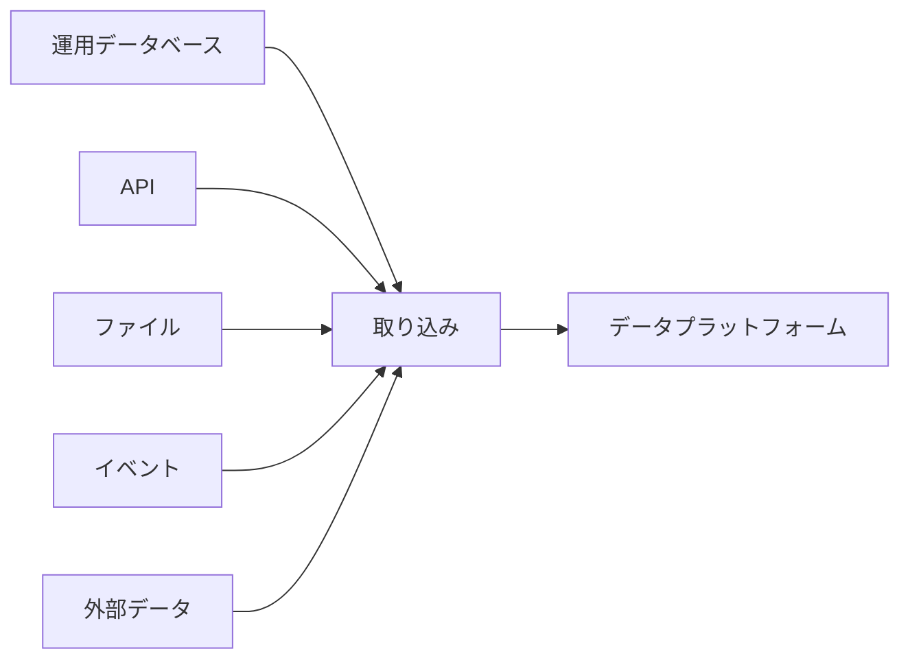

データ取り込み（Data Ingestion）は、ソースシステムからデータプラットフォームへデータを確実に移動します。対象は運用データベース、ファイル、API、アプリケーション、デバイス、パートナー、公開データなどです。単なるバイト転送ではなく、生産側への影響を抑えながら、意味と配信保証を維持することが課題です。

## 取り込み方式

**バッチ取り込み** は、スケジュールまたはトリガーにより、境界のあるレコード群を転送します。ファイル、定期 API 抽出、データベーススナップショットで一般的です。

**増分取り込み** は、既知の位置以降に追加・変更されたレコードだけを転送します。カーソル、ウォーターマーク、シーケンス、変更ログの信頼性が必要です。

**変更データキャプチャ（CDC）** は、トランザクションログなどから挿入、更新、削除を読み取ります。反復スキャンより負荷と遅延を抑えられますが、順序、スキーマ変更、初期スナップショット、リプレイを考慮する必要があります。

**イベント・メッセージ取り込み** は、生産者がブローカーやエンドポイントへ発行したレコードを受信します。確認応答、保持、順序、バックプレッシャーを明確にします。

## 主なソースインターフェース

- **ファイル** — 名前、完全性、文字コード、アトミックな公開の規約が必要
- **API** — ページング、レート制限、認証、応答スキーマの変更を扱う
- **データベース抽出** — 全量、クエリベースの増分、CDC で負荷と一貫性が異なる
- **イベントストリーム** — 永続的な位置、利用者の調整、復旧に十分な保持期間が必要
- **外部提供元** — 技術制御外の可用性、契約、版管理、セキュリティ制約が加わる

PostgreSQL、Kafka、マネージド取り込みサービスなどは実装例であり、製品名より方式と保証が重要です。

## プッシュとプル

**プル** ではプラットフォームがソースへ要求し、実行頻度と再試行を制御します。**プッシュ** では生産者または中継システムがデータを送信し、低遅延にしやすい一方、受信側は急増を吸収する必要があります。

どちらが常に優れているわけではありません。所有関係、接続方式、必要なレイテンシ、バックプレッシャー、障害復旧の責任から適切な方式を選びます。

## 全量ロードと増分ロード

**全量ロード** は対象データセット全体を複製します。単純ですが、反復すると高コストです。**増分ロード** は変更位置以降だけを複製します。多くの設計では、初期の全量スナップショットと継続的な増分取得を組み合わせます。

増分ロードには、安定した識別子と信頼できる変更位置が必要です。定期的な照合処理でソースと格納先を比較すれば、欠落した変更を検出できます。

## エンジニアリング上の論点

### ソースシステムへの影響

抽出処理は CPU、I/O、接続数、ネットワークを運用ワークロードと共有します。レート制限、リードレプリカ、ログベース取得、範囲を限定したクエリ、低負荷時間帯の実行によって影響を抑えます。ソースの所有者と取り込みの運用者は、安全な動作条件を合意しておく必要があります。

### 配信セマンティクス

ネットワークやプロセスは、レコードの読み取りから確認応答までの間にも失敗します。少なくとも1回の配信では重複が生じ得るため、安定したイベント ID、冪等な書き込み、重複排除期間を利用します。エンドツーエンドの「厳密に1回」を仮定するより、各境界の保証を明示する方が実用的です。

順序についても保証範囲を定めます。グローバル順序は高コストまたは実現不能な場合があり、エンティティやパーティション単位の順序で十分なことがあります。

### チェックポイント、再試行、リプレイ

チェックポイントは取り込み済みの位置を記録します。障害時には最初からやり直さず、既知の位置から再開できます。対応するデータが永続的に受け入れられた後にだけ、チェックポイントを進めます。

再試行には上限付きのバックオフを設け、診断に必要な文脈を保持します。リプレイにはソース側の保持期間または不変なランディングコピーが必要であり、下流処理は同じレコードの再受信に耐えなければなりません。

### スキーマ進化と遅延到着

フィールドの追加、削除、名称変更、型変更は取り込みを停止させたり、意味を静かに変えたりします。互換性ルール、スキーマメタデータ、検証、隔離領域によって変更を下流へ広げる前に可視化します。

遅延レコードにはイベント時刻と取り込み時刻の両方を保持します。事象が発生した時刻と、プラットフォームがそれを認識した時刻を区別できます。

### バックプレッシャーとセキュリティ

生産速度が消費速度を上回る場合、バッファ、流量制御、スケール、明示的な拒否動作が必要です。無制限のキューは障害を先送りするだけです。

認証情報は最小権限にし、定期的にローテーションします。転送時・保存時のデータを保護し、機密項目は必要な場合だけ収集します。

原則については [データプライバシー](/ja/docs/data/privacy/) 、分類、スキーマ、リネージについては [メタデータ](/ja/docs/data/metadata/) を参照してください。

## 取り込みと処理の境界

取り込みは、データを取得し、配信位置と来歴を特定できる形で永続化する責任を主に担います。 [データ処理](../processing/) は、フィルタリング、結合、集計、付加情報、業務ルールにより利用目的に合う表現へ変換します。実際の基盤では軽い正規化や検証を取り込みに含めることもありますが、責任の境界を可視化すると障害、リプレイ、所有を判断しやすくなります。
