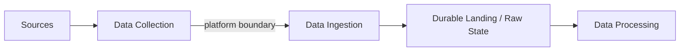

Data Ingestion is the engineering process of reliably transferring produced or collected data across the data-platform boundary into a durable, platform-managed state for downstream processing and use. Sources may be operational databases, files, APIs, applications, devices, partner systems, or public datasets. The engineering challenge is not merely transferring bytes; it is preserving useful meaning and delivery guarantees while limiting impact on the producer.

Its central question is: **How do we reliably bring data into the platform?** The source-side decisions about what to acquire, from where, under what conditions, and how it is captured are described in [Data Collection](/docs/data/collection/); ingestion begins where that data is transferred into the managed platform.

## Ingestion Modes

**Batch ingestion** transfers bounded groups of records on a schedule or trigger. Files, periodic API extracts, and database snapshots commonly use this mode. It is straightforward to reason about by interval, but its delivery latency is constrained by the batch cadence.

**Incremental ingestion** transfers only records added or changed since a known position. It reduces repeated work but requires a dependable cursor, watermark, sequence, or change log.

**Change Data Capture (CDC)** reads inserts, updates, and deletes from a database change mechanism such as a transaction log. CDC can lower source impact and improve timeliness compared with repeated table scans, but it introduces ordering, schema-change, snapshot, and replay concerns.

**Event and message ingestion** receives records as producers publish them to a broker or endpoint. This supports continuous flows and independent producers and consumers, while requiring explicit decisions about acknowledgments, retention, ordering, and backpressure.

## Common Source Interfaces

- **Files** provide a bounded exchange unit but need conventions for naming, completeness, encoding, and atomic publication.
- **APIs** expose controlled interfaces but may impose pagination, rate limits, authentication, and changing response schemas.
- **Database extraction** can use full snapshots, query-based increments, or CDC; each creates different load and consistency characteristics.
- **Event streams** support continuous delivery but require durable positions, consumer coordination, and retention sufficient for recovery.
- **External providers** add contractual availability, versioning, and security constraints beyond direct technical control.

Products such as PostgreSQL, Kafka, and managed ingestion services can implement these patterns, but the mode and guarantees matter more than the product name.

## Push and Pull

With **pull ingestion**, the platform requests data from the source. The platform controls cadence and retries, but must respect source capacity and may discover changes only when it polls.

With **push ingestion**, the producer or an intermediary sends data when it becomes available. This can reduce latency, but the receiver must absorb bursts and the producer needs clear delivery and retry behavior.

Neither is universally better. Ownership, connectivity, latency, backpressure, and failure recovery determine the appropriate choice.

## Full and Incremental Loads

A **full load** copies the entire selected dataset. It is simple and useful for initial snapshots or small sources, but repeated full extraction can be expensive and disruptive.

An **incremental load** copies changes since a defined point. It is more efficient but depends on stable identifiers and a trustworthy change position. Many ingestion designs combine an initial full snapshot with continuing incremental capture. Reconciliation jobs may periodically compare source and destination state to detect omissions.

## Engineering Concerns

### Source-System Impact

Extraction competes with operational workloads for CPU, I/O, connections, and network capacity. Rate limits, read replicas, log-based capture, bounded queries, and off-peak schedules can reduce disruption. The source owner and ingestion operator should agree on safe behavior.

### Delivery Semantics

Networks and processes fail between reading and acknowledging a record. At-least-once delivery may create duplicates; stronger guarantees often require coordination between multiple systems. Stable event identifiers, idempotent writes, and deduplication windows usually provide more practical protection than assuming exactly-once behavior end to end.

Ordering also needs an explicit scope. Global order can be expensive or unavailable, while order per entity or partition may be sufficient.

### Checkpoints, Retries, and Replay

A checkpoint records how far ingestion has progressed. On failure, the reader resumes from a known position instead of starting blindly. Checkpoints must advance only when corresponding data is durably accepted.

Retries should use bounded backoff and preserve enough context for diagnosis. Replay requires source retention or an immutable landing copy, and downstream operations must tolerate receiving records again.

### Schema Evolution and Late Arrival

Added, removed, renamed, or retyped fields can break ingestion or silently change meaning. Compatibility rules, schema metadata, validation, and controlled quarantine make change visible before it propagates.

Late records should retain event time and ingestion time. This allows downstream processing to distinguish when something happened from when the platform learned about it.

### Backpressure and Security

When producers are faster than consumers, ingestion needs buffering, flow control, scaling, or explicit rejection behavior. Unbounded queues only postpone failure.

Credentials should be narrowly scoped and rotated. Data should be protected in transit and at rest, and sensitive fields should be collected only when required. See [Data Privacy](/docs/data/privacy/) for the governing principles and [Metadata](/docs/data/metadata/) for classification, schemas, and lineage context.

## Where Ingestion Ends

Ingestion is primarily responsible for reading from a technical source interface, reliably transferring the data, and landing it durably with identifiable delivery and provenance. [Data Processing](../processing/) changes that data into representations intended for use through filtering, joins, aggregation, enrichment, or business rules.

Real platforms sometimes combine light normalization or validation with ingestion. The useful boundary is responsibility: transport-level checks and safe landing belong near ingestion, while reusable domain transformations belong to processing. Keeping that distinction visible makes failures, replay, and ownership easier to reason about.
