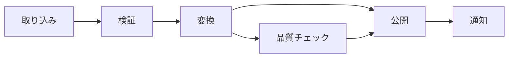

データオーケストレーション（Data Orchestration）は、データワークロードを必要な順序で実行し、状態を可視化し、成功・失敗への対応を制御します。取り込み、処理、検証、公開、運用アクションをワークフローとして接続しますが、すべての処理を自身で実行するものではありません。

## ワークフローと DAG

ワークフローは作業単位とその関係を記述します。有向非巡回グラフ（DAG）では、ノードがタスク、辺が依存関係を表します。前提条件を可視化し、独立した分岐を並列に実行できます。長時間のイベント処理やフィードバックループには別の調整モデルが必要な場合もあります。

## スケジューリングとイベント駆動実行

スケジューラは概ね、**いつ実行するか**に答えます。固定時刻、間隔、カレンダー境界で作業を起動します。

オーケストレータはさらに、**何が何に依存するか、ワークフローがどの状態にあるか、成功または失敗時に何をするか**を管理します。したがって、スケジューリングはオーケストレーションの一機能であり、同義ではありません。

時間ベースのスケジュールは予測可能な定期処理に適します。イベント駆動実行はファイル到着、上流データセット更新、メッセージ発行などに反応しますが、トリガー自体にも重複排除、順序、復旧動作が必要です。

## 依存関係と状態

依存関係には、タスク、データ、外部サービスの関係があります。実際の依存を表現すれば、時計が指定時刻になっただけで未準備のタスクが動くことを防げます。

ワークフロー状態は、待機中、実行中、成功、失敗、スキップ、キャンセルを記録します。永続的な状態は、オーケストレータ自身の再起動後の再開と監査可能な実行履歴を支えます。日付、テナント、地域、バックフィル区間などはパラメータ化し、各実行とともに記録します。

## 障害対応

- **再試行** — 一時障害を扱うが、タスクには冪等性が必要
- **タイムアウト** — 有用な進捗のない処理を停止する
- **障害分離** — 無関係な分岐の成果を不要に破棄しない
- **補償・クリーンアップ** — 単純に再試行できない外部副作用を処理する
- **アラートとエスカレーション** — 実行可能な文脈を担当者へ届ける
- **手動介入点** — 例外的判断を非公式な修正にしない

決定的な入力不正や非互換スキーマを繰り返しても復旧しません。再試行方針は一時障害と永続障害を区別します。

## バックフィル

バックフィルは、欠落結果の修復、修正版ロジックの適用、派生データの再構築のために過去区間を実行します。入力・出力境界、冪等または版管理された公開、現行処理を守る容量制御、履歴処理と現行状態の分離、コード・設定・スキーマ版の記録、公開前検証が必要です。

## オーケストレーション、処理、イベントストリーミング

[データ処理](../processing/) はレコードを変換し、オーケストレーションはその処理を行うワークロードを調整します。イベントストリーミングはイベント列を転送・保持します。イベントがワークフローを起動することはありますが、ブローカーが複数ステップの状態や下流完了まで管理するとは限りません。

Airflow、Dagster、Prefect、Argo Workflows、クラウドのマネージドオーケストレータは実装例です。製品比較ではなく、ワークフローの性質、運用環境、状態要件、所有から選択します。

## 運用可能なオーケストレーション

運用可能なワークフローは、状態、所要時間、パラメータ、試行、ログ、依存関係、生成資産を公開します。この実行メタデータは [データ可観測性](../observability/) を支え、 [メタデータ](/ja/docs/data/metadata/) を通じてリネージ、所有者、影響を受ける利用者へ接続できます。

何を実行すべきかだけでなく、実際に何がどの入力で実行され、なぜ失敗し、何を安全に再試行でき、どの下流結果が影響を受けるかを回答できるとき、オーケストレーションは信頼できる運用能力になります。
