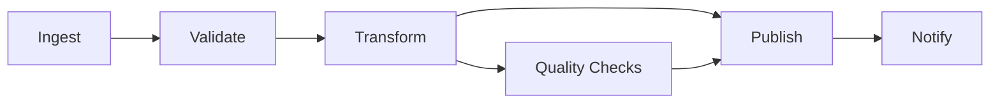

Data Orchestration coordinates data workloads so they execute in the required order, with visible state and controlled responses to success or failure. It connects ingestion, processing, validation, publication, and operational actions into workflows without performing all of that work itself.

## Workflows and DAGs

A workflow describes units of work and the relationships between them. A Directed Acyclic Graph (DAG) is a common representation: nodes are tasks and directed edges express dependencies.

A DAG makes prerequisites visible and permits independent branches to run concurrently. Not every workflow is naturally acyclic—long-running event systems and feedback loops may use other coordination models—but DAGs remain useful for bounded data jobs.

## Scheduling and Event-Driven Execution

A scheduler answers roughly: **When should this run?** It may trigger work at a fixed time, interval, or calendar boundary.

An orchestrator additionally manages: **What depends on what, what state is the workflow in, and what should happen when execution succeeds or fails?**

Time-based schedules suit predictable periodic work. Event-driven execution reacts to conditions such as a file arrival, an upstream dataset update, or a published message. Events can reduce unnecessary polling and latency, but the trigger still needs deduplication, ordering, and recovery behavior.

Scheduling is therefore one orchestration capability, not a synonym for orchestration.

## Dependencies and State

Dependencies may be task-level, data-level, or external. A downstream transformation might require two upstream datasets, a source extract, and an available external service. Expressing the real dependency prevents a task from running merely because the clock reached a particular time.

Workflow state records which tasks are pending, running, successful, failed, skipped, or canceled. Durable state allows the orchestrator to resume coordination after its own restart and gives operators an auditable execution history.

Parameterization separates reusable workflow logic from a particular date, tenant, region, or backfill interval. Parameters should be validated and recorded with each run so the result can be reproduced.

## Failure Handling

Failures are expected operating conditions, not exceptional design omissions.

- **Retries** handle transient faults but require idempotent task behavior.
- **Timeouts** stop work that no longer makes useful progress.
- **Failure isolation** prevents an unrelated branch from being discarded unnecessarily.
- **Compensation or cleanup** addresses partial external effects that cannot simply be retried.
- **Alerts and escalation** route actionable context to the responsible operator.
- **Manual intervention points** make exceptional decisions explicit instead of relying on undocumented fixes.

Retry policy should distinguish transient errors from invalid input or incompatible schemas. Repeating a deterministic failure wastes resources and delays diagnosis.

## Backfills

A backfill runs a workflow for historical intervals or entities. It may repair missed output, apply corrected logic, or rebuild derived data.

Safe backfills require:

- explicit input and output boundaries
- idempotent or versioned publication
- capacity controls so current workloads remain healthy
- isolation between historical and current workflow state
- recorded code, configuration, and schema versions
- validation before replacement data becomes authoritative

Treating a backfill as many ordinary scheduled runs can overload dependencies or publish results in an unsafe order. Orchestration should make its concurrency and promotion policy deliberate.

## Orchestration, Processing, and Event Streaming

[Data Processing](../processing/) executes transformations over records. Orchestration coordinates the workloads that perform them. An orchestrator may submit a Spark job or SQL transformation, wait for it, and respond to its status; it does not become the processing engine.

Event streaming transports and retains ordered event sequences for consumers. An event may trigger an orchestrated workflow, but the broker does not necessarily track the workflow's multi-step state, retries, or downstream completion. Conversely, an orchestrator is not designed to replace the continuous data plane of a stream.

Airflow, Dagster, Prefect, Argo Workflows, and managed cloud orchestrators demonstrate different coordination models. Product selection should follow workflow semantics, operating environment, state requirements, and team ownership rather than a feature checklist alone.

## Operable Orchestration

An orchestrated workflow should expose its state, duration, parameters, attempts, logs, dependencies, and produced assets. This execution metadata supports [Data Observability](../observability/) and can connect through [Metadata](/docs/data/metadata/) to lineage, owners, and affected consumers.

Orchestration becomes reliable when a team can answer not only what should run, but also what actually ran, with which inputs, why it failed, what is safe to retry, and which downstream results may be affected.
