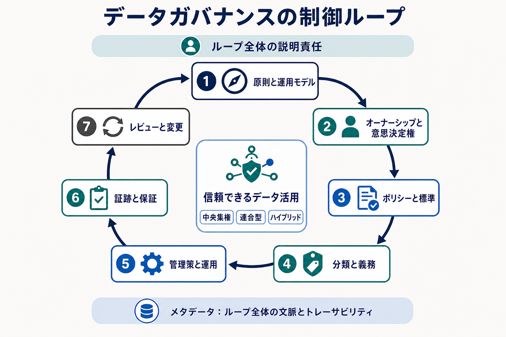

データガバナンス（Data Governance）とは、データに誰が説明責任を持ち、どのポリシーと意思決定権を適用し、それらをどう運用上の管理策へ変換し、機能していることをどう検証するかを定める組織的な統制システムです。

ガバナンスは、正当な確信を持ってデータを利用できるようにするために存在します。組織やシステムの境界を越えて、権限、義務、例外を明確にします。有効なガバナンスは、明確な意思決定境界とリスクに応じた管理策により、信頼できるデータ利用を支えます。中央集権、連合型、ハイブリッドのいずれでも機能し、特定のモデルへの移行を必然的な目標とはしません。

データ領域では、ガバナンスは横断的な **統制層（Control Layer）** に位置します。収集、管理、分析、共有、廃棄まで一貫して適用するルールと説明責任を確立します。

## ガバナンスとマネジメント

**ガバナンスは期待事項と説明責任を定め、マネジメントはそれらを満たす継続的な業務を実行します。** ガバナンスは品質目標、保持義務、サービス期待を定められます。 [データマネジメント](/ja/docs/data/management/) は、データを信頼でき、利用可能で、持続可能に保つ実践を担います。そのため MDM とデータ品質は、引き続きマネジメント領域です。

## ガバナンスの制御ループ

オーナーシップとスチュワードシップはループ全体に適用されます。メタデータはポリシー、資産、管理策を結び、根拠となるリネージ、判断、観測結果を記録します。

従来型のガバナンスは、中央委員会、文書、手動承認に依存しがちでした。影響の大きな判断には今も適切です。ドメインオーナーシップ、ポリシーコード化、メタデータ駆動の管理策、連合型の会議体は、規模に応じた別の協調方法を加えます。これらは単線的な成熟度段階ではなく設計上の選択肢です。

## 主な関心事

- **説明責任と意思決定権：** 成果の責任者、判断者、実務担当者を区別する
- **ポリシー、標準、管理策：** 意図を検証可能な期待事項と運用機構へ変換する
- **分類：** 機密性、個人データ、重要度、保持、共有制約に応じて義務を変える
- **例外とエスカレーション：** 逸脱を明示し、期限、承認、レビューを設定する
- **証跡と保証：** 管理策の作動とポリシー目標の達成を示す
- **連合型運営：** 全社的一貫性を保ちながら文脈依存の判断をドメインに置く

## 隣接するデータ領域との関係

| 領域                                                     | 中心となる問い                                             |
| -------------------------------------------------------- | ---------------------------------------------------------- |
| **データガバナンス**                                     | 誰が判断し、どのルールを適用し、説明責任をどう示すか       |
| [データマネジメント](/ja/docs/data/management/)          | データを信頼でき、利用可能で、持続可能に保つにはどうするか |
| [メタデータ](/ja/docs/data/metadata/)                    | データとその文脈について何が分かっているか                 |
| [データプライバシー](/ja/docs/data/privacy/)             | 人に関する情報をどの条件で処理すべきか                     |
| データセキュリティ                                       | 不正アクセス、改変、開示、損失からどう保護するか           |
| [データアーキテクチャ](/ja/docs/data/data-architecture/) | システム、境界、フローをどう構成するか                     |
| [データチーム](/ja/docs/data/teams/)                     | 誰がデータエコシステムを構築、運用、分析、支援するか       |

## データガバナンスのトピック










## 参考資料

- [ISO/IEC 38505: Governance of data](https://www.iso.org/standard/87195.html)
- [EDM Council: DCAM](https://edmcouncil.org/frameworks/dcam/)
- [COBIT](https://www.isaca.org/resources/cobit)
- [Data Mesh Principles and Logical Architecture](https://martinfowler.com/articles/data-mesh-principles.html)
