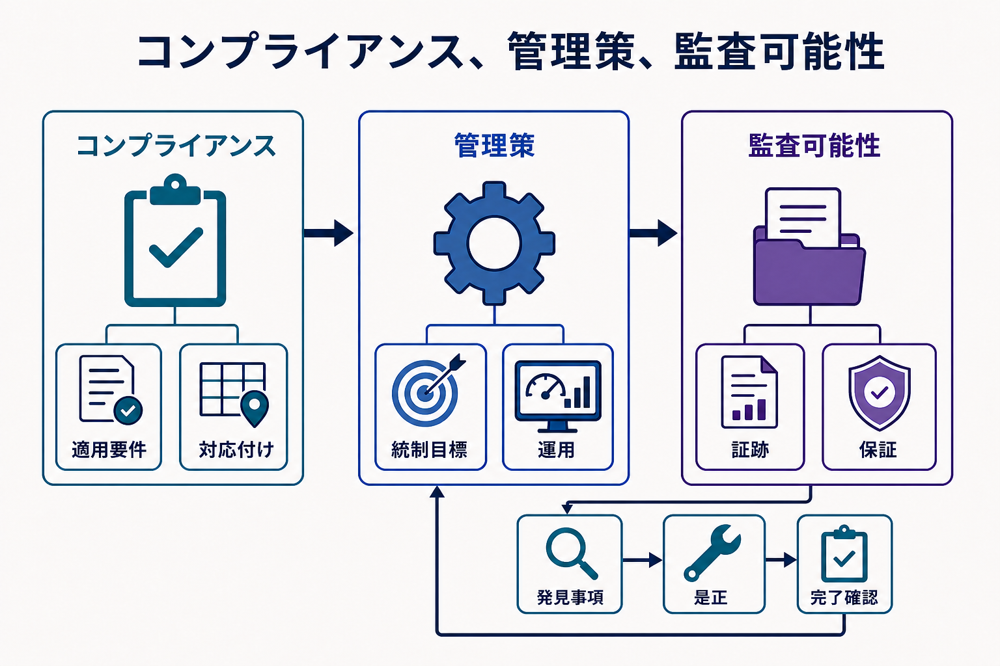
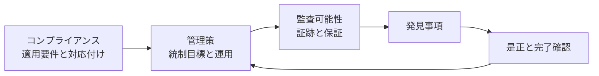

適用要件を統制目標へ対応付け、管理策が意図どおりに作動し、信頼できる証跡によって結果を監査できるとき、ガバナンスは実証可能になります。

**コンプライアンス（Compliance）** とは、適用される要件を満たすことです。要件の情報源には、法令、規制、契約、業界上の約束、内部ポリシーがあります。**監査可能性（Auditability）** は、組織がその要件にどう対応したかを再構成し、評価できる能力です。ガバナンスは両者を結ぶ意思決定上のオーナーシップとトレーサビリティを提供しますが、個別義務を解釈する法務、リスク、プライバシー、セキュリティなどの専門家を置き換えるものではありません。

## トレーサビリティ

コンプライアンスマッピングは、法令、契約、内部義務とポリシー・管理策の関係を記録します。一つの統制目標が複数の義務を満たす場合、情報源ごとに管理策を重複させないようにします。

マッピングは、義務が何を要求し、どこに適用されるかの解釈から始まります。その解釈を、組織固有の実装に依存しない一つ以上の統制目標へ変換します。次に、既存の管理策を統制目標へ対応付けます。ギャップがある場合は、管理策を追加する、統制対象範囲を変更する、正式な権限に基づいてリスクを受容する、または義務が適用されない理由を記録する、という明示的な判断が必要です。

## 証跡と保証

有用な証跡には、オーナーシップと分類の記録、リネージ、承認、例外、設定とルールのバージョン、実行結果、アクセス・変更イベント、課題の是正、レビュー判断があります。証跡には来歴、完全性、保持、および評価対象の期間・資産との明確な関係が必要です。

証跡に求められる品質は、何を立証するかによって異なります。現在の設定は今日の管理策の設計を示せても、前四半期を通じて作動したことまでは示せません。承認のサンプルは人によるレビューを示し、完全な実行記録は自動処理の網羅性を示せます。監査開始後に証跡を再構成するのではなく、管理策を設計するときに、管理策のオーナーが期待する証跡を定義します。

監査可能性（Auditability）は、どのルールが適用され、誰が判断し、どの管理策が作動し、どの例外が存在し、どの結果につながったかを再構成できる能力です。監査証跡は入力の一つですが、意味、所有、保持がないログだけでは十分な保証になりません。

**保証（Assurance）** とは、ガバナンスと管理策が適切に設計され、意図どおりに作動しているかについて、証跡から導く合理的な結論です。管理策のオーナー、独立した内部機能、顧客、外部監査人が実施できます。独立性と検証の深さは、支援する判断の重要性に応じて設定します。運用モニタリング、マネジメントレビュー、独立監査は異なる問いに答えるものであり、同じものとして扱いません。

## モニタリングと是正

継続的統制モニタリング（Continuous Controls Monitoring）は、定期レビューまで待たず、運用中に選択したシグナルを評価します。分類漏れ、期限切れの例外、チェック失敗、ポリシーからの逸脱を検知できます。ただし判断を置き換えるものではなく、しきい値、誤検知、検知漏れ、是正責任をレビューする必要があります。

検知した不備には、発見から解決までの経路が必要です。重大度、影響を受ける資産と義務、暫定的な保護策、是正オーナー、期限、完了確認、エスカレーションや通知の要否を特定します。失敗の繰り返しは管理策の弱さを示す場合がありますが、非現実的な標準、信頼できない入力、不明確なオーナーシップが原因の場合もあります。管理策を追加する前に、レビューで原因を区別します。

したがって、コンプライアンス状態は資産や組織に永続する属性ではありません。義務、システム、用途、オーナー、管理策は変化します。重大な変更時に保証を更新できるよう、ガバナンスがそれらの関係を維持します。

このモデルは技術や法域に依存しません。専門家が個別要件を解釈し、ガバナンスは要件を運用化するための共通のトレーサビリティと説明責任を提供します。
