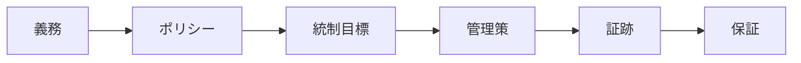

組織が義務を、説明責任を持つオーナー、統制目標、運用中の管理策、信頼できる証跡へ結び付けられるとき、ガバナンスは実証可能になります。

## トレーサビリティ

コンプライアンスマッピングは、法令、契約、内部義務とポリシー・管理策の関係を記録します。一つの統制目標が複数の義務を満たす場合、情報源ごとに管理策を重複させないようにします。

有用な証跡には、オーナーシップと分類の記録、リネージ、承認、例外、設定とルールのバージョン、実行結果、アクセス・変更イベント、課題の是正、レビュー判断があります。証跡には来歴、完全性、保持、および評価対象の期間・資産との明確な関係が必要です。

監査可能性（Auditability）は、どのルールが適用され、誰が判断し、どの管理策が作動し、どの例外が存在し、どの結果につながったかを再構成できる能力です。監査証跡は入力の一つですが、意味、所有、保持がないログだけでは十分な保証になりません。

継続的統制モニタリング（Continuous Controls Monitoring）は、定期レビューまで待たず、運用中に選択したシグナルを評価します。分類漏れ、期限切れの例外、チェック失敗、ポリシーからの逸脱を検知できます。ただし判断を置き換えるものではなく、しきい値、誤検知、検知漏れ、是正責任をレビューする必要があります。

このモデルは技術や法域に依存しません。専門家が個別要件を解釈し、ガバナンスは要件を運用化するための共通のトレーサビリティと説明責任を提供します。
